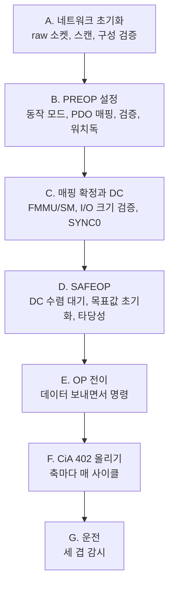

> **기준 출처:** CiA 402(= IEC 61800-7-201/301), [CiA 402 공개 요약](https://www.can-cia.org/can-knowledge/canopen/cia402) · [ETG EtherCAT Technology](https://www.ethercat.org/en/technology.html) · [SOEM](https://github.com/OpenEtherCATsociety/SOEM) `simple_test.c` / 확인일 2026-08-03
> **시리즈:** [목차](/posts/00-comm-series/) | 이전 → [11. 메일박스 프로토콜](/posts/11-mailbox-coe-foe-eoe/) | 다음 → [13. ESI와 ENI 설정 파일](/posts/13-esi-eni-config-files/)

## 1. FSM 세 개가 겹친다

08편에서 본 그림이 이 편의 주제다. ESM은 통신이 준비됐는지, CiA 402는 모터가 준비됐는지, 동작 모드는 무슨 명령을 받는지를 나타낸다.

"OP인데 축이 움직이지 않는다" 의 답이 여기 있다. 첫 번째가 됐다고 두 번째가 되는 게 아니다. 순서가 정해져 있다. ESM을 SAFEOP까지 올리고, 설정하고, OP로 올린 다음에 CiA 402를 올린다.

## 2. 전체 절차



### A. 네트워크 초기화

raw 소켓을 열고(`ec_init(ifname)`), 슬레이브를 스캔하고 주소를 배정하고(`ec_config_init(FALSE)`), 구성을 검증한다. Vendor ID와 Product Code가 예상과 다르면 여기서 중단한다. 이 시점의 ESM 상태는 PREOP이다.

### B. PREOP에서 설정

SDO(CoE 메일박스)로 한다. 동작 모드를 설정하고(`0x6060` ← 8, CSP), PDO를 매핑하고(`0x1600`/`0x1A00` + `0x1C12`/`0x1C13`), 매핑을 다시 읽어 검증하고, 드라이브 파라미터(전류 제한, 가속 제한 등)를 쓰고, SM 워치독을 설정한다.

전부 PREOP에서 해야 한다. SAFEOP 이후에는 매핑을 못 바꾼다.

### C. 매핑 확정과 DC

`ec_config_map(&io_map)` 으로 FMMU와 SM을 설정하고, `Ibytes` 와 `Obytes` 로 I/O 크기를 검증하고, `ec_configdc()` 로 DC를 설정하고, `ec_dcsync0(i, TRUE, cycle, shift)` 로 SYNC0을 설정한다.

### D. SAFEOP, 여기가 중요하다

1. SAFEOP 전이. 실패하면 AL Status Code를 읽는다(`0x0017`, `0x0024`)
2. 프로세스 데이터를 돌리기 시작한다. 출력은 무시되는 상태다
3. DC 수렴을 대기한다. `0x092C` 오차가 작아질 때까지
4. **목표값을 현재값으로 초기화한다.** `target_position = position_actual`. 이걸 안 하면 OP 전이 순간 축이 급이동한다
5. 입력 데이터 타당성을 확인한다. 위치가 물리 범위 안인가

### E. OP 전이

프로세스 데이터를 계속 보내면서 OP를 명령하고, 전 슬레이브가 OP인지 확인한다. 실패하면 AL Status Code를 본다(`0x0030` = DC). 이제 프로세스 데이터가 유효하지만 아직 모터는 안 돈다.

### F. CiA 402 상태 올리기

축마다, 매 사이클 수행한다.

Statusword를 읽어 상태를 판별하고 상태별로 Controlword를 낸다. Switch on disabled에서 `0x0006` 을 내면 Ready to switch on, 거기서 `0x0007` 이면 Switched on, 거기서 `0x000F` 면 Operation enabled다. Fault면 `0x0000` 뒤에 `0x0080` 으로 상승 엣지를 만든다.

D4에서 초기화한 목표값을 계속 유지하고, `0x6061`(모드 표시)이 8(CSP)인지 확인한다. 블로킹하지 않는다. 매 사이클 호출되는 시퀀서다.

### G. 운전

매 사이클 송수신하고, WKC를 검사하고(부족하면 직전 값 유지, 연속되면 폴트), Statusword로 Operation enabled 유지를 확인하고, 제어 연산을 하고, Target position을 갱신하며 Controlword `0x000F` 를 유지하고, DC에 맞춰 다음 주기까지 대기한다.

## 3. 가장 자주 막히는 다섯 지점

| # | 증상 | 원인 |
| --- | --- | --- |
| 1 | SAFEOP에서 안 올라간다 | PDO 매핑과 SM 크기가 다르다 (`0x0017`, `0x0024`) |
| 2 | OP에서 안 올라간다 | 프로세스 데이터를 안 보내고 명령만 냈다, 또는 DC 미수렴(`0x0030`) |
| 3 | OP인데 축이 움직이지 않는다 | CiA 402가 Switch on disabled에 있다 |
| 4 | OP 되자마자 축이 급이동한다 | D4(목표값 초기화)를 빼먹었다 |
| 5 | 폴트가 안 풀린다 | Fault reset이 상승 엣지인데 값을 유지했다 |

3번과 4번이 이 폴더 전체에서 가장 위험하고 가장 흔하다. 3번은 안 움직여서 답답한 문제이고 4번은 축이 전속력으로 튀는 위험한 문제다.

처음 시운전할 때는 반드시 모터축을 부하에서 분리하거나 이동 범위를 소프트웨어로 제한한 상태에서 D4를 검증한다.

## 4. 통합 코드 골격

```cpp
// comm_ethercat/drive_bringup.hpp
// A~F 를 하나로 묶은 시퀀서. G(운전)은 별도.
class DriveBringup {
public:
    bool run_blocking(const char* ifname,
                      std::span<const ExpectedSlave> expected) {
        // ── A. 네트워크 ──
        if (!ec_init(ifname)) {
            fail("ec_init 실패 — NIC 이름과 권한(CAP_NET_RAW) 확인"); return false;
        }
        if (ec_config_init(FALSE) <= 0) {
            fail("슬레이브를 못 찾음 — 케이블과 전원 확인"); return false;
        }
        if (!verify_topology(expected)) {
            fail("구성이 예상과 다름 — 배선 순서 확인"); return false;
        }

        // ── B. PREOP 설정 ──
        for (int i = 1; i <= ec_slavecount; ++i) {
            if (!is_drive(i)) continue;
            std::uint8_t mode = 8;                                   // CSP
            if (!sdo_write(i, 0x6060, 0x00, mode)) {
                fail("모드 설정 실패"); return false; }
            if (!configure_pdo(i, 0x1C13, 0x1A00, kAxisTxPdo)) {
                fail("TxPDO 설정 실패"); return false; }
            if (!configure_pdo(i, 0x1C12, 0x1600, kAxisRxPdo)) {
                fail("RxPDO 설정 실패"); return false; }
            if (!verify_pdo_mapping(i, 0x1A00, kAxisTxPdo)) {
                fail("TxPDO 검증 실패"); return false; }
            if (!verify_pdo_mapping(i, 0x1600, kAxisRxPdo)) {
                fail("RxPDO 검증 실패"); return false; }
        }

        // ── C. 매핑 확정 + DC ──
        ec_config_map(io_map_.data());
        for (int i = 1; i <= ec_slavecount; ++i)
            if (is_drive(i) && !verify_io_size(i)) {
                fail("I/O 크기 불일치"); return false; }
        ec_configdc();
        for (int i = 1; i <= ec_slavecount; ++i)
            if (ec_slave[i].hasdc) ec_dcsync0(i, TRUE, kCycleNs, kShiftNs);
        bind_axis_io();

        // ── D. SAFEOP ──
        ec_slave[0].state = EC_STATE_SAFE_OP;
        ec_writestate(0);
        if (ec_statecheck(0, EC_STATE_SAFE_OP, EC_TIMEOUTSTATE * 4)
            != EC_STATE_SAFE_OP) {
            log_esm_failure(); fail("SAFEOP 전이 실패"); return false;
        }
        // D2·D3: 프로세스 데이터를 돌리며 DC 수렴 대기
        for (int i = 0; i < kDcSettleCycles; ++i) {
            ec_send_processdata(); ec_receive_processdata(EC_TIMEOUTRET);
            wait_next_cycle();
        }
        if (!dc_converged()) {
            fail("DC 미수렴 — 0x092C 오차 확인"); return false; }

        // D4: 목표값 초기화. 이걸 빼면 축이 급이동한다
        for (auto& ax : axes_) ax.set_target_position(ax.position_actual());
        // D5: 타당성
        for (auto& ax : axes_) if (!sanity_check(ax)) {
            fail("입력 값이 비정상"); return false; }

        // ── E. OP ──
        ec_slave[0].state = EC_STATE_OPERATIONAL;
        ec_writestate(0);
        for (int retry = 0; retry < kOpRetries; ++retry) {
            ec_send_processdata(); ec_receive_processdata(EC_TIMEOUTRET);
            ec_statecheck(0, EC_STATE_OPERATIONAL, 50'000);
            if (ec_slave[0].state == EC_STATE_OPERATIONAL) break;
            wait_next_cycle();
        }
        if (ec_slave[0].state != EC_STATE_OPERATIONAL) {
            log_esm_failure(); fail("OP 전이 실패"); return false;
        }

        // ── F. CiA 402 (매 사이클, 블로킹 없이) ──
        for (int i = 0; i < kCia402Timeout; ++i) {
            ec_send_processdata(); ec_receive_processdata(EC_TIMEOUTRET);
            bool all_enabled = true;
            for (std::size_t a = 0; a < axes_.size(); ++a) {
                std::uint16_t cw{};
                const auto r = bringup_[a].update(axes_[a].statusword(),
                                                  cw, now_ms());
                axes_[a].set_controlword(cw);
                axes_[a].set_target_position(axes_[a].position_actual());
                if (r != Cia402Bringup::Result::Reached) all_enabled = false;
                if (r == Cia402Bringup::Result::FaultLatched) {
                    fail("축 폴트 지속"); return false; }
            }
            if (all_enabled) return true;
            wait_next_cycle();
        }
        fail("CiA 402 Operation Enabled 도달 실패");
        return false;
    }
};
```

`fail()` 이 단계 이름과 함께 로그를 남기게 만든다. "부팅 실패" 만으로는 아무것도 못 한다. "D 단계(SAFEOP)에서 슬레이브 3, AL Status Code 0x0024(PDO 매핑 오류)" 여야 한다.

## 5. 운전 중 감시

부팅에 성공했다고 끝이 아니다. 매 사이클 확인할 것들이 있다.

```cpp
void cyclic_control()   // 1 kHz, SCHED_FIFO
{
    ec_send_processdata();
    const int wkc = ec_receive_processdata(EC_TIMEOUTRET);

    // ① WKC
    if (wkc < expected_wkc_) {
        if (++wkc_low_streak_ > kMaxWkcLowStreak) {
            enter_safe_state("WKC 지속 부족"); return; }
        return;                    // 직전 값 유지
    }
    wkc_low_streak_ = 0;

    // ② ESM 상태. OP 에서 떨어지지 않았나
    //    매 사이클 ec_readstate() 는 비싸므로 저우선순위 스레드에서
    if (esm_state_.load() != EC_STATE_OPERATIONAL) {
        enter_safe_state("ESM 강등"); return; }

    // ③ CiA 402 상태. Operation Enabled 유지 중인가
    for (auto& ax : axes_) {
        const auto st = decode_state(ax.statusword());
        if (st != DriveState::OperationEnabled) {
            enter_safe_state("축 상태 이탈"); return; }
    }

    // ④ 제어 연산
    const auto cmd = controller_.update(read_states());

    // ⑤ 출력. Controlword 0x000F 를 계속 유지해야 한다
    for (std::size_t a = 0; a < axes_.size(); ++a) {
        axes_[a].set_controlword(0x000F);
        axes_[a].set_target_position(cmd[a]);
    }

    // ⑥ DC 정렬 대기
    sleep_until_dc_aligned();
}
```

①②③이 세 겹의 안전망이다. 각각 다른 층의 실패를 잡는다. ①은 통신이 끊겼는지(WKC), ②는 네트워크 상태가 유지되는지(ESM), ③은 드라이브 상태가 유지되는지(CiA 402)를 본다.

`enter_safe_state()` 가 무엇을 하는지가 안전 설계의 핵심이다. 감속 정지인가, 브레이크인가, 전원 차단인가. 이건 통신 문제가 아니라 시스템 안전 설계 문제이고 위험성 평가에 따라 정해진다.

## 6. 시운전 체크리스트

처음 축을 돌릴 때 순서대로 확인한다.

- 모터축을 부하에서 분리했거나 이동 범위를 물리적으로 제한했나
- 비상 정지가 하드와이어로 동작하나. 네트워크에 의존하지 않는가
- 구성 검증이 통과하나 (배선 순서)
- PDO 매핑과 I/O 크기가 기대와 일치하나
- DC 오차(`0x092C`)가 수렴하나
- 목표값이 현재값으로 초기화되나 (로그로 확인)
- 전 슬레이브가 OP에 도달하나
- 각 축이 Operation Enabled에 도달하나
- 목표를 현재값으로 고정한 채 몇 초간 안정한가 (축이 움직이지 않아야 한다)
- 아주 작은 이동(예: 1도)을 명령했을 때 그만큼만 움직이나
- 케이블 뽑기 테스트에서 워치독이 동작해 정지하나
- 비상 정지 테스트
- 사이클 지터 측정
- CRC 카운터가 0 근처인가

케이블 뽑기 테스트가 가장 자주 생략되고 가장 위험하다. 정상 운전에서는 아무 증상이 없어서 실제 사고가 나야 발견된다.

## 정리

- FSM 세 개가 겹친다. ESM(통신), CiA 402(모터), 동작 모드(명령)
- 전체 절차는 일곱 단계다. 네트워크, PREOP 설정, 매핑과 DC, SAFEOP, OP, CiA 402, 운전
- 설정은 전부 PREOP에서 한다. SAFEOP 이후에는 매핑을 못 바꾼다
- D 단계가 SAFEOP이 존재하는 이유다. 출력이 무시되는 동안 DC 수렴을 대기하고 목표값을 초기화하고 타당성을 확인한다
- D4(목표값을 현재값으로)를 빼먹으면 OP 전이 순간 축이 최대 속도로 급이동한다
- 자주 막히는 다섯: SAFEOP 실패(매핑), OP 실패(데이터 미전송이나 DC), OP인데 안 움직임(CiA 402), 축이 튐(D4), 폴트 안 풀림(상승 엣지)
- `fail()` 이 단계 이름과 슬레이브 번호와 AL Status Code를 함께 남겨야 진단이 된다
- 운전 중 세 겹 감시: WKC(통신), ESM(네트워크), CiA 402(드라이브)
- `enter_safe_state()` 의 내용은 통신이 아니라 시스템 안전 설계 문제다. 위험성 평가로 정한다
- 시운전은 부하 분리와 범위 제한과 하드와이어 비상정지 상태에서 한다. 케이블 뽑기 테스트를 반드시 한다

## 참고

- [CiA 402 프로파일 개요](https://www.can-cia.org/can-knowledge/canopen/cia402)
- [ETG — EtherCAT Technology](https://www.ethercat.org/en/technology.html)
- [SOEM — Simple Open EtherCAT Master](https://github.com/OpenEtherCATsociety/SOEM)
