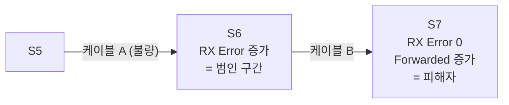

> **기준 출처:** ESC 데이터시트 공개 사양(오류 카운터 레지스터 0x0300~0x0313) · [ETG EtherCAT Technology](https://www.ethercat.org/en/technology.html) · [SOEM](https://github.com/OpenEtherCATsociety/SOEM) / 확인일 2026-08-03
> **시리즈:** [목차](/posts/00-comm-series/) | 이전 → [15. 사이클 지터와 실시간 OS](/posts/15-cycle-jitter-realtime-os/) | 다음 → [17. 예제, 마스터 골격 만들기](/posts/17-ethercat-master-skeleton/)

## 1. EtherCAT 진단의 결정적 장점

[기초 07편](/posts/07-basics-error-detection/)에서 CRC는 깨졌다는 것만 알려준다고 했다. CAN도 마찬가지였다. 어디서 깨졌는지는 모른다.

EtherCAT는 다르다. 어느 슬레이브의 어느 포트에서 깨졌는지 알려준다.

이유는 04편에서 봤다. 각 슬레이브가 들어온 프레임의 FCS를 검사하고, 틀리면 그 포트의 CRC 오류 카운터를 올리고, 프레임은 계속 흘려보낸다. 마스터가 모든 슬레이브의 포트별 카운터를 읽으면 어느 구간에서 오류가 생겼는지가 나온다.

이게 실무에서 엄청난 차이를 만든다. 케이블 100 m를 전부 뜯어볼 필요 없이 "슬레이브 7의 포트0 쪽 케이블" 로 좁혀진다.

## 2. 세 층의 지표

| 층 | 지표 | 무엇을 말해주나 |
| --- | --- | --- |
| ① 프레임 | WKC | 이번 사이클이 정상인가. 즉각적 |
| ② 상태 | AL Status와 Code | 설정과 상태가 유효한가 |
| ③ 물리 | 포트별 오류 카운터 | 어디가 나빠지고 있나. 예방적 |

③이 이 편의 주제이고 가장 가치 있는 지표다. ①②는 이미 문제가 났을 때 알려주지만 ③은 문제가 나기 전에 알려준다.

## 3. 포트별 오류 카운터 레지스터

ESC의 표준 레지스터다. 슬레이브 제조사와 무관하게 같은 자리에 있다.

| 레지스터 | 이름 | 크기 | 뜻 |
| --- | --- | --- | --- |
| `0x0300`~`0x0307` | RX Error Counter (포트 0~3) | 포트당 2 B | 이 포트로 들어온 프레임의 오류. 하위 바이트가 Invalid Frame, 상위 바이트가 물리 오류 |
| `0x0308`~`0x030B` | Forwarded RX Error (포트 0~3) | 포트당 1 B | 앞 슬레이브가 이미 오류로 표시한 프레임 |
| `0x030C` | ECAT Processing Unit Error | 1 B | ESC 내부 처리 오류 |
| `0x030D` | PDI Error Counter | 1 B | MCU와 ESC 인터페이스 오류 |
| `0x0310`~`0x0313` | Lost Link Counter (포트 0~3) | 포트당 1 B | 링크가 끊겼다 붙은 횟수 |

모두 8비트 또는 16비트라 오버플로한다. 값이 255에서 멈추거나 감싸는 칩이 있다. 주기적으로 읽고 클리어하거나 증가분만 누적한다.

### Forwarded RX Error가 위치 특정의 핵심

RX Error와 Forwarded RX Error를 구분하는 게 이 진단의 정수다.



RX Error가 처음 증가하는 슬레이브의 그 포트가 불량 구간의 끝이다. 그 앞의 케이블이나 커넥터를 본다. Forwarded만 증가하는 슬레이브들은 피해자이지 범인이 아니다. 이걸 구분 못 하면 엉뚱한 데를 뜯는다.

## 4. 진단 코드

```cpp
// comm_ethercat/diagnostics.hpp
struct PortErrors {
    std::uint8_t invalid_frame;    // 0x0300 하위
    std::uint8_t rx_error;         // 0x0300 상위, 물리 오류
    std::uint8_t forwarded;        // 0x0308, 앞에서 깨진 것
    std::uint8_t lost_link;        // 0x0310, 링크 끊김 횟수
};

struct SlaveDiagnostics {
    std::array<PortErrors, 4> ports;
    std::uint8_t processing_unit_error;   // 0x030C
    std::uint8_t pdi_error;               // 0x030D
};

SlaveDiagnostics read_diagnostics(int slave) {
    SlaveDiagnostics d{};
    const std::uint16_t adr = ec_slave[slave].configadr;

    // 포트 0~3 의 RX Error Counter (2바이트씩 연속)
    std::array<std::uint16_t, 4> rx{};
    int size = sizeof(rx);
    ec_FPRD(adr, 0x0300, size, rx.data(), EC_TIMEOUTRET);
    for (int p = 0; p < 4; ++p) {
        d.ports[p].invalid_frame = static_cast<std::uint8_t>(rx[p] & 0xFF);
        d.ports[p].rx_error      = static_cast<std::uint8_t>(rx[p] >> 8);
    }

    std::array<std::uint8_t, 4> fwd{};
    size = sizeof(fwd);
    ec_FPRD(adr, 0x0308, size, fwd.data(), EC_TIMEOUTRET);
    for (int p = 0; p < 4; ++p) d.ports[p].forwarded = fwd[p];

    size = sizeof(d.processing_unit_error);
    ec_FPRD(adr, 0x030C, size, &d.processing_unit_error, EC_TIMEOUTRET);
    size = sizeof(d.pdi_error);
    ec_FPRD(adr, 0x030D, size, &d.pdi_error, EC_TIMEOUTRET);

    std::array<std::uint8_t, 4> lost{};
    size = sizeof(lost);
    ec_FPRD(adr, 0x0310, size, lost.data(), EC_TIMEOUTRET);
    for (int p = 0; p < 4; ++p) d.ports[p].lost_link = lost[p];

    return d;
}

// 카운터를 0 으로. 주기적으로 읽고 클리어해서 오버플로를 피한다
void clear_error_counters(int slave) {
    std::array<std::uint8_t, 20> zeros{};   // 0x0300~0x0313
    ec_FPWR(ec_slave[slave].configadr, 0x0300,
            zeros.size(), zeros.data(), EC_TIMEOUTRET);
}
```

### 범인 찾기

```cpp
// "RX Error 가 처음 증가하는 슬레이브의 그 포트" 를 찾는다
struct BadSegment { int slave; int port; std::uint32_t rate_per_min; };

std::optional<BadSegment> find_bad_segment(
    std::span<const SlaveDiagnostics> diags, double minutes) {
    for (std::size_t i = 0; i < diags.size(); ++i) {
        for (int p = 0; p < 4; ++p) {
            const auto& port = diags[i].ports[p];
            // RX Error 가 있고 Forwarded 는 없다 → 여기서 처음 깨졌다
            if (port.rx_error > 0 && port.forwarded == 0) {
                return BadSegment{
                    static_cast<int>(i) + 1, p,
                    static_cast<std::uint32_t>(port.rx_error / minutes)
                };
            }
        }
    }
    return std::nullopt;
}
```

`rate_per_min` 이 중요하다. 절대값보다 증가 속도가 문제의 심각도를 말해준다. 부팅 시 한두 개는 정상일 수 있지만 분당 수십 개면 심각하다.

## 5. 감시 정책

| 지표 | 주기 | 임계 | 조치 |
| --- | --- | --- | --- |
| WKC | 매 사이클 | 기대값 미만 | 연속 N회면 안전 상태 |
| ESM 상태 | 100 ms | OP 이탈 | 로그와 복구 시도 |
| RX Error 증가율 | 1~10초 | 0 초과 | 경고 로그, 추세 기록 |
| | | 분당 10 이상 | 정비 권고 |
| Lost Link | 1~10초 | 증가 | 커넥터 접촉 불량 |
| PDI Error | 1~10초 | 증가 | 슬레이브 내부 문제 |
| DC 오차 | 1초 | 커지거나 불안정 | 마스터 지터 |
| 사이클 지터 | 매 사이클 누적 | 최댓값 | 15편의 튜닝 |

### 추세가 절대값보다 중요하다

케이블은 갑자기 끊어지지 않는다. 커넥터가 산화되고 반복 굽힘으로 심선이 하나씩 끊어지고 그러다 어느 날 통신이 안 된다.

RX Error 누적 그래프를 몇 주에 걸쳐 그려보면 처음엔 완만하다가 어느 시점부터 기울기가 급해진다. 그 기울기 변화를 보고 실제 고장이 나기 몇 주 전에 알 수 있다. 이게 예방 정비의 근거다.

[시리얼 08편](/posts/08-serial-errors-framing-overrun/)에서 UART의 Noise Error 추세를 두고 같은 말을 했다. 원리는 같고 EtherCAT는 위치까지 알려준다.

## 6. 증상별 진단 순서

### ① WKC가 부족하다

1. 얼마나 부족한가. 몇 개의 슬레이브가 빠졌는지 추정한다
2. `ec_readstate()` 로 어느 슬레이브가 OP가 아닌지 본다
3. AL Status Code로 이유를 확인한다 (`0x001A`=워치독, `0x0030`=DC)
4. 슬레이브가 아예 안 보인다면 몇 번째까지 보이는지로 끊긴 위치를 찾는다
5. 포트별 카운터로 그 구간에서 오류가 있었는지 본다

### ② 가끔 OP에서 SAFEOP로 떨어진다

1. AL Status Code를 확인한다. `0x001A` 나 `0x001B` 면 마스터 지터, `0x0030` 이면 DC 수렴 문제다
2. 사이클 지터 히스토그램을 확인한다
3. 정상이면 포트별 카운터로 프레임 손실을 본다

### ③ 통신은 되는데 값이 이상하다

1. PDO 매핑을 검증한다. 크기와 순서
2. 엔디안을 확인한다. EtherCAT는 little-endian이다
3. `AxisIo` 오프셋을 본다
4. 그래도 이상하면 타당성 검사에 걸리는지 본다

### ④ 특정 시점에만 오류

[기초 11편](/posts/11-basics-noise-ground-isolation/)의 질문이 "언제 깨지나" 였다. 모터가 가속할 때면 노이즈라 케이블 경로와 차폐를 보고, 브레이크가 풀릴 때면 서지이고, 특정 축이 움직일 때면 그 축 케이블의 반복 굽힘이고, 장비를 데울 때면 커넥터 열팽창이다. 포트별 카운터로 위치를 특정하면 확인이 빠르다.

## 7. 진단 대시보드

```cpp
// comm_ros/ethercat_diagnostics_node.cpp
// ROS 2 진단 토픽으로 내보낸다 (diagnostic_msgs/DiagnosticArray)
void publish_diagnostics() {
    for (int i = 1; i <= ec_slavecount; ++i) {
        const auto d = read_diagnostics(i);
        auto status = make_status(ec_slave[i].name);

        status.add("ESM 상태", esm_state_name(ec_slave[i].state));
        status.add("AL Status Code", format_hex(ec_slave[i].ALstatuscode));

        for (int p = 0; p < 4; ++p) {
            if (!port_in_use(i, p)) continue;
            status.add(fmt("포트{} RX Error", p),  d.ports[p].rx_error);
            status.add(fmt("포트{} Forwarded", p), d.ports[p].forwarded);
            status.add(fmt("포트{} Lost Link", p), d.ports[p].lost_link);
        }
        status.add("PDI Error", d.pdi_error);
        status.add("DC 오차 (ns)", read_dc_error_ns(i));

        // 레벨 판정
        if (ec_slave[i].state != EC_STATE_OPERATIONAL) status.level = ERROR;
        else if (any_rx_error_rising(i))               status.level = WARN;
        else                                           status.level = OK;

        publish(status);
    }

    // 전역 지표
    auto global = make_status("EtherCAT Master");
    global.add("WKC 기대/실제", fmt("{}/{}", expected_wkc_, last_wkc_));
    global.add("WKC 부족 누적", stats_.wkc_low);
    global.add("사이클 지터 최대 (µs)", stats_.jitter_max_us());
    publish(global);
}
```

이 대시보드 하나가 이 폴더 전체의 결론이다. 04편, 08편, 09편, 15편, 16편의 지표가 한 화면에 모인다. ROS 2의 `diagnostic_aggregator` 와 붙이면 시각화도 공짜다.

## 8. EtherCAT 폴더를 마치며

[기초 01편](/posts/01-basics-what-comm-solves/)의 여섯 칸을 EtherCAT로 채운다.

| | EtherCAT | 어디서 |
| --- | --- | --- |
| ① 도달 | 100BASE-TX, 세그먼트당 100 m, 트랜스포머 절연 | 03편 |
| ② 동기 | 이더넷 PHY의 클럭 복원 (4B/5B) | 이더넷 01편 |
| ③ 경계 | 이더넷 프레임 + EtherCAT 헤더 + Datagram 길이 | 04편 |
| ④ 무결 | CRC-32 + WKC + 포트별 카운터 | 04·16편 |
| ⑤ 조정 | 마스터가 전부 스케줄한다. 프레임이 하나뿐 | 02편 |
| ⑥ 시간 | on-the-fly와 DC. 사이클 계산 가능, 동기 1 µs 미만 | 02·09편 |

### 전체 여정

SPI와 I²C에서는 ④가 비어 있었다. 오류 검출이 사실상 없었다. 시리얼에서 ④를 채웠고(CRC-16, 엔코더 CRC-6) ⑥은 엔코더만 해결했다(래치 시점 확정). CAN은 ④를 5중으로 만들고 ⑤를 물리계층에서 풀었지만(비파괴 중재) ⑥이 부족했다. 6축 1 kHz가 162% 부하였다. 이더넷은 ①에서 ④까지는 훌륭한데 ⑤와 ⑥이 없었다. EtherCAT가 ①에서 ④를 이더넷에서 물려받고 ⑤와 ⑥을 다시 만들었다.

각 프로토콜은 앞의 것이 못 푼 칸을 푼다. 그리고 무언가를 포기한다. CAN은 대역폭을 포기하고 ⑤를 얻었고 EtherCAT는 유연성(스위치, 멀티마스터, 토폴로지)을 포기하고 ⑥을 얻었다. 완벽한 프로토콜은 없고 맞교환만 있다.

## 정리

- EtherCAT 진단의 결정적 장점은 어느 슬레이브의 어느 포트에서 오류가 생겼는지 알려준다는 것이다. CAN과 시리얼은 못 하는 일이다
- 세 층의 지표: WKC(즉각), AL Status Code(상태), 포트별 카운터(예방)
- 레지스터는 `0x0300`(RX Error), `0x0308`(Forwarded), `0x030C`(처리), `0x030D`(PDI), `0x0310`(Lost Link)이다
- 위치 특정의 핵심은 RX Error가 있고 Forwarded는 없는 슬레이브의 그 포트다. Forwarded만 증가하는 슬레이브는 피해자다
- 카운터는 8비트나 16비트라 오버플로한다. 주기적으로 읽고 클리어하며 증가율로 관리한다
- 절대값보다 추세다. 케이블은 갑자기 안 끊어지고 몇 주 전에 알 수 있다
- 증상별 순서: WKC 부족, 상태, AL Code, 몇 번째까지 보이나, 포트 카운터
- "가끔 SAFEOP로 떨어진다" 면 `0x001A`(워치독)를 보고 마스터 지터를 의심한다
- 진단 대시보드가 이 폴더의 결론이다. WKC, ESM, AL Code, 포트 카운터, DC 오차, 지터를 한 화면에 모은다
- 여섯 칸이 완성됐다. 각 프로토콜은 앞이 못 푼 칸을 풀고 무언가를 포기했다. 맞교환만 있다

## 참고

- [ETG — EtherCAT Technology](https://www.ethercat.org/en/technology.html)
- [SOEM — Simple Open EtherCAT Master](https://github.com/OpenEtherCATsociety/SOEM)
