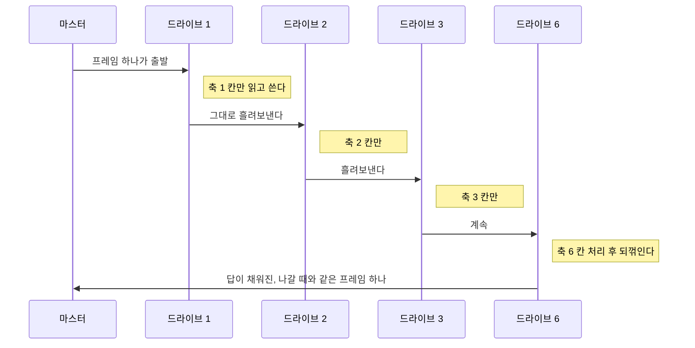
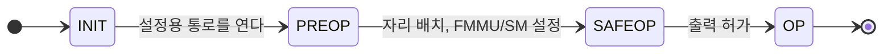
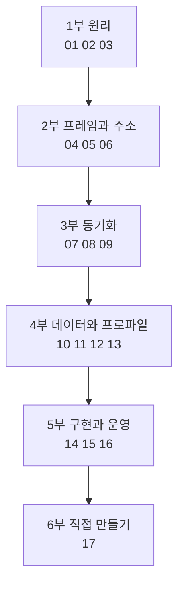

> **기준 출처:** [ETG EtherCAT Technology](https://www.ethercat.org/en/technology.html) / IEC 61158 Type 12, IEC 61784-2 CPF 12 / [SOEM](https://github.com/OpenEtherCATsociety/SOEM), [IgH EtherCAT Master](https://gitlab.com/etherlab.org/ethercat) / [Beckhoff InfoSys](https://infosys.beckhoff.com/) / 확인일 2026-08-18
> **시리즈:** [목차](/posts/00-comm-series/) | 이전 → [이더넷 05. 소켓 프로그래밍](/posts/05-socket-programming-basics/) | 다음 → [01. 왜 이더넷 위에 필드버스를 얹었나](/posts/01-why-fieldbus-on-ethernet/)

이 시리즈의 01편부터 17편은 EtherCAT가 대략 어떤 물건인지 아는 사람을 전제로 쓰여 있다. 그 전제가 없으면 외울 규칙 덩어리로 보인다. 이 글이 그 전제를 만든다.

여기까지만 읽어도 어떤 통신이고, 어떻게 돌아가고, 만들려면 무엇이 필요한지가 잡히도록 썼다. 세부는 전부 뒤 편으로 넘긴다. 읽고 나면 번호 순서대로 01편으로 가면 되고, 모르는 약어가 나오면 12절 사전으로 돌아오면 된다.

## 1. 30초 요약

EtherCAT는 하나의 컨트롤러가 여러 대의 모터와 센서에게 1 ms마다 명령을 주고 상태를 받아오는 산업용 통신이다.

보통의 통신은 한 대씩 차례로 묻고 답을 기다린다. EtherCAT는 그러지 않는다. 프레임 한 개를 만들어 모든 장치를 줄줄이 통과시킨다. 장치는 프레임을 멈춰 세우지 않고, 지나가는 그 순간에 자기 칸의 데이터를 읽고 자기 칸에 답을 써넣는다.

EtherCAT의 나머지는 이 하나에서 따라 나온다. 뒤의 16편은 그게 가능하려면 무엇이 더 필요한가를 채우는 내용이다.

| 질문 | 답 | 자세히 |
| --- | --- | --- |
| 어떤 통신인가 | 이더넷 케이블과 칩은 그대로 쓰고, 그 위의 규칙만 통째로 새로 만든 실시간 통신 | 3절 |
| 어떻게 작동하나 | 프레임 하나가 전 장치를 지나간다. on-the-fly 처리 | 4절 |
| 얼마나 빠른가 | 6축 로봇 기준 한 사이클 11.8 µs (1 ms 주기의 1.2%) | 5절 |
| 만들려면 뭐가 필요한가 | 마스터는 PC와 랜카드와 오픈소스, 슬레이브는 전용 칩(ESC)이 박힌 장치 | 8절 |
| 무엇을 포기했나 | 스위치, 무선, 인터넷, 멀티마스터 전부 못 쓴다 | 9절 |

## 2. 무슨 상황에서 쓰는 물건인가

6축 로봇 팔을 1 kHz(1 ms 주기)로 제어한다고 하자. 매 1 ms마다 아래를 다 해야 한다.

- 축 6개에 목표 위치를 내려보낸다 (출력)
- 축 6개에서 현재 위치, 전류, 상태를 읽어온다 (입력)
- 힘센서 값을 읽고 비상정지 입력을 확인한다

선을 어떻게 잇고 데이터를 어떻게 나를 것인가. 이걸 푸는 것이 필드버스이고 EtherCAT는 그중 하나다.


케이블은 흔히 쓰는 랜선(CAT5e)이고 커넥터도 RJ45다. 다만 스위치와 허브는 끼울 수 없다. 이유는 9절에 있다.

선이 일렬로 이어지는 것이 이 그림의 요점이다. 마스터에서 나간 프레임이 1번부터 끝까지 갔다가, 마지막 장치의 빈 포트에서 자동으로 되꺾여 왔던 길을 그대로 되짚어 마스터로 돌아온다. 자세히는 [03. 토폴로지와 물리계층](/posts/03-topology-mii-ebus/)에 있다.

## 3. 다른 통신 옆에 세워보기

새 통신을 배울 때 빠른 방법은 이미 아는 것 옆에 세워보는 것이다.

| | UART / RS-232 | CAN | 표준 이더넷 | EtherCAT |
| --- | --- | --- | --- | --- |
| 몇 대가 붙나 | 1:1 | 수십 대 | 수천 대 | 최대 65535 대 |
| 누가 말을 거나 | 양쪽 아무나 | 아무나 (멀티마스터) | 아무나 | 마스터 하나만 |
| 속도 | ~1 Mbps | 1 Mbps | 100 M ~ 10 Gbps | 100 Mbps |
| 도착 시각이 정해지나 | 단순해서 정해진다 | 우선순위가 낮으면 밀린다 | 아니다 | 계산으로 나온다 |
| 여러 장치가 동시에 움직이나 | 아니다 | 아니다 | 아니다 | µs급으로 맞춘다 |
| 장치 쪽 하드웨어 | 흔한 UART | CAN 컨트롤러 | 흔한 이더넷 칩 | 전용 칩(ESC) 필요 |
| 스위치, 라우터 | 해당 없음 | 해당 없음 | 당연히 된다 | 못 쓴다 |

표에서 볼 칸은 두 개다.

**도착 시각이 정해지나.** 로봇 제어에서 평균은 빠른데 가끔 늦는 통신은 쓸 수 없다. 제어 주기를 최악값으로 잡아야 하기 때문이다.

**동시에 움직이나.** 6축 로봇에서 축마다 명령 반영 시각이 20 µs씩 어긋나면 궤적이 틀어진다.

이 두 칸을 만족시키려고 나머지를 전부 포기한 것이 EtherCAT다.

표준 이더넷이 왜 실시간이 아닌지를 직접 유도해 보고 싶으면 [이더넷 04. 왜 표준 이더넷은 실시간이 아닌가](/posts/04-why-ethernet-not-realtime/)를 먼저 읽는다. 필수는 아니다. 결론은 01편 머리에 요약돼 있다.

## 4. 프레임 하나가 전부를 지나간다

### 4.1 보통 방식

CAN과 Modbus를 비롯한 대부분의 필드버스는 한 대씩 묻고 답을 기다린다. 왕복 한 번마다 선로가 놀고, 그것이 장치 수만큼 반복된다. 걸리는 시간은 한 번 왕복 시간에 장치 수를 곱한 값이다.

### 4.2 EtherCAT 방식

프레임 안에는 축마다 자기 칸이 하나씩 있다. 머리 뒤에 축 1 칸, 축 2 칸이 순서대로 붙고 꼬리로 끝난다. 이 프레임 하나가 줄을 따라 흘러가고 아무도 멈춰 세우지 않는다.



옛날 우편 열차는 역에 서지 않았다. 달리는 채로 갈고리를 뻗어 우편 자루를 낚아채고 동시에 새 자루를 던져 내렸다. 열차는 한 번도 멈추지 않는다. EtherCAT 슬레이브가 하는 일이 이것이다. 프레임이 칩을 통과하는 중에 자기 칸에서 명령을 읽고 자기 칸에 상태를 덮어쓴다.

이 처리 방식의 이름이 on-the-fly processing이고 [02. on-the-fly 처리](/posts/02-on-the-fly-processing/)가 그것만 다룬다.

### 4.3 그래서 뒤집힌 것

| | 보통 방식 | EtherCAT |
| --- | --- | --- |
| 프레임 개수 | 장치 수만큼 (N개) | 1개 |
| 장치가 늘면 | 시간이 비례해서 늘어난다 | 거의 그대로 (칩 통과 0.5 µs씩만) |
| 마스터가 푸는 문제 | N개 프레임을 어떤 순서로 보낼까 | 그 문제가 사라진다 |

어떤 순서로 보낼까를 푸는 것이 다른 필드버스들이다. CAN은 우선순위로, PROFINET IRT는 시간 슬롯으로, Modbus는 폴링으로 푼다. EtherCAT는 프레임이 하나면 순서를 정할 것이 없다는 쪽으로 문제 자체를 없앴다. [01편](/posts/01-why-fieldbus-on-ethernet/)이 이 선택의 배경을 다룬다.

## 5. 숫자로 확인

6축 로봇, 축당 16바이트(목표위치 4, 제어워드 2, 실제위치 4, 상태워드 2, 여유), 주기 1 ms 기준이다.

| | CAN (1 Mbps) | EtherCAT (100 Mbps) |
| --- | --- | --- |
| 보내야 할 것 | 축당 프레임 2개 = 12개 | 프레임 1개 |
| 프레임 크기 | 각 약 135 µs | 프로세스 데이터 96 B + 헤더 = 148 B |
| 한 사이클 소요 | 12 × 135 µs = 1620 µs | 11.8 µs |
| 1 ms 주기 대비 | 162 %, 물리적으로 불가능 | 1.2 % |

$$148\ \text{B} \times 8\ \text{bit} \div 100\ \text{Mbps} = 11.8\,\mu\text{s}$$

여기에 슬레이브 통과 지연(대당 약 0.5 µs)과 케이블 왕복을 더해도 수십 µs다. 여전히 주기의 2~3%다.

축을 12개로 늘리면 프로세스 데이터가 192 B가 되어 프레임은 244 B, 19.5 µs다. 프레임 개수는 그대로 1개이고 길이만 조금 늘었다. 이것이 on-the-fly의 실제 이득이다.

## 6. 한 사이클에 실제로 일어나는 일

EtherCAT를 쓰는 제어 프로그램은 단순하다.


1번과 5번이 PC 안의 메모리(프로세스 이미지)이고 2번부터 4번이 선로 위에서 일어나는 일이다.

C 코드에서는 이렇게 보인다.

```c
while (running) {
    /* 제어 계산: 입력 이미지를 읽고 출력 이미지를 채운다 */
    for (int i = 0; i < 6; i++) {
        int32_t actual = in[i].position_actual;      /* 슬레이브가 채워준 값 */
        out[i].position_target = trajectory(i, actual);
    }

    /* 통신은 이 두 줄이다 */
    ec_send_processdata();                    /* 출력 이미지 -> 프레임 -> 발사 */
    ec_receive_processdata(EC_TIMEOUTRET);    /* 돌아온 프레임 -> 입력 이미지 */

    wait_until_next_cycle();                  /* 1 ms 맞춰 대기 */
}
```

제어 코드 입장에서 EtherCAT는 배열 두 개다. `out[]`에 쓰면 모터가 움직이고 `in[]`을 읽으면 현재 상태가 있다. 선이 몇 가닥이고 장치가 몇 대인지는 코드에 나오지 않는다. 뒤 편들의 절반이 이 배열 두 개를 성립시키는 장치를 설명한다.

### 6.1 배열 두 개로 보이려면 필요한 것 다섯

| 풀어야 할 문제 | 그래서 생긴 장치 | 편 |
| --- | --- | --- |
| 프레임 안에서 내 칸을 어떻게 찾나 | 주소 지정 (위치, 고정, 논리 세 가지) | [05](/posts/05-addressing-auto-fixed-logical/) |
| 마스터가 배열 하나만 다루게 하려면 | FMMU, 슬레이브가 자기 몫을 알아서 오려낸다 | [06](/posts/06-fmmu-logical-mapping/) |
| 지나가는 찰나에 메모리를 안전하게 바꾸려면 | SyncManager, 3중 버퍼 | [07](/posts/07-syncmanager-buffer-mailbox/) |
| 다 처리됐는지 마스터가 어떻게 아나 | WKC, 슬레이브가 하나씩 올리는 카운터 | [04](/posts/04-frame-datagram-wkc/) |
| 데이터는 도착했는데 동시에 움직이려면 | 분산 클록(DC), 전 장치의 시계를 맞춘다 | [09](/posts/09-distributed-clocks/) |

마지막 항목이 특히 헷갈린다. 프레임이 도착했다는 것과 모터가 움직였다는 것은 다르다. 프레임은 드라이브 1에 먼저, 드라이브 6에 나중에 도착한다. 수 µs 차이지만 그냥 두면 축마다 반영 시각이 어긋난다. DC는 데이터 도착과 동작 시각을 분리한다. 전 슬레이브의 시계를 맞춰놓고 모두 t = 1000 µs에 반영하라고 지시한다.

## 7. 전원을 켜면 무슨 일이

전원을 넣자마자 위의 루프가 도는 것이 아니다. 슬레이브는 정해진 계단을 밟는다.



| 상태 | 이 단계에서 무슨 일이 | 할 수 있는 것 |
| --- | --- | --- |
| INIT | 전원 직후. 마스터가 몇 대가 어떤 순서로 붙어 있는지 훑는다 | 거의 없다 |
| PREOP | 메일박스가 열린다. PDO 매핑과 DC 설정을 여기서 한다 | 설정용 대화(SDO)만 |
| SAFEOP | 주기 데이터가 오가기 시작한다 | 입력은 유효, 출력은 아직 안전값 |
| OP | 출력이 실제로 나간다 | 여기부터 제어 루프 |

SAFEOP이 따로 있는 이유는 값을 읽을 수 있게 된 시점과 모터를 움직여도 되는 시점을 갈라놓기 위해서다. 설정이 끝나고 입력이 멀쩡히 들어오는 것을 확인한 뒤에야 출력을 연다. 안전이 걸린 장비에서 이 구분이 결과를 가른다. [08. ESM](/posts/08-esm-state-machine/)이 이 계단 전체를 다룬다.

실무에서 가장 자주 막히는 곳은 SAFEOP에서 OP로 올라가는 전이다. 슬레이브가 거부하면 AL Status Code라는 숫자를 남긴다. 그 숫자를 읽는 법이 08편에 있다.

### 7.1 모터를 쓰면 FSM이 하나 더 있다

여기서 처음 배우는 사람이 거의 반드시 헷갈린다.

| FSM | 누구 것 | 무엇을 관리하나 |
| --- | --- | --- |
| ESM (INIT → PREOP → SAFEOP → OP) | EtherCAT 통신 | 통신이 준비됐나 |
| CiA 402 (Switch on disabled → Ready to switch on → Switched on → Operation enabled) | 모터 드라이브 | 전원이 들어가고 축이 돌 준비가 됐나 |

둘은 별개이고 순서가 정해져 있다. 먼저 ESM을 OP까지 올린다. 통신이 살아야 명령을 보낼 수 있기 때문이다. 그다음 CiA 402를 Operation enabled까지 올린다. 제어워드를 `0x06`, `0x07`, `0x0F` 순으로 쓴다.

흔한 사고가 하나 있다. 제어워드를 `0x0F`로 올리는 순간 드라이브가 목표위치 값을 그대로 믿고 움직인다. 올리기 전에 목표위치를 현재위치로 초기화하지 않으면 축이 최대 속도로 급이동한다. [12. CoE와 CiA 402 기동 절차](/posts/12-coe-cia402-bringup/)를 참고한다.

## 8. 만들려면 무엇이 필요한가

### 8.1 하드웨어

| | 필요한 것 | 비고 |
| --- | --- | --- |
| 마스터 | PC 또는 SBC와 표준 랜카드 1장 | 전용 카드는 필요 없다. 인텔 계열 NIC가 드라이버가 성숙하다 |
| 슬레이브 | ESC 칩이 박힌 장치 | 돈과 결정이 걸린 지점. 8.5에서 다룬다 |
| 케이블 | CAT5e 이상, RJ45 | 구간당 100 m. 산업용은 실드 |
| 스위치 | 쓰면 안 된다 | 장치를 일렬로 잇는다 |

### 8.2 마스터 스택

밑바닥부터 짜는 것이 아니라 이미 있는 것을 쓴다.

| 스택 | 성격 | 언제 |
| --- | --- | --- |
| SOEM | 오픈소스 C, 가볍다. 파일 몇 개 수준 | 배우기 좋다. 소스를 끝까지 읽을 수 있다 |
| IgH EtherCAT Master | 오픈소스, 리눅스 커널 모듈 | 성능 튜닝, 다중 도메인 |
| 상용 스택 (TwinCAT, EC-Master 등) | 상용 | 제품화, 인증, 기술지원 |

SOEM으로 짜면 코드가 이 순서다.

```c
ec_init("eth0");                /* 랜카드 잡기 */
ec_config_init(FALSE);          /* 몇 대가 붙어 있나 스캔 */
ec_config_map(&IOmap);          /* 배열 두 개 만들기. FMMU 와 SM 이 여기서 설정된다 */
ec_configdc();                  /* 시계 맞추기 (DC) */
/*   슬레이브가 SAFEOP 에 올라온 것을 확인한 뒤 */
ec_slave[0].state = EC_STATE_OPERATIONAL;
ec_writestate(0);               /* OP 로 올리기 */
while (1) { ec_send_processdata(); ec_receive_processdata(EC_TIMEOUTRET); }
```

[14. SOEM 코드로 읽는 마스터 구현](/posts/14-soem-master-implementation/)이 이 여덟 줄을 한 줄씩 해부한다.

### 8.3 운영체제

네트워크는 12 µs인데 일반 윈도우와 리눅스는 1 ms 루프를 정확히 돌지 못한다. 다른 프로세스와 인터럽트에 밀려 수백 µs에서 수 ms씩 늦는다. 실제 병목은 여기다.

| 환경 | 지터(주기 흔들림) | 쓸 만한가 |
| --- | --- | --- |
| 일반 리눅스, 윈도우 | 수백 µs ~ 수 ms | 아니다 |
| PREEMPT_RT 리눅스 | 수십 µs | 쓸 만하다 |
| 전용 RTOS, 산업용 컨트롤러 | 수 µs | 쓸 만하다 |

[15. 사이클 지터와 실시간 OS](/posts/15-cycle-jitter-realtime-os/)가 이 문제를 다룬다.

### 8.4 설정 파일 ESI와 ENI

| | 무엇 | 어디서 오나 |
| --- | --- | --- |
| ESI (`.xml`) | 슬레이브가 어떤 장치이고 데이터가 어떻게 생겼는지를 적어놓은 파일 | 제조사가 준다 |
| ENI (`.xml`) | 이 네트워크는 이렇게 구성한다는 마스터용 설정 | 설정 도구가 ESI들을 모아 굽는다 |

SOEM은 ENI 없이도 돈다. 부팅할 때 슬레이브에게 직접 물어서 구성한다. 하지만 ESI는 사람이 읽어야 한다. 이 드라이브의 목표위치가 몇 번 객체인가가 거기 적혀 있다. [13. ESI와 ENI](/posts/13-esi-eni-config-files/)를 참고한다.

### 8.5 이것은 소프트웨어 결정이 아니다

슬레이브에는 ESC(EtherCAT Slave Controller)라는 전용 칩이 반드시 필요하다. 소프트웨어로는 만들 수 없다.

프레임이 선로를 지나가는 그 순간에 데이터를 갈아끼우고 WKC를 올려야 하기 때문이다. 100 Mbps에서 1비트는 10 ns다. CPU가 인터럽트를 받고 처리할 시간이 없다. ASIC이나 FPGA만 할 수 있다.

그래서 "우리 보드에 EtherCAT를 붙이자" 는 말은 소프트웨어 결정이 아니라 회로 설계 결정이다. ESC 칩이나 IP 코어를 기판에 올려야 한다. 반대로 마스터는 표준 NIC 하나면 된다. 프레임을 만들어 보내기만 하면 되기 때문에 PC와 SOEM으로 마스터가 된다.

## 9. 무엇을 포기했나

대가를 알아야 언제 쓸지 판단할 수 있다.

| 포기한 것 | 무슨 뜻인가 |
| --- | --- |
| 일반 이더넷 장비 호환 | 스위치와 허브를 못 쓴다. 일반 NIC는 EtherCAT 프레임(`0x88A4`)을 버린다 |
| 배선 자유도 | 정해진 순서로 일렬로 이어야 한다 |
| 멀티마스터 | 마스터는 하나다. CAN과 정반대다 |
| 전용 슬레이브 하드웨어 | ESC 칩이 필수다 |
| 라우팅 | 다른 망으로 못 나간다. 인터넷 경유가 불가능하다 |
| 무선 | 불가능하다 |
| 꽂았다 뺐다 | 구성이 바뀌면 재설정이 필요하다 |

### 9.1 그래서 언제 쓰나

| 상황 | 판단 |
| --- | --- |
| 다축이 µs급으로 동기해야 한다 | EtherCAT |
| 축이 많고 주기가 짧다 (1 ms 이하) | EtherCAT |
| 축 1~2개, 주기 10 ms | CAN으로 충분하다 |
| 센서 네트워크, 이벤트 기반 | CAN이 더 적합하다 |
| 원격지, 인터넷 경유 | TCP/IP |
| 무선 | 불가능하다 |

CAN과 EtherCAT는 경쟁이 아니라 역할 분담이다. 실제 로봇에서 주 제어축은 EtherCAT, 주변 장치와 안전 신호와 센서는 CAN을 같이 쓰는 구성이 흔하다.

## 10. 17편이 왜 이 순서인가

순서는 임의가 아니라 질문이 생기는 순서다.



같은 내용을 질문과 답으로 다시 쓰면 이렇다.

| 부 | 읽으면서 갖게 되는 질문 | 답하는 편 |
| --- | --- | --- |
| 1부 원리 | 왜 이더넷을 그냥 안 쓰나 / 도대체 어떻게 빠른가 / 선은 어떻게 잇나 | 01, 02, 03 |
| 2부 프레임과 주소 | 프레임이 어떻게 생겼나 / 슬레이브는 자기 칸을 어떻게 아나 / 마스터는 배열 하나만 보는데 그게 어떻게 나뉘나 | 04, 05, 06 |
| 3부 동기화 | 지나가는 찰나에 메모리를 어떻게 안전하게 바꾸나 / 왜 한 번에 OP로 못 가나 / 데이터는 왔는데 왜 동시에 안 움직이나 | 07, 08, 09 |
| 4부 데이터와 프로파일 | 내 데이터는 어디에 넣나 / 설정은 어떻게 보내나 / 실제 모터는 어떻게 돌리나 / 이 설정값들은 어디서 오나 | 10, 11, 12, 13 |
| 5부 구현과 운영 | 코드는 어떻게 짜나 / 왜 주기가 흔들리나 / 안 되면 어디를 보나 | 14, 15, 16 |
| 6부 예제 | 직접 만들어보자 | 17 |

각 편을 읽을 때 이것이 on-the-fly를 성립시키려고 왜 필요한가를 물으면 전부 이어진다.

## 11. 처음 읽는 사람을 위한 3단 코스

17편을 순서대로 완주하려고 하면 3부에서 지친다. 아래 순서를 권한다.

### 11.1 무슨 물건인지 (반나절)

| 순서 | 편 | 왜 지금 |
| --- | --- | --- |
| 1 | 이 글 (00) | 전체 지도 |
| 2 | [01. 왜 이더넷 위에 필드버스를 얹었나](/posts/01-why-fieldbus-on-ethernet/) | 왜 이걸 만들었나. 무엇을 얻고 무엇을 포기했나 |
| 3 | [02. on-the-fly 처리](/posts/02-on-the-fly-processing/) | 어떻게 되는가 |

번호 순서 그대로 읽으면 된다. 01편에서 왜를 보고 02편에서 어떻게를 보는 흐름이고, 두 편 다 머리에 요약 상자가 있어 앞 폴더를 읽지 않았어도 읽힌다.

### 11.2 실제로 돌리려면 (며칠)

08, 12, 14 순으로 읽는다. 부팅 계단, 드라이브 기동, 코드 순이다.

- [08. ESM](/posts/08-esm-state-machine/), 실무에서 제일 자주 막히는 곳
- [12. CoE와 CiA 402](/posts/12-coe-cia402-bringup/), 드라이브 기동 절차
- [14. SOEM 마스터 구현](/posts/14-soem-master-implementation/), 코드 골격

이 단계에서 04(WKC), 10(PDO), 13(ESI)은 필요할 때 찾아보는 사전으로 쓴다. 통독하지 않아도 된다.

### 11.3 왜 그렇게 되어 있나 (나머지 전부)

05, 06, 07, 09를 읽는다. 여기서 배열 하나로 보였던 이유가 잡힌다. 그다음 15, 16, 03, 11로 마무리하고 17로 직접 만든다.

## 12. 30초 사전

처음에는 다 몰라도 된다. 마주치면 여기로 돌아온다.

| 약어 | 풀이 | 한 줄 |
| --- | --- | --- |
| 마스터 / 슬레이브 | Master / Slave | 명령하는 쪽(PC) / 받는 쪽(드라이브, IO) |
| ESC | EtherCAT Slave Controller | 슬레이브에 반드시 박혀야 하는 전용 칩 |
| 프레임 | Frame | 한 번에 나가는 데이터 봉투 하나 |
| Datagram | 해당 없음 | 프레임 안의 칸 하나. 한 프레임에 여러 개 들어간다 |
| 프로세스 데이터 | Process Data | 매 주기 오가는 데이터 (목표위치, 현재위치 등) |
| PDO | Process Data Object | 프로세스 데이터의 항목. 이 칸에 무엇을 넣을지 |
| PDO 매핑 | 해당 없음 | 어느 값을 프레임 몇 번째 바이트에 놓을지 정하는 일 |
| SDO | Service Data Object | 가끔 주고받는 설정값. 주기 데이터가 아니다 |
| CoE | CANopen over EtherCAT | CANopen 규격을 EtherCAT 위에 그대로 얹은 것 |
| CiA 402 | 해당 없음 | 모터 드라이브 표준 프로파일. 제어워드, 상태워드, 운전모드 |
| CSP | Cyclic Synchronous Position | CiA 402 운전모드 중 하나. 매 주기 목표위치를 준다 |
| WKC | Working Counter | 슬레이브가 처리할 때마다 +1. 기댓값과 다르면 뭔가 빠진 것 |
| FMMU | Fieldbus Memory Management Unit | 마스터의 큰 배열에서 내 몫만 오려내는 하드웨어 |
| SM | SyncManager | 프레임과 CPU가 같은 메모리를 안 밟게 하는 하드웨어 |
| ESM | EtherCAT State Machine | 통신 FSM. INIT → PREOP → SAFEOP → OP |
| AL Status Code | Application Layer Status Code | ESM 전이 실패 이유 코드. 안 올라갈 때 이걸 읽는다 |
| DC | Distributed Clocks | 전 슬레이브 시계 맞추기. 동시 동작의 근거 |
| SYNC0 | 해당 없음 | DC가 슬레이브 내부에서 만드는 하드웨어 펄스 |
| ESI / ENI | Slave Information / Network Information | 제조사가 주는 장치 설명 XML / 마스터용 네트워크 설정 XML |
| LRW | Logical ReadWrite | 읽기와 쓰기를 한 번에 하는 명령. 전체 목록은 05편 |
| 메일박스 | Mailbox | 주기 데이터와 별도로 설정을 주고받는 통로 |
| 지터 | Jitter | 주기가 흔들리는 정도. 평균이 아니라 최악값을 본다 |

## 13. 막히면 어디로

| 증상 | 먼저 볼 곳 |
| --- | --- |
| 슬레이브가 아예 안 보인다 | 배선과 순서는 [03편](/posts/03-topology-mii-ebus/), 랜카드 선택은 [14편](/posts/14-soem-master-implementation/) |
| SAFEOP에서 OP로 안 올라간다 | AL Status Code, [08편](/posts/08-esm-state-machine/) |
| WKC가 기댓값과 다르다 | [04편](/posts/04-frame-datagram-wkc/), [16편](/posts/16-diagnostics-wkc-crc-counters/) |
| 값이 이상한 자리에 들어온다 | PDO 매핑, [10편](/posts/10-process-data-pdo-mapping/) |
| 통신은 OP인데 모터가 안 돈다 | CiA 402 상태, [12편](/posts/12-coe-cia402-bringup/) |
| OP 올리자마자 축이 급이동한다 | 목표위치 초기화 누락, [12편](/posts/12-coe-cia402-bringup/) |
| 축들이 미세하게 안 맞는다 | DC, [09편](/posts/09-distributed-clocks/) |
| 주기가 흔들린다, 가끔 프레임을 놓친다 | 마스터 쪽 OS, [15편](/posts/15-cycle-jitter-realtime-os/) |
| 간헐적으로 끊긴다 | CRC 카운터로 불량 구간 찾기, [16편](/posts/16-diagnostics-wkc-crc-counters/) |

## 정리

- EtherCAT는 이더넷 케이블과 칩은 그대로 쓰고 그 위의 규칙은 통째로 새로 만든 산업용 실시간 통신이다
- 프레임 한 개가 전 장치를 지나가고 장치는 지나가는 순간에 자기 칸을 처리한다. 이것이 on-the-fly다
- 그래서 장치가 늘어도 사이클이 거의 늘지 않는다. 6축 11.8 µs, 12축 19.5 µs
- 제어 코드 입장에서는 배열 두 개로 보인다. `out[]`에 쓰고 `in[]`을 읽고, 통신은 두 줄이다
- 그렇게 보이게 하려고 주소(05), FMMU(06), SyncManager(07), WKC(04), DC(09)가 있다
- 켤 때는 계단을 밟는다. INIT → PREOP → SAFEOP → OP. SAFEOP은 읽기는 되고 쓰기는 아직인 상태다
- 모터를 쓰면 그 위에 CiA 402 FSM이 하나 더 있다. ESM 먼저, 그다음 CiA 402
- 만들려면 마스터는 PC와 랜카드와 SOEM과 PREEMPT_RT, 슬레이브는 ESC 칩이 박힌 장치다
- EtherCAT를 붙이자는 말은 소프트웨어가 아니라 하드웨어 결정이다
- 대가는 스위치 못 씀, 일렬 배선, 마스터 하나, 무선과 인터넷 불가다
- 읽는 순서는 번호 그대로다. 이 글 다음 01, 02, 그리고 08, 12, 14, 나머지 순으로 간다

## 참고

- [ETG, EtherCAT Technology](https://www.ethercat.org/en/technology.html)
- [ETG, 공개 자료 다운로드](https://www.ethercat.org/en/downloads.html)
- [SOEM, Simple Open EtherCAT Master](https://github.com/OpenEtherCATsociety/SOEM)
- [IgH EtherCAT Master](https://gitlab.com/etherlab.org/ethercat)
- [Beckhoff InfoSys, EtherCAT 시스템 문서](https://infosys.beckhoff.com/)
- IEC 61158 Type 12 / IEC 61784-2 CPF 12
