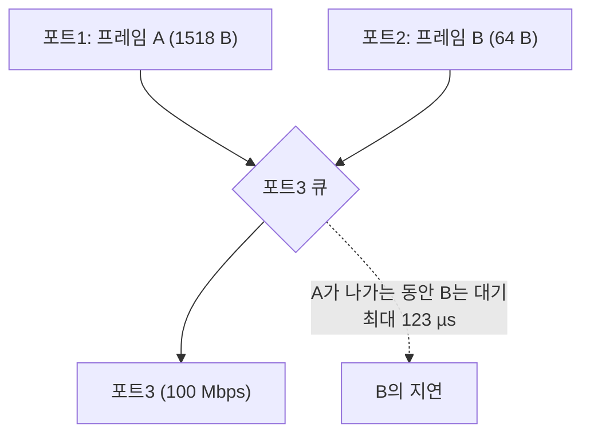

> **기준 출처:** IEEE 802.1D · IEEE 802.1Q · IEEE 802.3 §4 · IEEE 802.3x / 확인일 2026-08-03
> **시리즈:** [목차](/posts/00-comm-series/) | 이전 → [01. 이더넷 프레임과 MAC 주소](/posts/01-ethernet-frame-mac/) | 다음 → [03. IP, TCP, UDP](/posts/03-ip-tcp-udp-guarantees/)

## 1. CSMA/CD는 옛말이지만 지연은 남았다

공유 매체(허브) 시대의 충돌은 사라졌다. 요즘은 전부 스위치이고 각 포트가 전이중 전용 링크다.

| | 허브 시대 | 스위치 시대 |
| --- | --- | --- |
| 충돌 | 있다 (CSMA/CD) | 없다 |
| 지연의 원인 | 충돌 + 랜덤 백오프 | 큐잉 |
| 결정성 | 없다 | 여전히 없다 |

문제가 사라진 게 아니라 옮겨갔다. 충돌 대신 스위치 안의 큐가 지연을 만든다. 큐잉 지연은 충돌보다 나은 점이 있지만(대역폭 낭비가 없다) 여전히 예측 불가능하다.

## 2. 스위치가 하는 일

| 단계 | 동작 |
| --- | --- |
| ① 수신 | 프레임을 받는다 |
| ② 학습 | 출발지 MAC과 포트를 테이블에 기록 |
| ③ 조회 | 목적지 MAC이 어느 포트인가 |
| ④ 전달 | 그 포트로. 모르면 전 포트로 플러딩 |
| ⑤ 큐잉 | 목적 포트가 사용 중이면 기다린다 |

②의 학습이 있어서 스위치는 설정 없이 동작한다. ⑤가 이 편의 주제다.

## 3. 전달 방식 두 가지

### store-and-forward

프레임 전체를 받고 FCS를 검사한 뒤에 내보낸다.

$$\text{지연} \geq \text{프레임 수신 시간}$$

| | |
| --- | --- |
| 장점 | 깨진 프레임을 안 퍼뜨린다 |
| 장점 | 속도가 다른 포트 간 전달 가능 (100 Mbps → 1 Gbps) |
| 단점 | 최대 프레임이면 123 µs의 고정 지연 (100 Mbps 기준) |

### cut-through

목적지 MAC 6바이트만 읽으면 바로 전달을 시작한다. 프리앰블 8 + MAC 6 = 14바이트를 읽는 데 100 Mbps에서 약 1.1 µs다.

| | |
| --- | --- |
| 장점 | 지연이 프레임 크기와 무관 (수 µs) |
| 단점 | 깨진 프레임도 퍼뜨린다 (FCS를 아직 못 봤으니) |
| 단점 | 속도가 다른 포트 간에는 불가 |

cut-through의 발상이 EtherCAT의 on-the-fly 처리와 같다. 다 받고 나서가 아니라 지나가는 동안 처리한다. 차이는 EtherCAT가 여기서 한 걸음 더 나간다는 것이다. 스위치는 프레임을 그대로 전달하지만 EtherCAT 슬레이브는 지나가는 프레임의 내용을 실시간으로 읽고 쓴다.

## 4. 큐잉 지연

전달 방식과 무관하게, 목적 포트가 이미 사용 중이면 기다려야 한다.

포트 N개가 동시에 같은 목적 포트로 보내면, 최악의 경우 마지막 프레임은 N−1개의 프레임 시간을 기다린다.

| 상황 (100 Mbps) | 최악 지연 |
| --- | --- |
| 다른 포트 1개가 최대 프레임 전송 중 | 123 µs |
| 4개 포트가 동시에 최대 프레임 | 492 µs |
| 8개 포트 | 984 µs |

1 kHz 제어 루프의 주기가 1000 µs인데 스위치 하나가 984 µs를 먹을 수 있다. 그리고 이건 스위치 하나당이다. 두 단 거치면 두 배가 된다.

### 우선순위 큐로 해결되나

부분적으로만 된다.

| 도움 되는 것 | 안 되는 것 |
| --- | --- |
| 급한 프레임이 큐의 앞으로 간다 | 이미 전송이 시작된 프레임은 못 멈춘다. 최대 123 µs는 여전히 |
| 낮은 우선순위가 밀린다 | 같은 우선순위끼리는 여전히 경쟁 |
| | 모든 스위치가 지원하는 것도 아니다 |

[CAN 10편](/posts/10-can-bandwidth-worst-case/)의 블로킹과 정확히 같은 구조다. "이미 시작된 것은 끝까지 간다" 는 제약은 우선순위로 못 푼다.

차이가 하나 있다. CAN의 최대 프레임은 135비트라 1 Mbps에서 135 µs이고, 이더넷은 1518바이트라 100 Mbps에서 123 µs다. 숫자는 비슷하다. 그런데 CAN은 부하율을 관리하면 계산이 되는데 이더넷은 누가 언제 무엇을 보낼지 모른다.

## 5. 그 밖의 비결정성 요인

| 요인 | 무슨 일 |
| --- | --- |
| MAC 학습 테이블 만료 | 항목이 만료되면 다음 프레임이 전 포트로 플러딩되어 부하가 급증 |
| 테이블 오버플로 | 주소가 너무 많으면 플러딩 |
| 브로드캐스트와 멀티캐스트 | 전 포트로 간다. ARP, mDNS, 스패닝 트리 |
| 스패닝 트리(STP) | 토폴로지 변경 시 수 초간 통신 두절 |
| PAUSE 프레임 (802.3x) | 흐름 제어로 링크 전체가 멈춘다. 급한 프레임도 같이 |
| 스위치 내부 버퍼 관리 | 벤더마다 다르고 문서화가 안 된 경우가 많다 |

STP가 특히 위험하다. 케이블 하나가 흔들려 링크가 끊겼다 붙으면 스패닝 트리 재계산으로 수 초간 통신이 안 될 수 있다. RSTP라도 수백 ms다. 제어 시스템에서는 재앙이다.

그래서 산업용 실시간 네트워크는 일반 스위치를 안 쓴다. EtherCAT는 아예 스위치가 없는 토폴로지를 쓴다.

## 6. 지연을 다 더하면

PC에서 제어 보드까지 스위치 2단을 거친다고 하자. 100 Mbps 기준이다.

| 항목 | 최선 | 최악 |
| --- | --- | --- |
| 송신 NIC 큐 | 0 | ? (OS에 달림, 04편) |
| 케이블 전파 (10 m × 2) | 0.1 µs | 0.1 µs |
| 스위치 1 전달 (store-and-forward, 64 B) | 6.7 µs | 6.7 µs |
| 스위치 1 큐잉 | 0 | 123 µs |
| 스위치 2 전달 | 6.7 µs | 6.7 µs |
| 스위치 2 큐잉 | 0 | 123 µs |
| 수신 NIC + 커널 + 애플리케이션 | ? | ? (04편) |
| 네트워크 부분 합계 | 13.5 µs | 259.5 µs |

최선과 최악이 20배 차이다. 이게 지터이고, [기초 10편](/posts/10-basics-realtime-jitter/)에서 봤듯 지터는 보상할 수 없다. 그리고 NIC와 OS 지연이 아직 안 들어갔다. 그쪽이 훨씬 크다.

## 7. 현장에서 흔한 실수

| 실수 | 결과 |
| --- | --- |
| 사무용 스위치를 제어망에 넣는다 | 큐잉, STP, 플러딩. 팬이 있는 제품은 고장난다 |
| 제어망과 사무망을 섞는다 | 파일 전송 한 번에 제어 주기가 깨진다 |
| 무선(Wi-Fi)을 제어 경로에 | 지연 수십~수백 ms, 예측 불가 |
| VPN이나 터널을 거친다 | 지연 + 재전송 |
| 스위치에 링 구성 + STP | 링크 변동 시 수 초 두절 |

원칙은 하나다. 제어망은 물리적으로 분리한다. 진단이나 모니터링이 필요하면 별도 포트, 별도 NIC로 뽑는다. EtherCAT 마스터 PC는 보통 NIC를 2개 쓴다. 하나는 EtherCAT 전용이라 다른 트래픽이 없고, 하나는 일반 네트워크용이다.

## 정리

- 스위치 시대에 충돌은 사라졌지만 큐잉이 대신 들어왔다. 결정성은 여전히 없다
- store-and-forward는 전체 수신 후 FCS 검사. 최대 프레임이면 123 µs 고정 지연
- cut-through는 목적지 MAC만 읽고 즉시 전달(수 µs). 대신 깨진 프레임도 퍼뜨린다
- cut-through의 발상이 EtherCAT on-the-fly와 같다. EtherCAT는 지나가는 내용을 읽고 쓴다는 점이 다르다
- 지연의 대부분은 큐잉에서 온다. 8포트가 몰리면 최악 984 µs (100 Mbps)
- 우선순위 큐로 완전히 못 푼다. 이미 시작된 프레임은 못 멈춘다. CAN 블로킹과 같은 구조
- 그 밖의 비결정성: MAC 테이블 만료로 인한 플러딩, 브로드캐스트, STP 재계산(수 초 두절), PAUSE 프레임
- 스위치 2단이면 네트워크만으로 13.5 µs ~ 259.5 µs, 20배 지터. NIC와 OS 지연은 아직 안 들어갔다
- 제어망을 물리적으로 분리한다. EtherCAT 마스터는 보통 NIC를 2개 쓴다

## 참고

- [IEEE GET 802 프로그램](https://ieeexplore.ieee.org/browse/standards/get-program/page/series?id=68)
- [IEEE 802.1 작업그룹](https://1.ieee802.org/)
