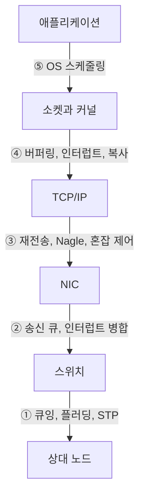

> **기준 출처:** IEEE 802.3 / 802.1Q · RFC 791·768·9293 · [ETG EtherCAT Technology](https://www.ethercat.org/en/technology.html) · [IEEE 802.1 TSN](https://1.ieee802.org/tsn/) · IEC 61784 · [Linux Foundation PREEMPT_RT](https://wiki.linuxfoundation.org/realtime/start) / 확인일 2026-08-03
> **시리즈:** [목차](/posts/00-comm-series/) | 이전 → [03. IP, TCP, UDP](/posts/03-ip-tcp-udp-guarantees/) | 다음 → [05. 소켓 프로그래밍 기초](/posts/05-socket-programming-basics/)

## 1. 이 폴더의 결론

[기초 10편](/posts/10-basics-realtime-jitter/)에서 실시간의 정의는 "최악의 경우를 계산할 수 있는가" 였다. 그 기준으로 표준 이더넷을 채점한다.

**표준 이더넷은 최악 지연의 상한이 없다.** 평균은 아주 좋지만 상한을 계산할 방법이 없다.

그리고 지연은 한 군데서 오지 않는다. 다섯 층에서 온다.

## 2. 지연의 다섯 원천

### ① 스위치 큐잉

| | 100 Mbps |
| --- | --- |
| 최대 프레임 하나 | 123 µs |
| 8포트 경합 | 984 µs |
| 2단 스위치 | 두 배 |
| STP 재계산 | 수백 ms에서 수 초 |

상한을 정하려면 누가 언제 무엇을 보낼지를 알아야 하는데 표준 이더넷은 그걸 모른다.

### ② NIC

| 요인 | 크기 |
| --- | --- |
| 인터럽트 병합 | 처리량을 위해 인터럽트를 모은다. 수십에서 수백 µs |
| 송신 큐(qdisc) | 큐 정책에 따라 |
| DMA 디스크립터 링 | |
| 오프로드 기능 (TSO/GSO/GRO) | 프레임을 모으거나 쪼갠다 |

인터럽트 병합은 기본으로 켜져 있다. 서버 처리량에는 좋지만 실시간에는 독이다. 드라이버가 지원하면 `ethtool -C eth0 rx-usecs 0 rx-frames 1` 로 끈다.

### ③ TCP/IP

| 요인 | 크기 |
| --- | --- |
| 재전송(RTO) | 최소 200 ms (Linux) |
| Nagle + Delayed ACK | 수십에서 수백 ms |
| 혼잡 제어 | 처리량 급감 |
| 단편화 재조립 | |

### ④ 커널 네트워크 스택

| 요인 | 크기 |
| --- | --- |
| 소켓 버퍼 복사 | µs |
| softirq 처리 지연 | 수십 µs에서 ms |
| 락 경합 | |
| 페이지 폴트 | 예측 불가 |

### ⑤ OS 스케줄링, 대개 가장 크다

| 커널 | 최악 스케줄링 지연 |
| --- | --- |
| 일반 Linux (`CONFIG_PREEMPT_NONE`) | 수 ms에서 수십 ms |
| Linux PREEMPT (저지연) | 수백 µs |
| PREEMPT_RT | 수십 µs |
| Windows (일반) | 수 ms에서 수십 ms |

네트워크를 아무리 다듬어도 OS가 5 ms를 먹으면 소용없다. 그래서 실시간 이더넷 마스터는 거의 항상 RT 커널과 CPU 격리와 실시간 우선순위를 함께 쓴다.

## 3. 다 더하면

제어 명령을 보내고 응답을 받기까지를 100 Mbps 전용 링크, 일반 Linux에서 계산한다.

| 항목 | 최선 | 평균 | 최악 |
| --- | --- | --- | --- |
| 애플리케이션 → 커널 (스케줄링) | 1 µs | 20 µs | 5000 µs |
| 커널 스택 + NIC 송신 | 5 µs | 30 µs | 500 µs |
| 스위치 (1단) | 7 µs | 20 µs | 130 µs |
| 슬레이브 처리 | 50 µs | 50 µs | 50 µs |
| 스위치 (돌아오는 길) | 7 µs | 20 µs | 130 µs |
| NIC 수신 + 인터럽트 병합 | 5 µs | 60 µs | 300 µs |
| 커널 → 애플리케이션 (스케줄링) | 1 µs | 20 µs | 5000 µs |
| 합계 | 76 µs | 220 µs | 11.1 ms |

최악이 평균의 50배다. 그리고 여기에 TCP 재전송 200 ms는 안 들어갔다.

평균 220 µs는 훌륭하지만 최악 11 ms를 감당할 수 없으면 이 네트워크는 쓸 수 없다. 1 kHz 루프에서 11주기를 통째로 놓친다.

## 4. 산업계의 네 가지 해법

같은 문제를 서로 다르게 풀었다. 어느 층을 건드렸는지로 분류하면 명확하다.

| 방식 | 어느 층을 바꿨나 | 대표 |
| --- | --- | --- |
| ① 우선순위만 | 2계층에 우선순위 큐 | EtherNet/IP + QoS, PROFINET RT |
| ② 시간 슬롯 예약 | 스위치를 시간 인지형으로 | PROFINET IRT, TSN |
| ③ 매체 접근 제어 | 누가 언제 말할지 통제 | Powerlink (마스터가 폴링) |
| ④ 프레임 처리 방식 자체 | 2계층을 완전히 다시 | EtherCAT, SERCOS III |

### ① 우선순위 (802.1p / QoS)

급한 프레임을 큐의 앞으로 보낸다. 개선은 되지만 상한이 안 생긴다. 02편에서 봤듯 이미 전송이 시작된 프레임은 못 멈춘다. 최소 123 µs의 블로킹이 남고 OS 지연은 그대로다. 수 ms 주기의 느슨한 제어에는 쓸 수 있는 soft real-time 수준이다.

### ② 시간 슬롯 (TSN, PROFINET IRT)

스위치가 시간을 알고, 정해진 시각에 정해진 프레임만 통과시킨다.

| TSN 표준 | 하는 일 |
| --- | --- |
| 802.1AS | 시각 동기 (gPTP) |
| 802.1Qbv | 시간 인지 셰이퍼. 시간 슬롯으로 게이트를 연다 |
| 802.1Qbu / 802.3br | 프레임 선점. "이미 시작된 프레임" 문제를 푼다 |
| 802.1CB | 이중화 (프레임 복제와 제거) |

802.1Qbu가 결정적이다. 긴 프레임을 중간에 끊고 급한 프레임을 보낸 뒤 이어서 보낸다. 02편에서 우선순위로 못 푼다던 문제를 물리적으로 해결한다.

대가는 스위치와 NIC가 전부 TSN 지원이어야 하고 시간 슬롯 설계가 복잡하다는 것이다. 아직 EtherCAT만큼 성숙하지 않다.

### ③ 매체 접근 제어 (Powerlink)

마스터가 슬레이브를 순서대로 폴링한다. 아무도 마음대로 말하지 않으니 충돌과 큐잉이 없다. 표준 이더넷 하드웨어를 쓸 수 있다는 게 장점이고, 대신 폴링이라 노드 수에 비례해 사이클이 길어진다. [시리얼 10편](/posts/10-modbus-silence-timeout/)의 Modbus와 같은 구조다.

### ④ 프레임 처리 방식 자체 (EtherCAT)

나머지 셋과 발상이 다르다. ①②③은 "프레임을 어떻게 스케줄할까" 를 푼다. EtherCAT는 "프레임을 하나만 쓰면 스케줄할 게 없다" 로 간다.

①②③에서는 슬레이브 N개마다 프레임 N개가 생기고 그걸 어떻게 배치할지가 문제다. EtherCAT는 프레임 하나가 슬레이브 1번부터 N번까지 지나가면서 각자 자기 몫을 읽고 쓰게 한다. 배치할 대상이 아예 없다.

| 그래서 없어진 것 | |
| --- | --- |
| 스위치 | 안 쓴다. 슬레이브가 직접 이어진다 |
| 큐잉 지연 | 프레임이 하나뿐 |
| 우선순위 경쟁 | 경쟁 상대가 없다 |
| IP/TCP | EtherType `0x88A4` 로 직접 (01편) |
| 프레임 개수 증가 | 슬레이브가 늘면 프레임이 길어질 뿐 |

기초 02편에서 계산한 효율이 여기서 의미를 갖는다. 슬레이브 30개면 효율 77%다. 노드가 늘수록 좋아지는 유일한 프로토콜이다.

대가는 토폴로지 자유도가 없고(정해진 순서로 이어야 한다), 일반 네트워크 장비와 호환이 안 되고, 마스터가 하나뿐이라는 것이다.

## 5. 비교

| | 표준 이더넷 | +QoS | TSN | EtherCAT |
| --- | --- | --- | --- | --- |
| 최악 지연 상한 | 없다 | 부분적 | 있다 | 있다 |
| 전형 사이클 | | 수 ms | < 1 ms | 0.1~1 ms |
| 지터 | 수 ms | 수백 µs | < 1 µs | < 1 µs (DC) |
| 표준 하드웨어 | 가능 | 가능 | TSN 장비 필요 | 전용 슬레이브 IC |
| 스위치 | 쓴다 | 쓴다 | TSN 스위치 | 안 쓴다 |
| 일반 IP 트래픽 공존 | 가능 | 가능 | 가능 | EoE로 터널링 |
| 성숙도 | | 높다 | 성장 중 | 높다 |
| 노드가 늘면 | 나빠진다 | 나빠진다 | 설계 재검토 | 효율이 좋아진다 |

마지막 줄이 EtherCAT의 결정적 차별점이다. 다른 모든 방식은 노드가 늘면 대역폭과 스케줄이 빡빡해지는데 EtherCAT는 고정 오버헤드를 나눠 쓰므로 효율이 올라간다.

## 6. 그래도 표준 이더넷을 써야 한다면

| 조치 | 효과 |
| --- | --- |
| 전용 물리 네트워크 (다른 트래픽 0) | 큐잉 지연 제거 |
| 스위치 없이 직결 | 스위치 지연 제거 |
| UDP + 애플리케이션 신뢰성 | TCP 지연 제거 |
| PREEMPT_RT 커널 + CPU 격리 + `SCHED_FIFO` | 스케줄링 지연을 수 ms에서 수십 µs로 |
| 인터럽트 병합 끄기 (`ethtool -C`) | NIC 지연 감소 |
| 메모리 잠금 (`mlockall`) | 페이지 폴트 제거 |
| 소켓 버퍼 크기 조정 (`SO_RCVBUF`) | 버스트 흡수 |
| 하드웨어 타임스탬프 (`SO_TIMESTAMPING`) | 실제 지연 측정 |

이 조합으로 수백 µs에서 1 ms급 soft real-time은 가능하다. 진단, 모니터링, 저속 제어에는 충분하다. 하지만 상한은 여전히 보장되지 않고 확률이 낮아질 뿐이다. 안전이 걸리면 이걸로는 안 된다.

## 정리

- 표준 이더넷의 문제는 느린 게 아니라 최악의 상한이 없다는 것이다
- 지연의 다섯 원천: 스위치 큐잉, NIC(인터럽트 병합), TCP/IP, 커널 스택, OS 스케줄링. 마지막이 대개 가장 크다
- 종합하면 최선 76 µs, 평균 220 µs, 최악 11.1 ms. 최악이 평균의 50배다
- 산업계의 네 해법을 "어느 층을 건드렸나" 로 분류: 우선순위(QoS)는 상한이 안 생기고, 시간 슬롯(TSN)은 802.1Qbu 프레임 선점이 핵심이며 성장 중이고, 매체 접근 제어(Powerlink)는 노드 수에 비례해 사이클이 늘고, EtherCAT는 프레임을 하나만 쓴다
- EtherCAT의 차별점은 노드가 늘수록 효율이 좋아진다는 것이다. 다른 모든 방식과 반대다
- EtherCAT의 대가: 토폴로지 제약, 일반 장비와 호환 불가, 마스터 하나
- 표준 이더넷으로 버티려면 전용망, 직결, UDP, PREEMPT_RT, 인터럽트 병합 끄기. 수백 µs급은 가능하지만 상한은 보장 안 된다

## 참고

- [ETG — EtherCAT Technology](https://www.ethercat.org/en/technology.html)
- [IEEE 802.1 TSN 작업그룹](https://1.ieee802.org/tsn/)
- [Linux Foundation — PREEMPT_RT](https://wiki.linuxfoundation.org/realtime/start)
