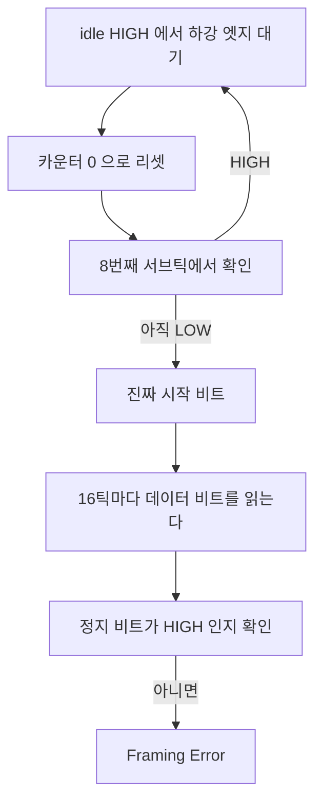

> **기준 출처:** MCU 레퍼런스 매뉴얼의 USART 절(ST RM0090 §30.3.4 Fractional baud rate generation, §30.3.5 USART receiver tolerance to clock deviation), 크리스탈과 발진자 데이터시트의 주파수 안정도 사양 / 확인일 2026-08-03
> **시리즈:** [목차](/posts/00-comm-series/) | 이전 → [01. UART 원리](/posts/01-uart-async-meaning/) | 다음 → [03. 프레임 구조](/posts/03-uart-frame-parity-stop/)

---

## 1. 얼마나 틀려도 되나

[01편](/posts/01-uart-async-meaning/)에서 UART 는 양쪽 클럭이 충분히 비슷하기를 기대한다고 했다. 충분히가 정확히 얼마인가. 이 숫자를 모르면 발진자를 고를 수 없고, 통신이 깨질 때 보율 오차가 원인인지 판단할 수 없다.

## 2. 수신기는 16배로 오버샘플링한다

수신기는 보율의 16배 속도로 선을 들여다본다. 일부 MCU 는 8배 모드도 지원한다.



세 번째 단계가 노이즈 방어다. 짧은 글리치는 8틱 뒤에 사라져 있으니 걸러진다. 그리고 많은 MCU 가 7번과 8번과 9번 샘플의 다수결을 취한다. 세 샘플이 안 맞으면 Noise Error 플래그를 세운다.

Noise Error 가 뜨는데 데이터는 맞는다면 물리계층이 나빠지고 있다는 조기 경보다. 이 플래그를 카운터로 세어두면 통신이 깨지기 전에 알 수 있다.

## 3. 허용 오차를 유도한다

8N1 프레임에서 마지막으로 읽는 것은 정지 비트이고 그 위치는 시작 비트 하강 엣지로부터 이만큼이다.

$$0.5 + 9 = 9.5\ \text{비트 시간}$$

시작 비트 가운데가 0.5 이고 데이터가 8개, 그다음이 정지 비트 가운데다. 수신기 보율이 상대적으로 $e$ 만큼 틀리면 그 시점의 누적 위치 오차는 $9.5 \times e$ 비트다. 이게 반 비트를 넘으면 옆 비트를 읽는다.

$$9.5 \times e < 0.5 \quad\Rightarrow\quad e < 5.26\%$$

이 5.26% 는 이상적인 값이다. 실제로는 여기서 계속 깎인다.

| 깎이는 요인 | 크기 |
| --- | --- |
| 시작 비트 검출 오차. 하강 엣지가 샘플 사이에 오면 최대 1틱 | 약 3% |
| 송신 측 오차. 5.26% 는 두 클럭의 상대 오차라 양쪽이 나눠 가진다 | 절반씩 |
| 노이즈 여유 | 남겨둬야 한다 |
| 전이 시간 | 느린 트랜시버면 더 크다 |

그래서 제조사 문서의 실제 허용 오차 표는 2~4% 수준을 제시한다. 오버샘플링 배수와 정지 비트 개수와 데이터 비트 수에 따라 다르다. 그건 한쪽 기준이 아니라 조건부 표라 실무 지침은 각 측 ±2% 이내를 목표로 굳었다.

### 정지 비트를 2개로 하면

마지막 정지 비트 가운데는 10.5 비트 시간 위치다.

$$10.5 \times e < 0.5 \Rightarrow e < 4.76\%$$

오히려 나빠진다. 정지 비트를 늘리면 여유가 생긴다는 게 흔한 오해인데, 수신기 관점에서는 프레임이 길어져서 오차가 더 쌓인다.

정지 비트 2개의 진짜 이득은 송신 쪽에 있다. 다음 시작 비트까지 간격이 벌어져서 수신기가 idle 을 확실히 보고 재정렬할 시간이 생긴다. 그리고 수신 소프트웨어가 처리할 시간이 는다.

## 4. 발진자를 고른다

| 발진자 | 정확도 | 온도 드리프트 | UART 에 쓸 수 있나 |
| --- | --- | --- | --- |
| 크리스탈 (수정) | ±20~50 ppm (0.002~0.005%) | 작다 | 여유가 400배다 |
| 세라믹 발진자 | ±0.3~0.5% | 중간이다 | 쓸 수 있다. 여유 4~6배 |
| MCU 내부 RC | ±1~3% (교정 후) | 크다 | 아슬아슬하다 |
| 내부 RC (미교정) | ±5~10% | 매우 크다 | 쓸 수 없다 |
| USB 동기 보정 RC | ±0.25% (USB SOF 로 교정) | — | USB 가 붙어 있을 때만 |

실온에서는 잘 되는데 장비가 30분 돌고 나면 통신 에러가 늘어난다면 내부 RC 발진기의 전형적인 증상이다. 25 °C 에서 교정된 RC 가 60 °C 에서 1~2% 밀린다. 상대 오차가 2% 를 넘어가면서 프레이밍 에러가 나기 시작한다.

대응 순서는 이렇다. 먼저 온도와 에러율의 상관관계를 확인한다. 온도 센서 값과 에러 카운터를 같이 로깅하면 된다. 그다음 크리스탈로 교체하는 게 근본 해결이다. 못 바꾸면 보율을 낮춘다. 오차 허용은 보율과 무관하지만 낮은 보율이 노이즈 여유가 커서 실질적으로 낫다. MCU 가 지원하면 런타임 재교정도 방법이다.

## 5. 분주기 계산에서도 오차가 생긴다

발진자가 정확해도 분주 결과가 정수로 떨어지지 않으면 오차가 생긴다.

$$\text{분주값} = \frac{f_{\text{clock}}}{16 \times \text{baud}}$$

### 예제 1. 16 MHz, 115200 bps

$$\frac{16\times10^6}{16 \times 115200} = 8.68$$

정수 분주만 되는 UART 라면 8 이나 9 를 골라야 한다.

| 분주값 | 실제 보율 | 오차 |
| --- | --- | --- |
| 8 | 125000 | +8.5% |
| 9 | 111111 | −3.5% |

둘 다 못 쓴다. 이 조합은 실패다.

### 예제 2. 같은 조건에 소수 분주 지원

STM32 의 USART 는 정수부 12비트와 소수부 4비트를 지원한다. 소수부는 1/16 단위다.

$$8.68 \approx 8 + \frac{11}{16} = 8.6875$$

$$\text{실제 보율} = \frac{16\times10^6}{16 \times 8.6875} = 115107.9$$

$$\text{오차} = \frac{115107.9 - 115200}{115200} = -0.08\%$$

소수 분주가 있느냐 없느냐가 결정적이다. 데이터시트에서 fractional baud rate 를 확인한다.

### 예제 3. 8 MHz, 115200 bps

$$\frac{8\times10^6}{16\times115200} = 4.34$$

| | 실제 보율 | 오차 |
| --- | --- | --- |
| 정수 4 | 125000 | +8.5% |
| 소수 4.375 (4 + 6/16) | 114285.7 | −0.79% |

소수 분주가 있으면 겨우 통과한다. 여유가 별로 없으니 상대 장비 오차까지 고려하면 위험하다.

### 왜 11.0592 MHz 크리스탈이 있나

$$\frac{11059200}{16 \times 115200} = 6.000$$

정확히 정수로 떨어진다. 시리얼 통신을 위해 존재하는 주파수다. 1.8432 MHz 의 배수인데 1.8432 는 115200 곱하기 16 이라 모든 표준 보율이 정확히 떨어진다. 요즘은 소수 분주와 PLL 덕에 덜 쓰지만 보율 오차가 치명적인 설계에서는 여전히 유효한 선택이다.

### 계산을 코드로 남긴다

```cpp
// comm_serial/baud_calc.hpp
// 컴파일 타임에 보율 오차를 계산하고 임계를 넘으면 빌드를 막는다.
// 클럭이나 보율을 바꿨을 때 조용히 깨지는 걸 방지한다.
#pragma once
#include <cstdint>

struct BaudSetting {
    std::uint32_t mantissa;     // 정수부
    std::uint8_t  fraction;     // 소수부 (1/16 단위)
    double        actual_baud;
    double        error_percent;
};

constexpr BaudSetting compute_baud(std::uint32_t f_clk, std::uint32_t target) {
    const double div  = static_cast<double>(f_clk) / (16.0 * target);
    const auto   mant = static_cast<std::uint32_t>(div);
    const auto   frac = static_cast<std::uint8_t>((div - mant) * 16.0 + 0.5);
    const double real = static_cast<double>(f_clk) / (16.0 * (mant + frac / 16.0));
    return { mant, frac, real, (real - target) / target * 100.0 };
}

inline constexpr auto kUart1 = compute_baud(16'000'000, 115'200);
static_assert(kUart1.error_percent < 1.0 && kUart1.error_percent > -1.0,
              "보율 오차가 1%를 넘는다. 클럭 또는 보율을 바꿔야 한다");
```

`static_assert` 가 핵심이다. 나중에 누가 시스템 클럭을 바꾸면 빌드가 깨지면서 알려준다. 안 그러면 현장에서 가끔 통신이 안 된다는 형태로 나타난다.

## 6. 보율이 틀렸는지 어떻게 아나

| 증상 | 해석 |
| --- | --- |
| 아무것도 안 온다 | 보율 문제가 아닐 가능성이 크다. 배선과 전원과 TX/RX 뒤바뀜을 본다 |
| Framing Error 가 계속 난다 | 보율 오차가 크거나 패리티 설정 불일치로 프레임 길이가 다르다 |
| 글자가 규칙적으로 깨진다 | 보율이 정수배 관계로 틀렸다. 예를 들어 2배다 |
| 긴 문자열의 뒷부분만 깨진다 | 프레임마다 재정렬되므로 이 증상은 드물다. 오히려 오버런을 의심한다 |
| 온도에 따라 달라진다 | 내부 RC 발진기다 |
| 한쪽 방향만 된다 | 양쪽 보율 설정이 다르거나 한쪽 클럭이 틀렸다 |

### 오실로스코프로 보율 실측하기

가장 확실한 방법이다. 알려진 바이트를 반복 전송하는데 `0x55`, 곧 `01010101` 이 최적이다. 비트마다 전이가 있어 경계가 다 보인다. 오실로스코프로 한 비트의 폭을 재고 보율은 그 역수로 계산한다.

비트 폭이 8.7 µs 로 측정되면 114943 bps 이고 115200 을 의도한 것이니 오차 0.22% 로 정상이다. 비트 폭이 8.0 µs 면 125000 bps 이므로 보율 설정이 틀렸다.

## 정리

- 수신기는 16배 오버샘플링으로 각 비트의 가운데에서 읽는다. 고급 UART 는 7, 8, 9번 샘플 다수결을 쓴다.
- Noise Error 플래그는 조기 경보다. 데이터가 맞아도 카운터가 늘면 물리계층이 나빠지는 중이다.
- 이론 한계는 마지막 정지 비트가 9.5 비트 위치이므로 $e < 5.26\%$ 다.
- 여기서 시작 비트 검출 오차와 양측 분담과 노이즈 여유를 빼면 실무 목표는 각 측 ±2% 다.
- 정지 비트를 2개로 해도 수신 오차 예산은 오히려 준다. 이득은 송신과 처리 시간 쪽에 있다.
- 발진자는 크리스탈(±50 ppm)이나 세라믹(±0.5%)을 쓴다. 내부 RC(±1~3%)는 온도에 밀린다.
- 데워지면 깨진다는 증상은 내부 RC 발진기의 전형이다.
- 분주 오차도 따로 생긴다. 16 MHz 에 115200 은 정수 분주로는 불가능하고(±8.5%) 소수 분주로 −0.08% 가 된다.
- 11.0592 MHz 크리스탈은 시리얼을 위해 존재하는 주파수다.
- 보율 계산을 `constexpr` 과 `static_assert` 로 박아두면 클럭을 바꿨을 때 빌드가 막아준다.
- 실측은 `0x55` 반복 전송에 오실로스코프로 비트 폭을 재는 것이다.

## 참고

- [ST RM0090 — STM32F4 레퍼런스 매뉴얼](https://www.st.com/resource/en/reference_manual/dm00031020.pdf)
- [Modbus over Serial Line V1.02](https://www.modbus.org/docs/Modbus_over_serial_line_V1_02.pdf)
