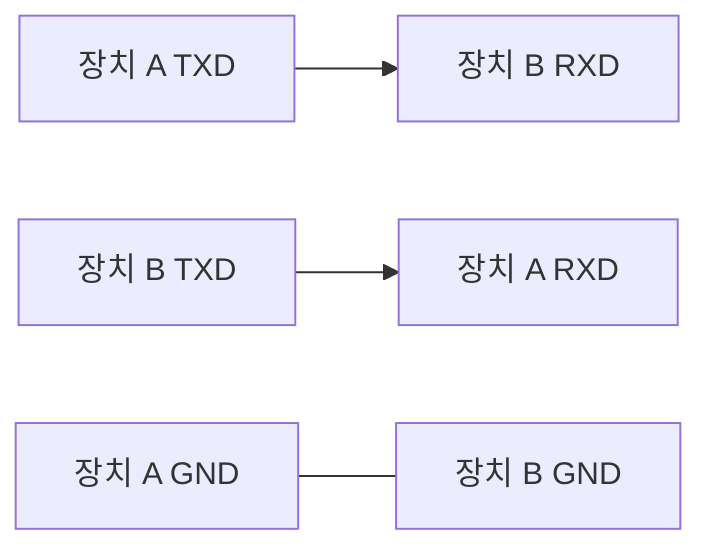

> **기준 출처:** TIA/EIA-232-F 는 유료 규격이라 아래 수치는 제조사 앱노트와 트랜시버 데이터시트로 교차 확인 가능한 공개 값이다. TI MAX3232 계열 데이터시트, Analog Devices RS-232 기술 자료 / 확인일 2026-08-03
> **시리즈:** [목차](/posts/00-comm-series/) | 이전 → [03. 프레임 구조](/posts/03-uart-frame-parity-stop/) | 다음 → [05. 핸드셰이크](/posts/05-serial-handshake-rts-cts/)

---

## 1. RS-232 는 전기 규격일 뿐이다

[01편](/posts/01-uart-async-meaning/)의 층 구분을 다시 보자. RS-232 가 정하는 것은 전압과 커넥터와 신호선의 의미뿐이다.

| RS-232 가 정하는 것 | RS-232 가 정하지 않는 것 |
| --- | --- |
| 논리 1 과 0 의 전압 | 보율 |
| 커넥터와 핀 배치 | 데이터 비트 수와 패리티 |
| 각 신호선의 이름과 방향 | 프레임 구조. 그건 UART 다 |
| 케이블 커패시턴스 상한 | 데이터의 의미 |

## 2. 논리 1이 음전압이다

RS-232 의 가장 낯선 점이다.

| 논리 | 이름 | 송신기 출력 | 수신기 판정 |
| --- | --- | --- | --- |
| 1 | mark | −5 ~ −15 V | −3 V 미만 |
| 0 | space | +5 ~ +15 V | +3 V 초과 |
| — | 불확정 | — | −3 V 에서 +3 V 사이 |

전신 전류 루프의 관습이다. 옛날 텔레타이프는 회선에 전류가 흐르는 상태를 mark, 곧 연결이 살아 있음이라 했고 안 흐르는 상태를 space 라 했다. idle 은 mark 였고 그게 전압 방식으로 옮겨오면서 반전 논리가 됐다. [01편](/posts/01-uart-async-meaning/)에서 본 idle 이 HIGH 인 이유, 곧 끊긴 선이 조용하도록 한다는 것과 같은 계보다.

실무적 함의가 있다. MCU 의 UART 핀은 0~3.3 V 에 idle 이 HIGH 인 3.3 V 이고, RS-232 선은 idle 이 mark 인 −12 V 다. 전압도 극성도 다르다. 그래서 트랜시버 칩이 반드시 필요하다. MAX3232 같은 칩이 전하 펌프로 ±5~10 V 를 만들고 극성을 뒤집는다.

MCU 의 TX 핀을 RS-232 커넥터에 직결하면 두 가지가 일어난다. 극성이 반대라 통신이 안 되고, 상대가 보내는 −12 V 가 MCU 핀에 들어가 칩이 손상된다.

| | TTL 3.3 V | RS-232 |
| --- | --- | --- |
| 논리 1 | 3.3 V | −12 V (전형) |
| 논리 0 | 0 V | +12 V |
| 임계 | 1.65 V | ±3 V |
| 마진 | 1.65 V | 약 9 V |

[기초 03편](/posts/03-basics-physical-differential/)에서 본 그라운드 전위차 문제를 전압을 키워서 버티는 방식이다. 차동이 아니라 단선이므로 근본 해결은 아니지만 ±9 V 마진이면 웬만한 사무실 환경은 견딘다.

## 3. 거리와 속도의 한계

규격은 거리를 직접 정하지 않고 케이블 커패시턴스를 2500 pF 이하로 제한한다.

| | 계산 |
| --- | --- |
| 일반 시리얼 케이블 | 약 50~100 pF/m |
| 2500 pF 를 75 pF/m 로 나누면 | 약 33 m |
| 규격이 흔히 인용되는 값 | 15 m 에 20 kbps (보수적이다) |

실무에서는 이보다 잘 되는 경우가 많다. 낮은 보율인 9600 에서 30~50 m 도 돌아간다. 하지만 보장은 없다.

커패시턴스가 문제인 이유는 [기초 04편](/posts/04-basics-transmission-line/)의 RC 상승 시간과 같은 원리다. 트랜시버가 ±12 V 를 만들어도 케이블 용량을 채우는 데 시간이 걸린다. 슬루 레이트가 유한하므로 비트가 사다리꼴로 뭉개진다. 보율이 높을수록 빨리 한계에 온다.

RS-232 규격은 최대 30 V/µs 로 슬루 레이트를 제한한다. 일부러 느리게 하는 이유가 있다. 빠른 엣지는 크로스토크와 EMI 를 만든다. 여러 신호선이 한 케이블에 있는 RS-232 에서는 서로 간섭한다. 느린 엣지가 그걸 줄인다. 대가는 속도 상한이다. 30 V/µs 로 24 V 를 전이하려면 0.8 µs 가 걸린다. 비트 시간이 이보다 훨씬 커야 하니 대략 수백 kbps 가 물리적 상한이다.

## 4. 신호선 아홉 개

RS-232 는 컴퓨터(DTE)와 모뎀(DCE) 연결을 상정하고 만들어졌다. DTE 는 Data Terminal Equipment 로 PC 와 터미널과 보통의 MCU 보드가 여기 해당하고, DCE 는 Data Circuit-terminating Equipment 로 모뎀과 일부 계측 장비가 해당한다. 신호 이름은 DTE 관점으로 붙었다. 그래서 헷갈린다.

| 핀 | 이름 | 방향 (DTE 기준) | 뜻 | 실제로 쓰나 |
| --- | --- | --- | --- | --- |
| 1 | DCD | 입력 | 모뎀이 반송파를 잡았다 | 거의 안 쓴다 |
| 2 | RXD | 입력 | 받는 데이터 | 필수다 |
| 3 | TXD | 출력 | 보내는 데이터 | 필수다 |
| 4 | DTR | 출력 | 나 준비됐다 | 일부만 쓴다 |
| 5 | GND | — | 신호 그라운드 | 필수다 |
| 6 | DSR | 입력 | 상대 준비됐다 | 일부만 쓴다 |
| 7 | RTS | 출력 | Request To Send | 흐름제어나 RS-485 방향 전환에 쓴다 |
| 8 | CTS | 입력 | Clear To Send | 흐름제어에 쓴다 |
| 9 | RI | 입력 | 전화가 왔다 | 안 쓴다 |

현대 임베디드에서 실제로 쓰는 건 2번과 3번과 5번 세 개다. 흐름제어를 쓰면 7번과 8번이 추가된다. 나머지는 모뎀 시대의 유물이다. 7번 RTS 는 RS-485 반이중에서 송수신 방향 전환, 곧 DE 핀 제어에 쓰는 관례가 굳었다.

## 5. 널모뎀은 가장 흔한 배선 실수다

DTE 끼리, 곧 PC 와 MCU 보드를 연결할 때는 선을 꼬아야 한다.

이렇게 꼰 케이블을 널모뎀 케이블이라 한다. 안 꼬면 양쪽이 서로 송신 핀끼리 연결되어 아무것도 오지 않는다. 흐름제어까지 쓴다면 RTS 와 CTS 도 같은 방식으로 꼰다.

아무것도 안 온다는 증상의 원인 1순위가 이것이다. 보율과 프레임을 아무리 맞춰도 소용없다. 확인법은 멀티미터로 각 장치의 TXD 핀 전압을 재는 것이다. idle 이면 −5~−12 V 가 나와야 한다. 두 장치의 같은 핀에서 둘 다 음전압이 나오면 둘 다 송신 핀이니 꼬아야 한다.

USB-RS232 어댑터는 PC 쪽 역할이라 DTE 다. MCU 보드도 보통 DTE 로 만든다. 그래서 널모뎀 케이블이나 크로스 배선이 필요하다. 단 일부 개발보드는 일부러 DCE 로 만들어 스트레이트 케이블로 PC 에 붙게 한다. 보드 문서를 확인한다.

## 6. 진단 체크리스트

| # | 확인 | 정상값 |
| --- | --- | --- |
| 1 | 각 장치 TXD 핀의 idle 전압 | −5 ~ −12 V. 양수면 뭔가 잘못됐다 |
| 2 | 두 장치의 TXD 가 서로 연결돼 있나 | 그러면 널모뎀이 필요하다 |
| 3 | GND 가 이어져 있나 | 필수다 |
| 4 | 케이블 길이 | 15 m 넘으면 보율을 낮춘다 |
| 5 | 트랜시버 전원 | MAX3232 는 3.3 V 로 동작하지만 전하 펌프 커패시터가 필요하다 |
| 6 | 오실로스코프로 파형 | 사다리꼴로 심하게 뭉개지면 케이블 용량 초과다 |
| 7 | 보율과 프레임 설정 | 02편과 03편을 본다 |

1번과 2번만 해도 절반은 잡힌다. 멀티미터 하나면 된다.

## 7. RS-232 를 지금도 쓰나

| 용도 | 현황 |
| --- | --- |
| PC 뒷면 시리얼 포트 | 거의 사라졌다. USB-시리얼로 대체됐다 |
| 산업 장비 설정 포트 | 여전히 흔하다 |
| MCU 디버그 콘솔 | 매우 흔하다. 다만 TTL 레벨로 232 트랜시버 없이 USB-UART 직결이다 |
| 계측기 제어 | 일부다. 대부분 USB 나 LAN 으로 이동했다 |
| 제어 루프 | 절대 쓰지 않는다 |

실무에서 시리얼 콘솔이라 부르는 것 대부분은 엄밀히는 RS-232 가 아니다. MCU 의 UART 핀인 3.3 V TTL 을 USB-UART 칩(CP2102, FT232, CH340 등)에 직결한 것이다. ±12 V 도 DB9 커넥터도 없다.

그래도 RS-232 로 연결한다고 말하는 관례가 남아 있으니 상대가 진짜 ±12 V 규격인지 TTL 레벨인지 반드시 확인한다. 이걸 틀리면 칩이 손상된다.

## 정리

- RS-232 는 전기 규격일 뿐이고 보율과 프레임은 UART 가 정한다.
- 논리 1인 mark 가 음전압(−5~−15 V)이고 논리 0인 space 가 양전압이다. 전신 전류 루프의 관습이다.
- MCU UART 핀을 RS-232 에 직결하면 안 된다. 극성이 반대이고 −12 V 가 칩을 손상시킨다. 트랜시버가 필수다.
- 노이즈 마진이 약 9 V 다. TTL 은 1.65 V 다. 전압을 키워 버티는 방식이다.
- 거리 제한의 정체는 케이블 커패시턴스 2500 pF 이고 대략 15~33 m 다. 슬루 레이트도 30 V/µs 로 제한된다.
- 실제로 쓰는 신호선은 2번 RXD, 3번 TXD, 5번 GND 다. 흐름제어면 7번 RTS 와 8번 CTS 가 추가된다.
- RTS 는 RS-485 방향 전환으로 재활용된다.
- 아무것도 안 온다의 1순위 원인은 널모뎀 미적용이다. DTE 끼리 연결하면 TXD 와 RXD 를 꼬아야 한다.
- 진단은 멀티미터로 TXD idle 전압을 확인하는 것부터 시작한다.
- 요즘 시리얼 콘솔 대부분은 TTL 레벨이지 진짜 RS-232 가 아니다. 혼동하면 칩이 손상된다.

## 참고

- [TI MAX3232 — RS-232 트랜시버](https://www.ti.com/lit/ds/symlink/max3232.pdf)
- [Analog Devices — RS-232 와 RS-485 비교](https://www.analog.com/en/resources/technical-articles/rs232-vs-rs485.html)
