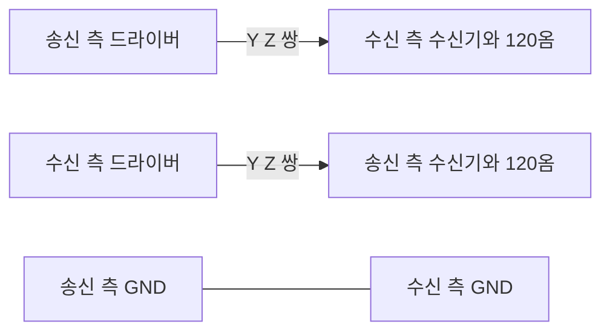

> **기준 출처:** TIA/EIA-422-B 는 유료라 아래 수치는 트랜시버 데이터시트와 앱노트로 교차 확인되는 공개 값이다. TI SLLA272, Analog Devices RS-485/RS-422 기술 자료 / 확인일 2026-08-03
> **시리즈:** [목차](/posts/00-comm-series/) | 이전 → [05. 핸드셰이크](/posts/05-serial-handshake-rts-cts/) | 다음 → [07. RS-485 반이중](/posts/07-rs485-half-duplex-direction/)

---

## 1. RS-232 의 한계를 어디서 넘나

[04편](/posts/04-rs232-electrical/)에서 RS-232 의 벽을 봤다.

| 한계 | 원인 |
| --- | --- |
| 거리 15~30 m | 케이블 커패시턴스 2500 pF 와 슬루 레이트 30 V/µs |
| 속도 수백 kbps | 같은 이유다 |
| 그라운드 전위차에 취약 | 단선 방식이라 GND 를 기준으로 삼는다 |
| 점대점만 가능 | 신호선 하나에 송신기 하나다 |

RS-422 는 이 중 앞의 셋을 차동으로 해결한다. [기초 03편](/posts/03-basics-physical-differential/)의 뺄셈 한 줄이 그대로 적용된다.

$$V_{\text{수신}} = (V_A + V_n) - (V_B + V_n) = V_A - V_B$$

## 2. 전기 사양

| 항목 | 값 |
| --- | --- |
| 송신기 차동 출력 | 최소 ±2 V (100 Ω 부하에서) |
| 수신기 감도 | ±200 mV |
| 공통모드 입력 범위 | −7 ~ +7 V |
| 최대 송신기 | 1개 |
| 최대 수신기 | 10개 (1 unit load 기준) |
| 케이블 | 트위스트 페어, $Z_0$ 는 100~120 Ω |

1200 m 라는 숫자가 어디서 나오는지 계산해 보면 이렇다.

$$\frac{\text{송신 최소 } 2\,\text{V}}{\text{수신 감도 } 0.2\,\text{V}} = 10\text{배}$$

신호가 1/10 로 줄어도 판정이 된다. 여기에 노이즈 여유를 좀 남겨도 여전히 여유가 크다. 트위스트 페어의 감쇠가 낮은 주파수에서 작으므로 1200 m 를 낮은 보율로는 갈 수 있다는 결론이 나온다.

이 배수 관계가 차동 전송의 힘이다. RS-232 는 마진이 9 V 지만 단선이라 그라운드 문제에 무방비였다. RS-422 는 마진 배수가 10배인 데다 그라운드 문제 자체가 없다.

## 3. 속도와 거리의 맞교환

[기초 04편](/posts/04-basics-transmission-line/)에서 CAN 을 두고 본 것과 같은 곡선이 여기도 있다.

| 보율 | 최대 거리 (대략) |
| --- | --- |
| 100 kbps | 1200 m |
| 500 kbps | 약 300 m |
| 1 Mbps | 약 120 m |
| 10 Mbps | 약 12 m |

대략 반비례다. 속도 곱하기 거리가 상수에 가깝다. 원인은 둘이다. 주파수 의존 감쇠 때문에 케이블이 저역통과 필터처럼 동작해 높은 주파수 성분이 더 많이 깎이고 엣지가 뭉개진다. 그리고 전파 지연과 반사 때문에 길수록 반사가 늦게 돌아와 비트 안에 겹친다.

설계 요령은 필요한 만큼만 빠르게 하는 것이다. 200 m 케이블에 1 Mbps 를 억지로 밀어넣는 것보다 115200 으로 안정적으로 도는 게 낫다. 시리얼은 어차피 제어 루프용이 아니다.

## 4. 배선은 2쌍에 GND 다

신호 이름이 여기서도 헷갈린다.

| 표기 | 뜻 |
| --- | --- |
| Y 와 Z | 송신기 출력의 플러스와 마이너스 |
| A 와 B | 수신기 입력의 플러스와 마이너스 |
| TX+, TX−, RX+, RX− | 같은 뜻의 흔한 표기 |
| D+, D− | RS-485 에서 흔한 표기 |

A 와 B 의 극성 정의가 제조사마다 뒤집혀 있는 경우가 있다. 규격상 A 가 반전이고 B 가 비반전이라는 해석과 그 반대가 공존한다. 실무에서는 바꿔 꽂아보는 게 가장 빠르다. 차동 쌍을 뒤집으면 논리가 반전되어 통신이 안 되지만 회로가 손상되지는 않는다. 데이터가 전부 `0x00` 이거나 전부 프레이밍 에러면 A 와 B 를 바꿔 본다.

종단은 수신단 한쪽만 단다. [기초 04편](/posts/04-basics-transmission-line/)의 규칙대로 신호가 도달하는 끝에만 단다. RS-422 는 송신기가 하나라 신호가 한 방향으로만 가므로 수신단 하나면 된다. 멀티드롭 수신이면 가장 먼 수신기에 단다. 중간 수신기들은 스터브로 붙되 짧게 한다.

차동이어도 GND 는 잇는다. 공통모드 범위가 ±7 V 뿐이라 GND 를 안 이으면 두 장치 전위가 얼마나 벌어질지 모른다. RS-422 도 3쌍이 아니라 2쌍에 GND 로 배선한다.

## 5. 엔코더가 여기 있다

RS-422 를 옛날 산업용 시리얼로만 알면 중요한 사실을 놓친다. SSI 와 BiSS-C 와 EnDat 의 물리계층이 전부 RS-422 다.

| 인터페이스 | 신호 쌍 | 방향 |
| --- | --- | --- |
| SSI | CLK 쌍(마스터에서), DATA 쌍(슬레이브에서) | 단방향 데이터 |
| BiSS-C | MA 쌍(마스터에서), SLO 쌍(슬레이브에서) | 양방향. SLO 로 응답한다 |
| EnDat | CLK 쌍(마스터에서), DATA 쌍(양방향) | 양방향 |

그리고 증분형 엔코더의 A, B, Z 신호도 RS-422 차동으로 보내는 게 표준이다. A+/A−, B+/B−, Z+/Z− 로 쓴다.

13편부터 15편까지 다룰 엔코더 인터페이스는 전부 RS-422 물리계층에 동기식 클럭과 고유 프로토콜을 올린 것이다. 이 글이 그 셋의 공통 기반이다.

왜 RS-422 인가. 모터 뒤쪽 엔코더까지 1~3 m 이고 모터 자체가 최악의 노이즈원이다. 단선 SPI 로는 못 간다. [SPI 06편](/posts/06-spi-modes-cpol-cpha/)의 계산에서 케이블 2 m 면 상한이 5.5 MHz 로 떨어지는 걸 봤다. 차동이 필수다.

그 밖의 용도로는 산업용 계측기와 PLC 에 지금도 흔하고, 방송 장비의 카메라 제어(SMPTE)와 항공과 철도에서도 쓰인다. RS-232 로 안 되는 거리의 장거리 UART 연결에도 쓴다.

## 6. RS-422 와 RS-485 의 차이

| | RS-422 | RS-485 |
| --- | --- | --- |
| 송신기 | 1개 | 최대 32 unit load |
| 수신기 | 최대 10개 | 최대 32 unit load |
| 방식 | 전이중 4선 | 반이중 2선 또는 전이중 4선 |
| 공통모드 범위 | −7 ~ +7 V | −7 ~ +12 V 로 더 넓다 |
| 방향 전환 | 불필요하다 | 2선식은 필요하다 |
| 종단 | 수신단 1개 | 양 끝 2개 |
| 복잡도 | 낮다 | 높다 |
| 전기적 관계 | 사실상 RS-485 의 부분집합이다 | 상위 호환이다 |

대부분의 RS-485 트랜시버는 RS-422 로도 쓸 수 있다. 드라이버를 항상 켜두고 점대점으로 쓰면 그게 RS-422 다. 그래서 부품 선정에서는 485 트랜시버를 사고 용도에 맞게 쓰는 경우가 많다.

## 정리

- RS-422 는 RS-232 의 거리와 속도와 그라운드 문제를 차동으로 해결한다.
- 송신 최소 ±2 V 에 수신 감도 ±200 mV 라 10배 여유가 나오고 그게 1200 m 의 근거다.
- 공통모드 범위는 ±7 V 이고 송신기 1개에 수신기 최대 10개다.
- 속도 곱하기 거리가 상수에 가깝다. 100 kbps 에 1200 m 이고 10 Mbps 에 12 m 다. 원인은 주파수 의존 감쇠와 반사다.
- 배선은 2쌍에 GND 다. 차동이어도 GND 는 잇는다. 공통모드가 ±7 V 뿐이다.
- A 와 B 극성 정의가 제조사마다 다를 수 있다. 안 되면 바꿔 꽂아본다. 회로는 손상되지 않는다.
- 종단은 수신단 하나다. 신호가 한 방향으로만 가기 때문이다.
- SSI 와 BiSS-C 와 EnDat 의 물리계층이 전부 RS-422 다.
- 증분형 엔코더의 A, B, Z 도 RS-422 차동이 표준이다.
- RS-485 는 RS-422 의 상위 호환이라 대부분의 485 트랜시버를 422 로 쓸 수 있다.

## 참고

- [TI SLLA272 — The RS-485 Design Guide](https://www.ti.com/lit/an/slla272d/slla272d.pdf)
- [Analog Devices — RS-485 Basics](https://www.analog.com/en/resources/technical-articles/rs485-basics.html)
