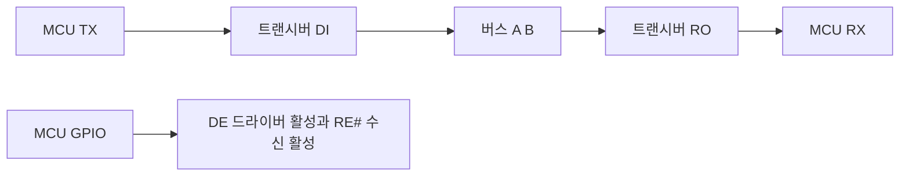

> **기준 출처:** TIA/EIA-485-A 는 유료라 수치는 아래 공개 문서로 교차 확인했다. TI SLLA272(unit load, 페일세이프, 종단, 스터브), Analog Devices RS-485 Basics, MCU 레퍼런스 매뉴얼의 USART 절에서 TXE 와 TC 플래그 차이(ST RM0090 §30.3.2 등) / 확인일 2026-08-03
> **시리즈:** [목차](/posts/00-comm-series/) | 이전 → [06. RS-422](/posts/06-rs422-differential/) | 다음 → [08. 시리얼 오류](/posts/08-serial-errors-framing-overrun/)

---

## 1. RS-485 가 더한 것은 멀티드롭이다

[06편](/posts/06-rs422-differential/)의 RS-422 는 송신기가 하나였다. RS-485 는 여러 노드가 같은 쌍을 공유한다.

| 항목 | 값 |
| --- | --- |
| 공통모드 입력 범위 | −7 ~ +12 V. 멀티드롭이라 전위차가 더 클 수 있어 422 보다 넓다 |
| 수신 감도 | ±200 mV |
| 노드 수 | 32 unit load |
| 방식 | 2선 반이중 또는 4선 전이중 |
| 거리 | 저속에서 1200 m. 422 와 같은 곡선이다 |

최대 32 노드라는 말은 정확히는 32 unit load 다. 1 UL 은 규격이 정한 입력 부하 기준이다.

| 트랜시버 등급 | 부하 | 최대 노드 |
| --- | --- | --- |
| 1 UL (표준) | 1 | 32 |
| 1/2 UL | 0.5 | 64 |
| 1/4 UL | 0.25 | 128 |
| 1/8 UL | 0.125 | 256 |

노드를 많이 달아야 하면 저부하 트랜시버를 고른다. 데이터시트에 1/8 unit load 로 표시된다. 다만 노드가 늘면 스터브와 커패시턴스가 늘어 실질적으로 속도와 거리가 준다. 32개도 실무에서는 꽤 많은 편이다.

## 2. 방향 전환이 가장 실무적인 함정이다

2선 반이중에서는 말할 때만 드라이버를 켜고 나머지 시간은 꺼야 한다. 안 그러면 다른 노드가 말을 못 한다.



보통 DE 와 RE# 를 하나의 GPIO 로 묶는다. HIGH 면 송신 모드이고 LOW 면 수신 모드다.

### 마지막 바이트가 잘리는 실패 사례

```cpp
// 틀린 코드. 실무에서 가장 흔한 RS-485 버그다
void send(std::span<const std::uint8_t> data) {
    de_pin.set_high();                       // 송신 모드
    for (auto b : data) {
        while (!(UART->SR & UART_SR_TXE)) {} // TXE 는 송신 레지스터가 비었다는 뜻이다
        UART->DR = b;
    }
    de_pin.set_low();                        // 여기가 문제다
}
```

`TXE`, 곧 Transmit Data Register Empty 는 다음 바이트를 넣어도 된다는 뜻이지 선로에 다 나갔다는 뜻이 아니다. 마지막 바이트는 아직 시프트 레지스터 안에서 밀려 나가는 중이다. 여기서 DE 를 내리면 드라이버가 꺼지고 마지막 바이트가 통째로 또는 부분적으로 사라진다.

UART 내부는 데이터 레지스터에서 시프트 레지스터를 거쳐 핀으로 간다. TXE 는 데이터 레지스터가 비면 뜨고 TC 는 시프트 레지스터까지 다 나가야 뜬다.

```cpp
// comm_serial/rs485_port.cpp
void Rs485Port::send(std::span<const std::uint8_t> data) {
    de_pin_.set_high();
    delay_ns(t_de_setup_);                    // 드라이버가 켜지는 시간. 보통 수십 ns 다

    for (auto b : data) {
        while (!(uart_->SR & UART_SR_TXE)) {}
        uart_->DR = b;
    }

    // TC(Transmission Complete)를 기다린다.
    // 마지막 정지 비트까지 선로에 나간 뒤에 뜬다.
    while (!(uart_->SR & UART_SR_TC)) {}

    delay_ns(t_de_hold_);                     // 여유
    de_pin_.set_low();
}
```

`TXE` 가 아니라 `TC` 를 기다린다. 이름이 비슷해서 놓치기 쉽고, 저속에서는 우연히 동작하다가 고속에서 깨진다. 저속에서는 다음 코드가 실행되는 시간이 비트 시간보다 짧아 잘리지만 그 잘림이 정지 비트 부분이라 상대가 관대하게 받아주는 경우가 있다.

증상은 이렇다. 마지막 바이트만 안 오거나, CRC 가 항상 틀리거나, 짧은 응답은 되는데 긴 응답이 깨진다.

TC 를 기다릴 수 없는 구조라면, 곧 DMA 나 인터럽트 기반이라면 시간으로 계산해야 한다.

$$t_{\text{마지막 바이트}} = \frac{\text{프레임 비트 수}}{\text{보율}}$$

| 보율 | 8N1 (10비트) | 8E1 (11비트) |
| --- | --- | --- |
| 9600 | 1042 µs | 1146 µs |
| 19200 | 521 µs | 573 µs |
| 115200 | 86.8 µs | 95.5 µs |

DMA 를 쓸 때는 DMA 완료 인터럽트가 마지막 바이트를 DR 에 넣었다는 뜻이다. [SPI 08편](/posts/08-spi-dma-interrupt-cost/)의 SPI BSY 문제와 정확히 같은 형태다. 그다음 TC 인터럽트를 켜서 거기서 DE 를 내린다. 대부분의 MCU 가 TC 인터럽트를 제공한다.

DE 를 내리는 게 너무 늦어도 문제다. 상대가 바로 응답을 보내기 시작하면 내 드라이버가 아직 켜져 있어 충돌한다. Modbus 는 이 문제를 3.5 문자 침묵으로 막는다. 슬레이브는 요청을 받고 3.5 문자 시간 이상 기다린 뒤에야 응답한다. 그 사이에 마스터가 여유 있게 수신 모드로 돌아간다. 9600 에서 3.5 문자 침묵이 4.01 ms 이므로 수십 µs 의 hold 는 안전하다.

## 3. 버스 충돌

두 노드가 같은 값을 내면 문제가 없다. 다른 값을 내면 한쪽은 A 를 HIGH 로 밀고 한쪽은 LOW 로 밀어 큰 전류가 흐른다.

RS-485 드라이버는 푸시풀이라 I²C 의 오픈 드레인처럼 안전하지 않다. 요즘 트랜시버는 단락 보호와 열 차단이 있어 즉시 손상되지는 않지만 그동안 통신은 완전히 깨진다.

| 방법 | 설명 |
| --- | --- |
| 마스터와 슬레이브 규율 | 마스터가 물어봐야만 슬레이브가 답한다. Modbus 가 이 방식이다 |
| 토큰 패싱 | 발언권을 차례로 넘긴다. 일부 프로토콜이 쓴다 |
| 타임아웃 후에만 재시도 | 마스터가 응답을 못 받아도 즉시 재전송하지 않는다 |

RS-485 에는 CAN 같은 중재가 없다. 전기적으로 충돌을 해결할 방법이 없으니 프로토콜이 규율로 막는다. 이게 RS-485 기반 프로토콜이 거의 다 마스터와 슬레이브 구조인 이유다. CAN 은 같은 문제를 와이어드 AND 물리계층과 비파괴 중재로 풀어 멀티마스터가 가능하다.

| 증상 | 해석 |
| --- | --- |
| 특정 노드를 뺐더니 전체가 정상이다 | 그 노드가 DE 를 안 내리고 있다. 펌웨어 버그이거나 고장이다 |
| 트랜시버가 뜨겁다 | 충돌 중이다 |
| 응답이 깨지는데 요청은 정상이다 | 마스터의 DE hold 가 너무 길거나 슬레이브가 너무 빨리 답한다 |

## 4. 페일세이프 바이어스

[기초 04편](/posts/04-basics-transmission-line/)에서 예고한 것이다. 모든 드라이버가 꺼져 있으면 A 와 B 가 떠 있다.

[01편](/posts/01-uart-async-meaning/)에서 봤듯 UART 의 idle 은 HIGH 여야 한다. 그런데 차동 전압이 0 근처면 수신기가 무작위로 판단하고 그 잡음이 시작 비트처럼 보여 가짜 바이트가 쏟아진다.

바이어스 저항이 A 를 VCC 쪽으로, B 를 GND 쪽으로 당겨 idle 에 A 에서 B 를 뺀 값이 +200 mV 를 넘게 만든다.

바이어스 저항이 종단 저항과 분압을 만든다는 데 주의한다. 종단 60 Ω, 곧 120 Ω 두 개의 병렬에 걸쳐 200 mV 이상을 만들려면 바이어스 저항이 충분히 작아야 하는데 너무 작으면 신호 진폭을 깎는다. TI SLLA272 가 이 계산 방법을 제시한다.

요즘 트랜시버는 대부분 내부 페일세이프를 갖는다. 수신 임계를 −200 mV 대신 −50 mV 쪽으로 옮겨 개방 상태에서 HIGH 로 판정하게 하는 방식이다. 데이터시트에서 true fail-safe 나 fail-safe receiver 를 확인하면 외부 바이어스를 넣지 않아도 된다.

아무도 안 보내는데 수신 버퍼에 쓰레기가 쌓이거나 프레이밍 에러가 idle 중에 계속 뜨면 페일세이프가 없는 것이다.

## 5. 2선과 4선

| | 2선 반이중 | 4선 전이중 |
| --- | --- | --- |
| 쌍 수 | 1 에 GND | 2 에 GND |
| 방향 전환 | 필요하다 | 불필요하다 |
| 멀티드롭 | 가능하다 | 가능하다. 마스터 TX 가 모든 슬레이브 RX 로 가고 슬레이브 TX 는 공유한다 |
| 충돌 위험 | 높다 | 슬레이브 쪽에만 있다 |
| 처리량 | 절반이다 | 전이중이다 |
| 배선 비용 | 싸다 | 비싸다 |
| Modbus RTU | 표준이다 | 가능하다 |

4선을 쓸 수 있으면 쓰는 게 낫다. 마스터 쪽 방향 전환 문제가 사라지고 요청과 응답이 겹칠 수 있어 처리량도 낫다. 다만 슬레이브들끼리는 여전히 TX 쌍을 공유하므로 슬레이브 쪽 DE 제어는 남는다.

## 6. 체크리스트

| # | 항목 |
| --- | --- |
| 1 | 종단 120 Ω 이 양 끝에 있는가. 전원 끄고 A 와 B 사이 저항이 60 Ω 인가 |
| 2 | 스터브가 짧은가. 1 Mbps 면 0.3 m 이하다 |
| 3 | GND 를 이었는가. A 와 B 와 GND 3선이다 |
| 4 | 페일세이프가 있는가. 내부 지원 여부를 확인하고 없으면 바이어스 저항을 넣는다 |
| 5 | DE 를 TC 플래그로 내리는가. TXE 가 아니다 |
| 6 | 마스터와 슬레이브 규율이 있는가. 아무나 말하지 않는다 |
| 7 | 트위스트 페어를 쓰고 전력선과 떨어뜨렸는가 |
| 8 | 노드 수가 32 를 넘으면 저부하 트랜시버를 썼는가 |

## 정리

- RS-485 는 RS-422 에 멀티드롭을 더한 것이다. 공통모드는 −7~+12 V 이고 32 unit load 이며 저부하 트랜시버로 최대 256 노드까지 간다.
- 2선 반이중은 DE 제어가 필요하고 그게 이 폴더 최대의 실무 함정이다.
- `TXE` 는 다음 바이트를 넣어도 된다는 뜻이고 `TC` 는 선로에 다 나갔다는 뜻이다. DE 는 TC 에서 내린다.
- 증상은 마지막 바이트만 안 오거나 CRC 가 항상 틀리는 것이다. 저속에서 우연히 되다가 고속에서 깨진다.
- DMA 를 쓰면 DMA 완료가 아니라 TC 인터럽트에서 DE 를 내린다. SPI 의 BSY 문제와 같은 형태다.
- RS-485 는 충돌을 전기적으로 풀지 못한다. 푸시풀이기 때문이다. 그래서 프로토콜이 마스터와 슬레이브 규율로 막는다.
- CAN 은 같은 문제를 와이어드 AND 와 비파괴 중재로 풀어 멀티마스터가 된다.
- 페일세이프 바이어스가 없으면 idle 에 가짜 바이트가 쏟아진다. 요즘 트랜시버는 내부 지원이 많다.
- 4선 전이중을 쓸 수 있으면 낫다. 마스터 쪽 방향 전환이 사라진다.

## 참고

- [TI SLLA272 — The RS-485 Design Guide](https://www.ti.com/lit/an/slla272d/slla272d.pdf)
- [Analog Devices — RS-485 Basics](https://www.analog.com/en/resources/technical-articles/rs485-basics.html)
