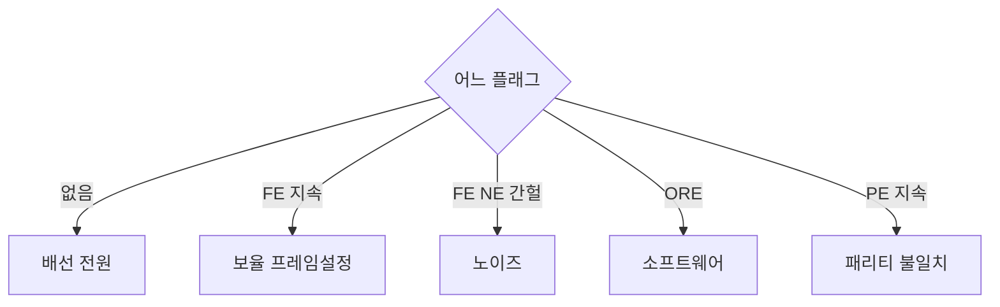

> **기준 출처:** MCU 레퍼런스 매뉴얼의 USART 상태 레지스터 절(ST RM0090 §30.6.1 — FE, ORE, NE, PE 플래그와 클리어 시퀀스), Linux `termios(3)` 의 `PARMRK`, `IGNPAR`, `BRKINT` / 확인일 2026-08-03
> **시리즈:** [목차](/posts/00-comm-series/) | 이전 → [07. RS-485 반이중](/posts/07-rs485-half-duplex-direction/) | 다음 → [09. Modbus RTU 프레임과 CRC-16](/posts/09-modbus-rtu-frame-crc16/)

---

## 1. 네 개의 플래그, 네 개의 다른 이야기

UART 하드웨어가 알려주는 오류는 네 가지다. 각각이 다른 층의 문제를 가리킨다. 이걸 구분하면 진단이 반쯤 끝난다.

| 플래그 | 무슨 일 | 무엇을 의심하나 |
| --- | --- | --- |
| FE (Framing Error) | 정지 비트가 HIGH 가 아니었다 | 보율, 프레임 설정, 노이즈, Break |
| ORE (Overrun Error) | 이전 바이트를 안 읽었는데 새 바이트가 왔다 | CPU 가 늦다. 통신 문제가 아니다 |
| PE (Parity Error) | 패리티가 안 맞는다 | 노이즈이거나 패리티 설정 불일치다 |
| NE (Noise Error) | 비트 가운데 3샘플이 안 맞았다 | 물리계층 품질 저하의 조기 경보다 |

ORE 가 특별하다. 나머지 셋은 선에서 뭔가 이상했다는 뜻이지만 ORE 는 내 소프트웨어가 느리다는 뜻이다. 원인이 통신이 아니라 내 쪽 설계에 있다.

## 2. Framing Error

수신기가 정지 비트 자리에서 LOW 를 봤다는 뜻이다. 원인이 넷 있다.

| 원인 | 어떻게 구분하나 |
| --- | --- |
| 보율 불일치 | 거의 모든 바이트에서 FE 가 난다. 오실로스코프로 비트 폭을 실측한다 |
| 프레임 설정 불일치 | 마찬가지로 지속적이다. 특히 8E1 과 8N1 이 어긋난 경우다 |
| 노이즈 | 간헐적이다. NE 플래그도 같이 뜨고 모터 동작과 상관관계가 있다 |
| Break 조건 | 데이터가 `0x00` 으로 읽히면서 FE 가 난다 |

### Break 는 오류가 아니라 신호다

선을 한 프레임 시간 이상 LOW 로 붙잡는 것을 Break 라 한다. 시작 비트로 시작해서 데이터가 전부 0 이고 정지 비트도 LOW 이므로 `0x00` 에 FE 로 보인다.

| 용도 | 설명 |
| --- | --- |
| LIN 버스 | Break 가 프레임 시작 신호로 규격에 박혀 있다 |
| 디버거와 터미널 | Ctrl+Break 로 대상 장치에 인터럽트를 건다 |
| 케이블 단선 | 페일세이프가 없으면 끊긴 선이 LOW 로 보여 Break 처럼 나타난다 |

많은 MCU 가 Break 를 별도 플래그로 구분해준다. 그러면 `0x00` 에 FE 인 경우와 진짜 Break 를 구별할 수 있다.

## 3. Overrun Error 는 내 소프트웨어가 느리다는 뜻이다

시프트 레지스터에서 데이터 레지스터로 옮겨진 값을 소프트웨어가 읽어가야 하는데, 데이터 레지스터가 안 비었는데 다음 바이트가 완성되면 ORE 가 뜬다. 그리고 새 바이트나 옛 바이트가 버려진다.

| 보율 | 바이트 시간(8N1) | FIFO 없을 때 여유 | 16단 FIFO 면 |
| --- | --- | --- | --- |
| 9600 | 1042 µs | 1042 µs 로 여유롭다 | 16.7 ms |
| 115200 | 86.8 µs | 86.8 µs | 1.4 ms |
| 460800 | 21.7 µs | 21.7 µs | 347 µs |
| 1000000 | 10 µs | 10 µs | 160 µs |

1 Mbps 에서 FIFO 가 없으면 10 µs 안에 반드시 읽어야 한다. 인터럽트 지연에 다른 ISR 하나만 끼어도 놓친다. DMA 없이는 불가능한 영역이다.

| 원인 | 대응 |
| --- | --- |
| UART 인터럽트 우선순위가 낮다 | 우선순위를 올린다 |
| ISR 안에서 파싱까지 하며 일을 너무 많이 한다 | ISR 은 버퍼에 넣기만 하고 파싱은 밖에서 한다 |
| 인터럽트를 오래 막는 구간이 있다 | 임계 구역을 짧게 만든다 |
| FIFO 를 안 쓰고 있다 | FIFO 임계값을 설정한다 |
| 처리 능력을 넘는 보율이다 | DMA 와 링 버퍼를 쓴다 |

ORE 는 통신을 고쳐서 해결하는 게 아니라 소프트웨어를 고쳐서 해결한다. 케이블을 바꾸고 종단을 달아도 없어지지 않는다.

### ORE 를 클리어하지 않으면 UART 가 멎는다

대부분의 MCU 에서 ORE 가 세워지면 수신이 멈춘다. 그리고 클리어하려면 정해진 시퀀스를 밟아야 한다. 예를 들어 SR 을 읽고 DR 을 읽는 식이다.

통신이 잘 되다가 어느 순간부터 아무것도 안 온다는 증상의 흔한 원인이다. 오버런이 한 번 나고 그걸 클리어하지 않아 영영 멎은 것이다. 오류 인터럽트를 반드시 켜고 핸들러에서 플래그를 클리어하고 카운터를 올린다. 조용히 무시하면 안 된다.

## 4. Parity Error 와 Noise Error

패리티는 [기초 07편](/posts/07-basics-error-detection/)에서 봤듯 약한 검사라 판정용으로는 쓸 수 없다. 하지만 바이트 단위 진단 신호로는 유용하다.

| PE 패턴 | 해석 |
| --- | --- |
| 거의 모든 바이트에서 PE | 패리티 설정 불일치다. 오류가 아니라 설정 문제다 |
| 간헐적 PE | 노이즈다 |
| 특정 시점에만 PE 급증 | 그때 무슨 일이 있었는지 묻는다 |

NE 는 [02편](/posts/02-uart-baud-error-budget/)에서 본 것이다. 비트 가운데 3샘플의 다수결이 만장일치가 아니었다는 뜻이다. NE 는 조기 경보다. 다수결이 2대1 이면 값은 맞게 읽히지만 여유가 없다는 뜻이다. 데이터는 정상인데 NE 카운터가 늘고 있으면 물리계층이 나빠지고 있다. 이 카운터를 장기 추세로 남겨두면 케이블이 끊어지기 전에 정비할 수 있다. 예방 정비의 근거가 된다.

## 5. 오류를 다루는 코드

원칙은 세고, 클리어하고, 재동기하는 것이다.

```cpp
// comm_serial/uart_stats.hpp
struct UartStats {
    std::uint32_t framing{};
    std::uint32_t overrun{};
    std::uint32_t parity{};
    std::uint32_t noise{};
    std::uint32_t break_detected{};
    std::uint32_t bytes_received{};

    // 진단용 파생값. 로그에 이걸 남긴다
    double error_rate() const {
        const auto errs = framing + overrun + parity;
        return bytes_received ? static_cast<double>(errs) / bytes_received : 0.0;
    }
};

// ISR 은 짧게 둔다. 세고 클리어하고 파서에 여기서 끊겼다만 알린다
void uart_irq_handler() {
    const std::uint32_t sr = uart->SR;

    if (sr & (UART_SR_FE | UART_SR_ORE | UART_SR_PE | UART_SR_NE)) {
        if (sr & UART_SR_FE)  ++stats.framing;
        if (sr & UART_SR_ORE) ++stats.overrun;
        if (sr & UART_SR_PE)  ++stats.parity;
        if (sr & UART_SR_NE)  ++stats.noise;

        (void)uart->DR;                // 클리어 시퀀스는 MCU 마다 다르니 매뉴얼을 확인한다
        parser.mark_discontinuity();   // 파서에게 흐름이 끊겼음을 알린다
        return;                        // 이 바이트는 신뢰할 수 없으니 버린다
    }

    if (sr & UART_SR_RXNE) {
        rx_ring.push(static_cast<std::uint8_t>(uart->DR));
        ++stats.bytes_received;
    }
}
```

파서는 이렇게 반응한다.

```cpp
// 기초 06편의 FrameParser 에 추가한다
void FrameParser::mark_discontinuity() {
    // 오류가 난 지점 이후의 바이트는 프레임 경계가 어긋났을 수 있다.
    // 조립 중이던 프레임을 버리고 재동기 상태로 간다.
    if (state_ != State::WaitStx) ++stats_.resync;
    state_ = State::WaitStx;
    idx_ = 0;
}
```

오류를 무시하고 계속 조립하면 안 된다. 깨진 바이트를 포함한 프레임은 CRC 에서 걸리겠지만 길이 필드가 깨졌으면 엉뚱하게 오래 기다린다. 즉시 재동기가 안전하다.

## 6. 진단 결정 트리



플래그가 아예 안 뜨면 배선과 널모뎀과 전원과 트랜시버를 본다. 잘 되다가 갑자기 멎었다면 ORE 미클리어이거나 RTS 가 내려간 채이거나 XOFF 를 받은 것이다.

FE 가 지속적이면 설정 문제이고 간헐적이면 노이즈다. 이 구분이 진단의 갈림길이다. 데이터가 `0x00` 이면 Break 이거나 단선이거나 페일세이프가 없는 것이다.

## 7. 운영 중 감시

```cpp
// 주기적으로, 예를 들어 1초마다 진단 토픽이나 로그로 내보낸다
struct UartHealth {
    double        error_rate;      // 0.001 넘으면 경고
    std::uint32_t resync_per_min;
    std::uint32_t noise_per_min;   // 절대값보다 추세가 중요하다
};
```

| 지표 | 정상 | 주의 | 조치 |
| --- | --- | --- | --- |
| error_rate | 0 에 가깝다 | 1e-4 초과 | 물리계층을 점검한다 |
| 분당 noise 증가 추세 | 평탄하다 | 우상향한다 | 예방 정비로 커넥터와 케이블을 본다 |
| overrun | 0 | 0 초과 | 소프트웨어를 재설계한다 |
| 분당 resync | 0 근처 | 늘어난다 | 프레임 경계가 자주 깨지고 있다 |

overrun 은 0 이어야 한다. 가끔 나는 건 괜찮다가 아니다. 데이터를 놓쳤다는 뜻이고 그건 설계가 마진 없이 돌고 있다는 신호다.

## 정리

- 플래그 넷이 각각 다른 층을 가리킨다. FE 는 보율과 설정과 노이즈, ORE 는 내 소프트웨어, PE 는 노이즈, NE 는 조기 경보다.
- ORE 는 통신 문제가 아니다. 케이블을 바꿔도 없어지지 않는다.
- 1 Mbps 에 FIFO 가 없으면 10 µs 안에 읽어야 한다. DMA 없이는 불가능하다.
- ORE 를 클리어하지 않으면 수신이 영영 멎는다. 잘 되다가 갑자기 안 온다는 증상의 흔한 원인이다.
- Break 는 오류가 아니라 신호다. LIN 에서는 규격이다. `0x00` 에 FE 로 보이며 단선과 구별이 안 될 수 있다.
- FE 가 지속적이면 설정이고 간헐적이면 노이즈다. 이 구분이 진단의 갈림길이다.
- NE 카운터의 추세가 예방 정비의 근거다. 데이터가 맞아도 여유가 줄고 있다는 뜻이다.
- ISR 은 세고 클리어하고 파서에 불연속을 알린다. 파싱은 ISR 밖에서 한다.
- 오류 후에는 조립 중이던 프레임을 버리고 재동기한다. 길이 필드가 깨졌을 수 있다.
- 운영 중 error_rate 와 분당 noise 와 overrun 을 감시한다. overrun 은 0 이어야 한다.

## 참고

- [ST RM0090 — STM32F4 레퍼런스 매뉴얼](https://www.st.com/resource/en/reference_manual/dm00031020.pdf)
- [Linux termios(3) 매뉴얼](https://man7.org/linux/man-pages/man3/termios.3.html)
