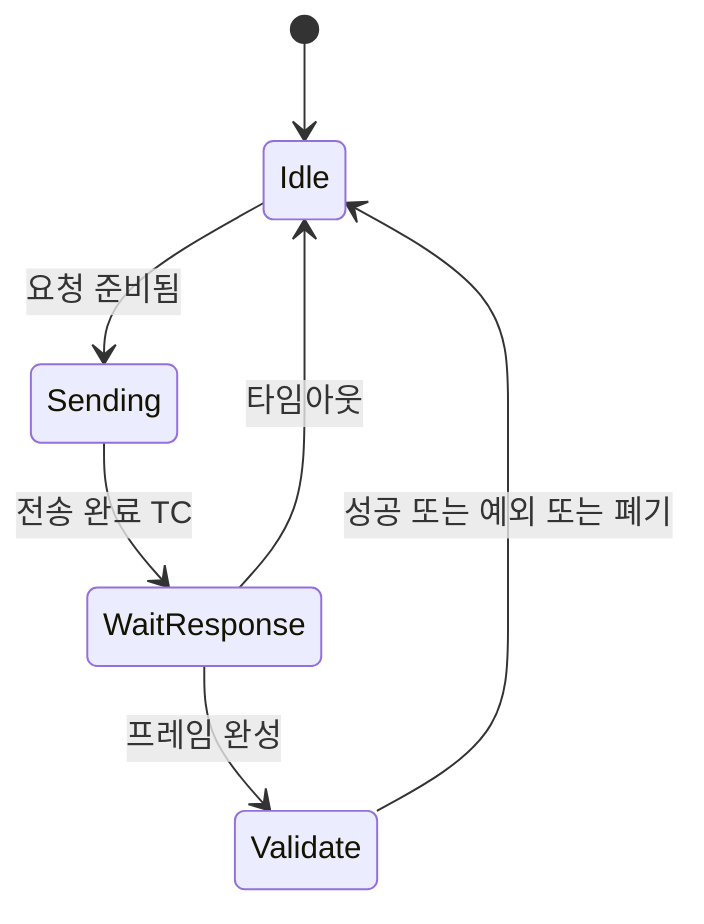

> **기준 출처:** Modbus over Serial Line V1.02 §2.5.1.1(RTU 전송 모드, t1.5 와 t3.5 정의와 19200 초과 시 고정값), §2.5.1.2(RTU 상태 다이어그램) / 확인일 2026-08-03
> **시리즈:** [목차](/posts/00-comm-series/) | 이전 → [09. Modbus RTU 프레임과 CRC-16](/posts/09-modbus-rtu-frame-crc16/) | 다음 → [11. MCU UART 드라이버](/posts/11-mcu-uart-driver-ringbuffer-dma/)

---

## 1. 길이 필드가 없다

[09편](/posts/09-modbus-rtu-frame-crc16/)의 프레임 `01 03 00 00 00 02 C4 0B` 어디에도 이 프레임이 8바이트라는 정보가 없다. 함수 코드마다 길이가 다르고 응답의 바이트 수 필드는 프레임 중간에 있다.

Modbus RTU 는 이 문제를 시간으로 푼다. [기초 06편](/posts/06-basics-framing/)의 다섯 번째 방법이다. 프레임 사이에는 3.5 문자 시간 이상의 침묵이 있어야 하고 프레임 안에서는 1.5 문자 시간 이상 쉬면 안 된다.

## 2. 침묵 시간 계산

1 문자는 11비트다. Modbus 규격이 8E1 이나 8N2 를 요구하기 때문이다.

$$t_{\text{char}} = \frac{11}{\text{baud}}, \qquad t_{1.5} = 1.5\,t_{\text{char}}, \qquad t_{3.5} = 3.5\,t_{\text{char}}$$

계산값이 너무 짧아져 현실적으로 지킬 수 없기 때문에 규격이 19200 bps 초과에서는 고정값을 쓰라고 정한다.

| 보율 | $t_{char}$ | $t_{1.5}$ | $t_{3.5}$ |
| --- | --- | --- | --- |
| 1200 | 9.167 ms | 13.75 ms | 32.08 ms |
| 2400 | 4.583 ms | 6.875 ms | 16.04 ms |
| 4800 | 2.292 ms | 3.438 ms | 8.02 ms |
| 9600 | 1.146 ms | 1.719 ms | 4.010 ms |
| 19200 | 0.573 ms | 0.859 ms | 2.005 ms |
| 38400 | 0.286 ms | 750 µs (고정) | 1.750 ms (고정) |
| 57600 | 0.191 ms | 750 µs (고정) | 1.750 ms (고정) |
| 115200 | 0.095 ms | 750 µs (고정) | 1.750 ms (고정) |

115200 에서 t3.5 인 1.750 ms 는 문자 18개 분량이다. 계산값인 0.334 ms 보다 5배 넉넉하다. 고속에서는 침묵이 오히려 큰 오버헤드가 된다.

## 3. 침묵 기반 프레이밍이 깨지는 곳

### USB-시리얼 어댑터의 latency timer

USB 는 폴링 기반이라 바이트가 즉시 넘어오지 않는다. 변환 칩이 바이트를 모아뒀다가 한 번에 보낸다.

| 칩 | 기본 latency timer |
| --- | --- |
| FTDI (FT232 등) | 16 ms |
| Silicon Labs (CP210x) | 유사한 버퍼링을 한다 |
| CH340 | 유사하다 |

16 ms 는 9600 의 t3.5 인 4 ms 보다 4배 크다. 두 프레임 사이의 침묵이 뭉개져서 두 프레임이 하나로 붙어 보이거나, 한 프레임 안의 바이트들이 여러 덩어리로 쪼개져 도착한다.

대응은 두 가지다. latency timer 를 1~2 ms 로 낮추는 방법이 있다. 윈도우에서는 장치 관리자의 고급 설정에서, 리눅스에서는 `/sys/bus/usb-serial/devices/ttyUSB0/latency_timer` 에서 바꾼다. 더 나은 방법은 시간에 의존하지 않고 파싱하는 것이다.

### 비실시간 OS 의 스케줄링

일반 리눅스나 윈도우에서는 애플리케이션이 바이트를 읽는 시각이 도착 시각과 다르다. 스케줄러가 수 ms 를 밀 수 있다. 침묵을 측정하는 기준 자체가 흔들린다.

### 고속에서의 타이머 해상도

115200 에서 t1.5 가 750 µs 다. 이걸 소프트웨어 타이머로 재려면 µs 급 해상도가 필요하다. MCU 는 되지만 호스트 PC 에서는 만만치 않다.

## 4. 실무 해법은 시간 대신 길이와 CRC 다

침묵 시간은 규격이 요구하는 송신 측 규칙으로 지키되 수신 파싱은 다르게 한다. 가능한 이유는 Modbus 프레임이 함수 코드를 보면 길이를 알 수 있기 때문이다.

| 함수 | 요청 길이 | 응답 길이 |
| --- | --- | --- |
| `03` Read Holding | 8 고정 | 5 에 바이트수 필드를 더한다 |
| `06` Write Single | 8 고정 | 8 고정 |
| `10` Write Multiple | 9 에 바이트수를 더한다 | 8 고정 |

응답의 3번째 바이트가 바이트 수이므로 그걸 읽으면 전체 길이가 나온다.

```cpp
// comm_serial/modbus_rtu_parser.hpp
// 시간인 침묵과 구조인 길이와 CRC 를 둘 다 쓴다.
// USB 어댑터나 비실시간 OS 에서도 견디도록 구조를 우선한다.
class ModbusRtuParser {
public:
    // 바이트가 도착할 때마다 호출한다
    std::optional<std::span<const std::uint8_t>> feed(std::uint8_t b, std::uint64_t now_us);

    // 아무것도 안 올 때 주기적으로 호출해 침묵을 감지한다
    void tick(std::uint64_t now_us);

private:
    std::array<std::uint8_t, modbus::kMaxAdu> buf_{};
    std::size_t   len_{};
    std::uint64_t last_byte_us_{};
    std::uint64_t t35_us_{1750};        // 보율에 따라 설정한다

    // 지금까지 받은 것으로 이 프레임의 전체 길이를 추정한다. 모르면 0 이다
    std::size_t expected_length() const;
};

inline std::optional<std::span<const std::uint8_t>>
ModbusRtuParser::feed(std::uint8_t b, std::uint64_t now_us) {
    // 침묵이 있었으면 새 프레임이다. 시간을 재동기 힌트로만 쓴다
    if (len_ > 0 && (now_us - last_byte_us_) >= t35_us_) len_ = 0;
    last_byte_us_ = now_us;

    if (len_ < buf_.size()) buf_[len_++] = b;
    else { len_ = 0; return std::nullopt; }     // 상한을 넘으면 버린다

    // 길이를 알 수 있으면 그 시점에 CRC 를 확인한다. 침묵을 기다리지 않는다
    const std::size_t want = expected_length();
    if (want != 0 && len_ == want) {
        const std::uint16_t rx = get_u16_le(&buf_[len_ - 2]);
        if (crc16_modbus({buf_.data(), len_ - 2}) == rx) {
            const std::size_t n = len_;
            len_ = 0;
            return std::span<const std::uint8_t>{buf_.data(), n};
        }
        // CRC 가 안 맞으면 길이 추정이 틀렸을 수 있으니 버리지 말고 더 받아본다
    }
    return std::nullopt;
}
```

핵심은 두 가지다. 침묵은 새 프레임이 시작됐다는 힌트로만 쓰고 필수 조건으로 삼지 않는다. 그리고 길이를 알면 침묵을 기다리지 않고 즉시 CRC 로 확정한다. 응답 지연이 t3.5 만큼 줄어든다. 이러면 latency timer 가 16 ms 여도 바이트가 한 덩어리로 오든 쪼개져 오든 똑같이 동작한다.

송신 측은 규격대로 t3.5 침묵을 지킨다. 상대 장비가 시간 기반으로 파싱할 수 있기 때문이다. 규격 위반은 상호운용성을 깬다.

```cpp
void ModbusMaster::send_request(std::span<const std::uint8_t> adu) {
    wait_until(last_activity_us_ + t35_us_);   // 규격을 지킨다
    port_.write(adu);                          // DE 는 TC 로 내린다
    last_activity_us_ = now_us();
}
```

## 5. 타임아웃은 세 개다

Modbus 마스터에는 서로 다른 타임아웃이 셋 필요하다. 하나로 뭉뚱그리면 진단이 안 된다.

| 타임아웃 | 무엇을 기다리나 | 전형값 |
| --- | --- | --- |
| 응답 타임아웃 | 요청 후 첫 바이트가 올 때까지 | 슬레이브 처리 시간에 여유를 더한다 |
| 프레임 간 타임아웃 | 프레임 조립 중 다음 바이트 | t1.5. 하이브리드 파서면 불필요하다 |
| 트랜잭션 타임아웃 | 전체 트랜잭션 완료 | 응답 전송 시간을 포함한다 |

응답 타임아웃은 이렇게 계산한다.

$$t_{\text{응답}} = t_{\text{요청 전송}} + t_{\text{슬레이브 처리}} + t_{\text{응답 전송}} + \text{여유}$$

9600 8E1 에서 홀딩 레지스터 10개를 읽는 경우를 계산해 보면 이렇다.

| 항목 | 계산 | 시간 |
| --- | --- | --- |
| 요청 전송 (8바이트) | 8 곱하기 1.146 ms | 9.2 ms |
| t3.5 침묵 | | 4.0 ms |
| 슬레이브 처리 | 장비 사양이고 보통 수 ms 다 | 10 ms |
| 응답 전송 (25바이트) | 25 곱하기 1.146 ms | 28.7 ms |
| 소계 | | 51.9 ms |
| 타임아웃 설정 (여유 2배) | | 약 100 ms |

9600 에서 트랜잭션 하나에 52 ms 다. 슬레이브 10대를 순회하면 520 ms 이고 초당 2회도 못 돈다. [기초 08편](/posts/08-basics-flow-control/)에서 본 Stop-and-Wait 의 한계가 구체적인 숫자로 나타난다.

115200 으로 올리면 전송 시간이 12배 줄어 트랜잭션이 약 15 ms 가 된다. 슬레이브 처리 10 ms 가 지배적이 된다. 그래도 제어 루프용은 아니다.

타임아웃이 너무 짧으면 문제가 생긴다. 마스터가 포기하고 다음 요청을 보냈는데 그때 느린 슬레이브의 응답이 도착한다. 응답과 요청이 버스에서 충돌하거나 마스터가 엉뚱한 응답을 다음 요청의 것으로 해석한다.

방어는 응답의 슬레이브 주소와 함수 코드가 내가 보낸 것과 일치하는지 반드시 확인하는 것이다. Modbus RTU 에는 트랜잭션 ID 가 없으므로 이게 유일한 방어다. TCP 판에는 있다.

```cpp
bool matches_request(const modbus::Response& r,
                     std::uint8_t req_slave, std::uint8_t req_func) {
    // 예외 응답이면 function 이 이미 0x80 을 벗겨진 상태다
    return r.slave == req_slave && r.function == req_func;
}
```

## 6. 마스터는 FSM 이다



| 상태 | 진입 동작 | 이탈 조건 |
| --- | --- | --- |
| `Idle` | DE 를 내려 수신 모드로 둔다 | 요청 큐에 항목이 들어온다 |
| `Sending` | t3.5 를 기다린 뒤 DE 를 올리고 전송한다 | TC 플래그가 뜬다 |
| `WaitResponse` | 응답 타임아웃 타이머를 시작한다 | 프레임이 완성되거나 타임아웃이 난다 |
| `Validate` | CRC 와 주소와 함수를 확인한다 | 항상 Idle 로 간다 |

모든 경로가 `Idle` 로 돌아온다. 어떤 오류가 나도 마스터가 멈추면 안 된다. [기초 06편](/posts/06-basics-framing/)의 재동기 원칙과 같은 구조다.

## 정리

- Modbus RTU 는 길이 필드가 없어서 시간으로 프레임을 끊는다. 프레임 사이는 t3.5, 프레임 안은 t1.5 다.
- 1 문자는 11비트이고 9600 에서 t3.5 가 4.010 ms 다.
- 19200 초과에서는 고정값을 쓴다. t1.5 는 750 µs 이고 t3.5 는 1.750 ms 다.
- 침묵 기반 프레이밍은 USB 어댑터 latency timer(FTDI 기본 16 ms)와 비실시간 OS 와 타이머 해상도에서 깨진다.
- 실무 해법은 송신은 규격대로 침묵을 지키고 수신은 길이와 CRC 로 확정하는 것이다.
- 침묵은 새 프레임 시작 힌트로만 쓰고, 길이를 알면 즉시 판정해 응답이 t3.5 만큼 빨라진다.
- 타임아웃 셋을 구분한다. 응답과 프레임 간과 트랜잭션이다.
- 9600 에서 트랜잭션 하나가 약 52 ms 라 슬레이브 10대 순회에 520 ms 다. 제어 루프용이 아니다.
- Modbus RTU 에는 트랜잭션 ID 가 없으니 응답의 주소와 함수 코드 일치를 반드시 확인한다.
- 마스터는 Idle, Sending, WaitResponse, Validate 를 도는 FSM 이고 모든 경로가 Idle 로 복귀한다.

## 참고

- [Modbus over Serial Line V1.02](https://www.modbus.org/docs/Modbus_over_serial_line_V1_02.pdf)
