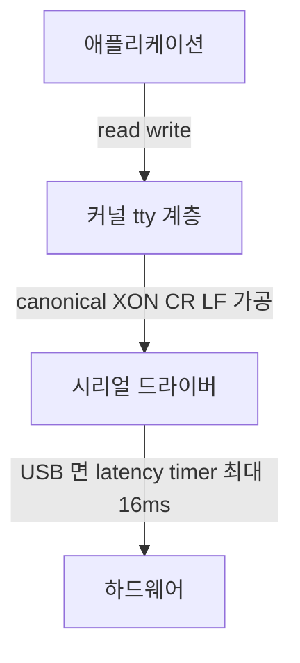

> **기준 출처:** `termios(3)`, `tcsetattr(3)`, `open(2)` POSIX 매뉴얼, Linux 커널 `Documentation/driver-api/serial/` 과 `/sys/bus/usb-serial/devices/*/latency_timer`, Microsoft Win32 API 문서의 `DCB` 와 `COMMTIMEOUTS` / 확인일 2026-08-03
> **시리즈:** [목차](/posts/00-comm-series/) | 이전 → [11. MCU UART 드라이버](/posts/11-mcu-uart-driver-ringbuffer-dma/) | 다음 → [13. 엔코더 SSI](/posts/13-encoder-ssi/)

---

## 1. 호스트에서 시리얼이 어려운 이유

MCU 에서는 UART 레지스터를 직접 만지니 동작이 명확하다. 호스트에서는 그 사이에 여러 층이 끼어든다.



커널 tty 계층의 가공과 USB latency timer 둘이 문제의 전부다. 이 글은 그 둘을 끄는 법이다.

## 2. Linux 의 canonical 모드가 데이터를 가로챈다

기본 상태의 tty 는 터미널로 동작한다. 사람이 키보드로 치는 것을 전제한 가공을 한다.

| 기본 동작 | 무슨 일을 하나 |
| --- | --- |
| canonical 모드 (`ICANON`) | 줄바꿈이 올 때까지 데이터를 주지 않는다 |
| echo (`ECHO`) | 받은 것을 도로 보낸다 |
| `IXON` 과 `IXOFF` | `0x11` 과 `0x13` 을 흐름제어로 먹는다 |
| `ICRNL` 과 `INLCR` | `\r`(`0x0D`)과 `\n`(`0x0A`)을 바꿔치기한다 |
| `OPOST` 와 `ONLCR` | 출력에서 `\n` 을 `\r\n` 으로 늘린다 |
| `ISTRIP` | 8번째 비트를 잘라낸다 |
| `PARMRK` | 패리티 에러 바이트 앞에 `0xFF 0x00` 을 끼워 넣는다 |

바이너리 프로토콜에 이게 전부 재앙이다. `0x0D` 가 `0x0A` 로 바뀌고 `0x11` 과 `0x13` 이 사라지고 데이터가 언제 올지 모른다. 증상은 MCU 에서는 되는데 PC 프로그램에서만 이상하거나 특정 값이 들어간 프레임만 실패하는 것이다.

```cpp
// comm_serial/posix_serial_port.cpp
#include <termios.h>
#include <fcntl.h>
#include <unistd.h>

bool PosixSerialPort::open(const std::string& dev, const SerialConfig& cfg) {
    // O_NOCTTY 는 이 포트를 제어 터미널로 삼지 않는다. Ctrl+C 가 우리 프로세스를 죽이는 걸 막는다
    // O_NONBLOCK 은 open 이 DCD 를 기다리며 멈추는 걸 막는다
    fd_ = ::open(dev.c_str(), O_RDWR | O_NOCTTY | O_NONBLOCK);
    if (fd_ < 0) return false;

    termios tio{};
    if (::tcgetattr(fd_, &tio) != 0) return false;

    // 한 줄로 raw 모드가 된다. 위 표의 가공을 전부 끈다
    ::cfmakeraw(&tio);

    // 프레임 설정
    tio.c_cflag &= ~CSIZE;  tio.c_cflag |= CS8;          // 데이터 8비트
    if (cfg.parity == Parity::None)      tio.c_cflag &= ~PARENB;
    else if (cfg.parity == Parity::Even) { tio.c_cflag |= PARENB; tio.c_cflag &= ~PARODD; }
    else                                 { tio.c_cflag |= PARENB; tio.c_cflag |=  PARODD; }
    if (cfg.stop == StopBits::Two) tio.c_cflag |= CSTOPB; else tio.c_cflag &= ~CSTOPB;

    tio.c_cflag |= (CLOCAL | CREAD);                      // 모뎀 제어선을 무시하고 수신을 켠다
    if (cfg.rts_cts) tio.c_cflag |= CRTSCTS; else tio.c_cflag &= ~CRTSCTS;

    // VMIN 과 VTIME 이 read() 의 블로킹 동작을 정한다
    tio.c_cc[VMIN]  = 0;    // 최소 바이트 수
    tio.c_cc[VTIME] = 1;    // 0.1초 단위 타이머라 1 은 100 ms 다

    ::cfsetispeed(&tio, to_speed_t(cfg.baud));
    ::cfsetospeed(&tio, to_speed_t(cfg.baud));

    if (::tcsetattr(fd_, TCSANOW, &tio) != 0) return false;
    ::tcflush(fd_, TCIOFLUSH);                            // 묵은 데이터를 버린다
    return true;
}
```

### VMIN 과 VTIME 네 조합

`read()` 의 블로킹 동작을 이 둘이 결정한다. 가장 헷갈리는 부분이다.

| VMIN | VTIME | 동작 |
| --- | --- | --- |
| 0 | 0 | 논블로킹이다. 있는 만큼만 즉시 반환하고 0 일 수도 있다 |
| 0 | 0 초과 | 타임아웃 있는 읽기다. 첫 바이트가 오거나 VTIME 후 반환한다. 폴링 루프에 적합하다 |
| 0 초과 | 0 | VMIN 개가 올 때까지 무한 대기한다 |
| 0 초과 | 0 초과 | 첫 바이트 후 바이트 간 타이머가 돈다. VTIME 안에 다음 바이트가 안 오면 반환한다 |

마지막 조합이 침묵 기반 프레이밍과 비슷해 보이지만 쓰면 안 된다. VTIME 의 최소 단위가 0.1초다. Modbus 의 t3.5 는 1.75~4 ms 라 50배 이상 거칠다.

실무 권장은 VMIN 을 0, VTIME 을 1 로 두어 100 ms 타임아웃을 걸고 애플리케이션에서 길이와 CRC 로 프레이밍하는 것이다. 커널의 시간 기능에 의존하지 않는다.

### 표준이 아닌 보율

`cfsetispeed` 는 정해진 상수만 받는다. 그 밖의 보율이 필요하면 `termios2` 를 쓴다.

```cpp
#include <asm/termbits.h>   // termios.h 와 같이 include 하면 충돌하니 별도 파일로 분리한다
#include <sys/ioctl.h>

bool set_custom_baud(int fd, std::uint32_t baud) {
    termios2 t2{};
    if (::ioctl(fd, TCGETS2, &t2) != 0) return false;
    t2.c_cflag &= ~CBAUD;
    t2.c_cflag |= BOTHER;          // 임의 보율을 쓰겠다는 표시다
    t2.c_ispeed = baud;
    t2.c_ospeed = baud;
    return ::ioctl(fd, TCSETS2, &t2) == 0;
}
```

## 3. USB-시리얼의 latency timer

[10편](/posts/10-modbus-silence-timeout/)에서 본 문제다. FTDI 기본값이 16 ms 다.

```bash
# 현재 값 확인
cat /sys/bus/usb-serial/devices/ttyUSB0/latency_timer

# 1 ms 로 낮추기 (root 권한이 필요하다)
echo 1 | sudo tee /sys/bus/usb-serial/devices/ttyUSB0/latency_timer

# 영구 적용은 udev 규칙으로 한다
# /etc/udev/rules.d/99-ftdi-latency.rules
# ACTION=="add", SUBSYSTEM=="usb-serial", DRIVER=="ftdi_sio", ATTR{latency_timer}="1"
```

윈도우에서는 장치 관리자에서 포트 속성으로 들어가 포트 설정의 고급에서 대기 시간을 1 ms 로 바꾼다.

낮추면 인터럽트가 늘어 CPU 사용률이 조금 오른다. 그래도 1~2 ms 는 감당할 만하다. 하지만 근본 해결은 아니다. OS 스케줄링 지터는 여전히 남는다. 제어 루프에 USB 시리얼을 넣지 않는 게 정답이고 latency timer 조정은 진단과 설정 용도의 응답성을 개선하는 수준으로 본다.

## 4. Windows 의 DCB 와 COMMTIMEOUTS

```cpp
// comm_serial/windows_serial_port.cpp
#include <windows.h>

bool WindowsSerialPort::open(const std::string& port, const SerialConfig& cfg) {
    // COM10 이상은 "\\\\.\\COM10" 형식이 필요하다. 흔한 함정이다
    const std::string path = "\\\\.\\" + port;

    handle_ = ::CreateFileA(path.c_str(), GENERIC_READ | GENERIC_WRITE,
                            0,              // 공유하지 않는다
                            nullptr, OPEN_EXISTING,
                            0,              // 동기 I/O 다. 비동기면 FILE_FLAG_OVERLAPPED 를 쓴다
                            nullptr);
    if (handle_ == INVALID_HANDLE_VALUE) return false;

    DCB dcb{};
    dcb.DCBlength = sizeof(dcb);
    if (!::GetCommState(handle_, &dcb)) return false;

    dcb.BaudRate = cfg.baud;
    dcb.ByteSize = 8;
    dcb.Parity   = (cfg.parity == Parity::None) ? NOPARITY
                 : (cfg.parity == Parity::Even) ? EVENPARITY : ODDPARITY;
    dcb.fParity  = (cfg.parity != Parity::None);
    dcb.StopBits = (cfg.stop == StopBits::Two) ? TWOSTOPBITS : ONESTOPBIT;

    // 바이너리 프로토콜이므로 흐름제어를 전부 끈다
    dcb.fOutxCtsFlow = cfg.rts_cts ? TRUE : FALSE;
    dcb.fRtsControl  = cfg.rts_cts ? RTS_CONTROL_HANDSHAKE : RTS_CONTROL_DISABLE;
    dcb.fOutX = FALSE;  dcb.fInX = FALSE;      // XON/XOFF 를 끈다
    dcb.fDtrControl = DTR_CONTROL_DISABLE;
    dcb.fBinary = TRUE;                        // 항상 TRUE 다. Windows 는 이것만 지원한다
    dcb.fAbortOnError = FALSE;                 // TRUE 면 오류 후 포트가 멎는다

    if (!::SetCommState(handle_, &dcb)) return false;

    // 타임아웃은 Linux 의 VMIN 과 VTIME 에 해당한다
    COMMTIMEOUTS to{};
    to.ReadIntervalTimeout         = MAXDWORD;  // 이 셋 조합이
    to.ReadTotalTimeoutMultiplier  = 0;         // 있는 만큼 즉시 반환하는
    to.ReadTotalTimeoutConstant    = 0;         // 논블로킹이다
    to.WriteTotalTimeoutMultiplier = 0;
    to.WriteTotalTimeoutConstant   = 1000;
    if (!::SetCommTimeouts(handle_, &to)) return false;

    ::PurgeComm(handle_, PURGE_RXCLEAR | PURGE_TXCLEAR);
    return true;
}
```

| 함정 | 내용 |
| --- | --- |
| COM10 이상 | `"COM10"` 이 아니라 `"\\\\.\\COM10"` 이어야 열린다. COM9 까지는 짧은 이름도 된다 |
| `fAbortOnError = TRUE` | 오류가 나면 포트가 멎고 `ClearCommError` 를 불러야 복구된다. FALSE 로 둔다 |
| `fBinary` | 항상 TRUE 다. FALSE 는 Windows 가 지원하지 않는다 |
| 포트 번호가 바뀐다 | USB 어댑터를 다른 포트에 꽂으면 COM 번호가 바뀐다. VID 와 PID 와 시리얼 번호로 찾는 코드가 필요하다 |

## 5. 공통 인터페이스로 감싼다

프로토콜 로직과 I/O 를 분리하는 방침대로 인터페이스를 둔다.

```cpp
// comm_serial/serial_port.hpp
class ISerialPort {
public:
    virtual ~ISerialPort() = default;
    virtual bool open(const std::string& device, const SerialConfig& cfg) = 0;
    virtual void close() = 0;

    // 있는 만큼 읽는다. 블로킹하지 않고 실제로 읽은 바이트 수를 돌려준다
    virtual std::size_t read(std::span<std::uint8_t> out) = 0;
    virtual std::size_t write(std::span<const std::uint8_t> data) = 0;

    // RS-485 방향 전환을 드라이버가 대신해줄 때 쓴다
    virtual bool set_rs485_mode(bool enable,
                                std::uint32_t delay_before_us,
                                std::uint32_t delay_after_us) {
        (void)enable; (void)delay_before_us; (void)delay_after_us;
        return false;   // 기본은 미지원이다
    }
};

// 테스트용이다. 하드웨어 없이 Modbus 마스터를 검증할 수 있다
class FakeSerialPort : public ISerialPort {
public:
    void inject_rx(std::span<const std::uint8_t> data);   // 슬레이브 응답을 흉내낸다
    std::span<const std::uint8_t> sent() const;           // 마스터가 보낸 것을 확인한다
    void set_response_delay(std::uint32_t us);            // 타임아웃 로직을 테스트한다
};
```

`FakeSerialPort` 가 있으면 Modbus 마스터의 타임아웃과 재시도와 예외 처리를 전부 유닛 테스트로 검증할 수 있다. 실제 슬레이브 장비 없이 CI 에서 돌아간다.

일부 리눅스 시리얼 드라이버는 커널이 DE 핀을 제어해준다. 그러면 [07편](/posts/07-rs485-half-duplex-direction/)의 TC 타이밍 문제를 커널이 처리한다.

```cpp
#include <linux/serial.h>
bool PosixSerialPort::set_rs485_mode(bool en, std::uint32_t before_us, std::uint32_t after_us) {
    serial_rs485 rs485{};
    if (::ioctl(fd_, TIOCGRS485, &rs485) != 0) return false;
    if (en) {
        rs485.flags |= SER_RS485_ENABLED | SER_RS485_RTS_ON_SEND;
        rs485.flags &= ~SER_RS485_RTS_AFTER_SEND;
        rs485.delay_rts_before_send = before_us / 1000;   // ms 단위다
        rs485.delay_rts_after_send  = after_us  / 1000;
    } else {
        rs485.flags &= ~SER_RS485_ENABLED;
    }
    return ::ioctl(fd_, TIOCSRS485, &rs485) == 0;
}
```

모든 드라이버가 지원하지는 않는다. USB 어댑터는 대개 미지원이라 어댑터 하드웨어가 자동으로 처리하거나 GPIO 로 직접 해야 한다.

## 6. 호스트 쪽 진단

| 증상 | 확인 |
| --- | --- |
| 특정 바이트값이 사라진다 | raw 모드가 아니다. `IXON` 이나 `ICRNL` 을 본다 |
| 데이터가 한참 뒤에 몰려서 온다 | canonical 모드이거나 latency timer 문제다 |
| `read()` 가 안 돌아온다 | VMIN 이 0 보다 큰데 데이터가 오지 않는다 |
| 프레임이 여러 조각으로 쪼개져 온다 | 정상이다. 애플리케이션이 조립해야 한다 |
| 포트를 못 연다 (Windows) | COM10 이상은 `\\.\COM10` 이다 |
| 오류 후 포트가 멎는다 (Windows) | `fAbortOnError` 를 본다 |
| RS-485 응답의 첫 바이트가 깨진다 | 방향 전환이 늦다 |

| 도구 | 용도 |
| --- | --- |
| `stty -F /dev/ttyUSB0 -a` | 현재 termios 설정을 전부 본다 |
| `cat /dev/ttyUSB0 | xxd` | 원본 바이트를 확인한다. raw 로 열려 있을 때 쓴다 |
| `interceptty`, `socat` | 두 프로그램 사이에 끼어 트래픽을 기록한다 |
| Wireshark 와 USB 캡처 | USB 레벨에서 본다 |
| `mbpoll` | Modbus 마스터 CLI 다. 내 슬레이브 구현 검증에 유용하다 |

`stty -a` 를 먼저 본다. 내 코드가 설정한 값이 실제로 반영됐는지 한눈에 확인된다. `-icanon`, `-echo`, `-ixon` 같은 항목에 `-` 가 붙어 있어야 꺼진 것이다.

## 정리

- 호스트 시리얼의 문제는 커널 tty 계층의 가공과 USB latency timer 둘이다.
- 기본 tty 는 터미널로 동작한다. `ICANON` 이 줄 단위로 묶고 `IXON` 이 `0x11` 과 `0x13` 을 먹고 `ICRNL` 이 `0x0D` 를 바꾼다.
- `cfmakeraw()` 한 줄로 전부 끈다. 바이너리 프로토콜에는 필수다.
- VMIN 과 VTIME 네 조합 중 실무 권장은 VMIN 0 에 VTIME 1 을 두고 애플리케이션에서 프레이밍하는 것이다.
- VTIME 최소 단위가 0.1초라 Modbus t3.5 에 못 쓴다.
- USB latency timer 기본값이 16 ms 다. `/sys/.../latency_timer` 를 1 로 낮추고 udev 규칙으로 영구화한다. 근본 해결은 아니다.
- Windows 는 COM10 이상에 `\\.\COM10` 을 쓰고 `fAbortOnError` 를 FALSE 로 두고 XON/XOFF 를 끄고 `COMMTIMEOUTS` 로 논블로킹을 만든다.
- `ISerialPort` 인터페이스와 `FakeSerialPort` 로 하드웨어 없이 Modbus 마스터 로직을 CI 에서 검증한다.
- 리눅스는 `TIOCSRS485` 로 커널이 DE 를 제어할 수 있다. 드라이버가 지원하는 경우다.
- 진단 1순위는 `stty -F /dev/ttyUSB0 -a` 로 설정이 실제로 먹었는지 확인하는 것이다.

## 참고

- [Linux termios(3) 매뉴얼](https://man7.org/linux/man-pages/man3/termios.3.html)
- [Microsoft — DCB 구조체](https://learn.microsoft.com/en-us/windows/win32/api/winbase/ns-winbase-dcb)
- [Microsoft — COMMTIMEOUTS 구조체](https://learn.microsoft.com/en-us/windows/win32/api/winbase/ns-winbase-commtimeouts)
