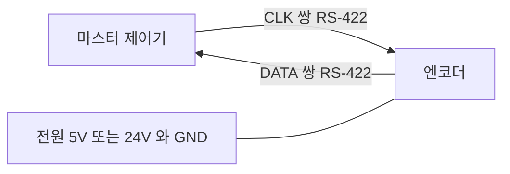

> **기준 출처:** SSI 는 공식 표준 문서가 없다. Stegmann(현 SICK)이 만든 사실상 표준이라 엔코더 제조사 데이터시트가 규격이고, 아래 내용은 여러 제조사 공개 데이터시트에 공통으로 나타나는 사항이다. 물리계층은 TIA/EIA-422-B 이고 그레이 코드는 공개 지식이다 / 확인일 2026-08-03
> **시리즈:** [목차](/posts/00-comm-series/) | 이전 → [12. 호스트 쪽 구현](/posts/12-host-termios-comport/) | 다음 → [14. 엔코더 BiSS-C](/posts/14-encoder-biss-c/)

---

## 1. 왜 엔코더는 UART 를 쓰지 않나

[01편](/posts/01-uart-async-meaning/)의 층 구분에서 엔코더 인터페이스는 별개 갈래였다. 이유가 셋이다.

| UART 의 문제 | 엔코더가 요구하는 것 |
| --- | --- |
| 바이트 단위인 8비트로 쪼개진다 | 위치는 13~40비트라 바이트 경계와 맞지 않는다 |
| 언제 값이 측정됐는지 모호하다 | 언제 래치했는가가 제어 지연 계산에 필수다 |
| 바이트마다 오버헤드가 20% 다 | 대역폭이 아깝다 |

두 번째가 결정적이다. 1 kHz 루프에서 위치가 언제 측정된 값인지 ±100 µs 모호하면 그게 그대로 지터가 되고 속도 추정 오차가 된다. 동기식 클럭은 첫 클럭 엣지에 래치한다는 확정된 순간을 준다.

## 2. 구조는 클럭 한 쌍과 데이터 한 쌍이다



클럭은 마스터가 준다. 그래서 드리프트나 보율 협상이 없고, 비트 수를 마스터가 정하므로 26비트든 40비트든 원하는 만큼 클럭을 주면 되고, 마스터가 원할 때 읽으므로 제어 주기와 정확히 동기된다.

## 3. 첫 엣지가 시간을 확정한다

| 구간 | 무슨 일이 일어나나 |
| --- | --- |
| idle | CLK 이 HIGH 이고 DATA 도 HIGH 다 |
| 첫 하강 엣지 | 엔코더가 현재 위치를 래치한다. 이후 회전해도 이번 값은 바뀌지 않는다 |
| 이후 엣지들 | 데이터를 MSB 부터 한 비트씩 내보낸다 |
| 마지막 비트 후 | 엔코더가 DATA 를 LOW 로 유지한다. monoflop 시간이고 보통 12~35 µs 다 |
| monoflop 종료 | DATA 가 HIGH 로 복귀하며 다음 전송 준비가 끝난다 |

monoflop 시간을 안 기다리고 다음 전송을 시작하면 안 된다. 엔코더가 아직 이전 트랜잭션 상태라 데이터가 깨진다. 제조사 데이터시트의 `t_m` 을 확인한다.

제어 주기 예산에 넣어야 한다. 26비트를 1 MHz 로 읽으면 26 µs 이고 monoflop 20 µs 를 더하면 46 µs 다. 1 kHz 루프의 4.6% 다.

클럭 극성과 샘플링 시점은 제조사마다 조금씩 다르다. 흔한 서술은 데이터가 하강 엣지에서 바뀌고 마스터는 상승 엣지에서 읽는다는 것이지만 반드시 데이터시트의 타이밍 다이어그램을 확인한다. [SPI 06편](/posts/06-spi-modes-cpol-cpha/)의 CPOL 과 CPHA 문제와 같은 성격이다. 값이 1비트 시프트되어 읽히면 샘플링 엣지가 틀린 것이다.

## 4. 데이터 포맷

다회전과 단회전을 이어 붙인 형태가 흔하다. 다회전 12비트에 단회전 13비트면 총 25비트다.

| 표기 | 뜻 |
| --- | --- |
| 13비트 단회전 | 한 바퀴를 8192 등분하니 분해능이 0.044° 다 |
| 25비트 (12 더하기 13) | 다회전 4096바퀴에 단회전 8192 다 |
| 17비트, 22비트 등 | 제조사마다 다양하다 |

20비트 단회전이면 $2^{20}$ 인 1048576 카운트가 한 회전이다. 감속비 100대1 하모닉 드라이브를 거치면 출력축에서 $360° / (1048576 \times 100)$ 로 $3.4\times10^{-6}$ 도가 된다. 충분히 정밀하다.

하지만 정밀도와 분해능은 다르다. 분해능이 20비트여도 정확도는 각도 오차와 편심과 온도 때문에 훨씬 나쁠 수 있다. 데이터시트에서 accuracy 항목을 따로 본다.

### 그레이 코드

SSI 엔코더는 그레이 코드로 출력하는 경우가 많다.

| 값 | 이진 | 그레이 |
| --- | --- | --- |
| 3 | `011` | `010` |
| 4 | `100` | `110` |

이진 코드에서 3 에서 4 로 갈 때 세 비트가 동시에 바뀐다. 물리적으로 완벽히 동시일 수 없어서 전이 순간에 읽으면 `111` 인 7 이나 `000` 인 0 같은 엉뚱한 값이 나올 수 있다. 그레이 코드는 인접한 값이 항상 1비트만 다르다. 전이 중에 읽어도 결과는 이전 값 아니면 다음 값이지 전혀 다른 값이 나오지 않는다.

```cpp
// comm_serial/gray_code.hpp
constexpr std::uint32_t gray_to_binary(std::uint32_t gray) noexcept {
    std::uint32_t b = gray;
    b ^= b >> 16;
    b ^= b >> 8;
    b ^= b >> 4;
    b ^= b >> 2;
    b ^= b >> 1;
    return b;
}
constexpr std::uint32_t binary_to_gray(std::uint32_t b) noexcept { return b ^ (b >> 1); }

static_assert(gray_to_binary(0b110) == 4);
static_assert(binary_to_gray(4) == 0b110);
```

다회전과 단회전을 통째로 그레이로 인코딩한 경우와 각각 따로 인코딩한 경우가 있다. 데이터시트를 확인한다. 잘못 변환하면 회전이 넘어가는 순간에만 값이 튀어 재현이 어려운 문제가 된다.

## 5. SSI 의 결정적 한계는 오류 검출이 없다는 것이다

[SPI 01편](/posts/01-spi-i2c-why-onboard/)의 ④ 무결성 칸이 여기서도 비어 있다.

| | 기본 SSI |
| --- | --- |
| CRC | 없다 |
| 패리티 | 일부 제조사가 1비트를 선택적으로 추가한다 |
| 에러 비트 | 일부가 엔코더 내부 오류 플래그 1비트를 준다 |
| 재전송 | 없다 |

위치값이 노이즈로 뒤집혀도 아무도 모른다. 그리고 엔코더는 모터 바로 옆에 있다. [기초 11편](/posts/11-basics-noise-ground-isolation/)에서 본 최악의 전자기 환경이다. 이게 BiSS-C 와 EnDat 가 존재하는 이유다. 둘 다 CRC 를 프레임에 넣었다.

SSI 를 써야 한다면 최소한의 방어를 넣는다.

```cpp
// SPI 01편의 타당성 검사에 SSI 특유의 방어를 더한다
class SsiGuard {
public:
    std::optional<std::uint32_t> validate(std::uint32_t raw) {
        // 물리적 변화율 검사
        if (primed_) {
            const std::int64_t d = wrap_delta(raw, last_);
            if (std::abs(d) > max_delta_) { ++rejects_; return std::nullopt; }
        }
        // 여유가 있으면 같은 값을 두 번 읽어 비교한다.
        // 노이즈는 두 번 같은 방식으로 뒤집히지 않는다.
        // 그리고 알려진 불가능 패턴인 전부 0 이나 전부 1 을 의심한다
        if (raw == 0 || raw == full_scale_) { ++suspicious_; }

        primed_ = true; last_ = raw;
        return raw;
    }
private:
    std::uint32_t last_{}, max_delta_{}, full_scale_{};
    bool          primed_{false};
    std::uint32_t rejects_{}, suspicious_{};
};
```

이중 읽기는 시간이 두 배 든다. 1 kHz 루프에서 46 µs 가 92 µs 가 되니 감당은 되지만 근본 해결은 CRC 가 있는 인터페이스로 가는 것이다.

## 6. 클럭 주파수와 케이블 길이

[06편](/posts/06-rs422-differential/)의 RS-422 속도와 거리 맞교환이 그대로 적용된다. 여기에 왕복 지연이 더해진다. 마스터가 클럭을 보내고 데이터가 돌아오는 시간이다.

$$t_{\text{왕복}} = 2 \times L \times 5\,\text{ns/m} + t_{\text{엔코더 응답}}$$

케이블 20 m 로 계산해 보면 왕복 전파가 2 곱하기 20 곱하기 5 ns 로 200 ns 이고, 엔코더 출력 지연이 약 200 ns 이고, 마스터 setup 이 50 ns 라 합계 450 ns 다. 반주기가 이보다 커야 하므로 최대 클럭이 약 1.1 MHz 다.

| 케이블 길이 | 대략적 클럭 상한 |
| --- | --- |
| 20 m 정도 | 약 1 MHz |
| 50 m 정도 | 약 400 kHz |
| 100 m 정도 | 약 300 kHz |
| 200 m 정도 | 약 200 kHz |
| 400 m 정도 | 약 100 kHz |

정확한 값은 반드시 해당 데이터시트를 확인한다. 긴 케이블에서 클럭을 낮추면 전송 시간이 길어져 제어 주기를 차지한다. 25비트를 100 kHz 로 읽으면 250 µs 에 monoflop 을 더해 1 kHz 루프의 27% 다. 로봇 관절에서는 케이블이 짧아 문제가 덜하지만 리니어 스테이지 같은 긴 축에서는 계산해야 한다.

일부 제조사가 지연 보상 옵션을 제공한다. 마스터가 왕복 지연을 측정해 샘플링 시점을 옮기는 방식이다. BiSS-C 는 이 기능을 규격에 넣었다.

## 7. SSI 마스터 구현

MCU 에 SSI 전용 주변장치는 대개 없다. SPI 로 흉내내는 게 표준 방법이다.

```cpp
// comm_serial/ssi_master.hpp
// SPI 를 클럭 생성기로 쓴다. MOSI 는 안 쓰고 MISO 만 읽는다.
// SSI 에는 CS 가 없으므로 CS 는 안 쓰거나 트리거로만 쓴다.
class SsiMaster {
public:
    struct Config {
        std::uint8_t  bits;              // 예를 들어 25 다
        bool          gray_encoded{true};
        std::uint32_t clock_hz;          // 케이블 길이로 정한다
        std::uint32_t monoflop_us{25};   // 데이터시트 t_m 에 여유를 더한다
    };

    std::optional<std::uint32_t> read() {
        if (now_us() - last_read_us_ < cfg_.monoflop_us) return std::nullopt;  // monoflop 대기

        // bits 비트를 받으려면 올림해서 바이트 단위로 클럭을 준다
        const std::size_t n_bytes = (cfg_.bits + 7) / 8;
        std::array<std::uint8_t, 8> tx{}, rx{};   // tx 는 전부 0 이고 엔코더는 무시한다
        if (!spi_.transfer({tx.data(), n_bytes}, {rx.data(), n_bytes})) return std::nullopt;
        last_read_us_ = now_us();

        // MSB 로 정렬하고 남는 하위 비트를 버린다
        std::uint64_t v = 0;
        for (std::size_t i = 0; i < n_bytes; ++i) v = (v << 8) | rx[i];
        v >>= (n_bytes * 8 - cfg_.bits);

        auto value = static_cast<std::uint32_t>(v);
        if (cfg_.gray_encoded) value = gray_to_binary(value);
        return guard_.validate(value);
    }
private:
    ISpiBus& spi_;
    Config   cfg_;
    SsiGuard guard_;
    std::uint64_t last_read_us_{};
};
```

SPI 모드 선택에 주의한다. SSI 의 idle CLK 은 HIGH 이므로 CPOL 이 1 인 계열, 곧 모드 2 나 3 이 맞는 경우가 많다. 하지만 첫 하강 엣지가 래치라는 SSI 특유의 동작 때문에 정확한 정렬은 데이터시트를 보고 정한다. 값이 1비트 시프트되면 모드를 바꿔 본다.

## 정리

- 엔코더가 UART 대신 동기식을 쓰는 이유는 임의 비트 수와 확정된 래치 시점과 오버헤드 없음 셋이다.
- 구조는 RS-422 차동 2쌍인 CLK 과 DATA 다. 마스터가 클럭을 준다.
- 첫 하강 엣지에 위치를 래치하므로 제어 지연 계산이 가능해진다.
- 마지막 비트 후 monoflop 시간인 12~35 µs 동안 DATA 를 LOW 로 유지한다. 안 기다리면 다음 읽기가 깨진다.
- 25비트를 1 MHz 로 읽으면 monoflop 포함 약 46 µs 다. 제어 주기 예산에 넣는다.
- 데이터는 다회전과 단회전 조합이다. 분해능과 정확도는 다른 값이다.
- 그레이 코드를 쓰는 이유는 인접 값이 1비트만 달라 전이 중에 읽어도 엉뚱한 값이 나오지 않기 때문이다.
- 다회전과 단회전을 통째로 인코딩했는지 따로인지 확인한다. 틀리면 회전 경계에서만 값이 튄다.
- SSI 는 오류 검출이 없는데 엔코더는 모터 바로 옆의 최악 노이즈 환경에 있다.
- 최소 방어는 변화율 타당성 검사와 이중 읽기다. 근본 해결은 CRC 가 있는 인터페이스다.
- 클럭 상한은 왕복 지연이 정한다. 20 m 면 약 1 MHz 이고 100 m 면 약 300 kHz 다.
- 구현은 SPI 를 클럭 생성기로 쓰고 MISO 만 읽는다. CPOL 과 래치 엣지 정렬은 데이터시트로 확인한다.

## 참고

- [TI SLLA272 — The RS-485 Design Guide](https://www.ti.com/lit/an/slla272d/slla272d.pdf)
- [BiSS Interface — 개방 규격](https://www.biss-interface.com/)
