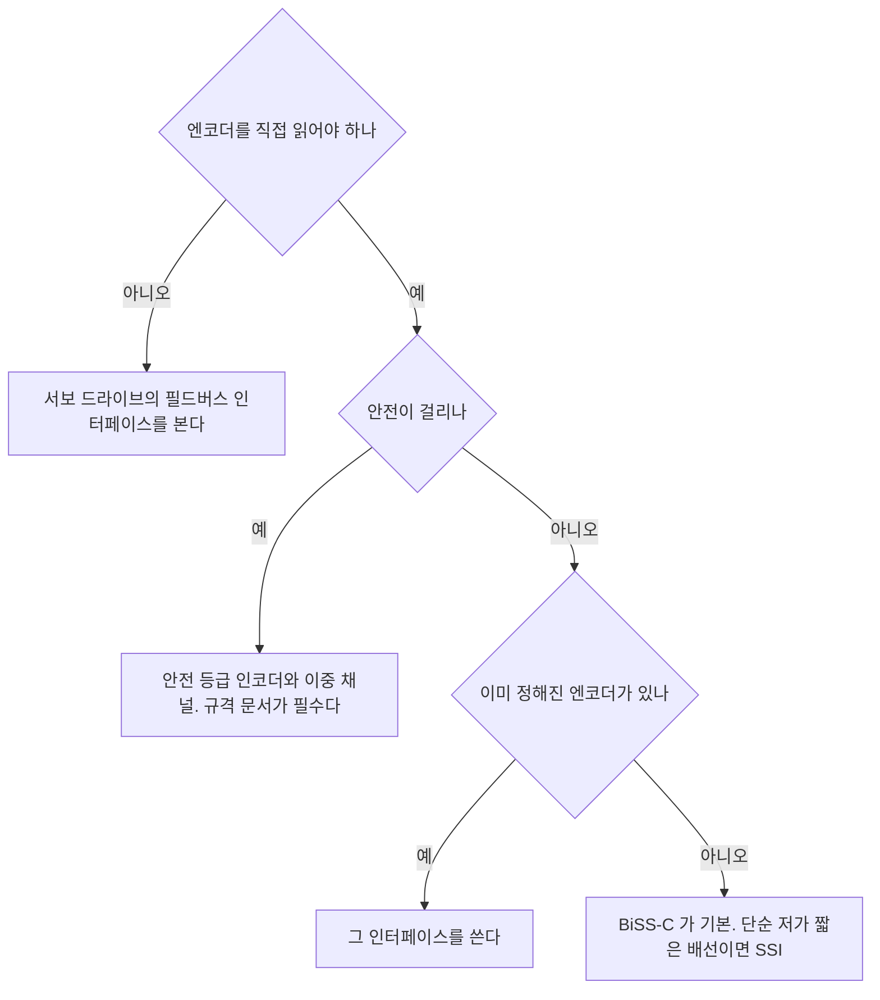

> **기준 출처:** HEIDENHAIN 이 공개한 EnDat 기술 자료(제품 카탈로그와 인터페이스 개요 문서)와 EnDat 마스터 IC 및 FPGA IP 벤더의 공개 데이터시트. 물리계층은 TIA/EIA-422-B / 확인일 2026-08-03
>
> 이 글은 다른 편보다 서술이 조심스럽다. EnDat 은 BiSS 와 달리 개방 규격이 아니다. 아래는 제조사가 공개한 개요 수준의 내용이고 구현하려면 제조사와의 라이선스와 기술 문서가 필요하다. 세부 비트 배치나 CRC 다항식은 여기서 단정하지 않는다.
>
> **시리즈:** [목차](/posts/00-comm-series/) | 이전 → [14. 엔코더 BiSS-C](/posts/14-encoder-biss-c/) | 다음 → [16. 시리얼 디버깅](/posts/16-serial-debugging-loopback/)

---

## 1. 셋을 한 줄로 비교하면

| | SSI | BiSS-C | EnDat |
| --- | --- | --- | --- |
| 만든 곳 | Stegmann(SICK) | iC-Haus | HEIDENHAIN |
| 규격 | 사실상 표준이다 | 개방이고 무료다 | 제조사 사양이라 라이선스가 필요하다 |
| 선 | CLK 쌍과 DATA 쌍 | MA 쌍과 SLO 쌍 | CLK 쌍과 양방향 DATA 쌍 |
| 방향 | 단방향 | 양방향 부가 채널 | 완전 양방향 |
| 오류 검출 | 없다 | CRC-6 | CRC |
| 파라미터 접근 | 없다 | 부가 채널이라 느리다 | 모드 명령으로 직접 한다 |
| 최대 클럭 | 약 2 MHz | 약 10 MHz | 2.2 에서 약 16 MHz |

EnDat 의 특징은 완전 양방향이다. DATA 라인이 진짜 양방향이라 마스터가 모드 명령을 보내고 슬레이브가 응답하는 구조다. BiSS 가 클럭 라인을 빌려 1비트씩 흘리는 것과 대조된다.

## 2. DATA 가 양방향이다

양방향이라 방향 전환 타이밍이 있다. [07편](/posts/07-rs485-half-duplex-direction/)의 RS-485 DE 문제와 같은 성격이다. 다만 여기서는 클럭 개수로 전환 시점이 확정되므로 훨씬 안전하다. 마스터가 명령 비트를 다 보낸 뒤 자기 드라이버를 끄고 엔코더가 켠다.

## 3. 모드 명령이 대화를 연다

EnDat 의 트랜잭션은 마스터가 무엇을 원하는지 먼저 말하는 구조다. 마스터가 모드 명령을 보내면 엔코더가 요청한 것과 CRC 를 돌려준다.

모드 명령에 안전 장치가 있다. 6비트인데 같은 값을 반전해서 한 번 더 보낸다. 비트 하나가 뒤집히면 두 조각의 반전 관계가 깨져서 엔코더가 즉시 거부한다.

이건 CRC 와는 다른 발상이다. CRC 는 계산해서 확인하지만 반전 중복은 구조 자체가 검사다. 하드웨어로 구현하기 쉽고 지연이 없다. CAN 도 비슷한 발상을 쓴다. 고정 필드인 delimiter 와 EOF 에 정해진 값이 안 오면 Form Error 를 낸다. 구조로 검사한다는 같은 계보다.

| 요청 | 무엇을 받나 |
| --- | --- |
| 위치값 전송 | 절대 위치와 CRC 다. 제어 루프가 매 주기 쓰는 것이다 |
| 위치값과 파라미터 읽기 | 위치와 함께 지정한 메모리 영역을 읽는다 |
| 위치값과 파라미터 쓰기 | |
| 파라미터 읽기와 쓰기 | 위치 없이 한다 |
| 리셋과 오류 클리어 | |

위치값과 파라미터를 한 트랜잭션에 넣을 수 있다는 게 EnDat 의 특징이다. 제어 주기를 방해하지 않으면서 진단 정보를 가져올 수 있다.

## 4. EnDat 2.1 과 2.2

| | 2.1 | 2.2 |
| --- | --- | --- |
| 위치 전송 | 순수 위치와 CRC 다 | 위치와 부가 정보와 CRC 다 |
| 파라미터 접근 | 별도 트랜잭션이 필요하다 | 위치와 같은 프레임에 실을 수 있다 |
| 클럭 | 비교적 낮다 | 최대 약 16 MHz 다 |
| 지연 보상 | 없다 | 전파 지연을 보상한다 |
| 아날로그 병용 | 일부 형식이 아날로그 사인과 코사인 신호를 같이 낸다 | 디지털만으로 충분하다 |

2.2 의 부가 정보가 실무에서 중요하다. 위치와 같은 프레임에 이런 것들이 실려 온다.

| 부가 정보 예 | 왜 중요한가 |
| --- | --- |
| 진단 값 (신호 품질) | 엔코더가 나빠지는 것을 미리 안다 |
| 온도 | 열 보상과 과열 감지에 쓴다 |
| 가속도와 속도 | 마스터가 미분할 필요가 줄어든다 |
| 경고와 오류 상세 | |

속도를 엔코더가 직접 준다는 게 제어에서 가치가 크다. [기초 10편](/posts/10-basics-realtime-jitter/)에서 봤듯 위치 차분으로 속도를 만들면 지터가 그대로 속도 노이즈가 된다. 엔코더 내부에서 정확한 시간 기준으로 계산한 값을 받으면 그 문제가 준다.

다만 엔코더가 어떤 방식으로 속도를 냈는지, 곧 차분인지 필터인지 시간 기준이 무엇인지를 알아야 제어에 쓸 수 있다. 데이터시트를 확인한다.

전파 지연 보상은 BiSS 와 같은 발상이다. 마스터가 왕복 지연을 측정해 더 높은 클럭을 쓸 수 있게 하고 위치가 래치된 정확한 시각을 알게 한다. 지연 예산이 측정값이 된다.

## 5. 오류 검출

EnDat 은 CRC 로 위치값을 보호하고 모드 명령 반전 중복이 명령 방향을 보호한다.

| 방향 | 보호 |
| --- | --- |
| 마스터에서 엔코더로 가는 명령 | 반전 중복 |
| 엔코더에서 마스터로 가는 위치와 데이터 | CRC |

CRC 다항식과 비트 수는 여기서 단정하지 않는다. 제조사 문서를 봐야 한다. 다만 원리는 [기초 07편](/posts/07-basics-error-detection/)과 같고 차수가 작으면 미검출 확률이 그만큼 남는다는 계산도 그대로 적용된다.

EnDat 은 기능안전 등급 제품군이 있다. 일반적인 접근은 두 개의 독립적인 위치 채널을 만들어 상호 비교하고, 각 채널에 독립적인 검사를 두고, 상위 안전 제어기가 두 값의 일치를 확인하는 것이다.

구체적인 안전 등급과 요구 조건은 제품과 규격 문서를 봐야 한다. 여기서 단정할 내용이 아니다. 원리만 기억한다. 안전은 CRC 하나가 아니라 독립 채널의 다중화로 만든다. 이 발상이 FSoE 와 같다. 일반 통신 위에 독립적인 안전 계층을 얹는다. 통신 CRC 는 안전 요구를 대신하지 못한다.

## 6. 구현은 대개 전용 하드웨어를 쓴다

EnDat 은 셋 중 구현이 가장 까다롭다. 양방향 방향 전환을 클럭 개수에 맞춰 해야 하고, 모드 명령을 반전 중복으로 조립해야 하고, 2.2 의 부가 정보는 프레임 구조가 요청 종류에 따라 다르고, 상세 문서에 라이선스가 필요하다.

| 방법 | 비고 |
| --- | --- |
| MCU 내장 EnDat 인터페이스 | 일부 모터 제어 MCU 가 제공한다. TI C2000 의 Position Encoder 인터페이스 등이다. 있으면 최선이다 |
| FPGA IP 코어 | 제조사나 서드파티가 제공한다 |
| 전용 마스터 IC | |
| 서보 드라이브에 맡긴다 | 가장 흔한 현실이다. 드라이브가 엔코더를 읽고 제어기는 EtherCAT 로 위치를 받는다 |

마지막 줄이 실무의 대부분이다. 의료로봇이나 산업로봇 관절 구성에서 제어기가 엔코더를 직접 읽는 경우보다, 서보 드라이브가 엔코더를 처리하고 제어기는 필드버스로 값을 받는 구조가 훨씬 흔하다.

그러면 이 폴더의 내용이 쓸모없는가. 그렇지 않다. 드라이브가 주는 값의 지연과 신뢰성을 이해해야 제어 루프를 설계할 수 있다. 진단 정보인 신호 품질과 온도와 CRC 오류를 필드버스로 받아 감시해야 한다. 그리고 드라이브가 없는 축인 리니어 스케일과 보조 센서는 직접 읽어야 한다.

## 7. 셋 중 무엇을 고르나

직접 구현한다면 BiSS-C 가 확실히 낫다. 규격이 무료로 공개돼 있고 CRC 가 있고 하드웨어는 SSI 와 같다. 포트폴리오용 예제로도 BiSS-C 가 적합하다. EnDat 은 공개 자료만으로 완전한 구현을 하기 어렵다.

## 정리

- EnDat 은 제조사 사양이라 상세 규격이 비공개다. 이 글은 공개 개요 수준이다.
- 특징은 완전 양방향 DATA 라인이다. 마스터가 모드 명령으로 무엇을 원하는지 먼저 말한다.
- 모드 명령을 반전해서 한 번 더 보낸다. CRC 와 다른 구조로 검사하는 발상이고 CAN 의 Form Error 와 같은 계보다.
- 2.2 가 더한 것은 부가 정보다. 위치와 같은 프레임에 진단과 온도와 속도가 온다.
- 엔코더가 속도를 직접 주면 지터가 속도 노이즈가 되는 문제가 완화된다. 단 계산 방식을 확인해야 쓴다.
- 전파 지연 보상으로 래치 시각을 정확히 안다. BiSS 와 같은 이득이다.
- 보호는 두 방향이다. 명령은 반전 중복이고 데이터는 CRC 다.
- 안전은 CRC 하나가 아니라 독립 채널 다중화로 만든다. FSoE 와 같은 원리다.
- 구현은 MCU 내장이나 FPGA IP 나 전용 IC 를 쓴다. 현실에서는 서보 드라이브가 대신 읽고 제어기는 필드버스로 받는 구조가 가장 흔하다.
- 그래도 이 내용이 필요한 이유는 지연과 신뢰성 이해, 진단 정보 감시, 드라이브 없는 축 때문이다.
- 직접 구현하거나 학습하거나 포트폴리오용이라면 BiSS-C 를 고른다.

## 참고

- [HEIDENHAIN — EnDat 인터페이스 개요](https://www.heidenhain.com/products/interfaces/endat)
- [BiSS Interface — 개방 규격](https://www.biss-interface.com/)
