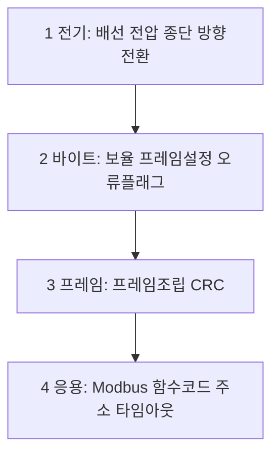

> **기준 출처:** 01편부터 15편까지의 출처를 종합한다. 새 출처는 없다 / 확인일 2026-08-03
> **시리즈:** [목차](/posts/00-comm-series/) | 이전 → [15. 엔코더 EnDat](/posts/15-encoder-endat/) | 다음 → [17. Modbus 마스터 만들기](/posts/17-modbus-master-example/)

---

## 1. 찍지 말고 자른다

통신 디버깅에서 가장 흔한 실패는 여러 개를 동시에 바꾸는 것이다. 보율도 바꾸고 케이블도 바꾸고 코드도 고치면 되더라도 왜 됐는지 모른다. 원칙은 한 번에 하나씩 아래층부터 위로 올라가는 것이다.



아래층이 안 되면 위층은 전부 무의미하다. 그런데 사람은 반대로 시작하는 경향이 있다. 코드가 가장 만만해 보여서 그렇다.

## 2. 전기층은 도구 없이 하는 것부터

| 확인 | 정상값 |
| --- | --- |
| RS-232 TXD idle | −5 ~ −12 V 다. 양수면 널모뎀 문제이거나 DTE 와 DCE 문제다 |
| RS-485 A 에서 B 를 뺀 idle 값 | +200 mV 초과다. 0 근처면 페일세이프가 없다 |
| RS-485 와 CAN 종단 | 전원 끄고 A 와 B 사이 저항이 60 Ω 이다. 120 Ω 두 개의 병렬이다 |
| 전원 | 트랜시버 VCC 를 확인한다 |
| GND 연결 | 두 장치 GND 사이 도통을 확인한다 |

이 다섯 개가 문제의 절반을 잡는다. 오실로스코프를 꺼내기 전에 한다.

그리고 언제 깨지는지를 먼저 묻는다. [기초 11편](/posts/11-basics-noise-ground-isolation/)에서 던진 질문이다.

| 시점 | 의심 |
| --- | --- |
| 항상 깨진다 | 설정이나 배선이다. 물리 문제가 아닐 가능성이 크다 |
| 모터가 돌 때만 깨진다 | 노이즈다 |
| 케이블을 만지면 깨진다 | 접촉 불량이거나 단선 직전이다 |
| 장비를 데우면 깨진다 | 내부 RC 발진기다 |
| 긴 응답에서만 깨진다 | 오버런이거나 DE 타이밍이다 |
| 특정 데이터에서만 깨진다 | XON/XOFF 이거나 프레이밍 문제다 |

## 3. 바이트층은 루프백으로 자른다

가장 값싸고 확실한 절단면이다. 내 쪽이 문제인지 상대 쪽이 문제인지를 즉시 가른다.

| 단계 | 무엇을 확인하나 |
| --- | --- |
| MCU 내부 루프백 (하드웨어 기능) | MCU UART 설정이 맞나 |
| 핀 루프백 (TX 와 RX 를 점퍼로) | MCU 핀 설정과 GPIO 다중화가 맞나 |
| 트랜시버 루프백 | 트랜시버와 레벨 변환이 맞나 |
| 케이블 루프백 (반대편에서 점퍼) | 케이블이 살아 있나 |

순서대로 진행하며 실패하는 지점이 범인이다. 트랜시버까지 되고 케이블에서 안 되면 케이블이고, 핀까지 되고 트랜시버에서 안 되면 트랜시버다.

```cpp
// 부팅 진단에 넣어두면 현장에서 유용하다
bool self_test_loopback(ISerialPort& port) {
    // 0x55 는 비트마다 전이가 있어 보율과 파형 문제를 잘 드러낸다
    constexpr std::uint8_t pattern[] = {0x55, 0xAA, 0x00, 0xFF, 0x0F, 0xF0};
    port.write(pattern);
    std::array<std::uint8_t, sizeof(pattern)> rx{};
    return read_exact(port, rx, timeout_ms(50)) &&
           std::equal(std::begin(pattern), std::end(pattern), rx.begin());
}
```

RS-485 반이중의 루프백은 특별하다. DE 를 켠 상태에서는 자기가 보낸 것이 자기 수신기로 그대로 들어온다. 이걸 활용하면 송신한 것과 수신한 것을 비교해 버스 충돌을 감지할 수 있다. 내가 보낸 값과 다르게 읽히면 다른 노드가 동시에 말하고 있다는 뜻이다.

CAN 의 Bit Error 검사가 정확히 이 방식이다. 쓴 값과 읽은 값을 비교한다. RS-485 에서는 소프트웨어로 흉내내야 하지만 CAN 은 하드웨어가 자동으로 한다.

## 4. 오실로스코프와 로직 애널라이저

둘 다 필요하고 용도가 다르다.

| | 오실로스코프 | 로직 애널라이저 |
| --- | --- | --- |
| 보는 것 | 아날로그 파형인 전압과 엣지와 링잉 | 디지털 값인 0 과 1 |
| 채널 | 2~4개 | 8~32개 |
| 기록 길이 | 짧다 | 길다. 수 초에서 분 단위다 |
| 프로토콜 디코드 | 일부 지원한다 | UART 와 SPI 와 I²C 와 CAN 이 내장돼 있다 |
| 강점 | 전기 문제인 링잉과 감쇠와 노이즈와 레벨 | 논리 문제인 값과 타이밍과 순서 |
| 못 보는 것 | 긴 시퀀스 | 파형 모양. 전압이 애매하면 그냥 틀리게 디코드한다 |

로직 애널라이저가 디코드했다고 보여주는 값을 무조건 믿으면 안 된다. 신호가 임계 근처에서 흔들리면 애널라이저가 임의로 판정한다. 디코드가 이상하면 오실로스코프로 파형을 확인한다.

| 파형 | 원인 |
| --- | --- |
| 엣지마다 계단형 링잉 | 종단이 없거나 불일치다 |
| 사다리꼴로 심하게 뭉개진다 | RS-232 에서 케이블 용량을 초과했다 |
| 진폭이 절반이다 | 종단이 3개 이상이거나 드라이버가 약하다 |
| 비트 폭이 예상과 다르다 | 보율 오류다 |
| idle 에 잔물결이 있다 | 페일세이프가 없다 |
| 마지막 바이트가 잘린다 | DE 를 TC 전에 내렸다 |
| 전체가 위아래로 출렁인다 | 공통모드 노이즈다 |

RS-485 Modbus 를 디버깅한다면 채널을 이렇게 배치한다. CH0 에 UART TX 를 트랜시버 앞 MCU 핀에서 잡아 소프트웨어가 무엇을 보냈는지 보고, CH1 에 UART RX 를 잡아 무엇을 받았는지 보고, CH2 에 DE 신호를 잡아 방향 전환 타이밍을 보고, CH3 에 제어 루프 GPIO 토글을 잡는다.

CH2 의 DE 와 CH0 의 TX 를 같이 보는 게 [07편](/posts/07-rs485-half-duplex-direction/) 문제의 결정적 증거다. DE 하강 엣지가 마지막 정지 비트보다 앞에 있으면 그게 범인이다. CH3 에 제어 루프 GPIO 를 토글해두면 통신이 제어 주기의 어디에 끼어드는지가 보인다. [기초 10편](/posts/10-basics-realtime-jitter/)의 지연 예산을 실측하는 방법이다.

## 5. 프레임층은 버스 모니터로 본다

RS-485 멀티드롭에서는 제3자로 붙어 전체 대화를 듣는 것이 가장 유용하다. 모니터는 절대 송신하면 안 된다. DE 를 켜면 버스를 망친다. 전용 스니퍼 하드웨어를 쓰거나 RS-485 어댑터를 수신 전용으로 설정한다.

| 도구 | 비고 |
| --- | --- |
| RS-485 에서 USB 로 변환하는 어댑터와 `xxd` | 가장 싸다. latency timer 를 낮춘다 |
| 로직 애널라이저와 UART 디코드 | 타이밍까지 본다 |
| 상용 Modbus 스니퍼 | 프로토콜 해석까지 한다 |

| 관찰 | 해석 |
| --- | --- |
| 마스터 요청은 있는데 응답이 없다 | 슬레이브 주소나 전원이나 배선 문제다 |
| 응답은 있는데 마스터가 못 받는다 | 마스터의 DE 가 안 내려갔거나 타임아웃이 짧다 |
| 응답이 오는데 CRC 가 틀리다 | 노이즈이거나 구현 문제다 |
| 요청과 응답이 겹친다 | 타임아웃이 짧아 마스터가 다음 요청을 보냈다 |
| 프레임 간격이 t3.5 보다 짧다 | 규격 위반이라 상대가 파싱하지 못할 수 있다 |
| 예외 응답이 온다 | 통신은 정상이고 주소나 함수 코드 문제다 |

## 6. 증상에서 원인으로

| 증상 | 1순위 | 2순위 | 3순위 |
| --- | --- | --- | --- |
| 아무것도 안 온다 | 널모뎀이나 TX 와 RX 뒤바뀜 | 전원이나 트랜시버 | 보율 |
| 글자가 깨진다 | 보율 | 프레임 설정 | 노이즈 |
| Framing Error 지속 | 보율 | 8E1 과 8N1 불일치 | — |
| 간헐적 오류 | 노이즈 | 종단 | 접지 |
| Overrun | 소프트웨어 | 보율이 너무 높다 | — |
| 마지막 바이트만 없다 | DE 와 TC | — | — |
| 긴 응답만 실패한다 | 오버런 | 버퍼 크기 | 타임아웃 |
| 가끔 통신이 멈춘다 | ORE 미클리어 | XOFF | RTS |
| 특정 값에서만 실패한다 | XON/XOFF | 이스케이핑 | — |
| PC 에서만 이상하다 | raw 모드가 아니다 | latency timer | — |
| 모터를 돌리면 깨진다 | 노이즈 | 접지 루프 | 차폐 |
| 데워지면 깨진다 | 내부 RC | — | — |
| 값이 하나씩 밀린다 | 40001 문제 | — | — |
| 엔코더 값이 1비트 시프트된다 | 샘플링 엣지 | — | — |

## 7. 진단을 코드에 심어둔다

가장 중요한 마무리다. 현장에서는 오실로스코프를 꺼내지 못한다. 그래서 소프트웨어가 스스로 증거를 남겨야 한다.

```cpp
// comm_serial/serial_diagnostics.hpp
struct SerialDiagnostics {
    UartStats uart;                                        // 하드웨어 플래그
    std::uint32_t frames_ok{}, frames_crc_bad{}, resync{}; // 파서
    std::uint32_t timeouts{}, exceptions{}, mismatched_replies{};  // 프로토콜
    std::uint32_t rx_dropped{}, max_buffer_used{};         // 버퍼

    // 사람이 읽을 한 줄 요약이다. 로그에 주기적으로 남긴다
    std::string summary() const;
};
```

| 지표 | 정상 | 의미 |
| --- | --- | --- |
| `uart.overrun` | 0 | 0 이 아니면 소프트웨어를 재설계한다 |
| `uart.noise` | 추세가 평탄하다 | 우상향이면 예방 정비를 한다 |
| `frames_crc_bad` | 0 에 가깝다 | 물리계층 문제다 |
| `resync` | 0 에 가깝다 | 프레임 경계가 깨지고 있다 |
| `timeouts` | 0 에 가깝다 | 슬레이브가 응답하지 않는다 |
| `exceptions` | 상황에 따라 다르다 | 통신은 정상이고 요청 내용 문제다 |
| `mismatched_replies` | 0 | 타임아웃이 짧다 |
| `max_buffer_used` | 50% 미만 | 버퍼 여유를 확인한다 |

`exceptions` 를 다른 오류와 섞어서 세면 안 된다. [09편](/posts/09-modbus-rtu-frame-crc16/)에서 봤듯 예외 응답은 통신 성공이다. 섞으면 통신 오류율 5% 같은 잘못된 숫자가 나와 엉뚱한 곳을 뒤지게 된다.

## 시리얼 열일곱 편의 여섯 칸

[기초 01편](/posts/01-basics-what-comm-solves/)의 여섯 칸을 시리얼로 채우면 이렇다.

| | UART / RS-232 | RS-485 와 Modbus | BiSS-C (엔코더) |
| --- | --- | --- | --- |
| ① 도달 | 단선 ±12 V 로 약 15 m | 차동으로 약 1200 m | 차동 RS-422 로 수 m |
| ② 동기 | 비동기. 시작 비트로 재정렬한다 | 같다 | 동기. 마스터 클럭을 준다 |
| ③ 경계 | 시작과 정지 비트 | 침묵 시간 t3.5 에 길이와 CRC 하이브리드 | Start 비트와 고정 길이 |
| ④ 무결 | 패리티라 약하다 | CRC-16 | CRC-6 |
| ⑤ 조정 | RTS/CTS 흐름제어 | 마스터와 슬레이브 규율. 충돌을 못 풀기 때문이다 | 마스터가 전부 결정한다 |
| ⑥ 시간 | 보장이 없다 | 없다. 9600 에서 트랜잭션이 52 ms 다 | 래치 시점 확정과 지연 보상이 있다 |

④ 칸이 드디어 채워졌다. SPI 와 I²C 폴더에서는 비어 있었다. 그리고 ⑥ 칸은 엔코더 인터페이스만 채웠다. 일반 시리얼은 여전히 제어 루프용이 아니다.

⑤ 칸을 보면 RS-485 는 충돌을 전기적으로 풀지 못해 프로토콜 규율에 의존한다. 다음 폴더의 CAN 이 이 칸을 물리계층에서 푼다.

## 정리

- 원칙은 한 번에 하나씩 아래층인 전기부터 위로 올라가는 것이다.
- 멀티미터 다섯 가지로 절반을 잡는다. RS-232 TXD idle 음전압, RS-485 차동 idle, 종단 60 Ω, 전원, GND 다.
- 언제 깨지는지를 먼저 묻는다.
- 루프백을 내부와 핀과 트랜시버와 케이블 순으로 잘라 실패하는 지점을 찾는다.
- RS-485 반이중은 자기 신호를 자기가 들으므로 송수신 비교로 충돌을 감지한다. CAN 의 Bit Error 와 같은 발상이다.
- 오실로스코프는 전기 문제를, 로직 애널라이저는 논리 문제를 본다. 둘 다 필요하다.
- 로직 애널라이저의 디코드를 무조건 믿지 않는다. 신호가 애매하면 임의로 판정한다.
- 채널 배치에 DE 신호와 제어 루프 GPIO 토글을 넣으면 방향 전환과 지연 예산 문제가 눈에 보인다.
- RS-485 는 제3자 모니터로 전체 대화를 듣는 게 가장 유용하다. 절대 송신하지 않는다.
- 진단을 코드에 심는다. 현장에서는 계측기를 꺼내지 못한다.
- 예외 응답을 오류와 섞어 세지 않는다. 통신은 성공한 것이다.

## 참고

- [Modbus over Serial Line V1.02](https://www.modbus.org/docs/Modbus_over_serial_line_V1_02.pdf)
- [TI SLLA272 — The RS-485 Design Guide](https://www.ti.com/lit/an/slla272d/slla272d.pdf)
