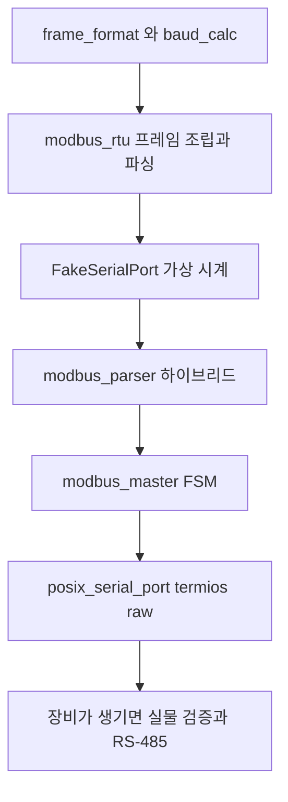

> **기준 출처:** 01편부터 16편까지를 코드로 옮긴 것이라 새 출처가 없다. Modbus over Serial Line V1.02 와 Modbus Application Protocol V1.1b3 / 확인일 2026-08-03
> **시리즈:** [목차](/posts/00-comm-series/) | 이전 → [16. 시리얼 디버깅](/posts/16-serial-debugging-loopback/)

---

## 1. 무엇을 만드나

Modbus RTU 마스터를 고른 이유는 이 폴더의 내용을 거의 다 쓰기 때문이다.

| 이 폴더에서 배운 것 | 예제에서 쓰이는 곳 |
| --- | --- |
| 프레임 설정 (8N1, 8E1) | 프레임 시간 계산 |
| CRC-16 | 프레임 조립과 검증 |
| 침묵 시간 대 길이와 CRC | 하이브리드 파서 |
| 타임아웃 셋 | 트랜잭션 관리 |
| 마스터 FSM | Idle, Sending, WaitResponse, Validate |
| RS-485 방향 전환 | 송신 완료 판정 |
| termios raw 모드 | 실물 구현 |

그리고 슬레이브 장비 없이 전부 테스트된다. `FakeSerialPort` 가 슬레이브를 흉내낸다.

## 2. 패키지 구조

```text
comm-examples/
└── comm_serial/
    ├── include/comm_serial/
    │   ├── frame_format.hpp      8N1 과 8E1, total_bits(), byte_time_us()
    │   ├── baud_calc.hpp         분주 오차 constexpr 계산
    │   ├── serial_port.hpp       ISerialPort 인터페이스
    │   ├── modbus_rtu.hpp        프레임 조립과 파싱, 예외 코드
    │   ├── modbus_parser.hpp     하이브리드 파서
    │   └── modbus_master.hpp     트랜잭션 FSM
    ├── src/
    │   ├── posix_serial_port.cpp termios raw 와 RS-485
    │   └── win_serial_port.cpp   DCB 와 COMMTIMEOUTS
    └── test/
        ├── fake_serial_port.hpp  슬레이브 대역
        ├── modbus_frame_test.cpp
        ├── modbus_parser_test.cpp
        ├── modbus_master_test.cpp
        └── baud_calc_test.cpp
```

## 3. Fake 시리얼 포트가 슬레이브를 대신한다

```cpp
// test/fake_serial_port.hpp
// 슬레이브 장비를 흉내낸다. 지연과 유실과 노이즈까지 주입할 수 있어야
// 10편과 16편의 실패 시나리오를 테스트로 재현할 수 있다.
class FakeSerialPort : public ISerialPort {
public:
    // 슬레이브 응답을 등록한다
    void on_request(std::vector<std::uint8_t> req, std::vector<std::uint8_t> resp,
                    std::uint32_t delay_us = 0) {
        rules_.push_back({std::move(req), std::move(resp), delay_us});
    }
    // 실패를 주입한다
    void set_drop_next_response(bool v) { drop_next_ = v; }        // 무응답이라 타임아웃이 난다
    void set_corrupt_next_crc(bool v)   { corrupt_crc_ = v; }      // CRC 오류를 만든다
    void set_split_response(std::size_t chunk) { chunk_ = chunk; } // 조각내서 도착하게 한다

    std::size_t write(std::span<const std::uint8_t> d) override {
        sent_.assign(d.begin(), d.end());
        for (auto& r : rules_) {
            if (r.req == sent_) {
                if (drop_next_) { drop_next_ = false; return d.size(); }
                auto resp = r.resp;
                if (corrupt_crc_) { resp.back() ^= 0xFF; corrupt_crc_ = false; }
                pending_.insert(pending_.end(), resp.begin(), resp.end());
                available_at_us_ = now_us_ + r.delay_us;
                break;
            }
        }
        return d.size();
    }

    std::size_t read(std::span<std::uint8_t> out) override {
        if (now_us_ < available_at_us_ || pending_.empty()) return 0;
        // chunk_ 로 쪼개서 준다. USB latency timer 상황을 재현한다
        const auto n = std::min({out.size(), pending_.size(),
                                 chunk_ ? chunk_ : pending_.size()});
        std::copy_n(pending_.begin(), n, out.begin());
        pending_.erase(pending_.begin(), pending_.begin() + n);
        return n;
    }

    void advance_us(std::uint64_t d) { now_us_ += d; }   // 가상 시계다

private:
    struct Rule { std::vector<std::uint8_t> req, resp; std::uint32_t delay_us; };
    std::vector<Rule> rules_;
    std::vector<std::uint8_t> sent_, pending_;
    std::uint64_t now_us_{0}, available_at_us_{0};
    std::size_t chunk_{0};
    bool drop_next_{false}, corrupt_crc_{false};
};
```

`advance_us()` 로 가상 시계를 쓴다. 실제로 100 ms 를 기다리지 않고 타임아웃 로직을 테스트할 수 있다. 테스트가 밀리초 단위로 끝난다. 그리고 `set_split_response()` 가 [10편](/posts/10-modbus-silence-timeout/)의 USB latency timer 문제를 재현한다. 응답이 한 덩어리로 오든 1바이트씩 오든 파서가 똑같이 동작해야 한다.

## 4. 무엇을 검증하나

### 프레임의 바이트 나열

```cpp
TEST(ModbusFrame, ReadHoldingExactBytes) {
    std::array<std::uint8_t, 8> buf{};
    ASSERT_EQ(build_read_holding(buf, 1, 0x0000, 2), 8u);
    const std::array<std::uint8_t, 8> expect{0x01,0x03,0x00,0x00,0x00,0x02,0xC4,0x0B};
    EXPECT_EQ(buf, expect);        // 왕복이 아니라 정확한 바이트 나열이다
}

TEST(ModbusFrame, EndiannessIsMixed) {
    // 09편의 함정. 데이터는 big-endian 이고 CRC 는 little-endian 이다
    std::array<std::uint8_t, 8> buf{};
    build_read_holding(buf, 1, 0x1234, 0x0002);
    EXPECT_EQ(buf[2], 0x12); EXPECT_EQ(buf[3], 0x34);   // 주소는 big-endian
    const auto crc = crc16_modbus({buf.data(), 6});
    EXPECT_EQ(buf[6], crc & 0xFF);                       // CRC 는 하위가 먼저
    EXPECT_EQ(buf[7], crc >> 8);
}
```

### 하이브리드 파서가 조각나서 와도 동작하는가

```cpp
// 10편의 주장인 침묵은 힌트로만 쓰고 판정은 길이와 CRC 로 한다를 검증한다
TEST(ModbusParser, WorksWhenResponseArrivesInOneChunk) {
    ModbusRtuParser p;
    const auto resp = make_response(1, 3, {0x12,0x34,0x56,0x78});
    std::optional<std::span<const std::uint8_t>> frame;
    for (auto b : resp) if ((frame = p.feed(b, /*now_us=*/0))) break;
    ASSERT_TRUE(frame);
    EXPECT_EQ(frame->size(), resp.size());
}

TEST(ModbusParser, WorksWhenResponseArrivesByteByByteWithGaps) {
    // USB latency timer 16 ms 상황이라 바이트마다 시간이 벌어진다
    ModbusRtuParser p;
    const auto resp = make_response(1, 3, {0x12,0x34,0x56,0x78});
    std::optional<std::span<const std::uint8_t>> frame;
    std::uint64_t t = 0;
    for (auto b : resp) { t += 5000; if ((frame = p.feed(b, t))) break; }
    ASSERT_TRUE(frame);       // 시간이 벌어져도 길이와 CRC 로 확정된다
}

TEST(ModbusParser, SilenceStartsNewFrame) {
    ModbusRtuParser p;
    p.feed(0x01, 0);  p.feed(0x03, 100);        // 프레임 조각이다
    // t3.5 이상 침묵이 있으면 새 프레임으로 간주해 앞의 조각을 버린다
    const auto resp = make_response(1, 3, {0xAA,0xBB});
    std::optional<std::span<const std::uint8_t>> frame;
    std::uint64_t t = 10'000;
    for (auto b : resp) if ((frame = p.feed(b, t += 10))) break;
    ASSERT_TRUE(frame);                          // 앞의 쓰레기에 영향받지 않는다
}
```

### 마스터 FSM 의 타임아웃과 응답 검증

```cpp
TEST(ModbusMaster, TimesOutWhenSlaveDoesNotRespond) {
    FakeSerialPort port;
    ModbusMaster m{port, {.response_timeout_ms = 100}};
    port.set_drop_next_response(true);

    auto req = m.read_holding_registers(1, 0, 2);
    for (int i = 0; i < 200; ++i) { port.advance_us(1000); m.poll(port_now_ms(port)); }
    EXPECT_EQ(req.state(), TransactionState::TimedOut);   // 실제로 기다리지 않는다
    EXPECT_EQ(m.stats().timeouts, 1u);
}

TEST(ModbusMaster, RejectsReplyFromWrongSlave) {
    // Modbus RTU 에는 트랜잭션 ID 가 없으므로 주소와 함수코드로 확인해야 한다
    FakeSerialPort port;
    ModbusMaster m{port, {}};
    port.on_request(build_read_holding_bytes(1, 0, 2),
                    make_response(/*slave=*/2, 3, {0x00,0x01,0x00,0x02}));  // 다른 노드다
    auto req = m.read_holding_registers(1, 0, 2);
    run_until_settled(m, port);
    EXPECT_NE(req.state(), TransactionState::Complete);
    EXPECT_EQ(m.stats().mismatched_replies, 1u);          // 걸러냈다
}

TEST(ModbusMaster, ExceptionIsNotCountedAsCommError) {
    // 09편과 16편의 원칙대로 예외 응답은 통신 성공이다
    FakeSerialPort port;
    ModbusMaster m{port, {}};
    port.on_request(build_read_holding_bytes(1, 0x9999, 2),
                    make_exception_response(1, 3, ExceptionCode::IllegalDataAddress));
    auto req = m.read_holding_registers(1, 0x9999, 2);
    run_until_settled(m, port);

    EXPECT_EQ(req.state(), TransactionState::Exception);
    EXPECT_EQ(req.exception(), ExceptionCode::IllegalDataAddress);
    EXPECT_EQ(m.stats().timeouts, 0u);                    // 타임아웃이 아니다
    EXPECT_EQ(m.stats().crc_errors, 0u);                  // CRC 오류도 아니다
    EXPECT_EQ(m.stats().exceptions, 1u);                  // 별도로 센다
}

TEST(ModbusMaster, CrcErrorIsCountedSeparately) {
    FakeSerialPort port;
    ModbusMaster m{port, {}};
    port.on_request(build_read_holding_bytes(1, 0, 2), make_response(1, 3, {0,1,0,2}));
    port.set_corrupt_next_crc(true);
    auto req = m.read_holding_registers(1, 0, 2);
    run_until_settled(m, port);
    EXPECT_EQ(m.stats().crc_errors, 1u);
}
```

세 번째 테스트가 [16편](/posts/16-serial-debugging-loopback/)의 원칙을 코드로 못박는다. 예외 응답과 타임아웃과 CRC 오류를 섞어서 세지 않는다. 섞으면 통신 오류율 5% 같은 잘못된 숫자가 나와 엉뚱한 곳을 확인하게 된다.

### 보율 계산

```cpp
TEST(BaudCalc, IntegerDividerFailsAt16MHz115200) {
    const auto s = compute_baud_integer_only(16'000'000, 115'200);
    EXPECT_GT(std::abs(s.error_percent), 2.0);      // ±8.5% 라 쓸 수 없다
}
TEST(BaudCalc, FractionalDividerSucceeds) {
    const auto s = compute_baud(16'000'000, 115'200);
    EXPECT_LT(std::abs(s.error_percent), 0.5);      // −0.08% 다
}
TEST(BaudCalc, ClassicCrystalIsExact) {
    const auto s = compute_baud(11'059'200, 115'200);
    EXPECT_NEAR(s.error_percent, 0.0, 0.001);       // 정확히 0 이다
}
```

## 5. RS-485 방향 전환은 실물에서만 확인된다

[07편](/posts/07-rs485-half-duplex-direction/)의 TXE 와 TC 문제는 fake 로는 재현되지 않는다. 실물에서 확인해야 한다.

```cpp
// src/posix_serial_port.cpp
bool PosixSerialPort::enable_rs485(std::uint32_t before_us, std::uint32_t after_us) {
    serial_rs485 rs{};
    if (::ioctl(fd_, TIOCGRS485, &rs) != 0) return false;   // 드라이버가 지원하지 않는다
    rs.flags |= SER_RS485_ENABLED | SER_RS485_RTS_ON_SEND;
    rs.flags &= ~SER_RS485_RTS_AFTER_SEND;
    rs.delay_rts_before_send = before_us / 1000;
    rs.delay_rts_after_send  = after_us  / 1000;
    return ::ioctl(fd_, TIOCSRS485, &rs) == 0;
}
```

커널이 지원하면 커널에 맡기는 게 안전하다. 지원하지 않으면 GPIO 로 직접 제어하되 반드시 TC 플래그를 기다린다. 검증은 로직 애널라이저로 TX 신호와 DE 신호를 같이 보는 것이다. DE 하강 엣지가 마지막 정지 비트보다 앞에 있으면 그게 문제다.

## 6. 만드는 순서



다섯 번째 단계까지가 전부 하드웨어 없이 된다. 그리고 거기까지 되면 `mbpoll` 같은 도구로 슬레이브 흉내를 내서 실물에 가까운 검증도 가능하다.

## 정리

- Modbus RTU 마스터가 이 폴더 내용을 거의 다 쓴다. 프레임 설정과 CRC 와 프레이밍과 타임아웃과 FSM 과 방향전환이다.
- `FakeSerialPort` 의 가상 시계로 타임아웃 테스트가 밀리초 만에 끝난다.
- `set_split_response()` 로 USB latency timer 상황을 재현한다. 조각나서 와도 파서가 같아야 한다.
- 검증은 네 가지다. 정확한 바이트 나열과 두 겹 엔디안, 하이브리드 파서, 마스터 FSM, 보율 계산이다.
- 마스터 FSM 은 타임아웃과 다른 노드 응답 거부와 예외와 타임아웃과 CRC 를 따로 세는 것을 본다.
- RS-485 방향 전환은 fake 로 재현되지 않는다. 실물과 로직 애널라이저로 TX 와 DE 를 같이 본다.
- 다섯 번째 단계까지가 하드웨어 없이 된다.

## 참고

- [Modbus over Serial Line V1.02](https://www.modbus.org/docs/Modbus_over_serial_line_V1_02.pdf)
- [Modbus Application Protocol V1.1b3](https://www.modbus.org/docs/Modbus_Application_Protocol_V1_1b3.pdf)
- [GoogleTest](https://google.github.io/googletest/)
