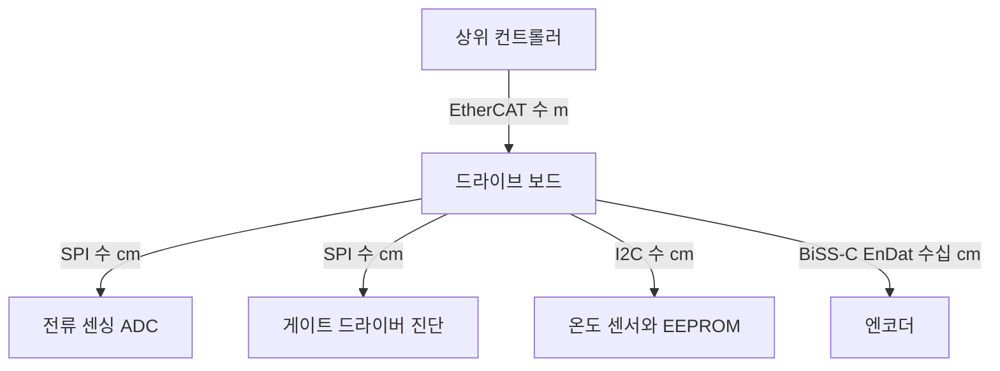

> **기준 출처:** NXP UM10204 §1, TI SLVA020, MCU 레퍼런스 매뉴얼의 주변장치 절 / 확인일 2026-08-03
> **시리즈:** [목차](/posts/00-comm-series/) | 다음 → [02. I²C 두 선으로 주소를 부른다](/posts/02-i2c-two-wires-addressing/)

---

## 1. 제약이 없으면 프로토콜이 단순해진다

[기초 01편](/posts/01-basics-what-comm-solves/)에서 통신 문제를 여섯 칸으로 나눴다. 보드 안 통신은 그중 여러 칸이 애초에 문제가 아니다.

| 칸 | 보드 밖 (CAN, EtherCAT) | 보드 안 (SPI, I²C) |
| --- | --- | --- |
| ① 도달 | 수십에서 수백 m, 노이즈, 그라운드 전위차 | 수 cm, 같은 PCB, 같은 그라운드라 거의 공짜 |
| ② 동기 | 클럭선을 못 주니 복원해야 한다 | 클럭선을 그냥 준다. 문제가 사라진다 |
| ③ 경계 | 프레이밍 규칙이 필요하다 | CS 핀 한 개가 프레임 경계다 (SPI) |
| ④ 무결 | CRC 여러 겹 | 거의 없다 |
| ⑤ 조정 | 중재와 우선순위 | 마스터가 전부 결정한다 |
| ⑥ 시간 | 어렵다 | 마스터가 클럭을 주니 지터가 ns 급이다 |

그래서 SPI 는 규격서조차 없다. 시프트 레지스터 두 개를 링으로 이은 것이 전부라 문서로 정할 게 별로 없었다. I²C 는 그나마 주소와 ACK 가 있어서 규격서(UM10204)가 있다.

여기서 얻는 결론이 하나 있다. 프로토콜의 복잡도는 물리적 제약의 함수다. 제약이 없으면 규칙도 필요 없다. 반대로 EtherCAT 가 그렇게 복잡한 건 설계자가 유별나서가 아니라, 100 m 떨어진 30개 노드를 µs 로 동기시키려면 그만큼이 필요해서다.

## 2. 조인트 하나 안의 통신 지도

로봇 관절 하나를 뜯으면 통신이 층층이 있다. 바깥에서 안으로 들어가면서 거리가 줄고 프로토콜이 단순해진다.



엔코더만 애매한 위치에 있다. 물리적으로는 모터 뒤쪽이라 보드 밖이지만 동기식 클럭 방식이라 SPI 를 닮았다. 그래서 SSI 와 BiSS-C 와 EnDat 는 긴 거리를 견디게 만든 동기식 시리얼이다. 차동 전송과 CRC 를 얹어서 그렇게 만들었다.

## 3. 대가는 오류 검출이 없다는 것

가장 중요한 한계다. 표에서 ④ 칸을 다시 보자.

| | 오류 검출 |
| --- | --- |
| SPI | 전혀 없다. 비트가 뒤집혀도 아무도 모른다 |
| I²C | ACK 만 있다. 이건 주소에 응답할 사람이 있다는 뜻이지 데이터가 맞다는 뜻이 아니다 |

이 전제는 보드 안이라 노이즈가 없다는 가정 위에 서 있다. 그 가정은 이럴 때 깨진다.

| 가정이 깨지는 상황 | 왜 |
| --- | --- |
| 배선이 커넥터를 지나 다른 보드로 간다 | 접촉 저항, 커넥터에서 꼬임이 풀린다 |
| 근처에서 모터가 PWM 스위칭한다 | [기초 11편](/posts/11-basics-noise-ground-isolation/)의 용량성 결합. 5 kV/µs 다 |
| 케이블이 20 cm 를 넘는다 | [기초 04편](/posts/04-basics-transmission-line/)의 전송선로 조건 |
| 플렉시블 케이블이 반복 굽힘을 받는다 | 단선 직전의 간헐 접촉 |

그래서 안전이 걸린 값은 SPI 나 I²C 로 받지 않는다. 관절 위치는 CRC 가 붙은 BiSS-C 나 EnDat 로 받거나, SPI 를 쓰더라도 애플리케이션 계층에서 CRC 를 직접 얹는다.

실제로 많은 엔코더와 ADC 칩이 SPI 프레임 안에 CRC 필드를 넣어 판다. 데이터시트에서 그 기능이 있으면 반드시 켠다. 없으면 값이 물리적으로 말이 되는지 검사하는 로직을 소프트웨어에 넣는다. 연속성과 범위와 변화율을 본다.

### 최소한의 방어 — 값 타당성 검사

CRC 가 없을 때 쓸 수 있는 가장 값싼 방어다.

```cpp
// 엔코더 카운트의 물리적 타당성 검사
// 최대 속도를 알면 한 주기에 이 이상 변할 수 없다는 상한이 나온다
class PlausibilityGate {
public:
    explicit PlausibilityGate(std::int32_t max_delta_per_cycle)
        : max_delta_{max_delta_per_cycle} {}

    // 통과하면 값, 튀면 nullopt. 직전 값을 유지할지는 호출자가 정한다
    std::optional<std::int32_t> check(std::int32_t raw) {
        if (!primed_) { primed_ = true; last_ = raw; return raw; }
        const std::int64_t d = std::int64_t{raw} - last_;
        if (std::abs(d) > max_delta_) { ++rejects_; return std::nullopt; }
        last_ = raw;
        return raw;
    }
    std::uint32_t rejects() const { return rejects_; }   // 늘면 배선이 나쁘다

private:
    std::int32_t  max_delta_, last_{};
    bool          primed_{false};
    std::uint32_t rejects_{};
};
```

최대 변화량은 이렇게 계산한다. 엔코더 20 bit(1048576 CPR), 최대 회전 6000 rpm 곧 100 rev/s, 제어 주기 1 ms 라면 한 주기 최대 변화는 100 × 1048576 × 0.001 로 약 104858 카운트다. 이 값을 넘는 점프는 물리적으로 불가능하니 통신 오류다. 단 카운터 랩어라운드는 따로 처리해야 한다.

그리고 `rejects()` 카운터가 늘고 있으면 그게 곧 물리계층 품질 지표다. [기초 08편](/posts/08-basics-flow-control/)의 원칙대로 재전송 대신 감지에 투자한다.

## 4. SPI 와 I²C 는 다른 것을 아꼈다

같은 문제를 푸는데 왜 둘이 공존하는가. 아낀 자원이 다르다.

| | I²C | SPI |
| --- | --- | --- |
| 아낀 것 | 핀 수. 장치가 몇 개든 2선이다 | 시간. 수십 Mbps 가 나온다 |
| 대가로 낸 것 | 속도(오픈 드레인 RC), 프로토콜 복잡도(주소와 ACK) | 핀 수. 슬레이브마다 CS 하나씩이다 |
| 태어난 배경 | 1980년대 TV 세트 안의 칩 연결. 핀이 비쌌다 | 시리얼 EEPROM 과 ADC 같은 빠른 주변장치 |

MCU 의 핀은 여전히 비싸다. 64핀 패키지에 모터 3상 PWM 6개, 엔코더 4개, 전류 ADC 3개, CAN 2개, EtherCAT 다수를 배치하고 나면 남는 핀이 없다. 슬레이브 8개에 CS 8개를 줄 여유가 없으면 I²C 가 답이고, 1 kHz 마다 6축 위치를 읽어야 하면 I²C 로는 시간이 나오지 않는다.

실무에서는 둘 다 쓴다. 빠른 것인 ADC 와 엔코더는 SPI 로, 느린 것인 온도와 EEPROM 과 전원 IC 는 I²C 로 붙인다.

## 5. 이 폴더를 읽는 틀

각 편에서 이 질문에 답한다.

1. 비트를 어떻게 읽나. 기초 05편의 ② 동기에 해당하고 02편과 05편에서 다룬다.
2. 타이밍의 한계는 무엇이 정하나. 기초 04편의 전기에 해당하고 03편과 06편에서 다룬다.
3. 깨지면 어떻게 알고 어떻게 되살리나. 04편에서 다룬다.
4. CPU 를 얼마나 쓰나. 기초 10편의 ⑥ 시간에 해당하고 08편에서 다룬다.

## 정리

- 보드 안은 물리적 제약이 거의 없어서 프로토콜이 단순하다. SPI 는 규격서조차 없다.
- 프로토콜 복잡도는 물리적 제약의 함수다. EtherCAT 가 복잡한 건 필요해서다.
- 조인트 안에는 통신이 층층이 있다. EtherCAT 는 m, SPI 와 I²C 는 cm, 엔코더 인터페이스는 그 중간이다.
- 최대 약점은 오류 검출이 없다는 것이다. I²C 의 ACK 는 응답자가 있다는 뜻이지 데이터가 맞다는 뜻이 아니다.
- 그 전제는 커넥터와 모터 노이즈와 긴 배선에서 깨진다. 칩의 CRC 기능을 켜거나 타당성 검사를 넣는다.
- 타당성 검사와 거부 카운터가 가장 값싼 방어이자 물리계층 품질 지표다.
- I²C 는 핀을 아꼈고 SPI 는 시간을 아꼈다. 실무에서는 둘 다 쓴다.

## 참고

- [NXP UM10204 — I²C-bus specification and user manual](https://www.nxp.com/docs/en/user-guide/UM10204.pdf)
- [TI SLVA020 — Introduction to SPI](https://www.ti.com/lit/an/slva020a/slva020a.pdf)
