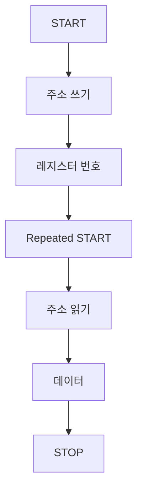

> **기준 출처:** NXP UM10204 §3.1.1, §3.1.4, §3.1.5, §3.1.6, §3.1.10, §3.1.11, §3.1.12 / 확인일 2026-08-03
> **시리즈:** [목차](/posts/00-comm-series/) | 이전 → [01. 보드 안 통신이 따로 있는 이유](/posts/01-spi-i2c-why-onboard/) | 다음 → [03. I²C 타이밍](/posts/03-i2c-timing-stretching-pullup/)

---

## 1. 선 두 개로 전부 해결하기

I²C 는 SDA(데이터)와 SCL(클럭) 단 두 선에 장치를 몇 개든 매단다. 장치를 추가해도 선이 늘지 않는다. 두 선으로 다 하려면 세 가지를 그 안에 넣어야 한다.

| 필요한 것 | I²C 의 답 |
| --- | --- |
| 어디가 메시지의 시작과 끝인가 | START 와 STOP 조건. 대역 밖 신호다 |
| 누구에게 하는 말인가 | 주소. 첫 바이트로 지명한다 |
| 상대가 받았나 | ACK 비트. 매 바이트마다 확인한다 |

## 2. START 와 STOP — 데이터로 만들 수 없는 신호

[기초 06편](/posts/06-basics-framing/)에서 본 대역 밖 표식의 교과서적인 예다. 기본 규칙은 이렇다. 데이터 비트는 SCL 이 HIGH 인 동안 SDA 가 변하면 안 된다. SDA 는 SCL 이 LOW 일 때만 바뀐다.

이 규칙을 일부러 어기는 것이 START 와 STOP 이다.

| 신호 | 조건 |
| --- | --- |
| START (S) | SCL 이 HIGH 인데 SDA 가 HIGH 에서 LOW 로 |
| STOP (P) | SCL 이 HIGH 인데 SDA 가 LOW 에서 HIGH 로 |

데이터로는 절대 나올 수 없는 패턴이니 충돌이 없다. 이스케이핑도 길이 필드도 필요 없다.

### Repeated START — STOP 없이 다시 시작



중간에 STOP 을 넣지 않고 바로 START 를 또 낸다. 이유가 있다. STOP 을 내면 버스가 해제되어 다른 마스터가 끼어들 수 있다. 레지스터 번호를 정해놓고 그 값을 읽는 두 단계 사이에 남이 끼어들면 엉뚱한 레지스터를 읽게 된다. Repeated START 는 버스를 놓지 않고 방향만 바꾸는 방법이다.

단일 마스터 시스템이면 STOP 뒤 START 로 해도 대개 동작하지만 슬레이브가 Repeated START 를 요구하는 경우가 많다. 데이터시트를 확인한다.

## 3. 주소 — 첫 바이트가 상대를 지명한다

START 다음 첫 바이트는 주소 7비트에 R/W 1비트다. 상위 7비트가 주소이고 최하위 1비트가 방향으로, 0 이면 쓰기이고 1 이면 읽기다.

주소 표기에 혼란이 있다. 데이터시트가 `0x48` 이라 하면 보통 7비트 주소다. 그런데 어떤 문서는 R/W 를 포함한 8비트로 쓰기 `0x90`, 읽기 `0x91` 이라고 쓴다. `0x48 << 1` 이 `0x90` 이다. 대부분의 MCU HAL 은 7비트를 받지만 일부는 8비트를 받는다. 주소가 안 잡히면 제일 먼저 이걸 의심한다.

| 주소 범위 | 용도 |
| --- | --- |
| `0x00` | General call(전체 호출)이나 START 바이트 |
| `0x01` ~ `0x07` | 예약 (CBUS, 10비트 주소 등) |
| `0x08` ~ `0x77` | 일반 슬레이브 112개 |
| `0x78` ~ `0x7F` | 예약 (10비트 주소, 디바이스 ID 등) |

10비트 주소 모드도 있지만 실무에서는 드물다.

### 주소 충돌은 I²C 의 구조적 약점이다

같은 칩을 두 개 달면 주소가 같다. 온도 센서를 4개 달고 싶은데 주소가 하나뿐이면 문제가 된다.

| 해법 | 방법 | 한계 |
| --- | --- | --- |
| 주소 핀 | A0, A1, A2 핀을 GND 나 VDD 로 묶어 하위 비트를 바꾼다 | 핀이 2~3개면 4~8개까지만 된다 |
| I²C 멀티플렉서 | TCA9548A 같은 스위치 칩으로 버스를 나눈다 | 부품과 지연이 추가된다 |
| 버스를 여러 개 | MCU 의 I²C 주변장치를 2~3개 쓴다 | 핀이 는다. I²C 를 쓴 이유가 무색해진다 |

이건 회로 설계 단계에서 잡아야 하는 문제다. 보드를 만들고 나서 발견하면 늦다. 부품 선정 시 데이터시트의 Slave Address 절을 반드시 확인한다.

## 4. ACK 와 NACK

바이트 8비트를 보낸 뒤 9번째 클럭에서 송신자가 SDA 를 놓고 수신자가 당긴다. LOW 면 ACK 로 받았다는 뜻이고, 아무도 당기지 않아 HIGH 면 NACK 다.

| 언제 | 뜻 | 대응 |
| --- | --- | --- |
| 주소 바이트 뒤 | 그 주소에 아무도 없다 | 주소가 7비트인지 8비트인지, 전원, 배선, 풀업을 확인한다 |
| 데이터 바이트 뒤 (쓰기 중) | 슬레이브가 더 못 받는다. 내부 버퍼가 찼거나 쓰기 진행 중이다 | 잠시 뒤 재시도한다. EEPROM 의 acknowledge polling 이 이것이다 |
| 마스터가 읽기 마지막 바이트에 NACK | 정상이다. 이제 그만 보내라는 신호다 | 없음 |

마지막 바이트에 NACK 을 보내는 걸 잊으면 버스가 멎는다. 슬레이브가 계속 보낼 준비를 하고 SDA 를 잡고 있어서 마스터가 STOP 을 만들지 못한다. [04편](/posts/04-i2c-failure-modes-recovery/)에서 다루는 버스 행의 흔한 원인 중 하나다.

그리고 ACK 은 무결성 검사가 아니다. 슬레이브가 클럭에 맞춰 SDA 를 당겼다는 것뿐이다. 데이터 비트가 노이즈로 뒤집혀도 ACK 은 정상적으로 나온다.

## 5. 실제 대화 — 레지스터 읽기

거의 모든 I²C 칩이 이 패턴이다. 레지스터 번호를 써넣고 그 값을 읽는다.

```text
① 레지스터 번호 지정 (쓰기)
   S │ 주소+W │A│ 레지스터번호 │A│

② 방향 전환 후 읽기
   Sr│ 주소+R │A│ 데이터[0] │A│ 데이터[1] │A│ … │ 데이터[n] │N│ P
                                                              ↑
                                                     마지막은 NACK
```

`A` 는 슬레이브의 ACK 이고 `N` 은 마스터의 NACK 이다.

```cpp
// comm_core 의 인터페이스. 실제 구현은 MCU HAL 또는 Linux /dev/i2c-*
class II2cBus {
public:
    virtual ~II2cBus() = default;
    // 쓰기 후 repeated START 로 읽기. 대부분의 HAL 이 이 조합을 한 함수로 제공한다
    virtual bool write_read(std::uint8_t addr7,
                            std::span<const std::uint8_t> tx,
                            std::span<std::uint8_t> rx) = 0;
};

// 온도 센서에서 16비트 레지스터 하나 읽기
std::optional<std::int16_t> read_temp_raw(II2cBus& bus,
                                          std::uint8_t addr7,
                                          std::uint8_t reg) {
    const std::uint8_t tx[1] = { reg };
    std::uint8_t rx[2]{};
    if (!bus.write_read(addr7, tx, rx)) return std::nullopt;   // NACK 또는 타임아웃
    // 대부분의 I²C 센서는 big-endian 이다. 필드버스와 반대다
    return static_cast<std::int16_t>((rx[0] << 8) | rx[1]);
}
```

`write_read` 를 쓰지 않고 `write` 와 `read` 를 따로 호출하면 중간에 STOP 이 들어간다. 단일 마스터면 대개 동작하지만 슬레이브가 Repeated START 를 요구하면 실패한다. HAL 문서에서 combined transfer 지원 여부를 확인한다.

## 6. 멀티마스터 중재도 공짜로 된다

I²C 는 마스터가 여러 개여도 된다. [기초 03편](/posts/03-basics-physical-differential/)에서 본 오픈 드레인의 와이어드 AND 성질 덕에 중재가 저절로 된다.

두 마스터가 동시에 START 를 냈다고 하자. 각자 자기가 쓴 값과 실제 SDA 를 비교한다. 내가 1 을 냈는데(놓았는데) SDA 가 0 이면 누군가 더 낮은 주소를 보내고 있다는 뜻이고, 나는 진 것이니 조용히 물러난다. 이긴 쪽은 자기가 이겼다는 것도 모르고 계속 진행한다. 데이터가 깨지지 않는다.

CAN 의 비파괴 중재와 정확히 같은 원리다. CAN 은 이걸 차동 신호 위에서, 훨씬 긴 거리에서, 우선순위 설계까지 얹어서 한다. 다만 실무의 임베디드 시스템에서 멀티마스터 I²C 는 잘 쓰지 않는다. 복잡도 대비 이득이 적고 버스 행 위험이 커진다.

## 정리

- I²C 는 SDA 와 SCL 두 선에 장치를 몇 개든 매단다. 선이 늘지 않는 게 존재 이유다.
- START 와 STOP 은 SCL 이 HIGH 일 때 SDA 가 변하는 것이다. 데이터 규칙을 일부러 어긴 대역 밖 신호다.
- Repeated START 는 버스를 놓지 않고 방향만 바꾼다. 레지스터 지정과 읽기 사이의 끼어들기를 막는다.
- 주소는 7비트가 기본이다. 8비트 표기와 혼동하는 게 첫 번째 함정이다.
- 쓸 수 있는 주소는 `0x08` 부터 `0x77` 까지 112개다. 같은 칩 여러 개는 주소 충돌이니 회로 단계에서 해결한다.
- ACK 은 매 바이트마다 있다. 주소 뒤 NACK 은 아무도 없다는 뜻이고, 읽기 마지막 바이트는 마스터가 NACK 을 내야 한다.
- ACK 은 무결성 검사가 아니다.
- 표준 패턴은 `S 주소+W 레지스터 Sr 주소+R 데이터 N P` 이고 HAL 의 combined transfer 를 쓴다.
- 멀티마스터 중재가 오픈 드레인 덕에 공짜로 된다. CAN 과 같은 원리이지만 실무에서는 잘 쓰지 않는다.

## 참고

- [NXP UM10204 — I²C-bus specification and user manual](https://www.nxp.com/docs/en/user-guide/UM10204.pdf)
