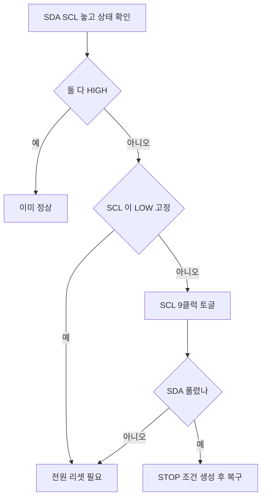

> **기준 출처:** NXP UM10204 §3.1.16(버스 클리어 절차), NXP AN10216, Linux 커널 `i2c-gpio` 의 bus recovery 구현 / 확인일 2026-08-03
> **시리즈:** [목차](/posts/00-comm-series/) | 이전 → [03. I²C 타이밍](/posts/03-i2c-timing-stretching-pullup/) | 다음 → [05. SPI 클럭을 주는 쪽이 주인이다](/posts/05-spi-clock-master/)

---

## 1. 아무나 버스를 멈출 수 있다

[기초 03편](/posts/03-basics-physical-differential/)에서 오픈 드레인이 곧 와이어드 AND 라는 것을 봤다. 한 명이라도 LOW 로 당기면 버스가 LOW 다. 이 성질이 중재를 공짜로 주지만 반대편의 대가가 있다.

슬레이브 하나가 SDA 를 놓지 않으면 버스 전체가 멎는다. 마스터를 리셋해도, 슬레이브 전원이 끊기지 않는 재부팅으로도 복구되지 않는다.

이걸 버스 행(bus hang)이라 한다. 그리고 이건 I²C 의 구조적 특성이지 버그가 아니다. 그래서 모든 실무 I²C 드라이버는 복구 절차를 갖고 있어야 한다.

## 2. 버스 행이 생기는 시나리오

### A. 읽기 도중 마스터가 리셋됐다

가장 흔하다. 슬레이브는 다음 비트를 SDA 에 실어놓고 마스터의 클럭을 기다리는 중인데 마스터가 리셋되거나 재프로그래밍된다.

슬레이브가 내보내려던 비트가 0 이면 SDA 를 LOW 로 잡고 있다. 마스터가 다시 부팅해서 START 를 내려 해도 SDA 가 이미 LOW 라 START 조건인 HIGH 에서 LOW 로의 변화를 만들 수 없다.

증상은 이렇다. 디버거로 재시작할 때마다 I²C 가 안 되고 전원을 완전히 껐다 켜면 된다. 개발 중에 자주 만나는 상황이고, 현장에서는 워치독 리셋 후에 똑같이 일어난다.

### B. 노이즈가 클럭을 하나 더 만들었다

SCL 에 글리치가 끼면 슬레이브는 비트 카운트를 잘못 세고 마스터와 슬레이브의 상태가 어긋난다. 슬레이브가 ACK 를 낼 차례라고 믿으면 SDA 를 잡는다.

### C. 마스터가 마지막 바이트에 NACK 을 안 보냈다

[02편](/posts/02-i2c-two-wires-addressing/)에서 본 것이다. 슬레이브가 더 보내라는 뜻으로 알고 다음 바이트를 준비한다.

### D. 클럭 스트레칭이 안 풀린다

슬레이브 펌웨어가 멈췄거나 내부 처리가 비정상적으로 길다. SCL 이 LOW 로 고정된다.

## 3. 복구 절차는 클럭 펄스 아홉 개다

시나리오 A 부터 C 까지는 표준 절차로 복구된다. UM10204 §3.1.16 이 정한 방법이다. 마스터가 SCL 에 클럭 펄스를 최대 9개 보낸다. 슬레이브가 남은 비트를 다 내보내면 SDA 를 놓는다. 그다음 STOP 조건을 만들어 버스를 정리한다.

왜 9개인가. 한 바이트가 8비트에 ACK 1비트를 더해 9클럭이다. 슬레이브가 어느 비트에서 멈춰 있든 9개면 반드시 바이트 경계에 도달한다.



### GPIO 로 구현한다

복구는 I²C 주변장치가 아니라 GPIO 비트뱅잉으로 해야 한다. 하드웨어 I²C 블록은 이미 어긋난 상태라 정상 시퀀스를 내지 못한다.

```cpp
// comm_core 의 하드웨어 추상. 실제 GPIO 조작은 플랫폼 구현이 담당한다
struct II2cRecoveryPins {
    virtual ~II2cRecoveryPins() = default;
    virtual void scl_release() = 0;      // 오픈 드레인이라 놓으면 풀업이 HIGH 로 만든다
    virtual void scl_drive_low() = 0;
    virtual void sda_release() = 0;
    virtual void sda_drive_low() = 0;
    virtual bool sda_is_high() = 0;
    virtual bool scl_is_high() = 0;
    virtual void delay_half_bit() = 0;   // 100 kHz 면 5 µs
};

enum class RecoveryResult { AlreadyIdle, Recovered, SdaStuck, SclStuck };

RecoveryResult recover_i2c_bus(II2cRecoveryPins& p) {
    p.sda_release();
    p.scl_release();
    p.delay_half_bit();

    if (p.sda_is_high() && p.scl_is_high()) return RecoveryResult::AlreadyIdle;

    // SCL 이 LOW 로 고정이면 슬레이브가 클럭을 붙잡고 있다. 할 수 있는 게 없다
    if (!p.scl_is_high()) return RecoveryResult::SclStuck;   // 전원 리셋이 필요하다

    // 9클럭. 슬레이브가 남은 비트를 다 밀어내게 한다
    for (int i = 0; i < 9 && !p.sda_is_high(); ++i) {
        p.scl_drive_low();  p.delay_half_bit();
        p.scl_release();    p.delay_half_bit();
        // 슬레이브가 스트레칭할 수도 있다. SCL 이 올라올 때까지 기다려야 정확하다
    }

    if (!p.sda_is_high()) return RecoveryResult::SdaStuck;   // 전원 리셋이 필요하다

    // STOP 조건을 만들어 슬레이브를 초기 상태로 되돌린다
    p.sda_drive_low();  p.delay_half_bit();
    p.scl_release();    p.delay_half_bit();
    p.sda_release();    p.delay_half_bit();   // SCL HIGH 에서 SDA LOW to HIGH 가 STOP

    return RecoveryResult::Recovered;
}
```

이 함수를 부팅 시퀀스의 I²C 초기화 앞에 무조건 한 번 호출한다. 비용은 마이크로초 단위인데 시나리오 A 를 통째로 없앤다. 넣지 않을 이유가 없다.

### 하드웨어 설계에서 미리 해둘 것

소프트웨어로 못 푸는 경우, 곧 `SclStuck` 과 `SdaStuck` 을 대비한다.

| 대비 | 방법 |
| --- | --- |
| 슬레이브 전원 제어 | I²C 슬레이브들의 전원을 MCU GPIO 로 끊을 수 있게 로드 스위치를 넣는다 |
| 슬레이브 리셋 핀 | 리셋 핀이 있는 칩은 MCU 에 연결해 둔다 |
| 버스 분리 | 중요한 칩과 덜 중요한 칩을 다른 I²C 버스로 나눈다 |

회로도를 그릴 때 결정되는 문제다. 소프트웨어로 나중에 만들 수 없다. 리뷰 때 I²C 가 멎으면 어떻게 되살릴 것인가를 반드시 물어본다.

## 4. 증상에서 원인으로

| 증상 | 가장 흔한 원인 | 확인법 |
| --- | --- | --- |
| 주소에서 NACK | 주소가 7비트인지 8비트인지 혼동했다 | `addr << 1` 로 바꿔 본다 |
| 주소에서 NACK | 슬레이브 전원이 없다 | VDD 를 측정한다 |
| 주소에서 NACK | 주소 핀 A0~A2 가 플로팅이다 | 반드시 GND 나 VDD 로 확정한다 |
| 주소에서 NACK | SDA 와 SCL 이 뒤바뀌었다 | 회로를 확인한다 |
| 모든 주소가 NACK | 풀업이 없다 | idle 전압이 $V_{DD}$ 인지 본다 |
| 스캔하면 유령 주소가 잔뜩 | 풀업이 없거나 너무 약하다 | [03편](/posts/03-i2c-timing-stretching-pullup/)의 계산을 한다 |
| SDA 가 LOW 고정 | 버스 행이다 | 9클럭 복구를 돌린다 |
| SCL 이 LOW 고정 | 슬레이브 고장이나 스트레칭 폭주다 | 전원 리셋을 한다 |
| 가끔만 실패한다 | $C_b$ 과다로 상승 시간이 부족하다 | 오실로스코프로 $t_r$ 을 측정한다 |
| 가끔만 실패한다 | 노이즈다 | 언제 실패하는지 상관관계를 찾는다 |
| 데이터가 이상한데 ACK 은 정상 | I²C 는 무결성 검사가 없다 | [01편](/posts/01-spi-i2c-why-onboard/)의 타당성 검사를 넣는다 |
| 긴 케이블에서만 실패한다 | $C_b$ 와 노이즈다 | I²C 를 케이블로 빼지 않는다 |

### 진단 1순위는 버스 스캔이다

`0x08` 부터 `0x77` 까지 전 주소에 쓰기 START 를 보내고 ACK 이 오는지 본다.

```cpp
// I²C 스캐너. 부팅 시 진단 로그로 한 번 돌려두면 배선 문제가 즉시 보인다
void i2c_scan(II2cBus& bus) {
    for (std::uint8_t addr = 0x08; addr <= 0x77; ++addr) {
        std::uint8_t dummy{};
        if (bus.write_read(addr, {}, {&dummy, 0}))   // 주소만 보내고 ACK 을 확인한다
            log_info("I2C device found at 0x%02X", addr);
    }
}
```

리눅스에서는 `i2cdetect -y 1` 이 같은 일을 한다. 결과를 읽는 법은 이렇다. 예상한 주소가 안 보이면 전원과 배선과 주소 핀을 본다. 모든 주소가 보이면 풀업 문제다. SDA 가 LOW 로 고정되어 있으면 전부 ACK 처럼 보인다. 예상하지 못한 주소가 보이면 보드에 모르는 칩이 있거나 주소가 충돌한 것이다.

## 5. 제어 루프에 I²C 를 넣을 때의 원칙

지금까지 본 것을 종합하면 결론이 나온다.

| 원칙 | 이유 |
| --- | --- |
| 제어 루프의 필수 경로에 I²C 를 넣지 않는다 | 스트레칭과 버스 행이 루프를 멈출 수 있다 |
| 넣어야 하면 반드시 타임아웃과 실패 시 직전 값 유지를 붙인다 | [기초 08편](/posts/08-basics-flow-control/)의 막지 말고 넘어간다 원칙이다 |
| 재시도를 루프 안에서 하지 않는다 | 지연이 배가 된다. 다음 주기에 다시 시도한다 |
| 온도나 설정처럼 느린 것만 I²C 로 붙인다 | 빠른 것은 SPI 로 붙인다 |
| 부팅 시 복구 절차를 무조건 한 번 돌린다 | 비용이 거의 없다 |
| 실패 카운터를 남긴다 | 물리계층 품질 지표가 된다 |

I²C 는 진단과 설정용, SPI 는 제어용이라는 것이 실무의 기본 분업이다. 온도 센서 값이 1 ms 늦게 와도 아무 일 없지만 엔코더 값이 그러면 안 된다.

## 정리

- 버스 행은 I²C 의 구조적 특성이다. 와이어드 AND 라 한 명이 SDA 를 잡으면 전체가 멎는다.
- 가장 흔한 시나리오는 읽기 도중 마스터 리셋이다. 슬레이브가 비트를 물고 SDA 를 LOW 로 유지해 START 를 만들 수 없다.
- 복구는 SCL 클럭 펄스 아홉 개다. 8비트에 ACK 하나다. 그다음 STOP 으로 슬레이브를 초기 상태로 되돌린다.
- 복구는 GPIO 비트뱅잉으로 해야 한다. 하드웨어 I²C 블록은 이미 어긋나 있다.
- `recover_i2c_bus()` 를 부팅 시 I²C 초기화 앞에 무조건 호출한다. 비용은 µs 이고 이득은 시나리오 하나 통째다.
- 소프트웨어로 못 푸는 경우를 위해 회로도 단계에서 슬레이브 전원 제어나 리셋 핀을 넣는다.
- 진단 1순위는 버스 스캔이다. 그다음 idle 전압, 그다음 오실로스코프로 $t_r$ 을 본다.
- 데이터가 이상한데 ACK 이 정상이면 I²C 는 아무 도움이 안 된다. 타당성 검사가 필요하다.
- 실무 분업은 I²C 가 진단과 설정, SPI 가 제어다.

## 참고

- [NXP UM10204 — I²C-bus specification and user manual](https://www.nxp.com/docs/en/user-guide/UM10204.pdf)
- [NXP AN10216 — I²C Manual](https://www.nxp.com/docs/en/application-note/AN10216.pdf)
- [Linux 커널 — I²C 문서](https://www.kernel.org/doc/html/latest/i2c/index.html)
