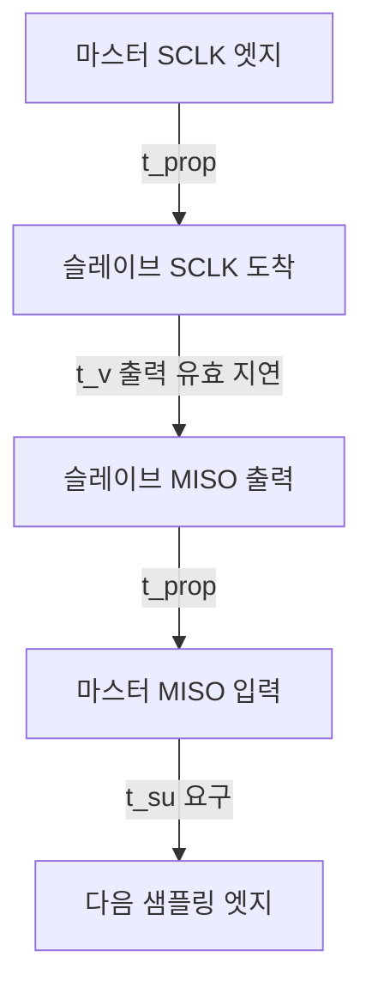

> **기준 출처:** TI SLVA020, MCU 레퍼런스 매뉴얼의 SPI 절(ST RM0090 §28.3.2 등), 각 주변장치 데이터시트의 AC Characteristics 표 / 확인일 2026-08-03
> **시리즈:** [목차](/posts/00-comm-series/) | 이전 → [05. SPI 클럭을 주는 쪽이 주인이다](/posts/05-spi-clock-master/) | 다음 → [07. 멀티 슬레이브](/posts/07-spi-multislave-cs-daisy/)

---

## 1. 왜 모드가 네 개나 있나

SPI 에는 규격서가 없다. 그래서 칩 제조사마다 클럭의 어느 엣지에서 읽을지를 다르게 정했고 그 조합이 표준처럼 굳었다. 두 개의 파라미터가 있다.

| 파라미터 | 뜻 |
| --- | --- |
| CPOL (Clock Polarity) | idle 일 때 SCLK 가 LOW(0)인가 HIGH(1)인가 |
| CPHA (Clock Phase) | 첫 번째 엣지(0)에서 샘플링하나 두 번째 엣지(1)에서 하나 |

CPHA 가 헷갈리는 지점이다. 첫 번째와 두 번째는 상승과 하강이 아니라 CS 가 내려간 뒤 오는 순서다. CPOL 에 따라 첫 엣지가 상승일 수도 하강일 수도 있다.

## 2. 네 가지 모드

| 모드 | CPOL | CPHA | idle SCLK | 샘플링 엣지 | 데이터 출력 엣지 |
| --- | --- | --- | --- | --- | --- |
| 0 | 0 | 0 | LOW | 상승 (첫 엣지) | 하강 |
| 1 | 0 | 1 | LOW | 하강 (둘째 엣지) | 상승 |
| 2 | 1 | 0 | HIGH | 하강 (첫 엣지) | 상승 |
| 3 | 1 | 1 | HIGH | 상승 (둘째 엣지) | 하강 |

### 모드 0 과 3 이 가장 흔한 이유

둘 다 상승 엣지에서 샘플링한다. 차이는 idle 레벨과 첫 비트를 언제 내놓느냐뿐이다.

| | 모드 0 | 모드 3 |
| --- | --- | --- |
| 첫 비트 출력 시점 | CS 하강 순간 | 첫 클럭 하강 엣지 |
| 함의 | 슬레이브가 CS 를 보고 즉시 데이터를 준비해야 한다 | 클럭이 한 번 움직인 뒤라 여유가 있다 |

CPHA 가 0 인 모드 0 과 2 는 CS 하강에 데이터가 나와야 하므로 타이밍이 빡빡하다. 그래서 고속 칩은 모드 3 을 선호하는 경향이 있다. 반대로 단순한 시프트 레지스터 칩은 모드 0 이 많다.

### 모드가 틀리면 어떻게 보이나

| 증상 | 원인 |
| --- | --- |
| 값이 1비트 밀려서 읽힌다 (`0x5A` 가 `0xB4` 나 `0x2D` 로) | CPHA 가 틀렸다 |
| 값이 전부 `0x00` 이나 `0xFF` 다 | CS 미동작, 배선, 전원 문제다 |
| 모드 0 과 3 을 바꿔도 똑같이 나온다 | CPOL 만 다르고 CPHA 가 같아 상승 샘플이 동일하다. 정상적으로 있을 수 있는 일이다 |
| 저속에서는 되는데 고속에서 깨진다 | 모드 문제가 아니라 타이밍 여유 부족이다 |

값이 시프트되어 보이면 CPHA 를, 완전히 엉뚱하면 배선을 의심한다. 네 모드를 다 시도해 보는 건 30초면 되니 데이터시트를 못 찾겠으면 그냥 해본다. 단 왜 되는지 확인하고 코드에 이유를 남긴다.

## 3. 최대 클럭 주파수를 직접 계산한다

데이터시트에 최대 20 MHz 라고 적혀 있어도 그건 칩 단독 사양이다. 실제 시스템의 상한은 왕복 경로 전체가 정한다. 임계 경로는 MISO 쪽이다.



반주기 안에 이게 다 들어가야 한다.

$$\frac{T}{2} \geq 2\,t_{prop} + t_{v(\text{slave})} + t_{su(\text{master})} + t_{skew}$$

$$f_{max} = \frac{1}{2\left(2t_{prop} + t_v + t_{su} + t_{skew}\right)}$$

### 예제 1. 같은 보드 위의 ADC

| 항목 | 값 |
| --- | --- |
| 배선 5 cm, 6.7 ns/m 로 왕복 | 0.7 ns |
| 슬레이브 출력 유효 $t_v$ | 25 ns |
| 마스터 setup $t_{su}$ | 5 ns |
| 스큐와 여유 | 5 ns |
| 합계 | 35.7 ns |

$$f_{max} = \frac{1}{2 \times 35.7\,\text{ns}} \approx 14\ \text{MHz}$$

데이터시트가 최대 20 MHz 라 해도 실제로는 14 MHz 가 상한이다. MCU 의 SPI 분주기는 2의 거듭제곱이 흔하니 168 MHz 를 16 으로 나눈 10.5 MHz 를 고르게 된다.

### 예제 2. 2 m 케이블 끝의 엔코더

| 항목 | 값 |
| --- | --- |
| 케이블 2 m, 5 ns/m 로 왕복 | 20 ns |
| 슬레이브 출력 유효 $t_v$ | 50 ns |
| 마스터 setup $t_{su}$ | 10 ns |
| 여유 | 10 ns |
| 합계 | 90 ns |

$$f_{max} = \frac{1}{2 \times 90\,\text{ns}} \approx 5.5\ \text{MHz}$$

케이블 2 m 만으로 상한이 14 MHz 에서 5.5 MHz 로 떨어진다. 그리고 여기에 [기초 03편](/posts/03-basics-physical-differential/)의 노이즈 문제와 [기초 04편](/posts/04-basics-transmission-line/)의 반사 문제가 겹친다.

그래서 엔코더는 SPI 를 그대로 쓰지 않는다. 대신 차동 전송과 CRC 와 지연 보상을 얹은 SSI, BiSS-C, EnDat 를 쓴다. BiSS-C 가 왕복 지연을 측정해 보상하는 기능을 갖는 이유가 바로 이 계산이다.

### 여유를 늘리는 방법

| 방법 | 효과 |
| --- | --- |
| 지연 샘플링 (일부 MCU 지원) | 샘플링 시점을 반주기 뒤로 미뤄 여유가 반주기 늘어난다 |
| 클럭을 낮춘다 | 확실하지만 시간이 든다 |
| 케이블을 짧게 한다 | $t_{prop}$ 이 준다 |
| $t_v$ 가 작은 칩을 고른다 | 부품 선정 단계의 일이다 |

지연 샘플링은 STM32 의 일부 시리즈와 TI C2000 등이 제공하는 기능이고 이름은 제조사마다 다르다. 케이블이 긴 SPI 에서 효과가 크니 레퍼런스 매뉴얼에서 찾아본다.

## 4. 데이터시트에서 읽어야 할 값들

칩 데이터시트의 AC Characteristics 나 Timing Requirements 표에서 이 이름들을 찾는다.

| 흔한 표기 | 뜻 | 누가 지켜야 하나 |
| --- | --- | --- |
| $t_{SCLK}$, $f_{SCLK}$ | 클럭 주기와 주파수 상한 | 마스터 |
| $t_{CSS}$, $t_{SU;CS}$ | CS 하강에서 첫 클럭 엣지까지 | 마스터 |
| $t_{CSH}$, $t_{HD;CS}$ | 마지막 클럭에서 CS 상승까지 | 마스터 |
| $t_{CSD}$, $t_{CS\_HIGH}$ | 트랜잭션 사이 CS HIGH 유지 | 마스터 |
| $t_{SU}$ (MOSI) | 슬레이브가 요구하는 입력 setup | 마스터 |
| $t_{H}$ (MOSI) | 슬레이브가 요구하는 입력 hold | 마스터 |
| $t_{V}$, $t_{DO}$ (MISO) | 클럭 엣지 후 데이터가 유효해지기까지 | 슬레이브 사양이지만 마스터가 감당한다 |
| $t_{DIS}$ | CS 상승 후 MISO 가 고임피던스가 되기까지 | 슬레이브. 멀티 슬레이브에서 중요하다 |

$t_{CSD}$, 곧 트랜잭션 사이 CS HIGH 시간을 놓치기 쉽다. 연속 트랜잭션을 돌릴 때 CS 를 너무 빨리 다시 내리면 슬레이브가 초기화를 마치지 못한다. 고속 루프에서 실제로 만나는 문제다.

## 5. 설정을 코드에 남기는 법

```cpp
// comm_core/spi_config.hpp
struct SpiConfig {
    std::uint32_t clock_hz;
    std::uint8_t  mode;          // 0..3  (CPOL<<1 | CPHA)
    bool          msb_first{true};
    std::uint8_t  bits_per_word{8};
};

// 설정에는 반드시 왜 이 값인가를 남긴다.
// 나중에 클럭을 올리고 싶을 때 무엇을 다시 계산해야 하는지가 여기 있어야 한다.
inline constexpr SpiConfig kEncoderSpi{
    // f_max 계산: 2*t_prop(20ns) + t_v(50ns) + t_su(10ns) + 여유(10ns) = 90ns
    //   -> 1/(2*90ns) 는 약 5.5 MHz 가 상한
    //   -> MCU 분주 168MHz/32 = 5.25 MHz 선택
    .clock_hz = 5'250'000,
    // 데이터시트 Fig.12: SCLK idle HIGH, 두 번째(상승) 엣지에서 샘플이므로 모드 3
    .mode = 3,
};
```

주석이 계산 과정을 담고 있어야 한다. 왜 5.25 MHz 인가를 6개월 뒤에 물어볼 때 데이터시트를 다시 뒤지지 않아도 되게 한다.

## 정리

- SPI 모드는 CPOL(idle 클럭 레벨)과 CPHA(첫 엣지냐 둘째 엣지냐)의 조합 네 가지다.
- CPHA 의 첫째와 둘째는 상승과 하강이 아니라 CS 하강 후 오는 순서다.
- 모드 0 과 3 이 가장 흔하다. 둘 다 상승 엣지 샘플이고 차이는 첫 비트를 CS 하강에 내놓느냐 첫 클럭 뒤에 내놓느냐다.
- 값이 1비트 밀려 보이면 CPHA 가 틀린 것이다. 완전히 엉뚱하면 배선이고, 고속에서만 깨지면 타이밍 여유 부족이다.
- 실제 상한은 $f_{max} = 1 / \left[2(2t_{prop}+t_v+t_{su}+t_{skew})\right]$ 로 계산한다.
- 보드 위 ADC 는 약 14 MHz 다. 데이터시트가 20 MHz 라 해도 그렇다.
- 케이블 2 m 엔코더는 약 5.5 MHz 로 떨어진다.
- 이 계산이 엔코더가 SPI 대신 BiSS-C 나 EnDat 를 쓰는 이유다. 차동과 CRC 와 지연 보상이 붙는다.
- 여유를 늘리려면 지연 샘플링 기능을 찾아본다. MCU 마다 이름이 다르다.
- $t_{CSD}$ 를 놓치면 고속 루프에서 실패한다.
- 설정 상수에 계산 과정을 주석으로 남긴다.

## 참고

- [TI SLVA020 — Introduction to the Serial Peripheral Interface](https://www.ti.com/lit/an/slva020a/slva020a.pdf)
