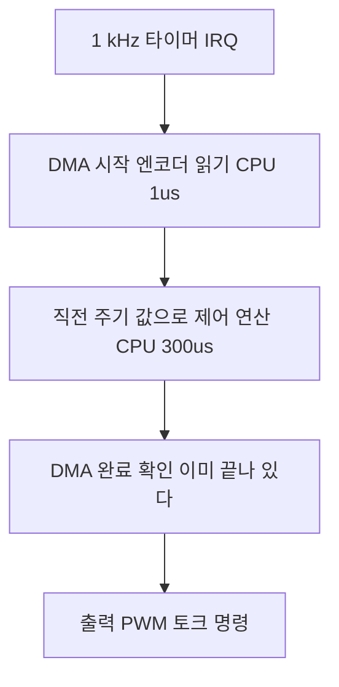

> **기준 출처:** ARM Cortex-M 아키텍처 문서(예외 진입과 이탈 사이클, tail-chaining), MCU 레퍼런스 매뉴얼의 DMA 절(ST RM0090 §10 등), ARM Cortex-M7 캐시와 DMA 일관성 공식 문서 / 확인일 2026-08-03
> **시리즈:** [목차](/posts/00-comm-series/) | 이전 → [07. 멀티 슬레이브](/posts/07-spi-multislave-cs-daisy/) | 다음 → [09. SPI 와 I²C 선택 기준](/posts/09-spi-vs-i2c-selection/)

---

## 1. 통신이 CPU 를 얼마나 쓰나

1 kHz 제어 루프는 예산이 1000 µs 다. 그 안에 센서 읽기와 제어 연산과 명령 출력이 다 들어가야 한다. 통신이 예산의 몇 퍼센트를 쓰는지 모르면 설계가 아니라 도박이다.

그리고 CPU 사용률보다 지터가 더 중요하다. 세 가지 방식이 이 둘에서 다르게 행동한다.

| 방식 | CPU 를 언제 쓰나 | 지터 영향 |
| --- | --- | --- |
| 폴링 (블로킹) | 전송 내내 점유한다 | 자기 루프는 막지만 예측 가능하다 |
| 인터럽트 | 바이트나 워드마다 잠깐 쓴다 | 다른 태스크에 지터를 뿌린다 |
| DMA | 시작과 완료 두 번만 쓴다 | 가장 깨끗하다 |

## 2. 세 방식의 비용 계산

조건은 6축 엔코더 데이지 체인 24바이트, SPI 10 MHz, MCU 168 MHz Cortex-M4 다. 전송 자체에 걸리는 시간은 셋 다 같다.

$$t_{\text{전송}} = \frac{24 \times 8\ \text{비트}}{10\ \text{MHz}} = 19.2\ \mu s$$

이 시간은 물리적으로 줄일 수 없다. 차이는 그동안 CPU 가 무엇을 하느냐다.

### 폴링

```cpp
for (auto b : tx) {
    SPI->DR = b;
    while (!(SPI->SR & SPI_SR_RXNE)) { }   // 여기서 CPU 가 논다
    *rx++ = SPI->DR;
}
```

CPU 점유가 19.2 µs 전부이고 1 ms 예산의 1.9% 다. 지터는 자기 루프만 막고 다른 인터럽트는 정상 동작한다.

1.9% 면 사실 괜찮다. 폴링을 무조건 나쁘게 볼 필요는 없다. 짧고 예측 가능하면 폴링이 가장 단순하고 지터도 적다. 문제는 전송이 길어질 때다.

### 바이트 단위 인터럽트

Cortex-M4 의 인터럽트 왕복 비용은 진입 12 사이클에 이탈(tail-chaining 시 6 사이클), 여기에 C 함수 프롤로그와 에필로그, 레지스터 저장, 분기까지 합쳐 대략 40~60 사이클로 잡는다.

| 항목 | 값 |
| --- | --- |
| 인터럽트 1회 약 50 사이클 @168 MHz | 0.30 µs |
| 24회 | 7.2 µs |
| 1 ms 예산 대비 | 0.72% |
| 지터 | 선점 24번이 다른 태스크에 뿌려진다 |

CPU 사용률 0.72% 만 보면 폴링보다 좋아 보이지만 지터 관점에서는 최악이다. 제어 연산 도중에 24번 끼어들면 그 연산이 언제 끝날지가 매번 달라진다. [기초 10편](/posts/10-basics-realtime-jitter/)에서 본 지터가 곧 속도 추정 노이즈라는 문제가 여기서 생긴다.

오버런 위험도 있다. SPI 10 MHz 면 바이트당 0.8 µs 인데 인터럽트 처리에 0.3 µs 가 든다. 더 높은 우선순위 인터럽트가 하나만 끼어도 다음 바이트를 놓친다.

### DMA

| 항목 | 값 |
| --- | --- |
| DMA 설정 (레지스터 몇 개) | 약 1 µs |
| 완료 인터럽트 1회 | 0.3 µs |
| CPU 점유 합계 | 약 1.3 µs |
| 1 ms 예산 대비 | 0.13% |
| 지터 | 선점이 2번뿐이다 |

폴링 대비 CPU 를 15배 아끼고 인터럽트 대비 선점을 12배 줄인다. 그리고 전송 중 19.2 µs 동안 CPU 는 제어 연산을 진행할 수 있다.

### 손익분기

| 전송 크기 | 권장 |
| --- | --- |
| 1~4 바이트 | 폴링. DMA 설정 오버헤드 1 µs 가 전송 0.8~3.2 µs 보다 크거나 비슷하다 |
| 5~16 바이트 | 폴링이나 DMA 중 측정해서 정한다 |
| 16 바이트 이상 | DMA |
| 바이트 단위 인터럽트 | 거의 쓸 이유가 없다. DMA 가 없는 주변장치일 때만 쓴다 |

작은 전송은 폴링이라는 결론이 반직관적이지만 맞다. `spi_transfer(&cmd, 1)` 에 DMA 를 쓰면 오히려 느리고 복잡하다.

## 3. DMA 의 함정 넷

DMA 는 좋지만 조용히 실패하는 방식이 여럿이다.

### 캐시 일관성

D-cache 가 있는 코어에서 DMA 는 캐시를 거치지 않고 메모리를 직접 읽고 쓴다.

| 방향 | 문제 | 대응 |
| --- | --- | --- |
| TX (메모리에서 주변장치로) | CPU 가 쓴 값이 아직 캐시에만 있어서 DMA 가 낡은 값을 보낸다 | 전송 전 Clean 으로 캐시를 메모리에 내린다 |
| RX (주변장치에서 메모리로) | DMA 가 메모리를 갱신했는데 CPU 는 캐시의 낡은 값을 읽는다 | 전송 후 Invalidate 를 한다 |

```cpp
// Cortex-M7 예. 버퍼는 반드시 캐시 라인(32바이트) 경계에 정렬하고 크기도 배수로 잡는다
alignas(32) static std::array<std::uint8_t, 32> tx_buf;
alignas(32) static std::array<std::uint8_t, 32> rx_buf;

void start_transfer() {
    SCB_CleanDCache_by_Addr(reinterpret_cast<std::uint32_t*>(tx_buf.data()), tx_buf.size());
    dma_start(tx_buf.data(), rx_buf.data(), tx_buf.size());
}
void on_transfer_complete() {
    SCB_InvalidateDCache_by_Addr(reinterpret_cast<std::uint32_t*>(rx_buf.data()), rx_buf.size());
    // 이제 rx_buf 를 읽어도 된다
}
```

정렬이 중요한 이유가 있다. invalidate 는 캐시 라인 단위로 동작한다. 버퍼가 라인 경계에 안 맞으면 같은 라인에 있는 옆 변수까지 무효화되어 그 변수에 대한 CPU 의 최신 쓰기가 사라진다. 재현이 극도로 어려운 문제가 된다.

더 간단한 대안은 MPU 로 DMA 버퍼 영역을 non-cacheable 로 설정하는 것이다. 성능은 조금 손해지만 실수가 원천적으로 없다. 실시간 시스템에서는 이쪽을 권한다.

### DMA 가 접근하지 못하는 메모리

MCU 마다 DMA 컨트롤러가 닿지 못하는 영역이 있다. STM32F4 의 CCM RAM(`0x10000000`, 64 KB)은 DMA1 과 DMA2 가 접근할 수 없다. 성능 좋은 메모리라 제어 변수를 여기 두는 경우가 많은데, DMA 버퍼를 여기 두면 전송이 조용히 실패하거나 버스 에러가 난다.

```c
/* 링커 스크립트에서 DMA 버퍼용 섹션을 명시적으로 분리한다 */
.dma_buffers (NOLOAD) : ALIGN(32) { *(.dma_buffers) } > RAM_D2
```

```cpp
__attribute__((section(".dma_buffers"), aligned(32)))
static std::array<std::uint8_t, 64> spi_dma_rx;
```

### 버스 경합

DMA 가 메모리에 접근하는 동안 CPU 의 메모리 접근이 잠깐 밀린다. CPU 사용률 표에는 잡히지 않지만 실행 시간이 늘어난다. 대응은 코드와 데이터를 서로 다른 메모리 뱅크에 배치하는 것이다. 명령어는 플래시나 ITCM 에, 제어 데이터는 DTCM 에, DMA 버퍼는 SRAM 에 나누면 경합이 크게 준다.

### 완료 인터럽트가 전송 완료를 뜻하지 않는다

DMA 가 마지막 바이트를 SPI 데이터 레지스터에 넣은 시점에 인터럽트가 뜨고, 그 바이트가 실제로 선로에 다 나가려면 시간이 더 걸린다. 여기서 CS 를 올리면 마지막 바이트가 잘린다.

대응은 DMA 완료 후 SPI 의 BSY 플래그가 내려갈 때까지 기다린 다음 CS 를 올리는 것이다. [07편](/posts/07-spi-multislave-cs-daisy/)의 $t_{CSH}$ 도 그 뒤에 지킨다. 이건 RS-485 의 방향 전환 타이밍 문제와 정확히 같은 형태다. 송신 버퍼가 비었다는 것과 선로에 다 나갔다는 것은 다르다.

## 4. 제어 루프에 어떻게 끼워 넣나

가장 좋은 구조는 DMA 를 제어 연산과 겹치게 하는 것이다.



핵심은 두 번째 단계다. 엔코더 값이 도착하기를 기다리지 않고 직전 주기 값으로 연산한다. 한 주기 1 ms 지연이 생기지만 CPU 를 놀리지 않고 지터도 없다.

지연 1 ms 가 [기초 10편](/posts/10-basics-realtime-jitter/)의 예산에 들어간다는 걸 잊지 않는다. $\omega_c \tau \lesssim 0.3$ 이므로 $\omega_c$ 가 300 rad/s 정도까지는 감당된다. 지연을 감수할 수 없으면 DMA 시작과 완료 확인 사이를 짧게 만들고(전송 19 µs) 그 사이에 안전 검사나 상태 갱신 같은 다른 일을 넣는다.

```cpp
// 제어 루프 골격
void control_isr()  // 1 kHz 타이머 인터럽트
{
    // 직전 주기에 시작한 DMA 가 끝났는지 본다. 거의 항상 끝나 있다
    if (!spi_.transfer_done()) { ++stats_.dma_overrun; }   // 이 카운터가 늘면 설계를 다시 본다
    else { encoder_.publish(parse_encoders(rx_buf)); }     // 기초 08편의 LatestValue

    // 다음 값 읽기를 지금 시작한다. 연산과 겹친다
    spi_.start_transfer(tx_buf, rx_buf);

    // DMA 가 도는 동안 연산한다
    const auto state = encoder_.read();
    const auto cmd   = controller_.update(state);

    pwm_.write(cmd);
}
```

## 5. 1 kHz 예산표

| 항목 | 시간 | 비중 |
| --- | --- | --- |
| 엔코더 SPI (DMA, CPU 점유분) | 1.3 µs | 0.13% |
| 전류 ADC SPI (DMA) | 1.0 µs | 0.10% |
| 제어 연산 (ADRC 나 임피던스, 6축) | 250 µs | 25% |
| 안전 검사와 상태 갱신 | 30 µs | 3% |
| EtherCAT 프로세스 데이터 처리 | 40 µs | 4% |
| 합계 | 약 322 µs | 32% |
| 여유 | 678 µs | 68% |

여유 68% 는 넉넉해 보이지만 최악값 기준으로 다시 계산해야 한다. 인터럽트 중첩과 캐시 미스와 플래시 대기가 겹치면 실제 최악은 이보다 훨씬 크다. GPIO 토글과 오실로스코프로 실측하는 게 유일한 확인 방법이다.

## 정리

- 통신 방식 선택의 기준은 CPU 사용률보다 지터다.
- 24바이트를 10 MHz 로 보내면 전송이 19.2 µs 다. 폴링은 CPU 19.2 µs(1.9%)로 단순하고 예측 가능해 작은 전송에 최선이다.
- 바이트 인터럽트는 CPU 7.2 µs 지만 선점을 24회 뿌려 다른 태스크에 지터를 준다. 거의 쓸 이유가 없다.
- DMA 는 CPU 1.3 µs(0.13%)에 선점 2회다.
- 손익분기는 4바이트 이하 폴링, 16바이트 이상 DMA 다.
- DMA 함정은 넷이다. 캐시 일관성(TX 전 Clean, RX 후 Invalidate, 32바이트 정렬 필수), DMA 가 못 닿는 메모리, 버스 경합, 완료 인터럽트가 전송 완료가 아니라는 것이다.
- 최선의 구조는 DMA 를 제어 연산과 겹치는 것이다. 직전 주기 값으로 연산하고 이번 값은 백그라운드로 받는다. 대가는 1 주기 지연이다.
- `dma_overrun` 카운터를 두고 감시한다.
- 계산은 시작점일 뿐이다. GPIO 와 오실로스코프로 실측한다.

## 참고

- [ARM — Cortex-M4 Technical Reference Manual](https://developer.arm.com/documentation/100166/latest/)
- [ARM — Cortex-M7 캐시와 DMA 일관성](https://developer.arm.com/documentation/ka003795/latest/)
