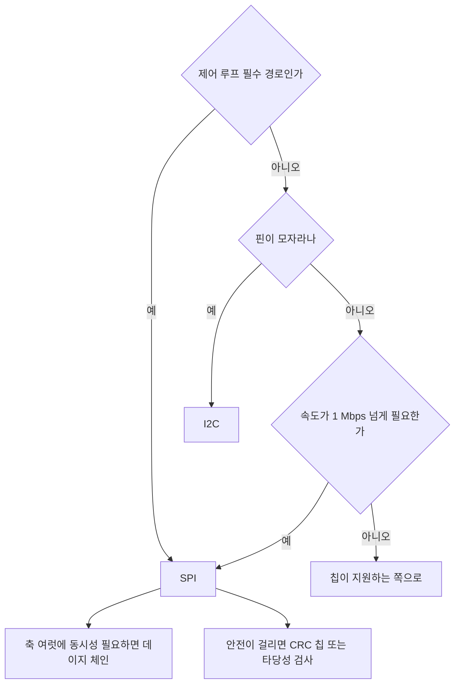

> **기준 출처:** 01편부터 08편까지의 출처를 종합한다. NXP UM10204, TI SLVA020 / 확인일 2026-08-03
> **시리즈:** [목차](/posts/00-comm-series/) | 이전 → [08. DMA와 인터럽트](/posts/08-spi-dma-interrupt-cost/) | 다음 → [10. 센서 드라이버 만들기](/posts/10-spi-i2c-sensor-driver/)

---

## 1. 한 장 비교

| | I²C | SPI |
| --- | --- | --- |
| 선 수 | 2 (SDA, SCL) | 3 에 슬레이브당 CS 1 |
| 슬레이브 N개일 때 핀 | 2 | 3 + N |
| 속도 | 100 k, 400 k, 1 M, 3.4 M | 수십 MHz (실제 상한은 06편 계산) |
| 전송 방식 | 반이중 | 전이중 |
| 주소 지정 | 7비트 주소 | CS 핀으로 한다 |
| 오류 검출 | ACK 만 있고 무결성은 아니다 | 없다 |
| 흐름 제어 | 클럭 스트레칭이 있다 | 없다 |
| 멀티마스터 | 중재를 지원한다 | 사실상 불가능하다 |
| 버스 행 위험 | 있다 | 없다. CS 가 초기화한다 |
| 지터 | 스트레칭과 중재로 변동한다 | 거의 없다 |
| 거리 | 약 1 m 지만 실제로는 보드 안이다 | 수십 cm |
| 오버헤드 | 주소와 ACK 로 바이트당 약 11% | 0% |
| 규격서 | UM10204 가 있다 | 없다. 데이터시트가 규격이다 |
| 프로토콜 복잡도 | 중간이다 | 최소다 |

## 2. 선택 트리



### 실무의 기본 분업

I²C 는 진단과 설정, SPI 는 제어다.

| 용도 | 인터페이스 | 이유 |
| --- | --- | --- |
| 엔코더 (또는 BiSS-C, EnDat) | SPI 계열 | 지터가 없고 빠르다 |
| 전류 센싱 ADC | SPI | 주기마다 빠르게 읽어야 한다 |
| 게이트 드라이버 진단과 설정 | SPI 나 I²C | 칩이 정하는 대로 한다 |
| 온도 센서 | I²C | 느려도 되고 핀을 아낀다 |
| EEPROM (보드 ID, 캘리브레이션) | I²C | 부팅 때만 읽는다 |
| 전원 관리 IC | I²C | 표준적으로 I²C 다 |
| 시리얼 플래시 (펌웨어) | SPI 나 QSPI | 대용량이고 고속이다 |

## 3. 결정을 뒤집는 세 가지 사정

### 칩이 하나만 지원한다

가장 흔한 이유다. 원하는 성능의 센서가 I²C 만 지원하면 선택의 여지가 없다. 부품 선정이 통신 선정을 결정한다.

부품 선정 단계에서 통신 방식을 같이 검토해야 하는 이유가 이것이다. 나중에 이 센서는 I²C 라 제어 루프에 못 넣는다는 걸 발견하면 보드를 다시 만들어야 한다.

### 주소 충돌

같은 칩 여러 개를 I²C 로 달려는데 주소 핀이 부족하면 SPI 로 가거나 멀티플렉서를 넣는다. 회로도 검토에서 잡아야 하는 항목이다.

### 격리와 거리

둘 다 보드 안 전제라 커넥터를 넘어가야 하면 둘 다 부적합하다.

| 거리 | 선택 |
| --- | --- |
| 같은 보드, 약 20 cm | SPI 나 I²C |
| 보드 간, 커넥터 하나에 약 50 cm | SPI 를 차동 버퍼와 함께 쓴다. I²C 는 권하지 않는다 |
| 케이블 1 m 이상 | 둘 다 안 된다. RS-422/485 나 엔코더 인터페이스, CAN 으로 간다 |

엔코더가 딱 이 경계에 있다. 모터 뒤쪽까지 1~3 m 를 가야 하는데 SPI 로는 [06편](/posts/06-spi-modes-cpol-cpha/)의 계산상 무리다. 그래서 차동과 CRC 와 지연 보상을 얹은 SSI, BiSS-C, EnDat 가 존재한다.

## 4. 두 인터페이스를 한 시스템에서 쓸 때

실제 보드는 대개 둘 다 있다.

| 항목 | 주의 |
| --- | --- |
| 제어 루프 안의 I²C | 타임아웃이 필수이고 재시도는 금지하며 실패 시 직전 값을 유지한다 |
| 부팅 순서 | I²C 복구 절차, I²C 초기화, SPI 초기화, 슬레이브 설정 순이다 |
| 우선순위 | SPI DMA 완료 인터럽트를 I²C 인터럽트보다 높게 둔다. 제어가 우선이다 |
| 진단 로그 | 부팅 시 I²C 스캔과 SPI 슬레이브 디바이스 ID 확인을 남긴다 |
| 실패 카운터 | 둘 다 별도로 센다. 어느 쪽이 나쁜지 구분되어야 한다 |

```cpp
// 부팅 진단. 이걸 남겨두면 현장에서 원인 파악이 빨라진다
void boot_diagnostics(II2cBus& i2c, ISpiBus& spi) {
    // I²C 는 버스가 살아 있는지부터 본다
    const auto rec = recover_i2c_bus(pins);
    if (rec != RecoveryResult::AlreadyIdle)
        log_warn("I2C bus was not idle at boot: %d", static_cast<int>(rec));
    i2c_scan(i2c);                                     // 어떤 주소가 응답하나

    // SPI 는 각 슬레이브의 디바이스 ID 를 확인한다. 데이지 체인 순서도 같이 검증된다
    for (std::size_t i = 0; i < kAxisCount; ++i) {
        const auto id = read_device_id(spi, i);
        if (id != kExpectedEncoderId)
            log_error("axis %zu: unexpected device id 0x%04X", i, id);
    }
}
```

## 5. 여섯 칸 채우기

[기초 01편](/posts/01-basics-what-comm-solves/)의 표를 이 폴더의 내용으로 채우면 이렇게 된다.

| | I²C | SPI |
| --- | --- | --- |
| ① 도달 | 오픈 드레인과 풀업, $C_b \le 400$ pF | 푸시풀, 보드 안 |
| ② 동기 | SCL 클럭선 (동기식) | SCLK 클럭선 (동기식), CPOL 과 CPHA 로 엣지 선택 |
| ③ 경계 | START 와 STOP (대역 밖 표식) | CS 핀 (대역 밖에 고정 길이) |
| ④ 무결 | ACK 만 있고 무결성은 아니다 | 없다 |
| ⑤ 조정 | 주소 지명, 와이어드 AND 중재, 클럭 스트레칭 | 마스터가 CS 로 전부 결정한다 |
| ⑥ 시간 | 스트레칭과 중재로 변동하고 버스 행 위험이 있다 | 지터가 거의 없다 |

④ 칸이 둘 다 비어 있다는 게 이 폴더의 가장 중요한 결론이다. 다음 폴더부터는 이 칸이 채워지기 시작한다.

| 폴더 | ④ 무결 칸의 답 |
| --- | --- |
| 시리얼 | 패리티 1비트(약하다)에서 Modbus 의 CRC-16, 엔코더의 BiSS-C CRC 로 간다 |
| CAN | CRC-15 와 5중 검사 |
| EtherCAT | CRC-32 와 WKC 와 포트별 카운터 |

거리가 멀어지고 안전이 걸릴수록 ④에 돈을 쓴다. 기초 01편에서 예고한 그대로다.

## 정리

- 핀을 아끼면 I²C, 시간을 아끼면 SPI 다.
- 실무 분업은 I²C 가 진단과 설정, SPI 가 제어다.
- 제어 루프의 필수 경로에는 SPI 를 쓴다. 지터가 없고 버스 행이 없고 빠르다.
- 축이 여럿이고 동시성이 필요하면 SPI 데이지 체인을 쓴다.
- 결정을 뒤집는 것은 칩이 하나만 지원하는 경우(가장 흔하다)와 주소 충돌과 거리다.
- 케이블 1 m 이상이면 둘 다 안 된다. 차동 시리얼이나 엔코더 인터페이스로 간다.
- 제어 루프 안의 I²C 는 타임아웃이 필수이고 재시도는 금지한다.
- 부팅 진단을 남기면 현장 원인 파악이 빨라진다.
- 이 폴더의 결론은 SPI 와 I²C 가 ④ 무결성 칸이 비어 있다는 것이다. 다음 폴더들이 그 칸을 채우는 이야기다.

## 참고

- [NXP UM10204 — I²C-bus specification and user manual](https://www.nxp.com/docs/en/user-guide/UM10204.pdf)
- [TI SLVA020 — Introduction to the Serial Peripheral Interface](https://www.ti.com/lit/an/slva020a/slva020a.pdf)
