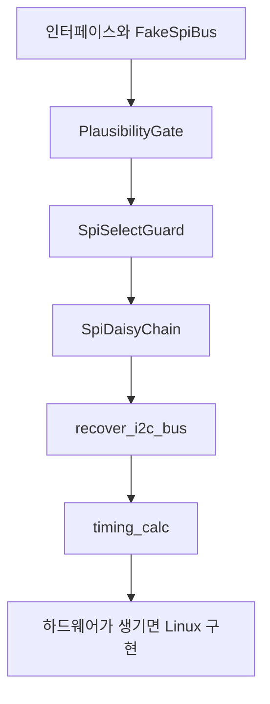

> **기준 출처:** 01편부터 09편까지를 코드로 옮긴 것이라 새 출처가 없다. I²C 복구 절차는 NXP UM10204 §3.1.16 / 확인일 2026-08-03
> **시리즈:** [목차](/posts/00-comm-series/) | 이전 → [09. SPI 와 I²C 선택 기준](/posts/09-spi-vs-i2c-selection/)

---

## 1. 무엇을 만드나

이 폴더의 결론은 SPI 와 I²C 에 오류 검출이 없다는 것이었다. 그래서 예제의 목표도 거기서 나온다. 하드웨어 없이도 오류 검출이 없는 버스를 어떻게 안전하게 쓰는가를 검증할 수 있는 코드를 만든다.

| 만들 것 | 근거 |
| --- | --- |
| `ISpiBus` 와 `II2cBus` 인터페이스에 fake 구현 | [05편](/posts/05-spi-clock-master/), [02편](/posts/02-i2c-two-wires-addressing/) |
| `SpiSelectGuard`, CS 를 RAII 로 다룬다 | [05편](/posts/05-spi-clock-master/) |
| `PlausibilityGate`, 값 타당성 검사 | [01편](/posts/01-spi-i2c-why-onboard/) |
| `SpiDaisyChain`, 순서 뒤집기 | [07편](/posts/07-spi-multislave-cs-daisy/) |
| `recover_i2c_bus()`, 9클럭 복구 | [04편](/posts/04-i2c-failure-modes-recovery/) |
| `compute_max_spi_clock()`, 타이밍 계산 | [06편](/posts/06-spi-modes-cpol-cpha/) |

## 2. 패키지 구조

```text
comm-examples/
└── comm_spi/
    ├── include/comm_spi/
    │   ├── spi_bus.hpp          ISpiBus 와 SpiSelectGuard
    │   ├── i2c_bus.hpp          II2cBus
    │   ├── i2c_recovery.hpp     9클럭 복구
    │   ├── daisy_chain.hpp      데이지 체인
    │   ├── plausibility.hpp     타당성 검사
    │   └── timing_calc.hpp      최대 클럭 계산
    ├── src/
    │   ├── linux_spi_bus.cpp    /dev/spidev (실물)
    │   └── linux_i2c_bus.cpp    /dev/i2c-*  (실물)
    └── test/
        ├── fake_spi_bus.hpp     하드웨어 대역
        ├── daisy_chain_test.cpp
        ├── plausibility_test.cpp
        ├── i2c_recovery_test.cpp
        └── timing_calc_test.cpp
```

`src/` 는 실물용이고 `test/` 는 fake 다. 인터페이스가 둘을 갈라놓아서 테스트는 하드웨어 없이 돌고 실물 코드는 테스트와 같은 인터페이스를 쓴다.

## 3. Fake 버스가 하드웨어를 대신한다

```cpp
// test/fake_spi_bus.hpp
// 실제 SPI 슬레이브를 흉내낸다. 시나리오를 주입해 예외 상황까지 검증한다.
class FakeSpiBus : public ISpiBus {
public:
    // 다음 transfer 에서 MISO 로 돌려줄 값
    void queue_response(std::span<const std::uint8_t> bytes) {
        responses_.emplace_back(bytes.begin(), bytes.end());
    }
    // 오류 주입. 실물로는 만들기 어려운 상황을 테스트한다
    void inject_bit_flip(std::size_t byte_index, std::uint8_t mask) {
        flip_ = {byte_index, mask};
    }
    void set_fail_next(bool v) { fail_next_ = v; }

    bool transfer(std::span<const std::uint8_t> tx, std::span<std::uint8_t> rx) override {
        sent_.emplace_back(tx.begin(), tx.end());          // 무엇을 보냈는지 기록한다
        if (fail_next_) { fail_next_ = false; return false; }
        if (responses_.empty()) { std::fill(rx.begin(), rx.end(), 0); return true; }

        auto r = responses_.front(); responses_.pop_front();
        std::copy_n(r.begin(), std::min(r.size(), rx.size()), rx.begin());
        if (flip_ && flip_->first < rx.size()) rx[flip_->first] ^= flip_->second;
        flip_.reset();
        return true;
    }
    void select()   override { ++select_count_; selected_ = true; }
    void deselect() override { selected_ = false; }

    const auto& sent() const { return sent_; }
    std::size_t select_count() const { return select_count_; }
    bool is_selected() const { return selected_; }

private:
    std::deque<std::vector<std::uint8_t>> responses_, sent_;
    std::optional<std::pair<std::size_t, std::uint8_t>> flip_;
    bool fail_next_{false}, selected_{false};
    std::size_t select_count_{0};
};
```

`inject_bit_flip()` 이 이 예제의 핵심이다. 01편에서 SPI 는 비트가 뒤집혀도 아무도 모른다고 했는데, 그 상황을 실제로 만들어서 타당성 검사가 잡아내는지 확인할 수 있다.

## 4. 무엇을 검증하나

### 타당성 검사가 실제로 이상값을 걸러내는가

```cpp
// test/plausibility_test.cpp
TEST(PlausibilityGate, RejectsPhysicallyImpossibleJump) {
    // 01편의 계산: 20bit 엔코더, 6000 rpm, 1 kHz 라 한 주기 최대 104858 카운트
    PlausibilityGate gate{104858};

    EXPECT_TRUE(gate.check(500'000).has_value());          // 첫 값은 통과
    EXPECT_TRUE(gate.check(510'000).has_value());          // 정상 변화
    EXPECT_FALSE(gate.check(900'000).has_value());         // 물리적으로 불가능하니 거부
    EXPECT_EQ(gate.rejects(), 1u);
}

TEST(PlausibilityGate, CatchesInjectedBitFlip) {
    FakeSpiBus bus;
    EncoderReader reader{bus, PlausibilityGate{104858}};

    bus.queue_response(encode_position(500'000));
    ASSERT_TRUE(reader.read());

    // 최상위 바이트의 비트를 뒤집는다. SPI 는 이걸 잡지 못한다
    bus.queue_response(encode_position(500'000));
    bus.inject_bit_flip(0, 0x80);
    EXPECT_FALSE(reader.read());                           // 타당성 검사가 잡아낸다
    EXPECT_EQ(reader.rejects(), 1u);
}
```

두 번째 테스트가 01편의 주장을 증명한다. CRC 가 없으니 소프트웨어로 방어해야 한다는 말을 코드로 확인한다.

### 데이지 체인의 순서가 맞는가

```cpp
// test/daisy_chain_test.cpp
// 07편의 경고: 순서를 잘못 잡으면 축 1의 값을 축 6에 쓴다
TEST(SpiDaisyChain, CommandOrderIsReversedOnWire) {
    FakeSpiBus bus;
    SpiDaisyChain<3, 2> chain{bus};

    std::array<std::uint8_t, 6> cmds{0xA0,0xA1, 0xB0,0xB1, 0xC0,0xC1};  // 슬레이브 0,1,2
    std::array<std::uint8_t, 6> replies{};
    chain.exchange(cmds, replies);

    // 가장 먼 슬레이브인 2번의 명령이 먼저 나가야 한다
    const auto& wire = bus.sent().front();
    EXPECT_EQ(wire[0], 0xC0); EXPECT_EQ(wire[1], 0xC1);   // 슬레이브 2
    EXPECT_EQ(wire[2], 0xB0); EXPECT_EQ(wire[3], 0xB1);   // 슬레이브 1
    EXPECT_EQ(wire[4], 0xA0); EXPECT_EQ(wire[5], 0xA1);   // 슬레이브 0
}

TEST(SpiDaisyChain, RepliesMapBackToCorrectSlave) {
    // 07편의 검증 요령: 고유한 값으로 확인한다.
    // 위치 값처럼 비슷한 숫자로는 뒤바뀜을 알아볼 수 없다.
    FakeSpiBus bus;
    SpiDaisyChain<3, 2> chain{bus};
    bus.queue_response({0xC0,0xC1, 0xB0,0xB1, 0xA0,0xA1});   // 물리 순서로 돌아온다

    std::array<std::uint8_t, 6> cmds{}, replies{};
    chain.exchange(cmds, replies);
    EXPECT_EQ(replies[0], 0xA0);   // 슬레이브 0 의 응답이 replies[0] 에 온다
    EXPECT_EQ(replies[2], 0xB0);
    EXPECT_EQ(replies[4], 0xC0);
}
```

### CS 가 RAII 로 확실히 해제되는가

```cpp
TEST(SpiSelectGuard, DeselectsEvenOnEarlyReturn) {
    FakeSpiBus bus;
    auto f = [&]() -> bool {
        SpiSelectGuard g{bus};
        EXPECT_TRUE(bus.is_selected());
        return false;                       // 중간에 빠져나간다
    };
    f();
    EXPECT_FALSE(bus.is_selected());        // CS 가 확실히 올라갔다
}
```

### I²C 복구 절차가 규격대로인가

```cpp
// test/i2c_recovery_test.cpp
TEST(I2cRecovery, SendsUpToNineClocksUntilSdaReleased) {
    FakeI2cPins pins;
    pins.hold_sda_low_for_clocks(5);        // 슬레이브가 5클럭 뒤에 놓는다
    EXPECT_EQ(recover_i2c_bus(pins), RecoveryResult::Recovered);
    EXPECT_EQ(pins.scl_pulses(), 5);        // 필요한 만큼만 낸다
    EXPECT_TRUE(pins.stop_condition_generated());   // STOP 으로 마무리한다
}

TEST(I2cRecovery, ReportsSclStuckWithoutTryingClocks) {
    FakeI2cPins pins;
    pins.force_scl_low();                   // 슬레이브가 클럭을 붙잡고 있다
    EXPECT_EQ(recover_i2c_bus(pins), RecoveryResult::SclStuck);
    EXPECT_EQ(pins.scl_pulses(), 0);        // 할 수 있는 게 없으니 전원 리셋이 필요하다
}
```

### 타이밍 계산이 맞는가

```cpp
// test/timing_calc_test.cpp — 06편의 계산을 코드로
TEST(SpiTiming, MaxClockOnBoard) {
    // 배선 5cm, t_v 25ns, t_su 5ns, 여유 5ns
    const auto f = compute_max_spi_clock({.cable_m = 0.05, .prop_ns_per_m = 6.7,
                                          .slave_valid_ns = 25, .master_setup_ns = 5,
                                          .margin_ns = 5});
    EXPECT_NEAR(f / 1e6, 14.0, 1.0);        // 약 14 MHz
}

TEST(SpiTiming, TwoMeterCableCollapsesMaxClock) {
    const auto f = compute_max_spi_clock({.cable_m = 2.0, .prop_ns_per_m = 5.0,
                                          .slave_valid_ns = 50, .master_setup_ns = 10,
                                          .margin_ns = 10});
    EXPECT_NEAR(f / 1e6, 5.5, 0.5);         // 약 5.5 MHz
}
```

마지막 테스트가 06편의 결론을 숫자로 못박는다. 케이블 2 m 면 14 MHz 가 5.5 MHz 로 떨어진다. 이게 BiSS-C 가 존재하는 이유였다.

## 5. 실물 구현

```cpp
// src/linux_spi_bus.cpp
#include <linux/spi/spidev.h>
#include <sys/ioctl.h>

bool LinuxSpiBus::open(const char* dev, const SpiConfig& cfg) {
    fd_ = ::open(dev, O_RDWR);
    if (fd_ < 0) return false;
    std::uint8_t  mode = cfg.mode;                      // 06편의 CPOL 과 CPHA
    std::uint32_t hz   = cfg.clock_hz;
    std::uint8_t  bits = cfg.bits_per_word;
    return ::ioctl(fd_, SPI_IOC_WR_MODE, &mode) >= 0
        && ::ioctl(fd_, SPI_IOC_WR_MAX_SPEED_HZ, &hz) >= 0
        && ::ioctl(fd_, SPI_IOC_WR_BITS_PER_WORD, &bits) >= 0;
}

bool LinuxSpiBus::transfer(std::span<const std::uint8_t> tx, std::span<std::uint8_t> rx) {
    spi_ioc_transfer t{};
    t.tx_buf = reinterpret_cast<std::uintptr_t>(tx.data());
    t.rx_buf = reinterpret_cast<std::uintptr_t>(rx.data());
    t.len    = static_cast<std::uint32_t>(tx.size());
    t.cs_change = 0;                                     // 전송 중 CS 를 유지한다
    return ::ioctl(fd_, SPI_IOC_MESSAGE(1), &t) >= 0;
}
```

`cs_change = 0` 이 07편의 하드웨어 NSS 가 바이트마다 CS 를 올린다는 문제에 대응한다. 커널이 전송 중 CS 를 유지하게 한다. 라즈베리파이 등에서 시험할 때는 `/dev/spidev*` 접근 권한이 필요하다.

## 6. 만드는 순서



여섯 번째 단계까지가 전부 하드웨어 없이 된다. 실물은 마지막에 붙인다. 이 순서가 프로토콜 로직과 I/O 를 분리한다는 방침을 실제로 가능하게 한다.

## 정리

- 이 폴더의 결론인 오류 검출이 없다는 사실이 예제의 목표를 정한다. 검출이 없는 버스를 안전하게 쓰는 법이다.
- `FakeSpiBus` 의 `inject_bit_flip()` 으로 01편의 문제 상황을 실제로 만들어 타당성 검사를 검증한다.
- 검증은 다섯 가지다. 타당성 검사가 불가능한 점프와 주입된 비트 뒤집힘을 걸러내는가, 데이지 체인 순서가 맞는가, CS 가 RAII 로 중간 이탈에서도 해제되는가, I²C 9클럭 복구가 규격대로 동작하고 SCL 고정은 구분하는가, 타이밍 계산이 06편의 숫자를 재현하는가다.
- 데이지 체인 순서는 고유값으로 검증한다. 비슷한 숫자로는 뒤바뀜을 보지 못한다.
- 실물은 `/dev/spidev` 에 `cs_change = 0` 을 쓴다.
- 여섯 단계가 전부 하드웨어 없이 된다. 실물은 마지막에 붙인다.

## 참고

- [NXP UM10204 — I²C-bus specification and user manual](https://www.nxp.com/docs/en/user-guide/UM10204.pdf)
- [Linux 커널 — spidev 인터페이스](https://www.kernel.org/doc/html/latest/spi/spidev.html)
- [GoogleTest](https://google.github.io/googletest/)
