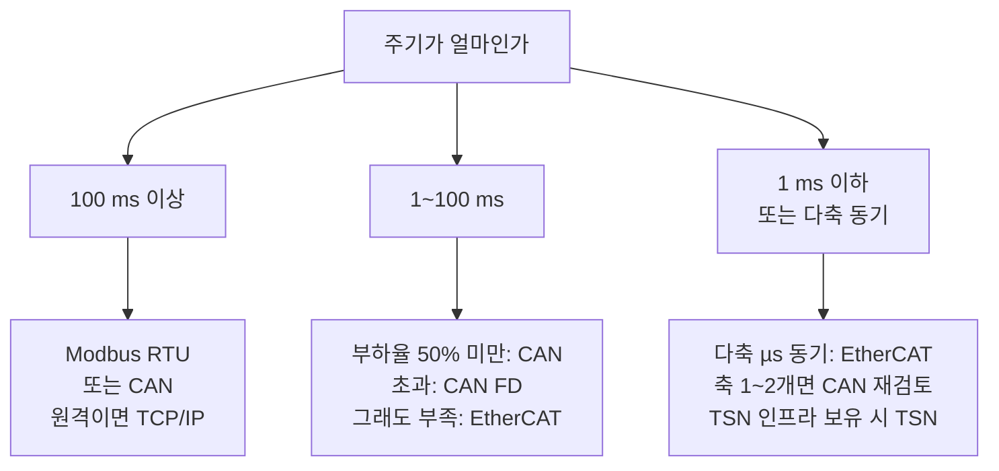

> **기준 출처:** 앞 폴더들의 결론을 종합한 것. 계산의 근거는 [기초 10편](/posts/10-basics-realtime-jitter/), [CAN 10편](/posts/10-can-bandwidth-worst-case/), [EtherCAT 02편](/posts/02-on-the-fly-processing/) / 확인일 2026-08-03
> **시리즈:** [목차](/posts/00-comm-series/) | 이전 → [01. 한 장 비교표](/posts/01-protocol-comparison-table/) | 다음 → [03. 계층 대응표](/posts/03-layer-mapping-table/)

## 1. 순서가 중요하다

"어느 프로토콜이 좋은가" 로 시작하면 안 된다. 요구사항에서 출발해야 한다.

1. 제어 대역폭 $\omega_c$ 를 정한다. 제어 설계에서 나온다
2. 지연 예산 $\tau \lesssim 0.3/\omega_c$ 를 계산한다
3. 샘플 주기 $T_s$ 를 정한다. ZOH가 $T_s/2$ 를 차지한다
4. 노드 수와 데이터 크기를 센다
5. 3번과 4번을 만족하는 프로토콜 후보를 고른다
6. 그중 가장 단순한 것을 고른다
7. 계산으로 확인하고 시제품으로 실측한다

6번이 중요하다. 가능한 것 중 가장 단순한 것이다. "EtherCAT가 되니까 EtherCAT" 은 나쁜 선택이다. 슬레이브에 ESC 칩이 필요하고 개발이 복잡하고 비용이 든다.

## 2. 선택 트리

### 같은 보드 위 (30 cm 미만)

제어 루프의 필수 경로인가(엔코더, 전류 ADC)를 먼저 묻는다. 그렇다면 SPI다. 축이 여럿이고 동시성이 필요하면 SPI 데이지 체인을 쓰고, CRC가 없는 게 걱정이면 칩의 CRC 기능이나 타당성 검사를 붙인다.

필수 경로가 아니면(온도, EEPROM, 전원 IC) 핀이 모자랄 때 I²C, 여유 있고 빠른 게 좋으면 SPI다.

### 같은 장비 안, 커넥터를 넘는다 (0.3~3 m)

엔코더 피드백이면 새로 고를 때 BiSS-C(개방, CRC, 지연 보상)가 낫고, HEIDENHAIN 생태계면 EnDat이고, 이미 정해져 있으면 그것에 타당성 검사를 붙인다.

일반 장치면 RS-422/485나 CAN이다.

### 장비 간, 캐비닛 간 (3 m 이상)

주기가 얼마인지로 갈린다.



## 3. 판단 기준 세 가지

### ① 대역폭이 되나

$$\text{부하율} = \sum_i \frac{C_i}{T_i}$$

| 프로토콜 | $C$ (8바이트 프레임) | 권장 부하율 |
| --- | --- | --- |
| Modbus RTU 115200 | 약 2 ms/트랜잭션 | 폴링이라 해당 없음 |
| CAN 500 kbps | 270 µs | 50% 미만 |
| CAN 1 Mbps | 135 µs | 50% 미만 |
| CAN FD (2 Mbps 데이터) | 약 90 µs | 50% 미만 |
| EtherCAT | 프레임 하나에 전부 | 사이클의 30% 미만 |

### ② 최악 지연이 예산 안에 드나

| | 최악 지연 |
| --- | --- |
| Modbus | 폴링 한 바퀴 (노드 수 × 트랜잭션) |
| CAN | 블로킹 + 간섭 + 전송 (CAN 10편의 반복 계산) |
| 표준 이더넷 | 계산 불가 |
| EtherCAT | 프레임 시간 + 통과 지연 + 마스터 지터 |

### ③ 동시성이 필요한가

| 필요 수준 | 방법 |
| --- | --- |
| 불필요 | 아무거나 |
| 약 100 µs | CANopen SYNC |
| 약 30 µs | SPI 데이지 체인 (보드 안) |
| 1 µs 미만 | EtherCAT DC |

③이 EtherCAT를 요구하는 가장 흔한 이유다. 대역폭은 CAN FD로도 되는 경우가 많은데 동시성은 대체재가 없다.

## 4. 로봇 시스템의 전형적 구성

하나로 다 하지 않는다. 층마다 다른 것을 쓴다.

| 층 | 프로토콜 | 왜 |
| --- | --- | --- |
| 상위(PC)에서 제어기로 | TCP/IP | 급하지 않고 원격이 필요하고 표준 도구가 많다 |
| 제어기에서 드라이브로 | EtherCAT | 다축 동기와 1 kHz |
| 제어기에서 주변장치로 | CAN | 이벤트 방송, 저렴, 멀티마스터 |
| 드라이브에서 엔코더로 | BiSS-C 또는 EnDat | 차동, CRC, 지연 보상 |
| 드라이브 보드 안 | SPI, I²C | 짧고 빠르고 싸다 |

상위 PC에서 ROS 2로 궤적을 생성하고 TCP/IP로 실시간 제어기에 넘긴다. 제어기는 RT 커널 위에서 EtherCAT로 6축 서보 드라이브를 1 kHz DC 동기로 돌리고, 동시에 CAN으로 그리퍼와 힘센서와 안전 I/O를 10~100 Hz로 다룬다. 각 드라이브는 BiSS-C나 EnDat으로 엔코더를 읽고, 드라이브 보드 안에서는 SPI로 전류 ADC와 게이트 드라이버를, I²C로 온도와 EEPROM을 다룬다.

CAN과 EtherCAT는 경쟁이 아니라 역할 분담이라는 말이 여기서 그림이 된다. 그리고 EoE로 TCP/IP를 EtherCAT 케이블 위에 터널링할 수도 있다. 배선을 줄이고 싶으면 고려한다.

## 5. 판단을 뒤집는 것들

이론상 최적이어도 현실이 뒤엎는 경우들이다.

| 요인 | 영향 |
| --- | --- |
| 부품이 그것만 지원한다 | 가장 흔한 이유다. 원하는 성능의 드라이브가 EtherCAT만 지원하면 선택의 여지가 없다 |
| 기존 시스템과의 호환 | 이미 CANopen인 라인에 EtherCAT 장비를 넣으려면 게이트웨이가 필요하다 |
| 팀의 경험 | 처음 쓰는 프로토콜은 개발과 디버깅 시간이 몇 배 든다 |
| 인증과 규격 요구 | 의료나 안전 분야는 인증된 스택을 요구할 수 있다 |
| 비용 | ESC 칩과 커넥터와 케이블. 노드가 많으면 무시 못 한다 |
| 공급 안정성 | 특정 칩 단종 위험 |
| 유지보수 | 현장 엔지니어가 다룰 수 있나 |

첫 번째가 압도적으로 흔하다. 실무에서 프로토콜 선택은 대개 부품 선정의 결과이지 독립적 결정이 아니다.

그래서 부품 선정 단계에서 통신 방식을 같이 검토해야 한다. 나중에 "이 센서는 I²C라 제어 루프에 못 넣는다" 를 발견하면 보드를 다시 만들어야 한다.

## 6. 선택을 문서로 남긴다

결정의 근거를 남기지 않으면 6개월 뒤에 아무도 왜 그랬는지 모른다.

```markdown
## 통신 방식 결정: 관절 축 제어

### 요구사항
- 제어 대역폭: 200 rad/s (약 32 Hz)
- 지연 예산: 0.3/200 = 1.5 ms
- 축 수: 6, 확장 계획 8
- 축당 데이터: 입력 12 B (Statusword, Position, Velocity)
              출력 6 B (Controlword, Target position)
- 다축 동시성: 필요 (말단 직선 궤적)
- 환경: 캐비닛에서 관절까지 케이블 총 20 m, 모터 노이즈 있음

### 후보 검토
| 후보 | 대역폭 | 최악지연 | 동시성 | 판정 |
| CAN 1 Mbps | 부하율 162% | | | 대역폭 부족 |
| CAN FD 2 Mbps | 부하율 약 60% | 계산 가능 | SYNC 로 수십 µs | 동시성 부족 |
| EtherCAT | 25 µs (2.5%) | 계산 가능 | DC 1 µs 미만 | 채택 |

### 결정
EtherCAT (CoE + CiA 402, CSP 모드, DC 동기, 사이클 1 ms)

### 대가로 받아들인 것
- 슬레이브에 ESC 칩 필요 → 드라이브를 EtherCAT 지원 제품으로
- 마스터에 RT 커널 필요 → PREEMPT_RT + CPU 격리
- 스위치 사용 불가, 토폴로지 고정

### 검증 계획
- 시제품에서 사이클 지터 실측 (cyclictest + GPIO)
- 축 12개로 확장 시 재계산 (46 µs 예상)
```

"대가로 받아들인 것" 절이 특히 중요하다. 나중에 "왜 스위치를 못 쓰지" 라는 질문이 나왔을 때 답이 문서에 있다.

이런 문서를 ADR(Architecture Decision Record)이라 부르기도 한다. 형식은 자유지만 요구사항, 후보, 근거, 대가 네 절은 있어야 한다.

## 7. 시제품 검증 항목

계산으로 후보를 좁혔으면 반드시 실측한다.

| 항목 | 방법 |
| --- | --- |
| 최악 지연 | GPIO 토글과 오실로스코프 (persistence 모드) |
| 지터 히스토그램 | 애플리케이션에서 누적, 최댓값과 꼬리 |
| 부하율 | CAN은 `canbusload`, EtherCAT는 프레임 시간 계산과 실측 |
| 노이즈 내성 | 모터를 실제로 돌리면서 오류 카운터 확인 |
| 케이블 뽑기 | 워치독이 동작하나 |
| 장시간 안정성 | 수 시간에서 수일 연속 운전, 카운터 추세 |
| 최악 조건 | 부하를 준 상태, 온도가 오른 상태 |

"모터를 구동한 상태에서" 가 핵심이다. 정지 상태에서 잘 되던 통신이 모터를 구동하면 깨지는 게 [기초 11편](/posts/11-basics-noise-ground-isolation/)의 주제였다. 온도도 마찬가지다. [시리얼 02편](/posts/02-uart-baud-error-budget/)에서 본 발진자 드리프트와 커넥터 열팽창은 시간이 지나야 나타난다.

## 정리

- 순서는 제어 대역폭, 지연 예산, 샘플 주기, 데이터량, 후보, 가장 단순한 것, 검증이다
- "가능한 것 중 가장 단순한 것" 을 고른다. EtherCAT가 되니까 EtherCAT은 나쁜 선택이다
- 판단 기준 셋: 대역폭(부하율 50% 미만), 최악 지연(예산 안), 동시성
- 동시성이 EtherCAT를 요구하는 가장 흔한 이유다. 대역폭은 대체재가 있지만 동시성은 없다
- 로봇은 층마다 다른 것을 쓴다. TCP/IP(상위), EtherCAT(축), CAN(주변), BiSS-C(엔코더), SPI/I²C(보드 안)
- 판단을 뒤집는 1순위는 "부품이 그것만 지원한다" 다. 프로토콜 선택은 대개 부품 선정의 결과다
- 그래서 부품 선정 단계에서 통신을 같이 검토한다
- 결정을 문서로 남긴다. 요구사항, 후보 검토, 결정, 대가로 받아들인 것, 검증 계획
- 시제품 검증은 모터를 구동한 상태에서 부하를 주고 장시간 한다

## 참고

- [ETG — EtherCAT Technology](https://www.ethercat.org/en/technology.html)
- [Linux SocketCAN](https://www.kernel.org/doc/html/latest/networking/can.html)
- [BiSS Interface (iC-Haus)](https://www.biss-interface.com/)
