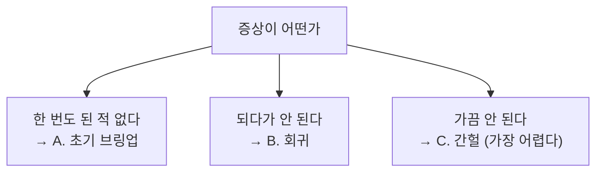

> **기준 출처:** 앞 폴더들의 진단 절차를 종합한 것 / 확인일 2026-08-03
> **시리즈:** [목차](/posts/00-comm-series/) | 이전 → [04. 공통 실패 패턴 10가지](/posts/04-common-failure-patterns/)

## 0. 시작하기 전에, 세 가지 질문

도구를 꺼내기 전에 이것부터 묻는다.

| # | 질문 | 왜 |
| --- | --- | --- |
| ① | 한 번도 된 적이 없나, 되다가 안 되나 | 설정 문제와 물리·환경 문제로 갈린다 |
| ② | 언제 깨지나 | 모터? 온도? 케이블을 만지면? 콘센트를 바꾸면? |
| ③ | 최근에 무엇이 바뀌었나 | 코드? 케이블? 부품? 배치? 펌웨어? |

①이 진단 경로를 완전히 가른다.

## A. 한 번도 된 적이 없다, 초기 브링업

### A1. 물리 (도구 없이 또는 멀티미터)

- 전원이 들어와 있나 (트랜시버 VCC 포함)
- GND가 이어져 있나
- TX와 RX가 뒤바뀌지 않았나 (RS-232는 널모뎀)
- 전원 끄고 종단 저항 측정. CAN과 RS-485는 60 Ω
- idle 전압 확인. RS-232 TXD는 −5에서 −12 V, RS-485 A−B는 +200 mV 초과(페일세이프), CAN은 CANH와 CANL이 약 2.5 V, I²C는 SDA와 SCL 둘 다 VDD
- 케이블 종류가 맞나 (차폐, Cat5e 이상, 크로스 여부)
- 스터브가 짧은가

### A2. 설정

- 보율이나 비트레이트가 양쪽 같나
- 보율을 실측했나 (`0x55` 반복과 오실로스코프)
- 프레임 설정 (8N1, 8E1, SPI 모드)
- 주소 (I²C 7/8비트, Modbus 슬레이브, CAN ID)
- CAN이면 샘플 포인트가 모든 노드에서 같나
- EtherCAT이면 NIC 이름과 권한(CAP_NET_RAW), 전용 NIC인가

### A3. 최소 확인

- 루프백 테스트 (내부에서 핀으로, 트랜시버로, 케이블로)
- 상대가 정말 보내고 있나 (오실로스코프로 확인)
- 스캔이 되나. I²C는 `i2cdetect`, CAN은 `candump` 로 아무 프레임이나 보이나, EtherCAT은 `slaveinfo` 로 몇 개가 보이나
- 예상 개수만큼 보이나. 몇 번째까지 보이나

마지막 줄이 EtherCAT의 특권이다. "3번째까지만 보인다" 면 3번과 4번 사이 케이블로 즉시 좁혀진다.

## B. 되다가 안 된다, 회귀

- 최근 변경을 되돌려 본다 (코드, 설정, 하드웨어)
- 특정 노드를 빼면 정상인가. 그렇다면 그 노드가 stuck-dominant이거나 DE를 안 내리거나 스터브가 길다
- 부품을 교체했나. 같은 부품번호여도 리비전이 다를 수 있다
- 펌웨어를 올렸나. ESI나 EDS 버전 불일치일 수 있다
- 케이블이나 커넥터를 만졌나
- 배치가 바뀌었나 (전력선과의 거리)

"특정 노드를 빼면 정상" 은 원시적이지만 확실한 방법이다. 노드가 많으면 이분 탐색으로 좁힌다.

## C. 가끔 안 된다, 간헐

여기서는 카운터가 전부다. 재현이 안 되므로 증거를 남겨야 한다.

### C1. 먼저 카운터를 켠다

| 프로토콜 | 켤 것 |
| --- | --- |
| UART | FE, ORE, PE, NE 카운터 |
| 파서 | resync 카운터 |
| CAN | `berr-reporting on` 으로 종류별 오류와 TEC/REC |
| EtherCAT | 포트별 RX Error, Forwarded, Lost Link |
| 공통 | 타임스탬프와 함께 추세를 기록 |

### C2. 상관관계를 찾는다

- 모터가 가속할 때인가 → 노이즈
- 브레이크가 풀릴 때인가 → 서지
- 특정 축이 움직일 때인가 → 그 케이블의 반복 굽힘
- 장비가 데워졌을 때인가 → 발진자나 커넥터 열팽창
- 부하가 높을 때인가 → 오버런이나 지터
- 특정 데이터 값일 때인가 → XON/XOFF나 스터핑
- 시간이 오래 지나면인가 → 카운터 오버플로나 드리프트

이 질문 하나가 맞으면 원인이 거의 특정된다. 그래서 로그에 타임스탬프와 시스템 상태(모터 속도, 온도)를 함께 남기는 게 중요하다.

### C3. 위치를 좁힌다

| 프로토콜 | 방법 |
| --- | --- |
| EtherCAT | RX Error가 있고 Forwarded가 없는 슬레이브의 그 포트 |
| CAN | 노드를 하나씩 떼며 재현, TEC가 오르는 노드 |
| RS-485 | 제3자 모니터로 전체 대화를 기록 |
| SPI, I²C | 로직 애널라이저 |

## 계층별 상세 절차

문제가 어느 층인지 안 잡히면 아래에서 위로 훑는다.

### ① 전기층

멀티미터로 전원, GND, 종단, idle 전압을 본다. 그다음 오실로스코프로 파형을 본다. 링잉이면 종단 문제, 진폭 저하면 종단 과다나 감쇠, 사다리꼴로 뭉개지면 케이블 용량, 전체가 출렁이면 공통모드 노이즈, dominant 고정이면 stuck-dominant 노드다. 배선도 확인한다. 전력선 이격, 차폐 접지, 트위스트다.

### ② 비트층

비트 폭을 실측하고(`0x55`) 오류 플래그를 종류별로 센다. FE가 지속되면 보율이나 프레임 설정이고, FE가 간헐이면 노이즈이고, ORE면 소프트웨어 문제이고, Stuff Error면 동기 문제이고, Bit Error면 물리계층이다. 발진자 종류(크리스탈인가 RC인가)와 CAN의 샘플 포인트와 Prop_Seg도 확인한다.

### ③ 프레임층

프레임이 조립되는지(파서의 resync 카운터), CRC가 맞는지 보고, 16진수로 원본 바이트를 찍어본다. 길이와 오프셋이 기대와 같은지, 엔디안이 맞는지 확인한다.

### ④ 프로토콜층

상태를 확인한다. CANopen NMT가 Operational인지, EtherCAT ESM이 OP인지와 AL Status Code를 본다. 매핑을 다시 읽어 비교하고, WKC나 ACK나 응답이 오는지 보고, SDO abort 코드와 타임아웃 설정을 확인한다.

### ⑤ 애플리케이션층

CiA 402 Statusword로 어느 상태인지 보고, 동작 모드(`0x6061`)가 기대값인지 확인하고, 목표값이 현재값으로 초기화됐는지 보고, 폴트 리셋이 상승 엣지인지 확인하고, 값이 물리적으로 타당한지 본다.

### ⑥ 실시간층

GPIO 토글과 오실로스코프로 주기를 실측하고, 지터 히스토그램의 최댓값을 보고, 부하를 준 상태에서 `cyclictest` 를 돌리고, 실시간 경로에 로깅이나 할당이나 락이나 SDO가 없는지 확인하고, DC 오차(`0x092C`)가 안정한지 본다.

## 도구 요약

| 도구 | 언제 | 비고 |
| --- | --- | --- |
| 멀티미터 | 전기층 | 가장 값싸고 가장 잘 듣는다 |
| 오실로스코프 | 전기, 비트, 실시간 | 파형, 비트 폭, GPIO 토글 |
| 로직 애널라이저 | 비트, 프레임 | 프로토콜 디코드. 디코드를 무조건 믿지 않는다 |
| `candump -l`, `canplayer` | CAN 전 층 | 기록과 재생. 간헐 문제의 결정타 |
| `canbusload` | CAN 대역폭 | |
| `slaveinfo` | EtherCAT 구성 | |
| `i2cdetect` | I²C 스캔 | |
| `stty -a` | 호스트 시리얼 | 설정이 실제로 먹었는지 확인 |
| `cyclictest`, `hwlatdetect` | 실시간층 | |
| 버스 모니터와 스니퍼 | 프레임, 프로토콜 | RS-485는 절대 송신 금지 |
| 코드에 심은 카운터 | 전 층 | 현장에서는 계측기를 못 꺼낸다 |

## 마지막 원칙

1. 아래층부터 위로. 1층이 안 되면 위층은 무의미하다
2. 한 번에 하나씩 바꾼다. 여러 개를 바꾸면 왜 됐는지 모른다
3. "언제 깨지나" 를 먼저 묻는다. 상관관계가 원인의 절반이다
4. 카운터를 남긴다. "가끔 이상하다" 를 숫자로 바꾼다
5. 계산은 시작점이고 실측이 결론이다
6. 오류 종류를 구분해서 센다. "통신 에러" 와 "Stuff Error 분당 40건" 은 다른 정보다
7. 예외 응답과 상태 이탈을 오류와 섞지 않는다. Modbus 예외 응답은 통신 성공이다

## 연재를 마치며

[기초 01편](/posts/01-basics-what-comm-solves/)에서 통신 문제를 여섯 개로 나눴다. 그 여섯 칸을 채우는 여정이었다.

기초에서 여섯 문제를 정의하고 공통 기초를 깔았다. SPI와 I²C는 ④(무결)가 비어 있는 세계였다. 시리얼에서 ④를 채웠고 ⑥은 엔코더만 해결됐다. CAN은 ④를 5중으로 만들고 ⑤를 물리계층에서 풀었지만 ⑥이 부족했다. 이더넷은 ①에서 ④까지는 훌륭한데 ⑤와 ⑥이 없었다. EtherCAT가 ①에서 ④를 물려받고 ⑤와 ⑥을 다시 만들었다. 그리고 종합에서 가로로 자르니 여덟 개의 반복 패턴이 보였다.

이제 처음 보는 프로토콜을 만나도 여섯 칸으로 읽을 수 있다. 그리고 "무엇을 중요하게 여겼고 무엇을 포기했나" 를 물으면 그 프로토콜의 정체가 나온다.

## 정리

- 시작 전 세 질문: 한 번도 된 적 없나 되다가 안 되나 가끔 안 되나, 언제 깨지나, 뭐가 바뀌었나
- 초기 브링업은 물리, 설정, 최소 확인(루프백과 스캔) 순서로 한다
- 회귀는 최근 변경을 되돌리고 노드를 하나씩 떼본다
- 간헐은 카운터를 켜고 상관관계를 찾고 위치를 좁힌다. EtherCAT은 포트 단위로 위치를 특정할 수 있다
- 계층별 절차는 전기, 비트, 프레임, 프로토콜, 애플리케이션, 실시간 순서다
- 멀티미터가 가장 값싸고 잘 듣는다. 오실로스코프는 그다음이다
- `candump -l` 과 `canplayer` 같은 기록과 재생이 간헐 문제의 결정타다
- 코드에 심은 카운터가 가장 오래 쓰인다. 현장에서는 계측기를 못 꺼낸다
- 일곱 원칙: 아래층부터, 하나씩, "언제", 카운터, 실측, 종류 구분, 예외를 오류와 섞지 않기

## 참고

- [Linux SocketCAN](https://www.kernel.org/doc/html/latest/networking/can.html)
- [Linux Foundation — PREEMPT_RT](https://wiki.linuxfoundation.org/realtime/start)
- [SOEM — Simple Open EtherCAT Master](https://github.com/OpenEtherCATsociety/SOEM)
