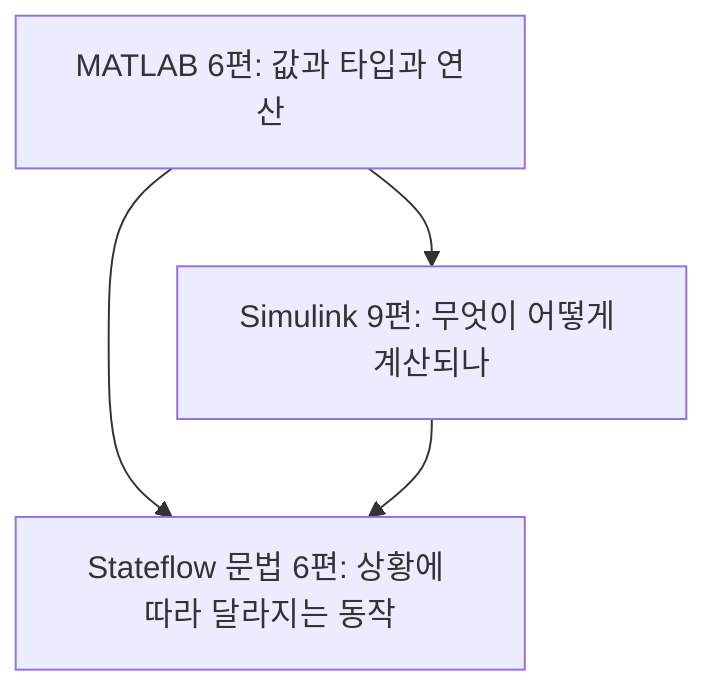

> **기준 출처:** [MathWorks MATLAB 문서](https://www.mathworks.com/help/matlab/) · [Simulink 문서](https://www.mathworks.com/help/simulink/) · [Stateflow 문서](https://www.mathworks.com/help/stateflow/) / 확인일 2026-08-07

세 도구는 따로 배우는 것이 아니라 한 화면 안에서 겹쳐서 나타난다.

```text
Simulink 블록 다이어그램
   +- 안에 Stateflow Chart 블록이 놓인다
        +- 그 안의 Action 은 MATLAB 문법으로 쓰인다
             +- 블록 파라미터 칸의 uint16(0) 이나 bin2dec('1111') 도 MATLAB 표현식이다
```

그래서 세 시리즈가 서로 이어진다. 비트 연산을 예로 들면 MATLAB `bitand`가 개념이고, Simulink Bitwise Operator가 블록이고, Stateflow Action이 사용처다.



대상 독자는 MATLAB을 한 번도 써 본 적 없는 사람이다. 사전 지식을 가정하지 않는다.

## 읽는 순서

급하지 않다면 아래 순서가 자연스럽다.

```text
matlab 01~03        값과 타입 (여기가 모든 것의 바닥)
   ↓
simulink 01         모델을 읽는 법
   ↓
matlab 04~06        비트 연산, 연산자, 내장 함수
   ↓
simulink 02~09      블록들
   ↓
stateflow 01~06     차트
```

모델을 급히 읽어야 한다면 simulink 01편과 06편(데이터 타입)과 07편(Data Store) 셋만 먼저 본다. 오독의 원인이 여기 몰려 있다.

MATLAB 코드를 C로 옮기는 작업이라면 matlab 03편(형 변환과 포화)과 06편(반올림과 나머지)을 먼저 본다. 두 편에 MATLAB과 C의 의미 차이가 모여 있다.

## 1부. MATLAB 언어 (6편)

| # | 글 | 언제 보나 |
| --- | --- | --- |
| 01 | [변수와 배열](/posts/01-matlab-variables-arrays/) | 가장 먼저 |
| 02 | [데이터 타입, 정수와 부동소수](/posts/02-data-types-int-float/) | 모델의 신호 타입이 궁금할 때 |
| 03 | [형 변환, 오버플로, 포화](/posts/03-cast-overflow-saturation/) | C 변환 작업 전에 필수다 |
| 04 | [비트 연산](/posts/04-bitwise-operations/) | 상태 워드나 통신 워드를 읽을 때 |
| 05 | [연산자와 논리식](/posts/05-operators-logical/) | 조건식을 쓸 때 |
| 06 | [자주 쓰는 내장 함수](/posts/06-builtin-functions/) | 함수 의미가 헷갈릴 때 |

## 2부. Simulink 블록 (9편)

| # | 글 | 언제 보나 |
| --- | --- | --- |
| 01 | [모델을 읽는 법](/posts/01-reading-simulink-models/) | 화면을 처음 볼 때 |
| 02 | [기본 블록, 소스와 수학 연산](/posts/02-source-math-blocks/) | Sum이 덧셈인지 뺄셈인지 볼 때 |
| 03 | [비교와 논리 블록](/posts/03-compare-logic-blocks/) | 조건 판정을 읽을 때 |
| 04 | [비트와 시프트 블록](/posts/04-bitwise-shift-blocks/) | 비트 필드를 다룰 때 |
| 05 | [신호 라우팅과 버스](/posts/05-signal-routing-bus/) | 신호가 어디서 왔는지 안 보일 때 |
| 06 | [데이터 타입과 포화](/posts/06-data-type-saturation/) | 값이 최댓값에 붙어 있을 때 |
| 07 | [상태를 가진 블록과 Data Store](/posts/07-stateful-blocks-datastore/) | 이전 값을 쓰거나 전역 변수를 볼 때 |
| 08 | [계층구조와 조건부 실행](/posts/08-hierarchy-conditional-execution/) | 조건에 따라 실행을 멈출 때 |
| 09 | [샘플 시간과 솔버](/posts/09-sample-time-solver/) | 주기가 다른 신호를 이을 때 |

## 3부. Stateflow 문법 (6편)

| # | 글 | 언제 보나 |
| --- | --- | --- |
| 01 | [Chart 구성 요소](/posts/01-sf-chart-elements/) | 차트를 처음 볼 때 |
| 02 | [Chart 속성](/posts/02-sf-chart-properties/) | 하나만 활성인지 전부 활성인지 볼 때 |
| 03 | [State와 Action](/posts/03-sf-state-action/) | `entry`와 `during`과 `exit`를 읽을 때 |
| 04 | [Transition 읽는 법](/posts/04-sf-transition-labels/) | 화살표 라벨의 대괄호와 중괄호를 볼 때 |
| 05 | [Data Scope와 타입](/posts/05-sf-data-scope-type/) | 데이터가 어디서 오는지 볼 때 |
| 06 | [시간 연산자](/posts/06-sf-temporal-operators/) | 타이머를 만들 때 |

## 주제로 찾기

| 궁금한 것 | 어디로 |
| --- | --- |
| `uint16`이나 `single`이 무엇인가 | matlab 02 |
| 값이 최댓값에 붙어 있다 | matlab 03, simulink 06 |
| C로 옮겼더니 1씩 다르다 | matlab 03, matlab 06, simulink 06 |
| `bitand`나 `bitshift`가 무엇인가 | matlab 04 |
| 상태 워드에서 비트를 꺼내려면 | matlab 04, simulink 04 |
| `&`와 `&&`의 차이 | matlab 05 |
| Sum 블록이 덧셈인지 뺄셈인지 | simulink 02 |
| 신호가 어디서 왔는지 안 보인다 | simulink 05, simulink 07 |
| 이전 값을 쓰려면 | simulink 07 |
| 조건에 따라 실행을 멈추려면 | simulink 08 |
| 주기가 다른 신호를 잇는 법 | simulink 09 |
| 차트가 하나만 활성인가 전부 활성인가 | stateflow 02 |
| 화살표 라벨의 기호가 무엇인가 | stateflow 04 |
| 타이머를 만들려면 | stateflow 06 |

## 그림에 관한 방침

이 연재의 그림은 전부 Simulink 표준 라이브러리로 최소 예제 모델을 만들어 찍은 것이다. 상수 두 개와 블록 하나와 표시기 하나 같은 구성이라 무엇을 보라는 것인지가 그림 안에 다 들어간다. 그림 아래에는 무엇을 보라는 설명을 붙인다.

## 참고

- [MathWorks — MATLAB 문서](https://www.mathworks.com/help/matlab/)
- [MathWorks — Simulink 문서](https://www.mathworks.com/help/simulink/)
- [MathWorks — Stateflow 문서](https://www.mathworks.com/help/stateflow/)