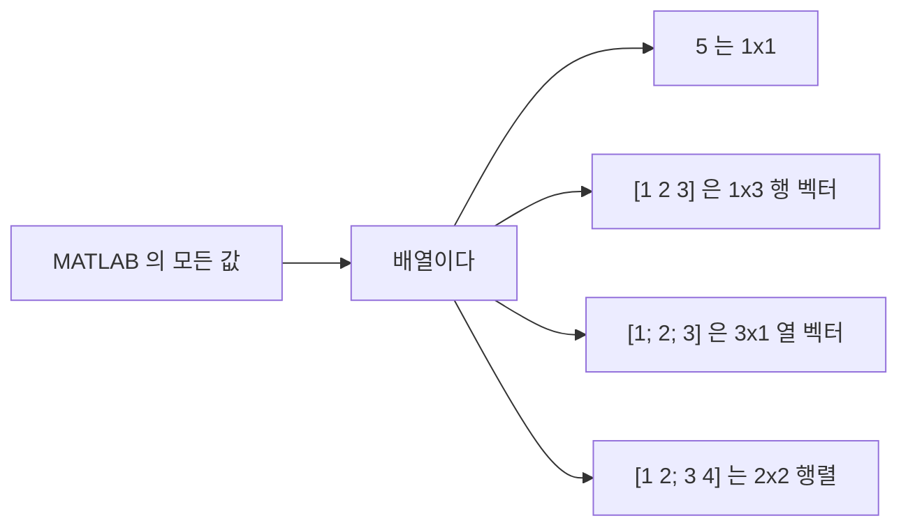
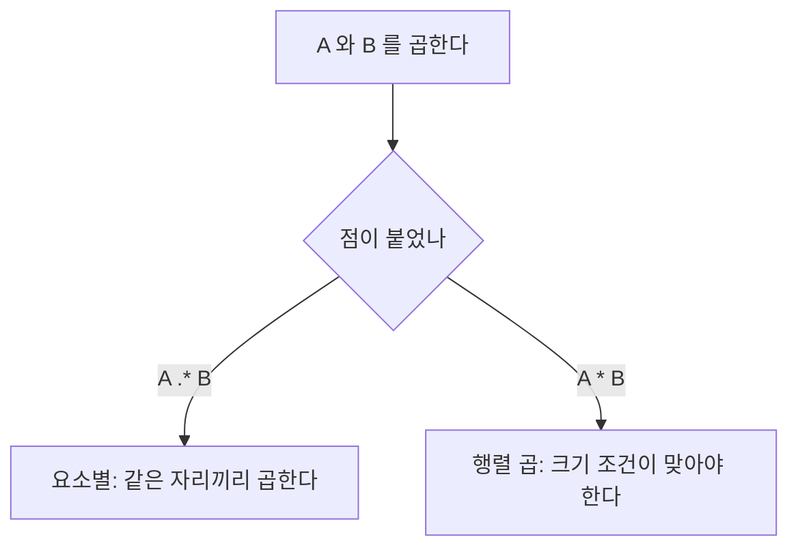

> **기준 출처:** [MathWorks Matrices and Arrays](https://www.mathworks.com/help/matlab/learn_matlab/matrices-and-arrays.html) · [Array Indexing](https://www.mathworks.com/help/matlab/math/array-indexing.html) · MATLAB 함수 레퍼런스의 `size`, `numel`, `length`, `class` / 확인일 2026-08-07
> **시리즈:** [목차](/posts/00-mp-series/) | 다음 → [02. 데이터 타입](/posts/02-data-types-int-float/)

대상은 MATLAB을 한 번도 실행해 본 적 없는 독자다. 예제는 모두 이 글에서 새로 만든 것이다.

## 1. 이 글을 읽는 이유

Simulink와 Stateflow는 겉으로는 블록과 상태 다이어그램이지만 그 안에서 계산되는 값의 규칙은 전부 MATLAB 언어의 규칙을 따른다. 블록 파라미터 칸에 적히는 `uint16(0)`과 Stateflow 액션에 적히는 `bitor(a, b)`는 모두 MATLAB 표현식이다. 모델을 읽으려면 MATLAB의 값 표현 방식을 먼저 알아야 한다.

이 글은 그중 가장 아래층인 변수와 배열을 다룬다.

## 2. 스칼라라는 것은 없다

MATLAB에서 모든 값은 배열이다. 숫자 하나도 예외가 아니고 내부적으로는 1행 1열짜리 배열로 저장된다.

```matlab
a = 5;
size(a)     % 결과: 1  1   -> 1행 1열 배열
```



이 원칙 때문에 MATLAB의 연산자는 대부분 요소별(element-wise)로 동작하고, 반복문 없이 배열 전체를 한 번에 계산할 수 있다.

## 3. 변수

대입은 이렇게 한다.

```matlab
count = 0;
name  = 'motor';
```

`=`는 비교가 아니라 대입이고 비교는 `==`다. 변수는 미리 선언하지 않으며 대입하는 순간 생성되고 타입도 그때 결정된다. 문장 끝의 세미콜론은 결과 출력을 억제한다. 세미콜론을 생략하면 계산 결과가 화면에 그대로 표시되고, 반복문 안에서 빠뜨리면 수만 줄이 출력되어 실행이 느려지므로 습관적으로 붙이는 편이 좋다.

이름은 영문자로 시작하고 이후에 영문자와 숫자와 언더스코어를 쓸 수 있다. 대소문자를 구분하므로 `Count`와 `count`는 다른 변수다. MATLAB 내장 함수와 같은 이름을 변수로 쓰면 그 함수를 가린다. `sum = 3;`을 실행하면 이후 `sum([1 2 3])`이 동작하지 않는다.

값의 종류는 세 함수로 확인한다.

```matlab
a = uint16(7);
class(a)    % 'uint16'   -> 데이터 타입
size(a)     % 1  1       -> 각 차원의 크기
numel(a)    % 1          -> 전체 요소 개수
```

`class`와 `size`와 `numel`은 값을 다룰 때 가장 먼저 확인하게 되는 세 함수다. 특히 `class`는 정수 타입이 섞이는 임베디드 모델에서 오류 원인을 찾는 출발점이 된다.

## 4. 배열 만들기

직접 나열하는 방식이 기본이다.

```matlab
row = [1 2 3];        % 1x3, 공백이나 쉼표는 열을 구분한다
col = [1; 2; 3];      % 3x1, 세미콜론은 행을 구분한다
mat = [1 2; 3 4];     % 2x2
```

대괄호 안에서 공백과 쉼표는 오른쪽으로, 세미콜론은 아래로 붙인다고 기억하면 된다.

콜론 연산자로 등차 수열을 만든다.

```matlab
v = 1:5;        % 1  2  3  4  5
w = 0:2:10;     % 0  2  4  6  8  10   (시작 : 증가폭 : 끝)
```

`시작:증가폭:끝` 형태이고 증가폭을 생략하면 1이다. 끝 값은 정확히 떨어질 때만 포함된다.

크기를 지정해 만들 수도 있다.

```matlab
z = zeros(3, 1);              % 3x1 double 0 배열
o = ones(2, 2);               % 2x2 double 1 배열
u = zeros(1, 8, 'uint16');    % 1x8 uint16 0 배열
```

세 번째 인수로 클래스 이름을 주면 그 타입으로 만들어진다. 제어 코드에서 버퍼를 미리 확보할 때 이 형태를 자주 쓴다.

## 5. 인덱싱은 1부터 센다

MATLAB의 인덱스는 1부터 시작한다. C 언어의 0부터 시작하는 인덱스와 다르므로 C로 변환하는 작업에서 가장 흔한 오차 원인이 된다.

```matlab
v = [10 20 30 40 50];

v(1)        % 10      첫 번째 요소
v(3)        % 30
v(end)      % 50      마지막 요소
v(2:4)      % 20 30 40   범위
v([1 5])    % 10 50      원하는 위치만
```

`end`는 그 차원의 마지막 인덱스를 뜻하는 예약어다. 2차원 배열은 `mat(행, 열)`로 접근하므로 `mat(2,1)`은 2행 1열이다.

존재하지 않는 인덱스를 읽으면 오류가 나지만 쓰면 배열이 자동으로 늘어난다. 의도치 않은 확장이 버그로 이어지는 경우가 있으므로 주의한다.

```matlab
v = [1 2 3];
v(6) = 9;       % v = 1  2  3  0  0  9   (빈 자리는 0 으로 채워진다)
```

## 6. 요소별 연산과 행렬 연산

MATLAB에는 같은 기호가 두 벌 있다. 점이 붙으면 요소별이고 붙지 않으면 선형대수 연산이다.



| 연산 | 요소별 | 행렬 |
| --- | --- | --- |
| 곱 | `A .* B` | `A * B` |
| 나눗셈 | `A ./ B` | `A / B` |
| 거듭제곱 | `A .^ 2` | `A ^ 2` |

```matlab
A = [1 2; 3 4];
A .* A      % [1 4; 9 16]     각 자리끼리 곱한다
A * A       % [7 10; 15 22]   행렬 곱이다
```

덧셈과 뺄셈은 원래 요소별이라 점이 없다. 제어 알고리즘 대부분은 신호를 자리별로 계산하므로 요소별 연산이 기본이고, 행렬 곱이 필요한 좌표 변환이나 자코비안 계산에서만 점 없는 형태를 쓴다.

## 7. 자주 발생하는 오류

| 메시지 | 원인 | 대응 |
| --- | --- | --- |
| `Index exceeds the number of array elements` | 인덱스가 배열 크기를 넘었다 | `numel`로 크기를 확인하고 0부터 세지 않았는지 본다 |
| `Matrix dimensions must agree` | 요소별 연산에서 두 배열 크기가 맞지 않는다 | `size`로 양쪽을 확인한다 |
| `Inner matrix dimensions must agree` | 행렬 곱의 크기 조건이 맞지 않는다 | 요소별 `.*`를 의도한 것은 아닌지 확인한다 |
| `Undefined function or variable` | 오타이거나 변수가 아직 만들어지지 않았다 | 대소문자를 확인한다 |

## 정리

- MATLAB의 모든 값은 배열이고 스칼라는 1×1 배열이다.
- 변수는 선언 없이 대입으로 생성되고 대소문자를 구분한다.
- 인덱스는 1부터 시작하고 `end`로 마지막을 가리킨다.
- 점이 붙은 연산자는 요소별이고 붙지 않은 것은 행렬 연산이다.
- 값의 성격을 확인하는 세 함수는 `class`와 `size`와 `numel`이다.

## 확인 문제

1. `a = [4 8 12 16];`일 때 `a(2:end)`의 결과는 무엇인가.
2. `zeros(1,4,'uint8')`과 `zeros(1,4)`의 차이를 `class`로 설명하라.
3. `[1 2 3] * [1 2 3]`이 오류가 나는 이유는 무엇이며 어떻게 고치면 각 자리끼리 곱해지는가.

## 참고

- [MathWorks — Matrices and Arrays](https://www.mathworks.com/help/matlab/learn_matlab/matrices-and-arrays.html)
- [MathWorks — Array Indexing](https://www.mathworks.com/help/matlab/math/array-indexing.html)