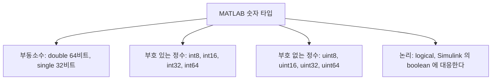

> **기준 출처:** [MathWorks Integers](https://www.mathworks.com/help/matlab/matlab_prog/integers.html) · [Floating-Point Numbers](https://www.mathworks.com/help/matlab/matlab_prog/floating-point-numbers.html) · MATLAB 함수 레퍼런스의 `intmax`, `intmin`, `realmax`, `eps`, `class`, `isa` / 확인일 2026-08-07
> **시리즈:** [목차](/posts/00-mp-series/) | 이전 → [01. 변수와 배열](/posts/01-matlab-variables-arrays/) | 다음 → [03. 형 변환과 포화](/posts/03-cast-overflow-saturation/)

## 1. 이 글을 읽는 이유

일반적인 MATLAB 스크립트는 타입을 신경 쓰지 않아도 동작한다. 아무것도 지정하지 않으면 전부 `double`이기 때문이다. 그러나 임베디드 제어 모델에서는 타입이 설계 항목이다. 보드로 나가는 값은 정해진 비트 폭을 가져야 하고 연산 결과가 그 폭을 넘으면 값이 잘리거나 고정된다.

Simulink 모델에서 `uint16`과 `uint32`와 `single`과 `boolean`이 명시적으로 등장하는 이유가 여기 있다. 이 글은 그 타입들이 각각 무엇을 표현할 수 있는지 정리한다.

## 2. 숫자 타입의 전체 지도



| 분류 | 클래스 | 비트 | 표현 범위 | 용도 |
| --- | --- | --- | --- | --- |
| 부동소수 | `double` | 64 | 약 ±1.8e308 | MATLAB 기본값. 해석과 설계에 쓴다 |
| 부동소수 | `single` | 32 | 약 ±3.4e38 | 임베디드 실수 연산 |
| 부호 있는 정수 | `int8` | 8 | -128에서 127 | |
| | `int16` | 16 | -32,768에서 32,767 | |
| | `int32` | 32 | 약 ±2.1e9 | |
| | `int64` | 64 | 약 ±9.2e18 | |
| 부호 없는 정수 | `uint8` | 8 | 0에서 255 | 바이트 |
| | `uint16` | 16 | 0에서 65,535 | 통신 워드, 상태 코드 |
| | `uint32` | 32 | 0에서 4,294,967,295 | 비트 플래그 집합, 카운터 |
| | `uint64` | 64 | 0에서 약 1.8e19 | |
| 논리 | `logical` | 개념상 1 | `true`와 `false` | 조건, 마스크 |

범위는 외우지 않고 함수로 확인한다.

```matlab
intmax('uint16')    % 65535
intmin('int16')     % -32768
realmax('single')   % 3.4028e+38
```

## 3. double과 single

둘 다 실수를 근사해서 저장하고 차이는 저장에 쓰는 비트 수다.

| | `double` | `single` |
| --- | --- | --- |
| 크기 | 8바이트 | 4바이트 |
| 유효 자릿수 | 약 15에서 16자리 | 약 7자리 |
| 1 근처의 분해능 (`eps`) | 약 2.2e-16 | 약 1.19e-7 |

```matlab
eps('single')   % 1.1921e-07
```

`eps(x)`는 x 바로 다음에 표현 가능한 수까지의 간격이다. `single`로 1.0을 저장하면 그 주변에서 약 1e-7보다 작은 차이는 표현되지 않는다.

임베디드에서 `single`을 쓰는 이유가 셋이다. 메모리와 대역폭이 절반이고 주기적으로 주고받는 신호가 수십 개면 차이가 크다. 많은 제어용 MCU의 부동소수 연산 장치가 32비트 단정밀도만 지원해서 `double`을 쓰면 소프트웨어 에뮬레이션으로 떨어져 수십 배 느려질 수 있다. 그리고 센서 분해능이 애초에 7자리에 못 미치는 경우가 많아 `double`의 추가 정밀도가 실익이 없다.

정밀도에서 오는 함정이 하나 있다. 부동소수는 10진 소수를 정확히 저장하지 못한다.

```matlab
0.1 + 0.2 == 0.3      % logical 0, 곧 false
```

MATLAB의 결함이 아니라 2진 부동소수 표현의 성질이다. 그래서 실수를 `==`로 비교하지 않고 허용 오차를 두고 비교한다.

```matlab
abs((0.1 + 0.2) - 0.3) < 1e-9      % logical 1, 곧 true
```

제어 모델에서 값이 목표에 도달했는가를 판정할 때 허용 오차 파라미터가 함께 등장하는 이유가 이것이다.

## 4. 정수 타입

정수는 변환 함수를 호출해서 만든다.

```matlab
a = uint16(1000);
b = int8(-5);
class(a)    % 'uint16'
```

리터럴 `1000`은 그 자체로는 `double`이다. `uint16(...)`으로 감싸야 `uint16`이 된다.

부호 없는 정수를 쓰는 이유가 있다. 제어 보드와 주고받는 워드와 상태 코드와 비트 플래그 묶음은 음수 개념이 없다. 이런 값에 부호 있는 타입을 쓰면 최상위 비트가 부호로 해석되어 비트 연산 결과가 의도와 달라진다. 그래서 통신과 플래그 영역에서는 `uint16`과 `uint32`가 표준적으로 쓰인다.

정수 나눗셈은 C와 가장 크게 다른 지점이다. C에서 정수 나눗셈은 소수부를 버리지만 MATLAB은 가장 가까운 정수로 반올림하며 0.5는 0에서 먼 쪽으로 간다.

```matlab
uint8(5) / uint8(2)     % 3    (2.5 -> 3)
int8(-5) / int8(2)      % -3   (-2.5 -> -3)
```

C로 변환할 때 이 차이를 놓치면 결과가 1씩 어긋난다. 버림이 필요하면 `floor`나 `idivide`를 명시적으로 쓴다.

```matlab
idivide(uint8(5), uint8(2), 'floor')    % 2
```

## 5. 논리 타입

비교 연산과 논리 연산의 결과는 `logical`이다.

```matlab
r = (3 > 2);
class(r)    % 'logical'
r           % 1
```

화면에는 1과 0으로 보이지만 `double` 1과 0과는 다른 타입이다. 구분이 필요한 이유가 둘이다. `logical` 배열은 인덱스로 쓸 수 있어서 `v(v > 10)`이 10보다 큰 요소만 고른다. 그리고 Simulink에서 `boolean` 신호는 논리 블록의 입출력으로만 허용되는 자리가 있어서 산술 타입을 그대로 꽂으면 타입 오류가 난다.

## 6. 타입을 확인하는 함수

```matlab
isa(a, 'uint16')     % 정확히 그 클래스인가
isinteger(a)         % 정수 계열인가
isfloat(a)           % 부동소수 계열인가
isnumeric(a)         % 숫자 계열인가, logical 은 false 다
islogical(r)         % 논리 타입인가
```

모델 분석이나 변환 작업에서 값이 예상과 다르게 동작하면 계산식을 의심하기 전에 `class`로 타입부터 확인하는 것이 빠르다.

## 정리

- 지정하지 않으면 모든 숫자는 `double`이다. 임베디드 모델에서는 타입을 명시한다.
- `single`은 유효 자릿수가 약 7자리이고 메모리와 MCU FPU 사정 때문에 선택된다.
- 부동소수는 `==`로 비교하지 않고 허용 오차를 둔다.
- 부호 없는 정수는 통신 워드나 비트 플래그처럼 음수가 없는 값에 쓴다.
- MATLAB의 정수 나눗셈은 반올림이고 C의 버림과 다르다.

## 확인 문제

1. `uint16`이 표현할 수 있는 최댓값을 함수로 구하는 방법을 쓰라.
2. `single`로 저장한 값끼리 같은지 판정할 때 `==`를 쓰면 안 되는 이유를 설명하라.
3. `uint8(7)/uint8(2)`의 결과와 같은 식을 C로 옮겼을 때의 결과를 각각 쓰고 차이의 원인을 설명하라.

## 참고

- [MathWorks — Integers](https://www.mathworks.com/help/matlab/matlab_prog/integers.html)
- [MathWorks — Floating-Point Numbers](https://www.mathworks.com/help/matlab/matlab_prog/floating-point-numbers.html)