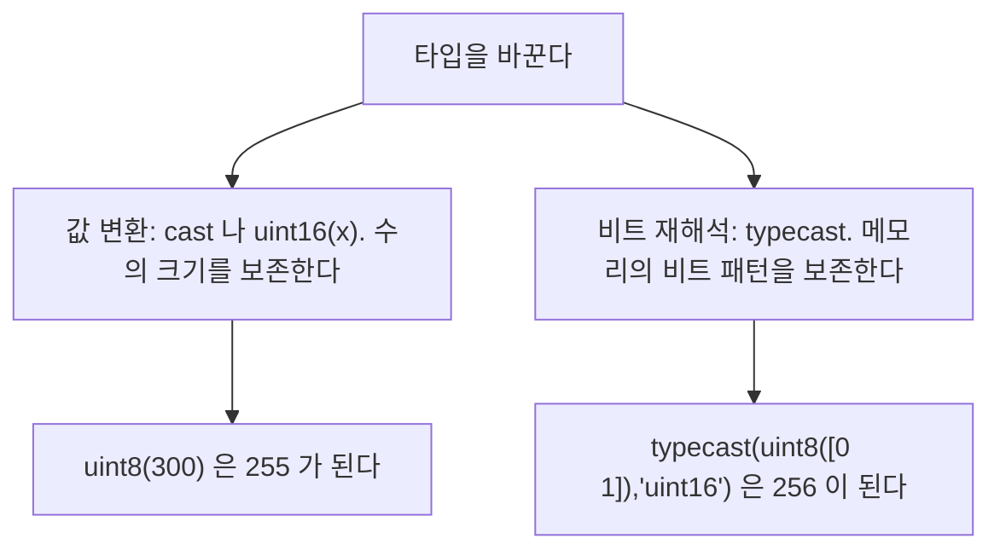

> **기준 출처:** [MathWorks Integers와 Integer Arithmetic](https://www.mathworks.com/help/matlab/matlab_prog/integers.html) · MATLAB 함수 레퍼런스의 `cast`, `typecast`, `idivide`, `intmax`, `intmin` · Fixed-Point Designer의 Rounding Modes와 Overflow Handling / 확인일 2026-08-07
> **시리즈:** [목차](/posts/00-mp-series/) | 이전 → [02. 데이터 타입](/posts/02-data-types-int-float/) | 다음 → [04. 비트 연산](/posts/04-bitwise-operations/)

## 1. 이 글을 읽는 이유

임베디드 모델에서 값이 잘못 나오는 원인 중 큰 몫이 타입 경계에서 발생한다. 두 신호를 더했더니 최댓값에 붙어 버리거나, 실수를 정수로 바꿨더니 예상과 1이 다르거나, 서로 다른 정수 타입을 섞었더니 컴파일이 실패하는 상황이다.

이 글은 그 경계에서 MATLAB이 정확히 어떤 규칙을 적용하는지 정리한다.

## 2. 타입 변환의 두 가지 의미

변환에는 성격이 완전히 다른 두 가지가 있다.



| | 값 변환 (`cast`, `uint16(x)`) | 비트 재해석 (`typecast`) |
| --- | --- | --- |
| 보존하는 것 | 수의 크기, 곧 값 | 메모리의 비트 패턴 |
| 예 | `uint8(300)`이 `255`가 된다 | `typecast(uint8([0 1]),'uint16')`이 `256`이 된다 |
| 결과 비트 수 | 목표 타입에 맞춰 재계산된다 | 총 비트 수가 같아야 한다 |
| 언제 쓰나 | 일반적인 신호 변환 | 통신 버퍼 해석, 바이트 조립 |

Simulink의 Data Type Conversion 블록에도 같은 구분이 있다. 블록 파라미터의 Input and output to have equal 항목에서 Real World Value를 고르면 값 변환이고 Stored Integer를 고르면 비트 패턴 유지에 가까운 동작이 된다. [Simulink 06편](/posts/06-data-type-saturation/)에서 다룬다.

## 3. 값 변환

기본 형태는 두 가지로 쓸 수 있다.

```matlab
b = uint16(x);         % 클래스 이름을 함수처럼 호출한다
b = cast(x, 'uint16'); % 동일하다. 클래스 이름을 변수로 다룰 때 유용하다
```

MATLAB의 정수 변환은 가장 가까운 정수로 반올림하고 0.5는 0에서 먼 쪽으로 간다.

```matlab
uint8(2.4)      % 2
uint8(2.5)      % 3
uint8(2.6)      % 3
int8(-2.5)      % -3
```

C의 `(int)` 캐스트는 소수부를 버리므로 `(int)2.9`가 2다. MATLAB은 3이다. C 변환 작업에서 이 차이가 그대로 오차가 된다. 버림을 원하면 변환 전에 명시적으로 처리한다.

```matlab
uint8(floor(2.9))   % 2
```

범위를 벗어나면 포화한다. MATLAB의 정수 변환과 정수 산술은 기본적으로 포화하고, 범위를 넘으면 최댓값이나 최솟값에 고정되며 C처럼 순환하지 않는다.

```matlab
uint8(300)      % 255     (최댓값에 고정된다)
uint8(-5)       % 0       (최솟값에 고정된다)
int8(200)       % 127
```

```matlab
uint8(200) + uint8(100)     % 255, 300 이 아니다
uint8(10)  - uint8(20)      % 0,   -10 이 아니다
```

이 동작은 제어 시스템에서 대체로 바람직하다. 순환이 일어나면 큰 양수가 갑자기 0 근처로 떨어져 지령이 급변하지만 포화는 경계에 머무르기 때문이다. 다만 C 코드는 기본이 순환이므로 변환 시 포화 처리를 별도로 구현하지 않으면 동작이 달라진다.

| | MATLAB과 Simulink 기본 | C 언어 기본 |
| --- | --- | --- |
| 실수에서 정수로 | 반올림 | 버림 |
| 범위 초과 | 포화 | unsigned는 순환, signed는 미정의 |

`NaN`과 `Inf`의 변환도 알아 둔다.

```matlab
uint8(NaN)      % 0
uint8(Inf)      % 255
uint8(-Inf)     % 0
```

`NaN`이 0으로 조용히 바뀌는 것은 위험하다. 나눗셈 결과를 정수로 변환하기 전에 분모가 0인지 확인하는 절차가 필요한 이유다.

## 4. 타입을 섞을 때의 규칙

MATLAB은 서로 다른 숫자 타입을 섞는 것을 엄격하게 제한한다.

| 허용되는 조합 | 결과 | 비고 |
| --- | --- | --- |
| 정수와 스칼라 `double` | 그 정수 타입 | `uint16(5) * 2`가 `uint16`이 된다 |
| `single`과 `double` | `single` | 낮은 정밀도로 맞춰진다 |
| 같은 정수 타입끼리 | 그 타입 | |
| `logical`과 숫자 | 숫자 타입 | `logical`이 0과 1로 승격된다 |

허용되지 않는 조합은 이렇다.

```matlab
uint8(1) + uint16(1)      % 오류
uint8(1) + single(1)      % 오류
```

발생하는 메시지는 정수는 같은 클래스의 정수나 스칼라 double과만 결합할 수 있다는 내용이다. 서로 다른 정수 타입끼리, 그리고 정수와 `single`은 직접 연산할 수 없고 반드시 한쪽을 명시적으로 변환해야 한다.

```matlab
uint16(uint8(1)) + uint16(1)     % 정상이다
single(uint8(1)) + single(1)     % 정상이다
```

이 제약은 불편해 보이지만 의도하지 않은 암묵적 승격을 막는 안전장치다. C에서는 같은 식이 조용히 승격되어 오버플로 지점이 보이지 않게 된다.

결과 타입이 정수로 유지되는 것에도 주의한다.

```matlab
uint16(10) / 4      % 3, 2.5 가 아니라 반올림된 3 이다
```

`4`는 `double` 스칼라이지만 결과 타입은 `uint16`이다. 소수 결과가 필요하면 정수 쪽을 먼저 실수로 올려야 한다.

```matlab
single(uint16(10)) / 4     % 2.5
```

## 5. 비트 재해석

`typecast`는 값을 바꾸지 않고 메모리에 있는 비트를 다른 타입의 눈으로 다시 읽는다.

```matlab
typecast(uint8([0 1]), 'uint16')     % 256, 리틀엔디언 기준이다
typecast(single(1), 'uint32')        % 1065353216
```

입력과 출력의 총 비트 수가 같아야 한다. 바이트 순서는 실행 환경의 엔디언을 따르므로 통신 프로토콜의 엔디언과 다르면 값이 뒤집혀 나오고, 프로토콜 문서와 대조해야 한다.

용도는 통신 프레임 해석이다. 바이트 배열로 들어온 데이터를 워드로 묶거나 실수 값을 전송용 정수 패턴으로 바꿀 때 쓴다.

## 6. 진단 순서

| 증상 | 확인할 것 |
| --- | --- |
| 값이 최댓값에 계속 붙어 있다 | 중간 계산에서 정수 포화가 일어났는가. 더 넓은 타입으로 올린 뒤 계산하고 마지막에 내리는가 |
| 결과가 항상 정수로 떨어진다 | 나눗셈 피연산자 중 하나가 정수 타입인가 |
| C로 옮겼더니 1씩 다르다 | 반올림과 버림의 차이인가 |
| 0이 나와야 할 자리에 0이 있는데 원인이 불명하다 | `NaN`이 정수로 변환되지 않았는가 |
| 타입 오류로 실행되지 않는다 | 서로 다른 정수 타입이나 정수와 `single`을 섞지 않았는가 |

원칙은 하나다. 넓은 타입에서 계산하고 마지막에 좁은 타입으로 내린다.

```matlab
% 권장하지 않는 형태: 중간에서 포화된다
r = uint8(200) + uint8(100);            % 255

% 권장 형태: 넓은 곳에서 계산하고 마지막에 판단한다
r16 = uint16(200) + uint16(100);        % 300
r   = uint8(min(r16, uint16(255)));     % 포화를 명시적으로 표현한다
```

## 정리

- 변환에는 값을 보존하는 `cast`와 비트를 보존하는 `typecast`가 있고 목적이 다르다.
- 실수에서 정수로의 변환은 반올림이고 0.5는 0에서 먼 쪽으로 간다. C의 버림과 다르다.
- 범위를 넘으면 포화한다. C의 순환과 다르다.
- 서로 다른 정수 타입과, 정수와 `single`은 직접 연산할 수 없고 명시적 변환이 필요하다.
- 정수와 `double` 스칼라를 섞으면 결과는 정수 타입으로 유지된다.

## 확인 문제

1. `uint8(250) + uint8(10)`의 결과와 같은 연산을 C의 `unsigned char`로 했을 때의 결과를 각각 쓰라.
2. `uint16(7)/2`의 결과가 3.5가 아닌 이유와 3.5를 얻는 방법을 쓰라.
3. `cast`와 `typecast` 중 통신 버퍼의 두 바이트를 하나의 16비트 워드로 합칠 때 쓰는 것은 무엇이며 그 이유는 무엇인가.

## 참고

- [MathWorks — Integers](https://www.mathworks.com/help/matlab/matlab_prog/integers.html)
- MathWorks Fixed-Point Designer — Rounding Modes, Overflow Handling