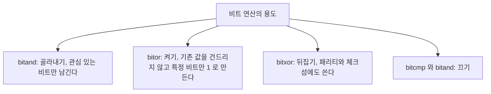

> **기준 출처:** [MathWorks bitand](https://www.mathworks.com/help/matlab/ref/bitand.html) · [bitor](https://www.mathworks.com/help/matlab/ref/bitor.html) · `bitxor`, `bitcmp`, `bitshift`, `bitset`, `bitget` 레퍼런스 · Bit-Wise Operations 문서 / 확인일 2026-08-07
> **시리즈:** [목차](/posts/00-mp-series/) | 이전 → [03. 형 변환과 포화](/posts/03-cast-overflow-saturation/) | 다음 → [05. 연산자와 논리식](/posts/05-operators-logical/)

## 1. 이 글을 읽는 이유

제어 보드와 주고받는 데이터는 대부분 하나의 정수 안에 여러 개의 독립적인 의미를 담는다. 16비트 워드 하나에 전원 켜짐이나 동작 준비됨이나 오류 있음 같은 정보를 비트 단위로 나누어 싣는 방식이다.

이런 값을 다루려면 정수를 수로 보는 대신 0과 1이 나열된 스위치 묶음으로 보아야 하고, 그 스위치를 조작하는 도구가 비트 연산이다.

## 2. 정수를 2진수로 보기

`dec2bin`으로 눈에 보이게 만들 수 있다. 두 번째 인수는 최소 자릿수다.

```matlab
dec2bin(5, 8)       % '00000101'
dec2bin(65535, 16)  % '1111111111111111'
```

비트 번호는 오른쪽 끝인 최하위 비트를 1번으로 센다. MATLAB의 `bitget`과 `bitset`이 1-기반이기 때문이다.

```text
   비트 번호   8  7  6  5  4  3  2  1
   값 5        0  0  0  0  0  1  0  1
```

## 3. 세 가지 기본 연산



`bitand`는 둘 다 1일 때만 1이다.

```matlab
bitand(uint8(12), uint8(10))    % 8
```

```text
  12 = 0000 1100
  10 = 0000 1010
 AND = 0000 1000  = 8
```

`bitor`는 하나라도 1이면 1이다.

```matlab
bitor(uint8(12), uint8(10))     % 14
```

```text
  12 = 0000 1100
  10 = 0000 1010
  OR = 0000 1110  = 14
```

`bitxor`는 서로 다를 때만 1이다.

```matlab
bitxor(uint8(12), uint8(10))    % 6
```

| A | B | `bitand` | `bitor` | `bitxor` |
| --- | --- | --- | --- | --- |
| 0 | 0 | 0 | 0 | 0 |
| 0 | 1 | 0 | 1 | 1 |
| 1 | 0 | 0 | 1 | 1 |
| 1 | 1 | 1 | 1 | 0 |

사용 조건이 셋이다. 피연산자는 음이 아닌 정수여야 하고, 두 피연산자의 클래스가 같아야 하며(한쪽이 `double` 스칼라인 것은 허용된다), `single`은 지원되지 않으므로 정수로 변환한 뒤 쓴다.

```matlab
bitand(uint16(12), uint16(10))     % 정상이다
bitand(uint16(12), 10)             % 정상이다, double 스칼라다
bitand(uint8(12), uint16(10))      % 오류다, 클래스가 다르다
```

## 4. 시프트

`bitshift(A, k)`는 비트를 k칸 이동시킨다.

| `k` | 방향 | 수학적 의미 |
| --- | --- | --- |
| 양수 | 왼쪽 | $2^k$를 곱한 것과 같다 |
| 음수 | 오른쪽 | 2의 k 절댓값 제곱으로 나누고 버린 것과 같다 |

```matlab
bitshift(uint8(3), 2)      % 12    0000 0011 -> 0000 1100
bitshift(uint8(12), -2)    % 3     0000 1100 -> 0000 0011
```

시프트는 포화하지 않는다. 타입의 폭 밖으로 나간 비트는 그대로 버려진다.

```matlab
bitshift(uint8(255), 1)    % 254
```

```text
  255 = 1111 1111
  왼쪽으로 1칸 -> 1 1111 1110  (맨 앞 1 은 8비트 밖이라 버려진다)
  결과        =   1111 1110 = 254
```

이 점이 `uint8(255) * 2`가 255로 포화하는 것과 다르다. 곱셈은 포화하고 시프트는 절단한다.

부호 있는 타입에서 오른쪽 시프트는 산술 시프트로, 부호 비트가 복제되어 채워진다. 음수는 오른쪽으로 밀어도 음수로 남는다. 이 성질 때문에 Simulink의 대응 블록 이름이 Shift Arithmetic이다.

## 5. 플래그 워드 다루기

여러 개의 상태를 하나의 정수에 담는 것이 가장 흔한 사용처다. 아래는 이 글에서 임의로 정의한 예시 플래그다.

```matlab
% 예시 정의, 임의 작성이다
FLAG_READY = uint16(1);      % 비트 1  : 0000 0000 0000 0001
FLAG_BUSY  = uint16(2);      % 비트 2  : 0000 0000 0000 0010
FLAG_ERROR = uint16(4);      % 비트 3  : 0000 0000 0000 0100
FLAG_HOMED = uint16(8);      % 비트 4  : 0000 0000 0000 1000
```

각 플래그는 2의 거듭제곱이다. 그래야 서로 겹치지 않는 자리를 차지한다.

```matlab
% 켜기
status = uint16(0);
status = bitor(status, FLAG_READY);     % 1
status = bitor(status, FLAG_HOMED);     % 9, 곧 1 + 8

% 확인하기
isReady = bitand(status, FLAG_READY) ~= 0;      % true
isError = bitand(status, FLAG_ERROR) ~= 0;      % false

% 끄기
status = bitand(status, bitcmp(FLAG_HOMED));    % HOMED 만 0 으로

% 뒤집기
status = bitxor(status, FLAG_BUSY);     % 켜져 있으면 끄고 꺼져 있으면 켠다
```

`bitand`의 결과는 0 또는 그 플래그 값이므로 `~= 0`으로 논리값을 만드는 단계가 반드시 필요하다. 이 단계를 빠뜨리면 정수를 조건으로 쓰게 되어 의도가 흐려진다.

`bitcmp`는 비트 반전이다. `bitcmp(uint16(8))`은 `1111 1111 1111 0111`이므로 이것과 `bitand`하면 4번 비트만 0이 되고 나머지는 보존된다. `bitcmp`는 타입 폭에 의존하므로 `bitcmp(uint8(8))`과 `bitcmp(uint16(8))`의 결과가 각각 247과 65527로 다르다. 반드시 대상과 같은 타입으로 만들어야 한다.

여러 비트를 한 번에 다룰 때는 하나라도와 전부의 판정 방식이 다르다.

```matlab
MASK_MOTION = bitor(FLAG_BUSY, FLAG_HOMED);          % 10
anyMotion   = bitand(status, MASK_MOTION) ~= 0;      % 둘 중 하나라도 켜졌는가
allMotion   = bitand(status, MASK_MOTION) == MASK_MOTION;  % 둘 다 켜졌는가
```

## 6. 필드 추출

하나의 워드 안에 1비트 플래그뿐 아니라 여러 비트짜리 숫자 필드가 들어 있는 경우가 많다. 16비트 워드의 5번에서 8번 비트인 4비트에 동작 모드 번호가 실려 있다면 다음 순서로 꺼낸다.

```matlab
word = uint16(hex2dec('01A0'));      % 예시 값, 임의다

% 1) 원하는 자리만 남긴다
masked = bitand(word, uint16(hex2dec('00F0')));    % 5~8번 비트 마스크

% 2) 최하위로 끌어내린다
mode = bitshift(masked, -4);
```

순서를 바꾸어 시프트를 먼저 해도 되지만 마스크 다음에 시프트하는 순서가 상위 비트의 오염을 확실히 제거하므로 더 안전하다.

반대로 값을 워드에 끼워 넣을 때는 세 단계다.

```matlab
% 자리를 비우고, 올려서, 합친다
cleared = bitand(word, bitcmp(uint16(hex2dec('00F0'))));
word    = bitor(cleared, bitshift(uint16(3), 4));
```

## 7. 개별 비트 접근

번호로 직접 다루는 방법도 있다. 인덱스는 1-기반이고 1번이 최하위 비트다.

```matlab
bitget(uint8(12), 3)        % 1, 12 는 0000 1100 이라 3번 비트가 1 이다
bitget(uint8(12), 1)        % 0

bitset(uint8(0), 4)         % 8, 4번 비트를 1 로
bitset(uint8(15), 1, 0)     % 14, 1번 비트를 0 으로
```

`bitget`과 `bitset`은 읽기 쉽지만 여러 비트를 동시에 다루기에는 마스크 방식이 간결하다. 생성되는 C 코드도 마스크 방식이 더 직접적이다.

## 8. 논리 연산과 혼동하지 않기

이 구분은 자주 틀리는 지점이다.

| | 비트 연산 | 논리 연산 |
| --- | --- | --- |
| 함수나 기호 | `bitand`, `bitor`, `bitxor`, `bitcmp` | `&`, `\|`, `xor`, `~` |
| 대상 | 정수의 각 비트 | 값의 참과 거짓 |
| 결과 타입 | 입력과 같은 정수 | `logical` |
| 12와 10 | `bitand`는 8 | `&`는 true, 둘 다 0이 아니므로 |

```matlab
bitand(12, 10)      % 8, 비트 단위다
12 & 10             % 1, 둘 다 참이므로 참이다
```

정수를 조건문에 그대로 넣지 않는다. `if bitand(status, FLAG_ERROR)` 대신 `if bitand(status, FLAG_ERROR) ~= 0`으로 쓰면 의도가 명확해지고 Stateflow와 Simulink의 타입 검사도 통과한다.

## 9. 자주 발생하는 오류

| 증상 | 원인 |
| --- | --- |
| 같은 클래스의 정수나 스칼라 double이어야 한다는 오류가 난다 | 두 피연산자의 정수 타입이 다르다. 한쪽을 변환한다 |
| 비트를 껐는데 다른 비트까지 사라졌다 | `bitcmp`를 다른 폭의 타입으로 만들었다 |
| 시프트했더니 값이 커지지 않고 이상해졌다 | 타입 폭 밖으로 비트가 밀려나 버려졌다. 더 넓은 타입에서 시프트한다 |
| 플래그 두 개가 서로 간섭한다 | 플래그 값이 2의 거듭제곱이 아니어서 자리가 겹친다 |
| `single` 입력에서 오류가 난다 | 비트 연산은 정수 전용이다 |

## 정리

- 비트 연산은 정수를 스위치 묶음으로 다루는 도구다.
- `bitand`는 골라내기, `bitor`는 켜기, `bitxor`는 뒤집기, `bitcmp`와 `bitand` 조합은 끄기다.
- `bitshift(A, k)`는 k가 양수면 왼쪽이고 음수면 오른쪽이며 밖으로 나간 비트는 버려진다. 포화가 아니다.
- 필드 추출은 마스크 다음에 시프트, 삽입은 비우기 다음에 올리기 다음에 합치기다.
- 비트 연산 결과는 정수이므로 조건으로 쓰려면 `~= 0`을 붙여 논리값으로 만든다.

## 확인 문제

1. `bitand(uint8(13), uint8(6))`의 결과를 2진수로 쓰라.
2. `uint16` 변수 `w`의 9번 비트만 0으로 만드는 한 줄 식을 쓰라.
3. `bitshift(uint8(200), 1)`과 `uint8(200) * 2`의 결과가 다른 이유를 설명하라.
4. 플래그 값을 1, 2, 3, 4로 정의하면 안 되는 이유를 비트 자리로 설명하라.

## 참고

- [MathWorks — bitand](https://www.mathworks.com/help/matlab/ref/bitand.html)
- [MathWorks — bitor](https://www.mathworks.com/help/matlab/ref/bitor.html)