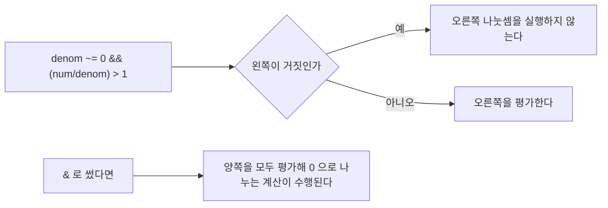

> **기준 출처:** [MathWorks Operators and Elementary Operations](https://www.mathworks.com/help/matlab/operators-and-elementary-operations.html) · [Operator Precedence](https://www.mathworks.com/help/matlab/matlab_prog/operator-precedence.html) / 확인일 2026-08-07
> **시리즈:** [목차](/posts/00-mp-series/) | 이전 → [04. 비트 연산](/posts/04-bitwise-operations/) | 다음 → [06. 자주 쓰는 내장 함수](/posts/06-builtin-functions/)

## 1. 이 글을 읽는 이유

Stateflow의 Transition 조건과 Simulink의 Relational Operator 블록과 MATLAB Function 블록의 `if` 문은 모두 같은 문법 규칙을 공유한다. 특히 `&`와 `&&`의 차이는 안전 관련 로직에서 실제 동작 차이를 만든다.

## 2. 산술 연산자

| 연산자 | 의미 | 비고 |
| --- | --- | --- |
| `+`와 `-` | 덧셈과 뺄셈 | 항상 요소별이다 |
| `*` | 행렬 곱 | 크기 조건이 있다 |
| `.*` | 요소별 곱 | 제어 계산의 기본이다 |
| `/` | 행렬 우나눗셈 | 스칼라끼리면 일반 나눗셈이다 |
| `./` | 요소별 나눗셈 | |
| `^` | 행렬 거듭제곱 | |
| `.^` | 요소별 거듭제곱 | |
| `'` | 켤레 전치 | 실수에서는 단순 전치와 같다 |
| `.'` | 전치 | 복소수에서 켤레를 취하지 않는다 |

점이 붙으면 요소별이라는 규칙은 [01편](/posts/01-matlab-variables-arrays/)에서 다뤘다.

## 3. 비교 연산자

| 연산자 | 의미 |
| --- | --- |
| `==` | 같다 |
| `~=` | 같지 않다 |
| `<`, `>`, `<=`, `>=` | 대소 비교 |

결과는 항상 `logical`이고 배열이면 같은 크기의 `logical` 배열이 나온다.

```matlab
[1 5 3] > 2         % 0  1  1
```

MATLAB의 같지 않다는 `~=`다. C 계열의 `!=`는 MATLAB 문법이 아니다. Stateflow에서도 Action Language를 MATLAB으로 설정한 차트는 `~=`를 쓰고 C로 설정한 차트는 `!=`를 쓴다. [Stateflow 02편](/posts/02-sf-chart-properties/)에서 다룬다.

부동소수는 `==`로 비교하지 않고 허용 오차를 둔다. [02편](/posts/02-data-types-int-float/)에서 다뤘다.

## 4. 단락 평가

이 절이 이 글의 중심이다.

| 연산자 | 이름 | 대상 | 단락 평가 |
| --- | --- | --- | --- |
| `&` | 요소별 AND | 배열이 가능하다 | 하지 않는다 |
| `\|` | 요소별 OR | 배열이 가능하다 | 하지 않는다 |
| `&&` | 단락 AND | 스칼라만 된다 | 한다 |
| `\|\|` | 단락 OR | 스칼라만 된다 | 한다 |
| `~` | NOT | 배열이 가능하다 | 해당 없다 |
| `xor(a,b)` | 배타적 OR | 배열이 가능하다 | 해당 없다 |

요소별 연산은 배열 전체에 대해 자리마다 판정하고 0이 아닌 값은 참으로 취급된다.

```matlab
[1 0 1] & [1 1 0]       % 1  0  0
```

`&&`는 왼쪽만으로 결론이 나면 오른쪽을 아예 실행하지 않는다.



```matlab
% denom 이 0 이면 오른쪽 나눗셈은 실행되지 않는다
if denom ~= 0 && (num / denom) > 1
    ...
end
```

`&`로 썼다면 양쪽이 모두 평가되므로 0으로 나누는 계산이 수행된다. `&&`는 보호 조건을 표현하는 도구다. `||`도 대칭적으로 왼쪽이 참이면 오른쪽을 실행하지 않는다.

| 상황 | 사용 |
| --- | --- |
| `if`나 `while`의 조건, 값 하나끼리 비교 | `&&`와 `\|\|` |
| 배열에 마스크를 만들 때 | `&`와 `\|` |
| 왼쪽 조건이 오른쪽의 안전을 보장해야 할 때 | 반드시 `&&` |

`&&`와 `||`의 피연산자는 스칼라여야 하고 배열을 주면 오류가 난다. 배열을 조건으로 쓰려면 `any`나 `all`로 스칼라화한다.

```matlab
if all(v > 0) && numel(v) > 3
    ...
end
```

단락 평가는 생성되는 C 코드에서도 분기로 유지된다. `&&`를 쓰면 조건 하나가 거짓일 때 뒤쪽 계산이 실제로 건너뛰어지고, 실행 시간이 조건에 따라 달라지므로 최악 실행 시간을 따지는 실시간 코드에서는 이 성질을 인지하고 있어야 한다. 또한 커버리지 측정에서 condition과 decision coverage와 MC-DC는 `&&`와 `||`의 개별 조건을 따로 센다.

## 5. 연산자 우선순위

높은 것부터 낮은 순서다.

| 순위 | 연산자 |
| --- | --- |
| 1 | 괄호 |
| 2 | `'`, `.'`, `^`, `.^` |
| 3 | 단항 `+`, `-`, `~` |
| 4 | `*`, `/`, `\`, `.*`, `./`, `.\` |
| 5 | 이항 `+`와 `-` |
| 6 | 콜론 |
| 7 | `<`, `<=`, `>`, `>=`, `==`, `~=` |
| 8 | `&` |
| 9 | `\|` |
| 10 | `&&` |
| 11 | `\|\|` |

실무적으로 외워야 할 것은 둘이다. 비교가 논리보다 먼저라서 `a > 0 & b > 0`은 `(a > 0) & (b > 0)`으로 해석된다. 그리고 `&`가 `|`보다 먼저라서 `a | b & c`는 `a | (b & c)`다.

두 번째는 읽는 사람이 틀리기 쉬우므로 의도한 그룹은 괄호로 명시하는 편이 낫다. 우선순위에 의존한 식은 리뷰에서 오해를 부른다.

```matlab
% 권장하지 않는다
ok = ready | busy & ~fault;

% 권장한다
ok = ready | (busy & ~fault);
```

## 6. 조건문과 반복문

```matlab
if cond1
    ...
elseif cond2
    ...
else
    ...
end
```

`elseif`는 붙여 쓴다. `else if`로 띄우면 중첩된 `if`가 되어 `end`가 하나 더 필요하다. 블록의 끝은 `end`이고 중괄호를 쓰지 않는다.

```matlab
switch mode
    case 0
        ...
    case {1, 2}     % 여러 값을 묶을 수 있다
        ...
    otherwise
        ...
end
```

MATLAB의 `switch`는 fall-through가 없다. 하나의 `case`가 끝나면 자동으로 빠져나가므로 `break`를 쓰지 않는다. C로 변환할 때는 각 `case`마다 `break`가 필요하다는 점이 차이다.

```matlab
for k = 1:10
    ...
end

while cond
    ...
end
```

반복 제어는 `break`와 `continue`가 있다. 실시간 제어 코드에서는 반복 횟수가 고정되지 않은 `while`을 피한다. 한 주기의 실행 시간이 예측되지 않으면 주기를 보장할 수 없기 때문이다.

## 7. 논리값을 만드는 보조 함수

| 함수 | 의미 |
| --- | --- |
| `any(v)` | 하나라도 참인가 |
| `all(v)` | 전부 참인가 |
| `xor(a,b)` | 서로 다른가 |
| `isempty(v)` | 비어 있는가 |
| `isnan(x)` | `NaN`인가. `x == NaN`은 항상 거짓이므로 반드시 이 함수를 쓴다 |
| `isinf(x)` | 무한대인가 |

`NaN`은 자기 자신과도 같지 않다는 성질이 있어 `==`로 검출할 수 없다. `isnan`을 쓴다.

## 8. 자주 발생하는 오류

| 증상 | 원인 |
| --- | --- |
| `&&`의 피연산자가 논리 스칼라여야 한다는 오류가 난다 | `&&`에 배열을 주었다. `any`나 `all`로 스칼라화한다 |
| 조건이 항상 참으로 동작한다 | 대입과 비교를 혼동했거나 0이 아닌 정수를 조건으로 썼다 |
| 우선순위 때문에 의도와 다른 그룹으로 묶였다 | 괄호를 명시한다 |
| `NaN` 검사에 실패한다 | `x == NaN` 대신 `isnan(x)`를 쓴다 |

## 정리

- `~=`가 같지 않다이고 `!=`는 MATLAB 문법이 아니다.
- `&`와 `|`는 요소별이고 양쪽을 모두 평가한다. `&&`와 `||`는 스칼라 전용이고 단락 평가를 한다.
- 0 나눗셈 방지나 인덱스 범위 확인 같은 보호 조건에는 반드시 `&&`를 쓴다.
- 비교 연산자가 논리 연산자보다 우선하고 `&`가 `|`보다 우선한다. 의도는 괄호로 명시한다.
- MATLAB의 `switch`는 fall-through가 없다.
- `NaN`은 `==`로 검출되지 않고 `isnan`을 쓴다.

## 확인 문제

1. `a | b & c`는 어떻게 묶여 해석되는가. 괄호를 넣어 다시 쓰라.
2. `idx > 0 && v(idx) > 5`에서 `&&`를 `&`로 바꾸면 어떤 문제가 생기는가.
3. `x`가 `NaN`인지 확인하는 올바른 방법과 `x == NaN`이 동작하지 않는 이유를 쓰라.

## 참고

- [MathWorks — Operators and Elementary Operations](https://www.mathworks.com/help/matlab/operators-and-elementary-operations.html)
- [MathWorks — Operator Precedence](https://www.mathworks.com/help/matlab/matlab_prog/operator-precedence.html)