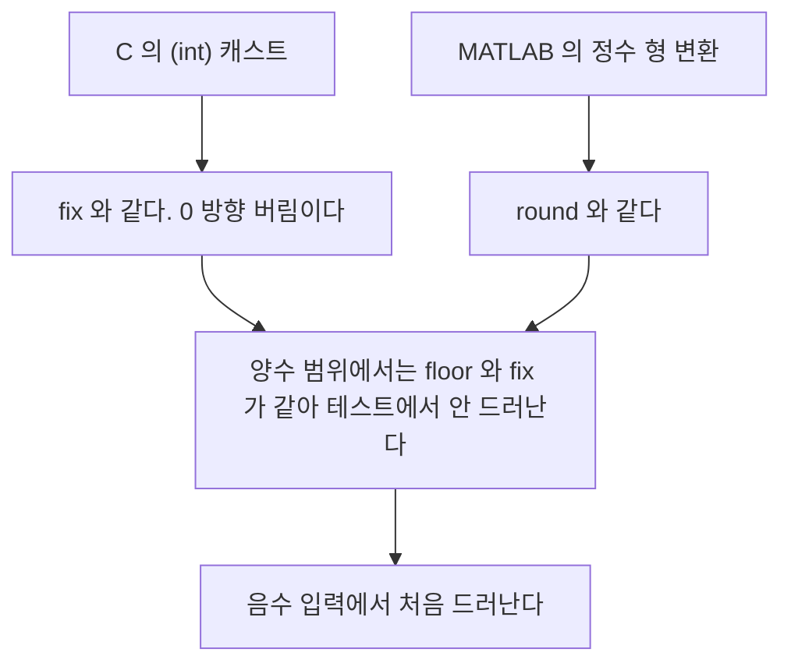

> **기준 출처:** [MathWorks floor 레퍼런스](https://www.mathworks.com/help/matlab/ref/floor.html) · [mod 레퍼런스](https://www.mathworks.com/help/matlab/ref/mod.html) · `min`, `max`, `abs`, `sign`, `sum`, `zeros`, `size`, `numel` 레퍼런스 / 확인일 2026-08-07
> **시리즈:** [목차](/posts/00-mp-series/) | 이전 → [05. 연산자와 논리식](/posts/05-operators-logical/) | 다음 → [Simulink 01. 모델을 읽는 법](/posts/01-reading-simulink-models/)

## 1. 이 글의 범위

제어 알고리즘과 Stateflow 액션에 반복해서 등장하는 내장 함수를 성격별로 묶었다. 각 함수의 전체 문법이 아니라 혼동하기 쉬운 지점에 초점을 둔다.

## 2. 반올림 계열 넷

이름이 비슷하지만 음수에서 결과가 갈린다.

| 함수 | 규칙 | 2.5 | -2.5 | 2.7 | -2.7 |
| --- | --- | --- | --- | --- | --- |
| `floor` | 아래로, 음의 무한 방향 | 2 | -3 | 2 | -3 |
| `ceil` | 위로, 양의 무한 방향 | 3 | -2 | 3 | -2 |
| `round` | 가장 가까운 정수, 0.5는 0에서 먼 쪽 | 3 | -3 | 3 | -3 |
| `fix` | 0 방향으로 버림 | 2 | -2 | 2 | -2 |



두 문장이 MATLAB 코드를 C로 옮길 때 반복해서 문제를 만드는 지점이다. 양수 범위에서는 `floor`와 `fix`가 같아서 테스트에서 드러나지 않다가 음수 입력에서 처음 드러나는 경우가 많다.

`round`는 자릿수 인수를 받을 수 있다.

```matlab
round(3.14159, 2)     % 3.1400
```

## 3. 나머지 계열

두 함수는 부호가 다를 때만 결과가 갈린다.

| 함수 | 결과 부호가 따르는 쪽 | (-7, 3) | (7, -3) | (7, 3) |
| --- | --- | --- | --- | --- |
| `mod` | 제수, 곧 뒤쪽 | 2 | -2 | 1 |
| `rem` | 피제수, 곧 앞쪽 | -1 | 1 | 1 |

각도 정규화와 순환 카운터와 인덱스 순환에는 `mod`를 쓴다. 결과가 항상 0 이상 n 미만 범위에 들어오기 때문이다. C의 나머지 연산자는 `rem`과 같으므로 음수 입력에서 부호가 다르고 변환 시 주의한다.

```matlab
angle = mod(angle, 360);        % 항상 0 이상 360 미만이다
```

## 4. 크기와 부호 계열

| 함수 | 설명 |
| --- | --- |
| `abs(x)` | 절댓값 |
| `sign(x)` | 부호. 양수는 1, 0은 0, 음수는 -1 |
| `min(a,b)`와 `max(a,b)` | 두 값 중 작은 값과 큰 값을 요소별로 |
| `min(v)`와 `max(v)` | 벡터 안에서 최소와 최대 |

인수 개수에 따라 의미가 바뀐다.

```matlab
max([3 9 1])         % 9        벡터 안의 최대다
max([3 9 1], 5)      % 5 9 5    각 요소와 5 를 비교한다
```

인수가 하나면 배열 내부에서 찾기이고 둘이면 요소별 비교다. 이 차이를 놓치면 벡터를 다룰 때 의도와 다른 결과가 나온다. 위치까지 받을 수도 있다.

```matlab
[m, idx] = max([3 9 1]);     % m 은 9, idx 는 2 다
```

포화 관용구가 여기서 나온다.

```matlab
y = min(max(x, lo), hi);     % x 를 lo 이상 hi 이하로 제한한다
```

`max`로 하한을 걸고 `min`으로 상한을 거는 두 겹 구조가 소프트웨어 리미터의 표준 형태다. Simulink의 Saturation 블록이 하는 일과 같다. [Simulink 06편](/posts/06-data-type-saturation/)에서 다룬다.

## 5. 배열 생성과 집계

| 함수 | 설명 |
| --- | --- |
| `zeros(m,n)` | 0 배열. 세 번째 인수로 클래스를 지정할 수 있다 |
| `ones(m,n)` | 1 배열 |
| `sum(v)` | 합. 행렬이면 열 방향이 기본이다 |
| `prod(v)` | 곱 |
| `cumsum(v)` | 누적합 |
| `any(v)`와 `all(v)` | 하나라도 참인가와 전부 참인가 |
| `find(v)` | 참인 요소의 인덱스 |
| `sort(v)` | 정렬 |

`zeros`에는 클래스를 명시한다.

```matlab
buf = zeros(1, 16, 'uint16');
```

Simulink와 Stateflow에서 배열 지역 변수를 초기화할 때 이 형태를 쓴다. 클래스를 지정하지 않으면 `double`이 되어 이후 정수 연산에서 타입 오류나 불필요한 변환이 발생한다.

`sum`의 방향도 주의한다.

```matlab
A = [1 2; 3 4];
sum(A)        % 4  6      열 방향이고 기본값이다
sum(A, 2)     % 3; 7      행 방향이다
sum(A(:))     % 10        전체 합이다
```

전체 합을 원할 때 `sum(A)`만 쓰면 벡터가 나온다. `sum(A(:))`이나 `sum(A, 'all')`을 쓴다.

정수 타입에서 `sum`은 결과를 `double`로 승격하지 않고 입력 클래스를 유지한다. `uint8` 배열의 합이 255를 넘으면 포화하므로 넓은 타입으로 올린 뒤 합산하는 것이 안전하다.

```matlab
s = sum(uint16(v));
```

## 6. 크기 조회

| 함수 | 반환 | 주의 |
| --- | --- | --- |
| `size(A)` | 각 차원의 크기 벡터 | `size(A,1)`은 행 수, `size(A,2)`는 열 수다 |
| `numel(A)` | 전체 요소 개수 | 가장 안전한 개수 함수다 |
| `length(A)` | 가장 긴 차원의 크기 | 행렬에서 오해를 부르므로 사용을 피한다 |
| `ndims(A)` | 차원 수 | |
| `isempty(A)` | 비었는가 | |

`length`는 벡터에서는 직관적이지만 행렬에서는 긴 쪽을 반환하므로 개수를 세는 목적이면 `numel`을 쓰는 편이 안전하다.

## 7. 표시와 진단

| 함수 | 용도 |
| --- | --- |
| `disp(x)` | 값을 변수 이름 없이 출력한다 |
| `fprintf('%d\n', x)` | 서식 출력이다 |
| `error('...')` | 오류를 발생시키고 중단한다 |
| `warning('...')` | 경고만 출력하고 계속한다 |
| `assert(cond, '...')` | 조건이 거짓이면 오류를 낸다 |
| `class`와 `isa` | 타입을 확인한다 |

모델 분석 스크립트를 작성할 때는 `disp`보다 `fprintf`가 유리하다. 서식을 지정할 수 있어 표 형태의 출력을 만들기 쉽다.

`disp`와 `fprintf`와 `error`는 Stateflow 액션이나 코드 생성 대상 MATLAB Function 블록에서 제약이 있다. 시뮬레이션에서만 동작하거나 코드 생성 시 제거되는 경우가 있으므로 실제 제어 로직의 일부로 삼지 않는다.

## 정리

- 반올림은 네 종류다. C의 캐스트는 `fix`에, MATLAB의 정수 변환은 `round`에 해당한다.
- `mod`는 제수 부호를 따르고 `rem`은 피제수 부호를 따른다. C의 나머지 연산자는 `rem`과 같다.
- `min`과 `max`는 인수 개수에 따라 배열 내부 찾기와 요소별 비교로 의미가 바뀐다.
- `y = min(max(x, lo), hi)`가 소프트웨어 리미터의 표준 형태다.
- `zeros`에는 클래스를 명시한다. 생략하면 `double`이 된다.
- 개수를 셀 때는 `length` 대신 `numel`을 쓴다.

## 확인 문제

1. `floor(-3.2)`와 `fix(-3.2)`와 `round(-3.5)`의 결과를 각각 쓰라.
2. `mod(-1, 360)`의 결과와 각도 정규화에 `rem`이 아니라 `mod`를 쓰는 이유를 설명하라.
3. `uint8` 벡터의 합을 안전하게 구하는 방법과 그 이유를 쓰라.

## 참고

- [MathWorks — floor, ceil, round, fix](https://www.mathworks.com/help/matlab/ref/floor.html)
- [MathWorks — mod, rem](https://www.mathworks.com/help/matlab/ref/mod.html)