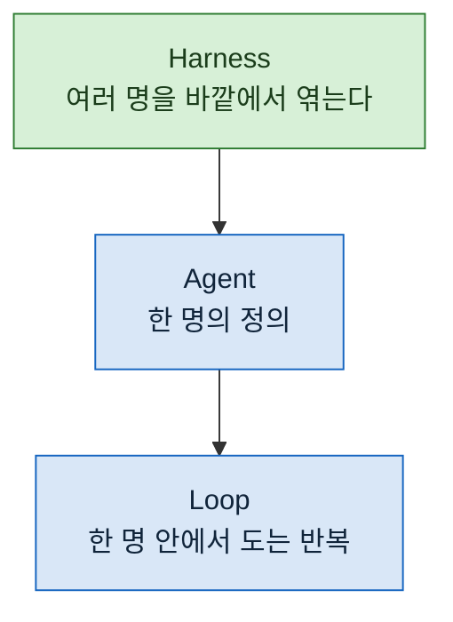

> **기준 출처:** 이 연재 전체의 지도이고 개별 근거는 각 편의 출처를 따른다. 대응표는 [Claude Code 공식 문서](https://code.claude.com/docs/en/sub-agents)와 [MathWorks Stateflow 문서](https://www.mathworks.com/help/stateflow/parallel-and-exclusive-state-semantics.html)를 대조해 직접 작성한 것이며, 어느 한쪽 문서에 실려 있는 표가 아니다. / 확인일 2026-08-24

## 이 연재가 답하는 질문

에이전트를 여러 명 쓸 때 **누가 언제 무엇을 받아 무엇을 넘기는지**를 어떻게 정하는가.

그리고 그 구조가 왜 상태 기계와 같은 모양이 되는가.

## 왜 이 관점인가

나는 제어 쪽에서 FSM 을 그리며 일한다. 에이전트를 여러 개 엮는 그림을 그리다가 익숙한 모양을 봤다. 상태가 있고, 조건이 붙은 전이가 있고, 병렬 갈래가 있고, 재시도 상한이 있었다.

우연이 아니다. Harel 이 1987년에 상태 전이 다이어그램에 더한 것이 **계층, 동시성, 통신** 셋인데, 오케스트레이션도 규모가 커지면 같은 셋이 필요해진다. 같은 문제를 풀기 때문에 그림이 닮는다.

다만 **대응은 어휘 수준이고 의미론까지 같지는 않다.** 이 단서를 빼면 틀린 직관을 준다. 03편에서 어디까지 같고 어디부터 다른지 표로 가른다.

이 연재가 다루는 것은 맨 위 한 층이다.

## 읽는 순서

### 1부. 문제와 정의

| # | 글 | 무엇을 얻나 |
| --- | --- | --- |
| 01 | [에이전트 하나로는 왜 안 되는가](/posts/01-why-one-agent-breaks/) | 컨텍스트, 단방향, 비재현. 셋 다 모델 능력 문제가 아니라는 것 |
| 02 | [제어 구조를 모델 밖으로](/posts/02-control-outside-the-model/) | 오케스트레이션의 정의와 하네스라는 층 |
| 03 | [대응표: State, Transition, Condition, Action](/posts/03-stateflow-mapping/) | FSM 어휘로 읽는 법, 그리고 **어디부터 다른가** |

### 2부. 배선

| # | 글 | 무엇을 얻나 |
| --- | --- | --- |
| 04 | [병렬 상태로 읽는 팬아웃](/posts/04-fanout-as-parallel-states/) | 양이 아니라 **축**으로 나눈다. 컨텍스트 격리가 주는 것과 뺏는 것 |
| 05 | [파이프라인과 배리어](/posts/05-pipeline-and-barrier/) | 배리어가 정당한 경우 셋, 아닌 경우 셋 |
| 06 | [구조화 출력이 곧 데이터 계약이다](/posts/06-schema-as-contract/) | 스키마가 Transition 의 guard 자리에 온다 |

### 3부. 신뢰성

| # | 글 | 무엇을 얻나 |
| --- | --- | --- |
| 07 | [적대적 검증](/posts/07-adversarial-verification/) | "확인해라" 와 "반박해라" 는 다른 결과를 낸다 |
| 08 | [수렴 조건](/posts/08-convergence-condition/) | 개수로 끊지 않는다. 최소 체류 시간과 같은 발상 |
| 09 | [자원 경합](/posts/09-resource-contention/) | 진짜로 동시에 돌기 때문에 생기는 문제와 파일 분할 소유 |
| 10 | [권한으로 막기](/posts/10-tools-as-interlock/) | 부탁은 확률적이고 도구 제거는 구조적이다 |
| 11 | [History 상태](/posts/11-history-and-resume/) | 중단 후 재개. 무엇을 남겨야 이어 붙는가 |
| 12 | [깨지는 방식들](/posts/12-how-it-breaks/) | 조용히 어긋나는 여섯 가지와 그것을 잡는 다섯 숫자 |

## 30초 사전

| 나오는 말 | 한 줄로 |
| --- | --- |
| **에이전트** | 컨텍스트를 읽고 판단해 도구를 부르고 결과를 보는 일을 반복하는 것 |
| **서브에이전트** | 그 루프를 별도 컨텍스트에서 하나 더 돌리는 것. 부모의 대화 이력을 물려받지 않는다 |
| **오케스트레이션** | 여러 에이전트의 실행 순서와 데이터 흐름을 에이전트 밖에서 정해두는 것 |
| **하네스** | 모델이 아니라 모델을 감싸는 바깥 구조. 실행 순서, 도구, 검사, 저장소 |
| **구조화 출력** | 자유 문장이 아니라 정해진 모양의 데이터로 답하게 강제하는 것 |
| **팬아웃** | 일을 축으로 나눠 동시에 여러 명에게 던지는 것 |
| **배리어** | 앞 단계가 전부 끝나야 다음으로 넘어가게 막는 지점 |

## 이 연재를 안 읽어도 되는 경우

한 번에 끝나는 일에는 필요 없다. 파일 하나 고치고, 함수 하나 쓰고, 질문 하나 답하는 데 오케스트레이션을 얹으면 배보다 배꼽이 크다.

**절차를 이미 아는 일이 반복될 때** 값이 나온다. 조사하고, 만들고, 검증하고, 배치하는 순서를 매번 새로 판단할 이유가 없을 때다.

## 이어지는 것

- 그 앞 층의 개념 정리 → [에이전틱 엔지니어링 연재](/posts/00-agentic-series/)
- 도구에 실제로 붙인 이야기 → [Claude Code 세팅 연재](/posts/00-ccsetup-series/)
