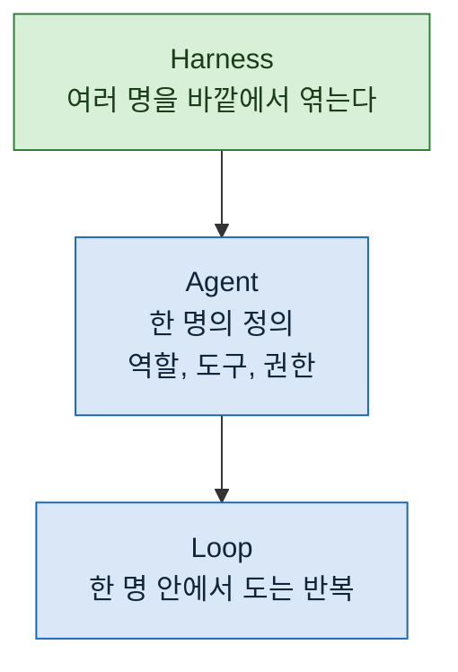

> **기준 출처:** [Claude Code Docs, Create custom subagents](https://code.claude.com/docs/en/sub-agents) · [Claude Agent SDK, Subagents](https://platform.claude.com/docs/en/agent-sdk/subagents) / 확인일 2026-08-24
> **시리즈:** [목차](/posts/00-orch-series/) | 이전 → [01. 에이전트 하나로는 왜 안 되는가](/posts/01-why-one-agent-breaks/) | 다음 → [03. 대응표: State, Transition, Condition, Action](/posts/03-stateflow-mapping/)

앞 편에서 에이전트 하나가 깨지는 세 가지를 봤다. 컨텍스트가 넘치고, 검사하는 쪽과 만든 쪽이 같고, 순서가 재현되지 않는다.

셋 다 모델 안에서는 풀리지 않는다. 그래서 바깥이 필요하다.

## 1. 정의

**오케스트레이션은 누가, 언제, 무엇을 받아, 무엇을 넘기는지를 에이전트 밖의 코드가 정하는 것이다.**

여러 에이전트를 쓰는 것 자체는 오케스트레이션이 아니다. 에이전트에게 "필요하면 서브에이전트를 불러라" 라고 시키면 여러 개가 돌긴 하지만, 언제 몇 개가 도는지는 여전히 그때그때 판단이다. 순서가 기록에 안 남는 건 똑같다.

배선이 코드에 있으면 같은 입력에 같은 순서가 나온다. 그것만으로 앞 편의 3번이 풀린다.

## 2. 하네스라는 층

이 바깥을 부르는 이름이 하네스다. 모델이 아니라 **모델을 감싸는 구조**를 가리킨다. 실행 순서, 쓸 수 있는 도구, 통과해야 하는 검사, 결과가 저장되는 곳이 여기 속한다.

에이전트 관련 이야기를 세 층으로 나눠 보면 자리가 분명해진다.



이 연재가 다루는 것은 맨 위 한 층뿐이다. 아래 두 층은 다른 연재로 넘긴다.

## 3. 무엇이 바뀌나

같은 일을 두 방식으로 시켜보면 차이가 보인다.

| | 모델이 정한다 | 코드가 정한다 |
| --- | --- | --- |
| 단계 수 | 그때그때 | 고정 |
| 실패 시 | 알아서 넘어가거나 멈춘다 | 어디서 멈출지 미리 정해져 있다 |
| 두 번째 실행 | 다른 순서 | 같은 순서 |
| 기록 | 대화 로그 | 단계별 입출력 |

오른쪽이 항상 좋은 것은 아니다. 탐색이 필요한 일, 무엇을 할지 모르는 일은 왼쪽이 맞다. **오른쪽이 맞는 것은 이미 절차를 아는 일**이다. 조사하고, 초안을 쓰고, 검증하고, 배치한다. 이 순서를 매번 새로 판단할 이유가 없다.

## 4. 데이터가 흐르는 방식도 정해진다

순서만 밖으로 나오는 게 아니다. 단계 사이에 넘기는 것도 모양이 정해진다.

자유 문장으로 넘기면 다음 단계가 그걸 다시 해석해야 한다. 해석은 실패할 수 있고, 실패해도 티가 안 난다. 대신 **정해진 모양의 데이터**로 답하게 강제하면 다르다.

```
자유 문장:  "세 군데 문제가 있는 것 같습니다. 특히 두 번째가..."
구조화 출력: [{file, line, severity, what}, {...}, {...}]
```

오른쪽은 다음 단계가 해석 없이 그대로 쓴다. 그리고 모양이 안 맞으면 **그 자리에서 걸린다.** 뒤에서 조용히 틀리지 않는다.

이게 왜 중요한지는 05편과 06편에서 다시 다룬다.

## 5. 그래서 무엇을 얻나

앞 편의 세 가지에 각각 답이 붙는다.

| 깨지던 것 | 오케스트레이션이 하는 일 |
| --- | --- |
| 컨텍스트가 넘친다 | 단계마다 별도 컨텍스트. 넘기는 것은 요약과 구조화 출력뿐 |
| 검사하는 쪽과 만든 쪽이 같다 | 검증을 **별도 단계**로 분리한다. 만든 쪽의 보고를 근거로 주지 않는다 |
| 순서가 재현되지 않는다 | 순서가 코드에 있다. 두 번 돌리면 두 번 같다 |

## 6. 여기서부터가 이 연재의 이야기다

지금까지는 오케스트레이션이 무엇인지였다. 문제는 **그래서 어떻게 배선하느냐**다.

단계를 몇 개로 나눌지, 언제 동시에 돌리고 언제 모을지, 실패하면 어디로 돌아갈지, 언제 그만둘지. 이걸 정하는 일은 낯설지 않았다. FSM 을 그려본 사람이면 이미 해본 일이다.

다음 편에서 그 대응을 표로 세운다.

## 참고

- [Claude Code Docs: Create custom subagents](https://code.claude.com/docs/en/sub-agents)
- [Claude Agent SDK: Subagents](https://platform.claude.com/docs/en/agent-sdk/subagents)
