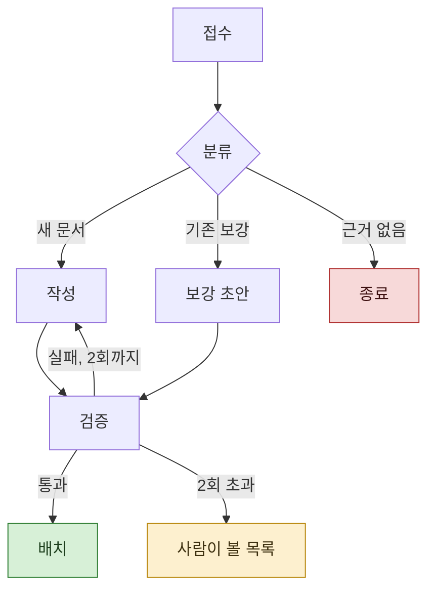

> **기준 출처:** D. Harel, *Statecharts: A Visual Formalism for Complex Systems*, Science of Computer Programming 8 (1987) 231-274 ([원문](https://www.sciencedirect.com/science/article/pii/0167642387900359)) · [MathWorks, Parallel and Exclusive States](https://www.mathworks.com/help/stateflow/parallel-and-exclusive-state-semantics.html) · [MathWorks, Execution Order for Parallel States](https://www.mathworks.com/help/stateflow/ug/execution-order-for-parallel-states.html) · [Claude Code Docs, Create custom subagents](https://code.claude.com/docs/en/sub-agents) / 확인일 2026-08-24
> **시리즈:** [목차](/posts/00-orch-series/) | 이전 → [02. 제어 구조를 모델 밖으로](/posts/02-control-outside-the-model/) | 다음 → [04. 병렬 상태로 읽는 팬아웃](/posts/04-fanout-as-parallel-states/)

앞 편에서 오케스트레이션이 단계와 배선을 코드로 고정하는 일이라고 했다. 그 그림을 그리다 보면 익숙한 모양이 나온다.

## 1. 왜 닮는가

Harel 이 1987년 논문에서 상태 전이 다이어그램에 더한 것은 정확히 셋이다. **계층, 동시성, 통신.** 큰 반응형 시스템을 그리려면 평평한 상태 기계로는 부족했기 때문이다.

오케스트레이션도 규모가 커지면 같은 셋이 필요해진다.

- 단계 안에 하위 단계가 생긴다 (계층)
- 여러 갈래를 동시에 돌린다 (동시성)
- 한쪽의 발견이 다른 갈래를 바꾼다 (통신)

**같은 문제를 풀기 때문에 그림이 닮는다.** 비유가 아니라 구조가 같은 것이다.

## 2. 대응표

| Stateflow | 에이전트 오케스트레이션 |
| --- | --- |
| **State** | 에이전트 한 명이 맡은 한 단계 |
| **Transition** | 다음 단계로 넘어가는 배선 |
| **Condition (guard)** | 출력이 스키마를 만족하는가, 판정이 통과인가 |
| **Action** | 그 단계에서 실제로 도는 프롬프트 |
| **병렬(AND) 상태** | 여러 에이전트를 동시에 돌리는 팬아웃 |
| **Junction** | 결과를 모아 갈래를 나누는 지점 |
| **History junction** | 중단 후 재개. 끝난 단계는 다시 돌리지 않는다 |
| **Local, Output data** | 단계 사이에 넘기는 구조화 출력 |
| **이벤트 브로드캐스트** | 한 갈래의 발견이 다른 흐름을 깨우는 것 |
| **Chart 한 스텝** | 한 회차 |

## 3. 실제로 그려보면

예를 들어 질문 하나를 받아 문서를 만드는 흐름을 그리면 이렇게 된다.

State 가 있고, guard 가 붙은 Transition 이 있고, 재시도 카운터가 있고, 종료 상태가 둘이다. 차트 그리는 사람이 보면 읽을 것이 없다.

## 4. 어디까지 같고 어디부터 다른가

여기서 멈추면 틀린 직관을 얻는다. **대응은 어휘 수준이고 의미론까지 같지는 않다.**

가장 큰 차이가 병렬이다.

| | Stateflow 병렬(AND) 상태 | 오케스트레이션 팬아웃 |
| --- | --- | --- |
| 실제 실행 | **동시에 돌지 않는다.** 차트가 정한 순서로 한 스텝 안에서 차례로 수행된다 | **실제로 동시에** 돈다 |
| 순서 | 결정되어 있고 지정할 수 있다 | 정해지지 않는다. 먼저 끝난 것이 먼저 온다 |
| 자원 충돌 | 순차 실행이라 잘 드러나지 않는다 | 같은 파일을 동시에 쓰면 덮어쓴다 |

MathWorks 문서는 이 점을 분명히 적어둔다. 병렬 상태가 동시에 활성이더라도 차트는 시뮬레이션 중 각각을 언제 활성화할지 정해야 하고, 그 순서가 각 상태가 실행 단계를 밟는 시점을 결정한다.

그래서 09편에서 자원 경합을 따로 다룬다. Stateflow 에서는 잘 안 나타나는 문제가 여기서는 바로 나타난다.

## 5. 대응이 유용한 이유

차이를 알고 쓰면 대응표가 일한다.

FSM 을 그려본 사람은 이미 다음을 알고 있다. 상태를 너무 잘게 쪼개면 읽을 수 없다. guard 를 안 붙이면 어디로 갈지 모른다. 종료 상태가 없으면 안 끝난다. 재시도에 상한이 없으면 돈다.

**이 감각이 그대로 옮겨간다.** 오케스트레이션에서 새로 배울 것은 위 표의 오른쪽 칸뿐이다.

## 참고

- D. Harel, *Statecharts: A Visual Formalism for Complex Systems*, Science of Computer Programming 8 (1987) 231-274 [원문](https://www.sciencedirect.com/science/article/pii/0167642387900359)
- [MathWorks: Parallel and Exclusive States](https://www.mathworks.com/help/stateflow/parallel-and-exclusive-state-semantics.html)
- [MathWorks: Execution Order for Parallel States](https://www.mathworks.com/help/stateflow/ug/execution-order-for-parallel-states.html)
- [MathWorks: Stateflow Semantics](https://www.mathworks.com/help/stateflow/ug/what-do-semantics-mean-for-stateflow-charts.html)
- [Claude Code Docs: Create custom subagents](https://code.claude.com/docs/en/sub-agents)
