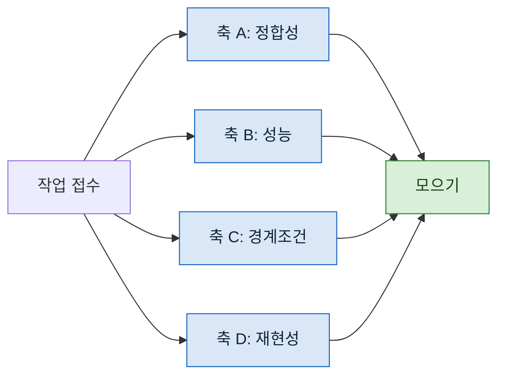

> **기준 출처:** [Claude Code Docs, Create custom subagents](https://code.claude.com/docs/en/sub-agents) · [MathWorks, Parallel and Exclusive States](https://www.mathworks.com/help/stateflow/parallel-and-exclusive-state-semantics.html) / 확인일 2026-08-24
> **시리즈:** [목차](/posts/00-orch-series/) | 이전 → [03. 대응표](/posts/03-stateflow-mapping/) | 다음 → [05. 파이프라인과 배리어](/posts/05-pipeline-and-barrier/)

일을 여러 명에게 나눌 때 제일 먼저 부딪치는 질문은 "어떻게 나누나" 다.

## 1. 양으로 나누면 안 되는 이유

파일 100개를 25개씩 네 명에게 주면 빠르기는 하다. 그런데 네 명이 **같은 눈**으로 본다.

각자 받은 프롬프트가 같고, 각자 세우는 기준이 같고, 각자 놓치는 것도 같다. **한 각도로 못 찾는 것은 넷 다 못 찾는다.** 병렬로 돌린 값이 시간 단축뿐이다.

대신 같은 대상을 네 관점으로 나누면 다르다.

| 나누는 방식 | 네 명이 찾는 것 |
| --- | --- |
| 양 (파일 25개씩) | 같은 종류의 문제 4배 |
| **축** (정합성 / 성능 / 경계조건 / 재현성) | **서로 겹치지 않는 문제 4종** |

같은 파일을 네 번 읽는 낭비처럼 보이지만, 읽는 목적이 다르면 다른 것이 보인다. 코드 리뷰에 리뷰어를 늘리는 것과 체크리스트를 늘리는 것이 다른 일인 것과 같다.

## 2. 이 성질은 어디서 오나

축으로 나누는 것이 실제로 작동하려면 **각자가 서로를 안 봐야** 한다. 한 명이 먼저 낸 결론을 다른 명이 보면 거기에 끌려간다.

서브에이전트가 정확히 이 성질을 갖는다. 공식 문서의 표현대로, 각 서브에이전트는 **새로 격리된 컨텍스트에서 시작하고** 부모의 대화 이력을 보지 못한다. 부모가 이미 읽은 파일도, 이미 내린 결론도 물려받지 않는다.

이건 양날이다.

| | |
| --- | --- |
| 🟢 좋은 쪽 | 앞사람 결론에 끌려가지 않는다. 그래서 독립성이 성립한다 |
| 🔴 나쁜 쪽 | 필요한 배경도 안 넘어간다. **프롬프트에 안 적은 것은 없는 것이다** |

나쁜 쪽을 잊으면 팬아웃이 헛돈다. "아까 말한 그 파일" 이라고 쓰면 그 에이전트에게는 아무 뜻이 없다.

## 3. Stateflow 로 보면

병렬(AND) 상태다. 같은 스텝에서 여러 갈래가 동시에 활성이고, 각 갈래는 자기 안에서 자기 일을 한다.

다만 03편에서 그은 선을 기억해야 한다. **Stateflow 의 병렬 상태는 실제로 동시에 돌지 않는다.** 차트가 정한 순서로 한 스텝 안에서 차례로 수행된다. 여기서는 진짜로 동시에 돈다.

그 차이가 만드는 문제가 둘이다.

- **끝나는 순서가 정해지지 않는다.** 먼저 끝난 것이 먼저 온다. 결과를 순서에 의존해 쓰면 안 된다
- **같은 자원을 동시에 건드린다.** 09편에서 따로 다룬다

## 4. 몇 개로 나눌 것인가

축을 늘리면 커버리지가 늘지만 무한정은 아니다. 실제로 걸리는 것은 셋이다.

| 한계 | 무엇 |
| --- | --- |
| **동시 실행 상한** | 실행 환경이 동시에 돌리는 수를 제한한다. 넘으면 줄을 서므로 축을 늘려도 시간이 안 준다 |
| **축의 독립성** | 축 두 개가 사실상 같은 것을 보면 결과가 겹친다. 겹치는 만큼이 낭비다 |
| **합치는 비용** | 결과가 많아지면 모아서 정리하는 쪽이 병목이 된다 |

경험적으로는 **축을 먼저 적어보고 겹치는 것을 지우는** 순서가 낫다. 개수를 정해놓고 축을 만들면 억지 축이 생긴다.

## 5. 안 되는 일

팬아웃이 안 맞는 경우도 분명하다.

- **앞 결과가 있어야 다음을 아는 일.** 탐색이 순차적이면 나눌 수가 없다
- **전체를 한꺼번에 봐야 판단되는 일.** 중복 제거가 대표적이다. 이건 05편의 배리어 이야기다
- **한 번에 끝나는 일.** 나누는 비용이 일보다 크다

## 참고

- [Claude Code Docs: Create custom subagents](https://code.claude.com/docs/en/sub-agents)
- [MathWorks: Parallel and Exclusive States](https://www.mathworks.com/help/stateflow/parallel-and-exclusive-state-semantics.html)
