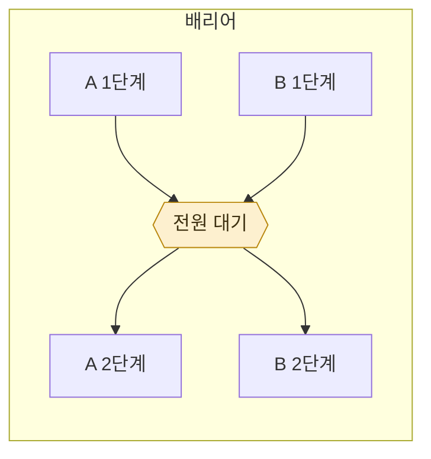

> **기준 출처:** [Claude Code Docs, Create custom subagents](https://code.claude.com/docs/en/sub-agents) · [MathWorks, Execution Order for Parallel States](https://www.mathworks.com/help/stateflow/ug/execution-order-for-parallel-states.html) / 확인일 2026-08-24
> **시리즈:** [목차](/posts/00-orch-series/) | 이전 → [04. 병렬 상태로 읽는 팬아웃](/posts/04-fanout-as-parallel-states/) | 다음 → [06. 구조화 출력이 곧 데이터 계약이다](/posts/06-schema-as-contract/)

여러 항목에 여러 단계를 적용할 때 배선이 두 가지로 갈린다. 이 선택이 전체 시간을 정한다.

## 1. 두 가지 배선

항목 다섯 개를 1단계, 2단계, 3단계에 통과시킨다고 하자.



| | 파이프라인 | 배리어 |
| --- | --- | --- |
| 배선 | 항목마다 독립적으로 1→2→3 통과 | 전원 1단계 완료 → 전원 2단계 → … |
| A가 3단계일 때 B는 | 1단계여도 된다 | 반드시 2단계 |
| 총 시간 | **가장 느린 한 항목의 사슬** | **단계마다 가장 느린 항목의 합** |

## 2. 배리어의 비용

숫자로 보면 분명하다. 항목 다섯 개, 단계 셋, 각 단계에 걸리는 시간이 항목마다 다르다고 하자.

가장 느린 항목이 가장 빠른 항목의 세 배 걸린다면, 배리어를 걸 때마다 빠른 넷은 **자기 시간의 삼분의 이를 기다리는 데 쓴다.** 단계가 셋이면 그 손실이 세 번 쌓인다.

파이프라인에서는 그 대기가 없다. 빠른 항목은 먼저 3단계까지 가고, 느린 항목은 자기 속도로 간다. 전체 시간은 **가장 느린 항목 하나가 끝까지 가는 시간**이다.

그래서 **기본값은 파이프라인**이다.

## 3. 배리어가 정당한 경우

그럼에도 걸어야 하는 때가 있다. 조건은 하나로 정리된다.

> **다음 단계가 앞 단계 전부를 한꺼번에 봐야 할 때만 정당하다.**

구체적으로 셋이다.

| | 왜 전부가 필요한가 |
| --- | --- |
| **중복 제거** | 무엇이 겹치는지는 전부 모여야 안다. 항목별로는 판단이 안 된다 |
| **조기 종료** | 합계가 0이면 다음 단계를 통째로 건너뛴다. 합계는 전부 모여야 나온다 |
| **상호 비교** | 다음 단계 프롬프트가 "다른 결과들과 비교해서" 를 요구한다 |

## 4. 정당하지 않은 경우

여기가 실제로 헷갈리는 자리다. 아래 셋은 배리어처럼 보이지만 아니다.

**"결과를 펼치고 걸러야 해서"**
그 변환은 파이프라인 **단계 안에서** 하면 된다. 항목 하나의 결과를 정리하는 데 다른 항목이 필요하지 않다.

**"단계가 개념적으로 나뉘어서"**
단계가 나뉜 것과 **동기화되어야 하는 것**은 다르다. 조사와 작성은 분명히 다른 일이지만, A의 작성이 B의 조사를 기다릴 이유는 없다.

**"코드가 깔끔해서"**
대기 시간은 실제 비용이다. 읽기 좋은 코드를 위해 치르기에는 비싸다.

## 5. 판별법

코드가 이런 모양이면 배리어가 불필요한 경우가 많다.

```
결과들 = 전부_기다림(1단계)
정리됨 = 펼치고_거른다(결과들)      ← 항목 간 의존이 없다
최종   = 전부_기다림(2단계, 정리됨)
```

가운데 줄이 **항목끼리 비교하지 않으면** 배리어가 필요 없다. 그 변환을 1단계 뒤에 붙여 파이프라인으로 만들면 된다.

반대로 가운데 줄이 "이미 나온 것과 겹치는지" 를 보고 있으면 배리어가 맞다.

## 6. 섞어 쓰기

실제로는 한 흐름 안에서 둘이 섞인다.

```
축별 조사 (파이프라인)
  → 발견마다 곧바로 검증 (파이프라인, 배리어 없음)
  → 전부 모아 중복 제거 (배리어, 여기서만)
  → 최종 정리
```

축 A의 발견이 검증되는 동안 축 B는 아직 조사 중이어도 된다. **모으는 것은 중복 제거 직전 한 번뿐**이다.

## 7. Stateflow 로 보면

병렬 상태들이 각자 자기 스텝을 밟는 것이 파이프라인이고, 모든 갈래가 특정 조건을 만족할 때까지 다음 상태로 못 가게 막는 것이 배리어다.

차트에서는 후자를 그리려면 조건을 명시적으로 써야 한다. 오케스트레이션에서도 같다. **배리어는 저절로 생기지 않고 누가 걸어야 생긴다.** 그러니 걸 때마다 위 조건 셋 중 어디에 해당하는지 답할 수 있어야 한다.

## 참고

- [Claude Code Docs: Create custom subagents](https://code.claude.com/docs/en/sub-agents)
- [MathWorks: Execution Order for Parallel States](https://www.mathworks.com/help/stateflow/ug/execution-order-for-parallel-states.html)
