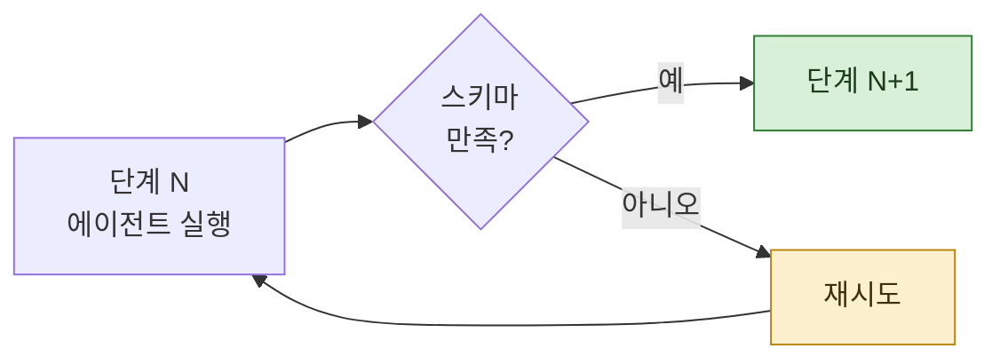

> **기준 출처:** [Claude Platform Docs, Structured outputs](https://platform.claude.com/docs/en/build-with-claude/structured-outputs) · [Claude Agent SDK, Get structured output from agents](https://platform.claude.com/docs/en/agent-sdk/structured-outputs) · [Claude Platform Docs, Strict tool use](https://platform.claude.com/docs/en/agents-and-tools/tool-use/strict-tool-use) / 확인일 2026-08-24
> **시리즈:** [목차](/posts/00-orch-series/) | 이전 → [05. 파이프라인과 배리어](/posts/05-pipeline-and-barrier/) | 다음 → [07. 적대적 검증](/posts/07-adversarial-verification/)

앞의 두 편이 "누가 언제 도는가" 였다면 이번 편은 "무엇을 넘기는가" 다.

## 1. 자유 문장의 문제

단계 사이를 문장으로 넘기면 다음 단계가 그것을 다시 해석해야 한다.

```
"세 군데 문제가 있는 것 같습니다. 특히 두 번째가 심각해 보이는데,
 파일은 아마 config 쪽일 겁니다."
```

다음 단계가 여기서 파일 경로를 뽑아야 한다. 뽑다가 틀릴 수 있고, **틀려도 티가 안 난다.** 그냥 다음 단계가 엉뚱한 파일을 열고, 거기서 아무것도 못 찾고, "문제 없음" 이라고 답한다.

앞 편들에서 본 실패 모드와 같은 모양이다. 실패가 조용하다.

## 2. 스키마가 하는 일

정해진 모양으로만 답하게 강제하면 다르다.

```json
[
  {"file": "src/config.ts", "line": 42, "severity": "high", "what": "..."},
  {"file": "src/auth.ts",   "line": 17, "severity": "low",  "what": "..."}
]
```

다음 단계는 해석 없이 그대로 쓴다. 그리고 모양이 안 맞으면 **그 자리에서 걸린다.** 뒤로 안 흘러간다.

공식 문서는 이것을 두 갈래로 제공한다. 응답 자체를 정해진 JSON 형식으로 받는 쪽(`output_config.format`)과, 도구 입력이 스키마를 만족하도록 보장하는 쪽(`strict: true`)이다. 둘은 따로 써도 되고 같이 써도 된다.

Agent SDK 에서는 JSON Schema 를 `outputFormat` 으로 넘기면 되고, 에이전트가 끝났을 때 결과에 검증된 데이터가 담겨 온다.

## 3. Transition 의 guard 와 같은 자리

Stateflow 에서 Transition 에 조건을 붙이면, 그 조건이 참일 때만 다음 상태로 간다. 조건이 거짓이면 그 자리에 머문다.

스키마가 정확히 그 자리에 있다.



차이가 있다면 guard 를 사람이 안 써도 된다는 것이다. **스키마를 쓰면 guard 가 따라온다.** 모양 검사가 곧 전이 조건이다.

문서가 설명하는 strict tool use 의 원리도 여기에 닿아 있다. 모델의 토큰 샘플링을 스키마에 맞는 출력만 나오도록 제약하는 방식이라, 검사해서 되돌리는 것이 아니라 애초에 어긋난 것이 안 나온다.

## 4. 스키마를 설계하는 규칙

모양을 정하는 일이 곧 단계 사이의 계약을 정하는 일이다. 실무에서 걸리는 것 넷.

**필수 항목을 아끼지 않는다.**
선택 항목이 많으면 다음 단계가 다시 `if (있으면)` 을 써야 한다. 그건 해석이 돌아온 것이다.

**근거 칸을 넣는다.**
`what` 만 있으면 "무엇을 어떻게 확인했는지" 가 사라진다. `evidence` 나 `method` 를 넣어두면 뒤 단계가 그걸 검증할 수 있다.

**개수를 세는 칸을 넣는다.**
01편에서 본 "실패 0건" 문제가 여기서 풀린다. 결과 배열이 비었을 때 `checkedCount` 가 함께 오면 **0건을 검사한 것과 0건이 발견된 것이 구분된다.**

**등급을 열거형으로 고정한다.**
`severity` 를 자유 문자열로 두면 "높음", "high", "심각", "주의" 가 섞인다. 뒤에서 정렬도 필터도 안 된다.

## 5. 스키마가 못 하는 것

모양이 맞는다고 내용이 맞는 것은 아니다.

`{"file": "src/x.ts", "line": 9999, "severity": "high"}` 는 스키마를 완벽히 만족하면서 존재하지 않는 줄을 가리킬 수 있다. 스키마는 **형식의 계약**이지 사실의 보증이 아니다.

그래서 다음 편이 필요하다. 내용이 맞는지는 다른 장치가 본다.

## 참고

- [Claude Platform Docs: Structured outputs](https://platform.claude.com/docs/en/build-with-claude/structured-outputs)
- [Claude Agent SDK: Get structured output from agents](https://platform.claude.com/docs/en/agent-sdk/structured-outputs)
- [Claude Platform Docs: Strict tool use](https://platform.claude.com/docs/en/agents-and-tools/tool-use/strict-tool-use)
