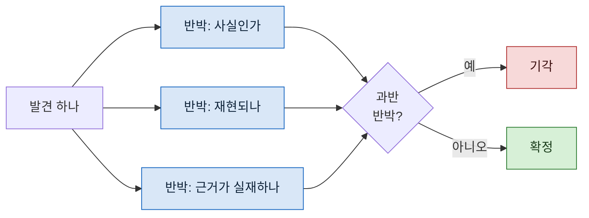

> **기준 출처:** [Claude Code Docs, Create custom subagents](https://code.claude.com/docs/en/sub-agents) · [Claude Agent SDK, Subagents](https://platform.claude.com/docs/en/agent-sdk/subagents) / 확인일 2026-08-24
> **시리즈:** [목차](/posts/00-orch-series/) | 이전 → [06. 구조화 출력이 곧 데이터 계약이다](/posts/06-schema-as-contract/) | 다음 → [08. 수렴 조건](/posts/08-convergence-condition/)

앞 편에서 스키마가 형식의 계약이지 사실의 보증은 아니라고 했다. 내용을 보는 것은 다른 장치다.

## 1. 왜 자기 검증이 안 되나

01편에서 본 두 번째 문제다. 만든 쪽과 검사하는 쪽이 같은 맥락에 있으면 통과시킨다.

같은 대화 안에서는 이유가 생기지 않는다. 방금 그 결론을 낸 근거가 여전히 눈앞에 있고, 그 근거를 의심할 새 정보가 없다. **틀린 곳을 찾으려면 자기 판단을 의심해야 하는데, 의심할 재료가 자기 안에 없다.**

그래서 검증은 새 컨텍스트가 해야 한다. 서브에이전트가 부모의 대화 이력을 안 물려받는다는 성질이 여기서 도구가 된다. 04편에서는 그것이 관점의 독립성을 줬다면, 여기서는 **판단의 독립성**을 준다.

## 2. 그런데 독립만으로는 부족하다

새 컨텍스트에 "이 발견이 맞는지 확인해 달라" 고 시키면 대개 맞다고 한다.

확인해 달라는 요청은 **확인을 목표로 만든다.** 그럴듯한 근거가 하나만 보여도 요청이 충족되기 때문이다. 반증을 찾을 이유가 여전히 없다.

목표를 뒤집으면 달라진다.

| 시키는 말 | 검증자가 찾는 것 |
| --- | --- |
| "맞는지 확인해라" | 맞다는 근거 하나 |
| **"틀렸다는 것을 보여라"** | **틀렸다는 근거 전부** |

같은 발견을 같은 모델이 보는데, 무엇을 찾으라고 하느냐에 따라 결과가 갈린다. 이것이 적대적 검증이다.

## 3. 한 명으로는 안 되는 경우

반박을 시켜도 한 명이면 그 한 명의 각도만 본다. 발견이 여러 방식으로 틀릴 수 있으면 여러 각도가 필요하다.

두 가지 구성이 있다.

**같은 렌즈 N명 (다수결)**
동일한 반박 지시를 N명에게 주고, 과반이 반박하면 기각한다. 판단의 흔들림을 평균으로 누른다.

**다른 렌즈 N명 (관점 분할)**
각자 다른 각도를 준다. 정합성 / 재현성 / 부작용 / 근거의 실재. 하나라도 확실히 반박하면 기각한다.

발견이 **한 가지 방식으로만 틀릴 수 있으면** 다수결이 낫고, **여러 방식으로 틀릴 수 있으면** 관점 분할이 낫다. 후자에 다수결을 섞으면 서로 다른 것을 본 사람들의 표를 더하는 셈이라 뜻이 흐려진다.

## 4. 검증자에게 무엇을 주지 않을 것인가

여기가 실제로 자주 무너지는 자리다.

🔴 **만든 쪽의 보고를 근거로 주지 않는다.** "이 에이전트가 이렇게 판단했는데 맞는지 봐 달라" 라고 하면, 그 판단이 앵커가 되어 독립성이 사라진다. 대상만 준다. 파일 경로, 발견 내용, 그게 전부다.

🔴 **통과가 목표라는 신호를 주지 않는다.** "마지막 확인입니다" 나 "곧 배포합니다" 같은 말이 붙으면 통과 쪽으로 기운다.

## 5. FDIR 과 같은 자리

제어 쪽에서는 익숙한 구조다. 고장을 검출하고(Detection), 어디서 났는지 가르고(Isolation), 그 부분을 떼어내는(Recovery) 흐름.

적대적 검증이 하는 일이 그 앞의 두 단계다. 발견 중에 틀린 것을 검출하고, 어느 발견인지 가른다. 세 번째는 오케스트레이션이 정한다. 재시도할지, 사람에게 넘길지.

중요한 것은 **검출기가 검출 대상과 독립이어야** 한다는 점이다. 센서 하나로 그 센서의 고장을 못 잡는 것과 같다.

## 6. 비용

검증자를 붙이면 그만큼 더 돈다. 발견 하나에 세 명이면 검증 비용이 조사 비용을 넘을 수도 있다.

그래서 붙이는 기준을 정해두는 편이 낫다.

| 붙인다 | 안 붙인다 |
| --- | --- |
| 결과가 되돌리기 어렵다 (발행, 배포, 삭제) | 되돌리기 쉽다 |
| 발견이 그럴듯한데 확인이 어렵다 | 바로 확인된다 |
| 사람이 그 결과를 근거로 판단한다 | 중간 산출물이다 |

## 참고

- [Claude Code Docs: Create custom subagents](https://code.claude.com/docs/en/sub-agents)
- [Claude Agent SDK: Subagents](https://platform.claude.com/docs/en/agent-sdk/subagents)
