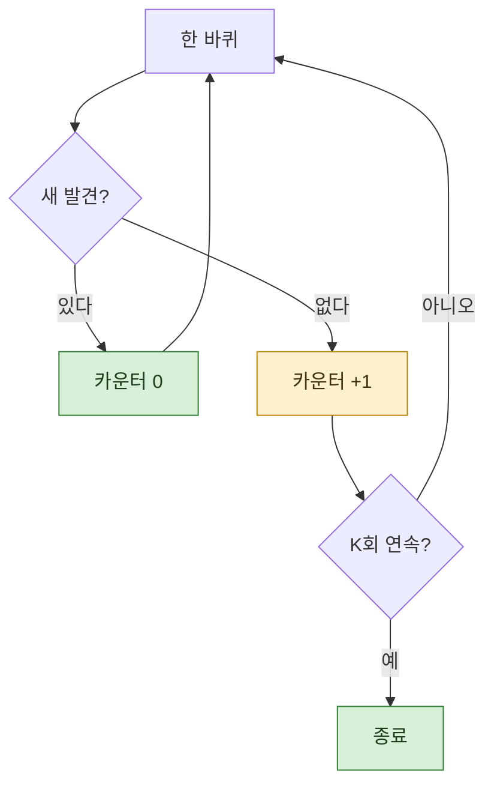

> **기준 출처:** [Claude Code Docs, Create custom subagents](https://code.claude.com/docs/en/sub-agents) / 확인일 2026-08-24. 채터링과 최소 체류 시간 비교는 스위칭 시스템의 일반적인 논의를 가져온 것이고, 이 글에서 새로 측정한 수치는 없다.
> **시리즈:** [목차](/posts/00-orch-series/) | 이전 → [07. 적대적 검증](/posts/07-adversarial-verification/) | 다음 → [09. 자원 경합](/posts/09-resource-contention/)

찾는 일에는 끝이 없다. 언제 그만둘지를 정하는 것이 오케스트레이션의 일이다.

## 1. 개수로 끊으면 꼬리를 놓친다

"열 개 찾으면 종료" 는 쓰기 쉽다. 그리고 대개 틀린다.

발견의 개수를 미리 안다면 애초에 찾을 필요가 없다. 모르니까 찾는 것이고, 모르는 상태에서 정한 숫자는 근거가 없다. 열 개에서 끊으면 열한 번째가 있었는지 알 수 없고, 스무 개로 늘리면 열 개만 있는 경우에 열 바퀴를 헛돈다.

**개수는 결과이지 조건이 아니다.**

## 2. 마르는 것으로 끊는다

대신 이렇게 정한다.

> **연속 K회 새 발견이 없으면 종료한다.**

한 바퀴 돌려서 새것이 나오면 카운터를 0으로 되돌리고, 안 나오면 하나 올린다. K에 닿으면 끝낸다.



K가 1이면 한 번 허탕에 끝난다. 운 나쁜 한 바퀴에 속는다. K를 2나 3으로 두면 그 흔들림을 견딘다.

## 3. 채터링을 막는 것과 같은 발상

제어에서 모드를 갈아탈 때 같은 문제를 만난다. 경계 근처에서 신호가 조금 흔들리면 모드가 왔다갔다 한다. 채터링이다.

막는 방법이 둘이다.

| 제어 쪽 장치 | 여기서는 |
| --- | --- |
| **히스테리시스**: 들어가는 문턱과 나오는 문턱을 다르게 둔다 | 발견으로 치는 기준과 안 치는 기준을 다르게 둔다 |
| **최소 체류 시간**: 한 모드에 최소 얼마는 머물게 한다 | **연속 K회** 조건이 정확히 이것이다 |

전환 판단을 한 번의 관측이 아니라 **유지된 관측**으로 바꾸는 것. 같은 아이디어다.

## 4. 수렴하지 않는 흔한 원인

이 구조를 넣었는데도 안 끝나는 경우가 있다. 원인이 거의 하나다.

🔴 **중복 판정의 기준을 「확정된 것」으로 잡았을 때.**

07편의 검증에서 기각된 발견을 "본 것" 에서 빼면, 다음 바퀴에 같은 것이 다시 올라온다. 새 발견으로 세어지고, 카운터가 0으로 돌아가고, 다시 기각된다. 영원히 돈다.

```
❌ 기준 = 확정된 발견 집합     → 기각된 것이 매 바퀴 되돌아온다
✅ 기준 = 지금까지 본 것 전부   → 기각된 것도 두 번째부터는 새것이 아니다
```

기각도 정보다. 버리면 안 된다.

## 5. 상한은 따로 둔다

수렴 조건과 별개로 **바퀴 수 상한**은 있어야 한다. 무한 루프를 막는 것이 아니라, **끝나지 않는다는 사실을 알기 위해서**다.

상한에 걸려 끝났으면 그건 "다 찾았다" 가 아니라 "못 끝냈다" 다. 두 종료를 구분해서 보고해야 한다. 구분하지 않으면 미완을 완료로 읽는다.

| 종료 사유 | 뜻 |
| --- | --- |
| 연속 K회 새 발견 없음 | 마른 것으로 판단 |
| 바퀴 수 상한 도달 | **아직 나오는 중인데 멈췄다** |
| 예산 소진 | 위와 같음 |

## 6. K를 얼마로 둘 것인가

정답은 없고, 대신 무엇을 보고 정할지는 말할 수 있다.

- **발견이 드문드문 나오는 일**이면 K를 크게. 한 바퀴 비었다고 마른 게 아니다
- **발견이 초반에 몰리는 일**이면 K를 작게. 뒤로 갈수록 나올 확률이 급히 준다
- **한 바퀴가 비싼 일**이면 K를 작게 하고 대신 한 바퀴의 범위를 넓힌다

실무에서는 K=2 로 시작해 몇 번 돌려보고 조정하는 편이 낫다. **첫 회차의 로그가 그 판단의 근거**가 되므로, 바퀴마다 새 발견 수를 기록해 두는 것이 중요하다.

## 참고

- [Claude Code Docs: Create custom subagents](https://code.claude.com/docs/en/sub-agents)
