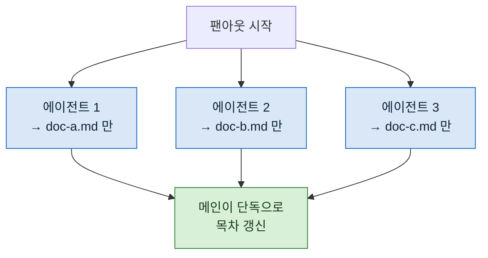

> **기준 출처:** [MathWorks, Execution Order for Parallel States](https://www.mathworks.com/help/stateflow/ug/execution-order-for-parallel-states.html) · [Claude Code Docs, Create custom subagents](https://code.claude.com/docs/en/sub-agents) / 확인일 2026-08-24
> **시리즈:** [목차](/posts/00-orch-series/) | 이전 → [08. 수렴 조건](/posts/08-convergence-condition/) | 다음 → [10. 권한으로 막기](/posts/10-tools-as-interlock/)

03편에서 그은 선이 실제 문제가 되는 자리가 여기다.

## 1. 왜 여기서만 나타나나

Stateflow 의 병렬(AND) 상태는 동시에 활성이지만 **실제로 동시에 실행되지는 않는다.** 차트가 각 상태를 언제 활성화할지 정하고, 그 순서대로 한 스텝 안에서 차례로 수행된다.

그래서 두 병렬 갈래가 같은 변수를 써도 순서가 결정되어 있다. 결과가 놀랍지는 않다.

오케스트레이션의 팬아웃은 다르다. **진짜로 동시에 돈다.** 두 에이전트가 같은 파일을 읽고, 각자 고치고, 각자 쓴다. 나중에 쓴 쪽이 먼저 쓴 쪽의 결과를 통째로 덮는다.

더 나쁜 것은 실패가 조용하다는 것이다. 둘 다 성공을 보고한다. 파일에는 하나만 남는다.

## 2. 다축 제어에서 본 문제

제어 쪽에서 익숙한 구조다. 축이 여럿이면 각 축의 제어 루프가 같은 자원을 두고 겹친다. 통신 대역, 연산 시간, 공유 메모리.

해법도 같은 계열이다. **자원을 쪼개 소유자를 하나로 만든다.** 축마다 자기 슬롯을 주거나, 공유 구간을 짧게 만들고 그 구간만 배타적으로 잡는다.

여기서도 같다.

## 3. 세 가지 방법

| 방법 | 무엇 | 언제 |
| --- | --- | --- |
| **파일 분할 소유** | 에이전트 한 명당 쓰기 대상 파일 하나를 미리 배정한다. 배정 밖은 쓰지 않는다 | 산출물이 항목마다 갈라질 때 |
| **단일 소유자** | 모두가 건드리는 파일은 팬아웃이 끝난 뒤 **한 명만** 갱신한다 | 목차, 집계표처럼 모으는 파일 |
| **새 파일만** | 기존 파일 수정은 초안으로 내고 병합은 나중에 한 명이 한다 | 기존 문서를 보강할 때 |



목차 파일이 병렬 구간 밖에 있는 것이 요점이다. 그 파일은 모두가 한 줄씩 추가하고 싶어하는 파일이라 **경합의 전형**이다.

## 4. 도구로는 경로가 안 묶인다

여기서 조심할 것이 하나 있다.

다음 편에서 다룰 도구 제한은 **"쓰기를 할 수 있는가"** 를 정한다. **"어디에 쓰는가"** 는 정하지 못한다. 쓰기 도구를 준 순간 그 에이전트는 어느 파일이든 쓸 수 있다.

즉 파일 분할 소유는 **지시가 유일한 경계**다. 구조적 보장이 아니라 약속이다.

그래서 뒤에 검사가 필요하다. 팬아웃이 끝나면 각 에이전트가 배정 밖을 건드렸는지 확인한다. 버전 관리 아래에 있다면 변경된 파일 목록을 보는 것으로 충분하다.

## 5. 읽기는 겹쳐도 된다

경합은 쓰기에서만 생긴다. 여러 에이전트가 같은 파일을 **읽는** 것은 문제가 없고, 오히려 흔하다. 04편의 축 분할이 바로 같은 대상을 여러 각도로 읽는 구성이다.

그래서 실무의 기본형은 이렇게 된다.

```
읽기: 공유해도 된다  (같은 재료를 여러 명이 본다)
쓰기: 반드시 쪼갠다  (한 파일에 한 명)
모으기: 한 명이 한다 (병렬 구간 밖에서)
```

## 6. 경합이 남는 자리

파일만 자원이 아니다. 실무에서 겹치는 것 몇 가지.

- **외부 호출 한도.** 여러 에이전트가 같은 API 를 동시에 두드리면 제한에 걸린다. 실패가 아니라 지연으로 나타나서 원인을 찾기 어렵다
- **같은 작업 디렉터리.** 임시 파일 이름이 겹치면 서로 덮는다. 에이전트마다 별도 폴더를 주는 편이 낫다
- **순번.** "다음 번호" 를 각자 계산하면 같은 번호를 둘이 쓴다. 번호 배정은 팬아웃 전에 끝내둔다

마지막이 특히 조용하다. 파일이 안 겹쳐도 **내용 안의 식별자가 겹친다.**

## 참고

- [MathWorks: Execution Order for Parallel States](https://www.mathworks.com/help/stateflow/ug/execution-order-for-parallel-states.html)
- [Claude Code Docs: Create custom subagents](https://code.claude.com/docs/en/sub-agents)
