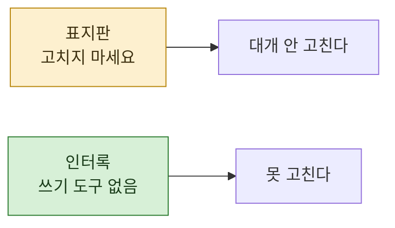

> **기준 출처:** [Claude Code Docs, Create custom subagents](https://code.claude.com/docs/en/sub-agents) · [Claude Agent SDK, Subagents](https://platform.claude.com/docs/en/agent-sdk/subagents) / 확인일 2026-08-24
> **시리즈:** [목차](/posts/00-orch-series/) | 이전 → [09. 자원 경합](/posts/09-resource-contention/) | 다음 → [11. History 상태](/posts/11-history-and-resume/)

앞 편에서 파일 분할 소유가 "지시가 유일한 경계" 라고 했다. 지시보다 단단한 층이 하나 더 있다.

## 1. 부탁과 권한의 차이

프롬프트에 "파일을 고치지 마세요" 라고 쓰면 대개 안 고친다. **대개** 다.

모델이 그 지시를 얼마나 무겁게 받아들일지는 그때그때 다르다. 맥락이 길어지면 앞의 지시가 묻히고, 상황이 절박해 보이면 예외를 만든다. 확률이 낮아도 0은 아니다.

도구를 안 주면 확률이 0이 된다. **없는 도구는 부를 수 없다.**

| | 부탁 | 도구 제거 |
| --- | --- | --- |
| 성격 | 확률적 | 구조적 |
| 맥락이 길어지면 | 약해진다 | 그대로 |
| 모델이 바뀌면 | 달라질 수 있다 | 그대로 |

## 2. 어떻게 거는가

공식 문서는 두 가지 방식을 제공한다. `tools` 필드를 **허용 목록**으로 쓰거나, `disallowedTools` 를 **차단 목록**으로 쓴다.

```yaml
---
name: safe-researcher
description: Research agent with restricted capabilities
tools: Read, Grep, Glob, Bash
---
```

문서의 설명대로 이 에이전트는 파일을 고칠 수도, 만들 수도, MCP 도구를 쓸 수도 없다.

허용 목록 쪽이 안전하다. 새 도구가 생겼을 때 차단 목록은 자동으로 뚫리지만 허용 목록은 안 뚫린다.

## 3. 인터록이라는 이름

제어 쪽에서 부르는 이름이 있다. **인터록.** 조건이 갖춰지지 않으면 그 동작 자체가 물리적으로 불가능하게 만드는 것이다.

문이 열려 있으면 회전을 못 걸게 하는 스위치가 그렇다. "문 열렸을 때 돌리지 마세요" 라는 표지판과 다르다. 표지판은 사람이 읽고 지켜야 하지만, 스위치는 안 지킬 방법이 없다.

도구 제한이 그 스위치다.



## 4. 어디에 거는가

역할별로 정하면 대개 이렇게 갈린다.

| 역할 | 주는 도구 | 왜 |
| --- | --- | --- |
| **탐색자** | 읽기, 검색만 | 근거를 모아 오는 일이다. 고칠 이유가 없다 |
| **검증자** | 읽기, 검색만 | 🔴 고칠 수 있으면 **틀린 것을 지적하는 대신 고쳐버린다.** 그러면 검증 기록이 안 남는다 |
| **작성자** | 읽기 + 쓰기 | 산출물을 만들어야 한다. 대신 09편의 배정 규칙이 붙는다 |
| **조율자** | 전부 | 마지막에 모으고 배치한다 |

검증자에게 쓰기를 안 주는 이유가 특히 중요하다. **고칠 수 있는 검증자는 검증을 안 한다.** 발견을 목록으로 내는 대신 조용히 고치고, 무엇이 틀렸었는지가 사라진다.

## 5. 도구 제한으로 못 하는 것

앞 편에서 말한 한계를 다시 짚어야 한다.

🔴 **경로는 못 묶는다.** `tools` 는 "쓰기를 할 수 있는가" 를 정하지 "어디에 쓰는가" 를 정하지 않는다. 쓰기를 준 순간 그 에이전트는 어느 파일이든 쓸 수 있다.

그래서 층이 둘이 된다.

| 층 | 무엇을 막나 | 성격 |
| --- | --- | --- |
| 도구 제한 | 할 수 있는 **동작의 종류** | 구조적 |
| 배정 지시 | 그 동작의 **대상 범위** | 약속 |
| 사후 검사 | 약속이 지켜졌는지 | 사후 |

가장 안쪽만 구조적이고 나머지는 아니다. 이 사실을 알고 설계하는 것과 모르고 "권한을 걸었으니 안전하다" 고 믿는 것은 다르다.

## 6. 사람 게이트는 도구로 못 만든다

마지막 한 겹이 남는다. **되돌릴 수 없는 동작 앞에는 사람이 서야 한다.**

발행, 배포, 삭제, 외부로 보내기. 이런 것들은 도구를 주느냐 마느냐로 나눌 수 없다. 언젠가는 실행해야 하기 때문이다.

이 자리는 자동화하지 않는 것으로만 지켜진다. 오케스트레이션이 거기까지 밀고 가서 **멈추고 기다리게** 만드는 것이 설계다. "알아서 다 해줘" 라는 요청이 와도 그 지점에서는 서는 것.

## 참고

- [Claude Code Docs: Create custom subagents](https://code.claude.com/docs/en/sub-agents)
- [Claude Agent SDK: Subagents](https://platform.claude.com/docs/en/agent-sdk/subagents)
