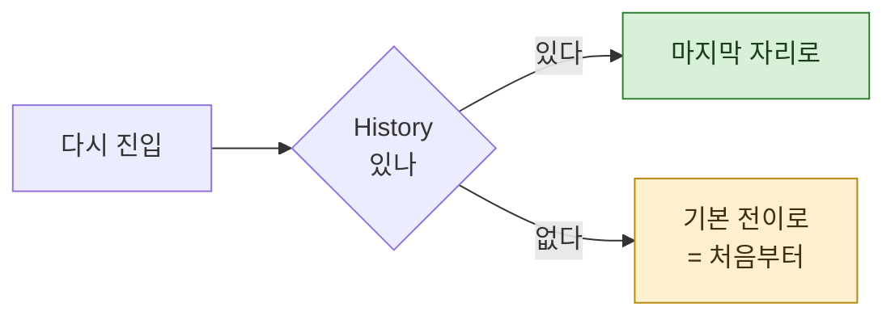

> **기준 출처:** [MathWorks, Enter a Chart or State](https://www.mathworks.com/help/stateflow/ug/chart-initialization-and-entry-actions.html) · [MathWorks, Stateflow Semantics](https://www.mathworks.com/help/stateflow/ug/what-do-semantics-mean-for-stateflow-charts.html) / 확인일 2026-08-24. 재개 구조에 관한 서술은 이 연재가 정리한 설계 논의이고, 특정 제품의 동작 명세가 아니다.
> **시리즈:** [목차](/posts/00-orch-series/) | 이전 → [10. 권한으로 막기](/posts/10-tools-as-interlock/) | 다음 → [12. 오케스트레이션이 깨지는 방식들](/posts/12-how-it-breaks/)

긴 흐름은 끊긴다. 예산이 다하거나, 사람이 멈추거나, 중간 단계가 실패하거나.

## 1. 처음부터 다시가 왜 문제인가

단계 열 개짜리 흐름이 아홉 번째에서 멈췄다고 하자. 다시 돌리면 앞의 여덟 개를 또 돈다.

비용이 두 배가 되는 것만 문제가 아니다. **결과가 달라진다.** 같은 프롬프트에 같은 답이 온다는 보장이 없으므로, 두 번째 실행의 1~8단계는 첫 번째와 다른 것을 만든다. 아홉 번째만 고치려던 것이 전체를 흔든다.

## 2. Stateflow 의 History junction

같은 문제를 상태 기계에서는 오래전에 풀었다.

History junction 이 있는 상태에 다시 들어가면, 기본 전이를 무시하고 **마지막으로 활성이었던 하위 상태로 돌아간다.** 문서의 표현대로, 차트 초기화 이후 그 상태의 자식이 활성이었던 적이 있으면 그 자식의 진입 동작이 수행된다.

즉 "처음으로" 가 아니라 "있던 자리로" 다.



## 3. 오케스트레이션에서 같은 것을 만들려면

History junction 이 저절로 되는 이유는 차트가 **어느 상태에 있었는지를 기억**하기 때문이다. 오케스트레이션에서도 같은 것이 필요하다. 단계마다 무엇이 들어가고 무엇이 나왔는지가 남아 있어야 한다.

남겨야 하는 것 셋.

| 무엇 | 왜 |
| --- | --- |
| **단계 식별자** | 어디까지 갔는지 |
| **그 단계의 입력** | 같은 입력인지 확인해야 결과를 재사용할 수 있다 |
| **그 단계의 출력** | 재사용할 값 |

입력을 함께 남기는 것이 요점이다. 입력이 바뀌었으면 그 단계부터는 다시 돌려야 한다. 안 그러면 낡은 결과 위에 새 단계를 쌓는다.

## 4. 어디까지 이어 붙일 수 있나

원칙은 단순하다.

> **바뀌지 않은 앞부분까지만 재사용하고, 처음 바뀐 지점부터 끝까지 다시 돈다.**

중간만 갈아끼우는 것은 안 된다. 5단계를 고쳤는데 6~10단계의 옛 결과를 쓰면, 그 결과들은 옛 5단계를 보고 만든 것이다. 겉으로는 이어져 보이는데 근거가 어긋나 있다.

이 규칙이 지켜지려면 단계가 **순서에 의존한다는 사실이 명시**되어야 한다. 06편의 구조화 출력이 여기서도 일한다. 단계 사이에 넘어가는 것이 명시적이면 무엇이 무엇에 의존하는지 보인다.

## 5. 재개를 깨뜨리는 것

의외로 자주 깨진다. 원인이 거의 하나다.

🔴 **결정적이지 않은 값이 흐름 안에 들어갈 때.**

현재 시각, 난수, 매번 달라지는 임시 경로. 이런 것이 단계의 입력에 섞이면 "같은 입력" 판정이 절대 성립하지 않는다. 재개할 때마다 전부 새로 돈다.

해법은 그 값들을 **흐름 밖에서 정해 넣는 것**이다.

```
❌ 각 단계가 실행 시각을 스스로 읽는다
✅ 시작할 때 한 번 읽어 매개변수로 넘긴다
```

제어 쪽 말로 하면 상태를 외부에서 주입하는 것이다. 흐름 자체는 순수하게 두고, 바깥이 변하는 값을 책임진다.

## 6. 체크포인트를 어디에 둘 것인가

모든 단계를 저장하면 저장 비용이 늘고, 드물게 두면 되돌아가는 폭이 커진다. 기준은 **그 단계를 다시 도는 비용**이다.

| 단계 성격 | 체크포인트 |
| --- | --- |
| 비싸고 결과가 안정적 (대규모 조사, 외부 호출) | 반드시 둔다 |
| 싸고 빠른 변환 | 안 둬도 된다. 다시 도는 편이 싸다 |
| 사람 승인 직전 | 반드시 둔다. 승인을 기다리는 동안 세션이 끊길 수 있다 |

마지막이 실무에서 제일 많이 걸린다. 사람을 기다리는 시간이 가장 길기 때문이다.

## 참고

- [MathWorks: Enter a Chart or State](https://www.mathworks.com/help/stateflow/ug/chart-initialization-and-entry-actions.html)
- [MathWorks: Stateflow Semantics](https://www.mathworks.com/help/stateflow/ug/what-do-semantics-mean-for-stateflow-charts.html)
