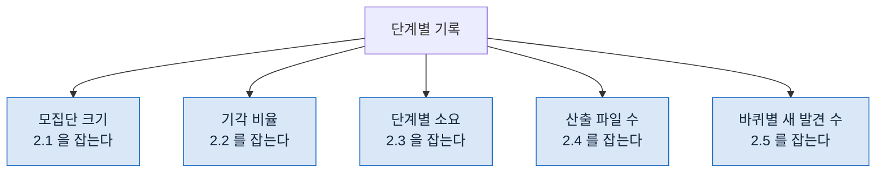

> **기준 출처:** 이 연재 01~11편의 종합이고 개별 근거는 각 편의 출처를 따른다. 실패 유형은 이 연재가 정리한 것이며 외부 문헌의 분류를 옮긴 것이 아니다. / 확인일 2026-08-24
> **시리즈:** [목차](/posts/00-orch-series/) | 이전 → [11. History 상태](/posts/11-history-and-resume/)

지금까지 무엇을 어떻게 배선하는지를 봤다. 마지막은 그 배선이 깨지는 자리다.

## 1. 조용한 실패가 기본이다

먼저 짚어야 할 성질이 있다. **오케스트레이션의 실패는 대개 예외를 안 던진다.**

각 단계는 성공을 보고하고, 흐름은 끝까지 가고, 결과가 나온다. 그 결과가 틀렸다는 것만 아무도 모른다. 크래시가 나면 오히려 다행이다. 어디가 문제인지 바로 보인다.

그래서 아래 목록은 "무엇이 터지나" 가 아니라 **"무엇이 조용히 어긋나나"** 다.

## 2. 여섯 가지

### 2.1 0건이 두 뜻이다

가장 흔하다. "실패 0건" 이 "0건을 검사했다" 일 수 있다.

검사 대상이 비었는데 루프가 그냥 안 돌고 끝나면 출력은 성공과 똑같다. 06편의 `checkedCount` 가 이걸 막는 장치였다. **결과가 비었을 때 모집단 크기를 함께 요구하면** 두 경우가 갈린다.

### 2.2 검증자가 만든 쪽의 말을 근거로 쓴다

07편의 이야기다. 검증자에게 "이렇게 판단했는데 맞는지 봐 달라" 고 주면 그 판단이 앵커가 된다.

이 실패는 **통과율이 유난히 높은 것**으로 나타난다. 검증을 붙였는데 기각이 거의 없으면 검증이 도는지 의심할 자리다.

### 2.3 배리어를 안 걸어야 할 곳에 걸었다

05편. 정합성 문제는 아니고 시간만 버린다. 그래서 발견이 늦다.

증상은 **전체 시간이 항목 수에 비례해 늘어나는 것**이다. 파이프라인이면 가장 느린 하나에 수렴해야 한다.

### 2.4 병렬 쓰기가 서로를 덮었다

09편. 두 에이전트가 같은 파일을 쓰면 나중 쪽만 남는다. 둘 다 성공을 보고한다.

증상은 **산출물 수가 배정 수보다 적은 것**이다. 다섯 명에게 시켰는데 파일이 넷이면 하나가 먹혔다.

### 2.5 수렴하지 않는다

08편. 기각된 발견을 "본 것" 에서 빼면 매 바퀴 되돌아온다.

증상은 **바퀴마다 새 발견 수가 일정한 것**이다. 마르는 중이면 줄어야 한다.

### 2.6 재개가 낡은 결과 위에 쌓았다

11편. 중간 단계를 고쳤는데 그 뒤 단계의 옛 결과를 재사용하면, 겉으로는 이어져 보이는데 근거가 어긋난다.

이건 증상이 거의 없다. **입력을 함께 저장하는 것**만이 방어다.

## 3. 어디를 봐야 보이나

위 여섯 중 다섯이 **단계별 기록**을 보면 드러난다.

이 다섯 숫자를 남기지 않으면 여섯 가지 중 어느 것도 사후에 확인할 수 없다. **기록이 없으면 조용한 실패는 영원히 조용하다.**

## 4. 이 구조를 안 써야 할 때

연재를 닫으면서 반대쪽도 적어둔다.

| 이럴 때는 안 쓴다 | 왜 |
| --- | --- |
| **한 번에 끝나는 일** | 배선 비용이 일보다 크다 |
| **무엇을 할지 모르는 일** | 순서를 고정할 수 없다. 탐색은 모델에게 맡기는 편이 낫다 |
| **한 번만 할 일** | 재현성이 값을 못 한다 |
| **사람이 바로 확인하는 일** | 검증 층이 중복이다 |

02편에서 말한 것을 다시 쓰면, 오케스트레이션이 값을 하는 것은 **이미 절차를 아는 일이 반복될 때**다. 그렇지 않은 일에 얹으면 느려지기만 한다.

## 5. 연재를 닫으며

시작할 때 던진 질문은 "여러 에이전트를 어떻게 엮는가" 였다.

답은 대부분 새로운 것이 아니었다. 단계를 나누고, 조건을 붙이고, 동시에 돌릴 것과 모을 것을 가르고, 자원을 쪼개고, 언제 그만둘지 정하고, 끊겼을 때 이어 붙인다. **FSM 을 그려본 사람이 이미 하던 일이다.**

새로운 것은 셋이었다.

- 병렬이 **진짜로 동시에** 돈다 (03, 09편)
- 검증자가 만든 쪽과 **다른 컨텍스트**에 있을 수 있다 (07편)
- 도구를 안 주는 것으로 **동작 자체를 막을 수 있다** (10편)

이 셋을 빼면 나머지는 제어에서 쓰던 어휘가 그대로 쓰인다. 그래서 대응표가 일한다. 다만 03편에서 그은 선은 계속 유효하다. **어휘 수준의 대응이지 의미론까지 같지는 않다.**

## 참고

이 연재의 개별 근거는 각 편의 출처 블록에 있다.

- [00. 목차](/posts/00-orch-series/)
