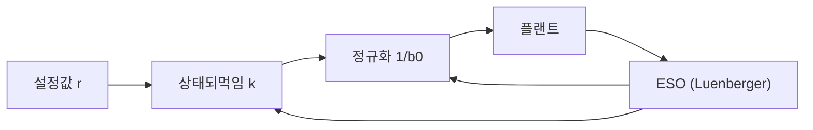
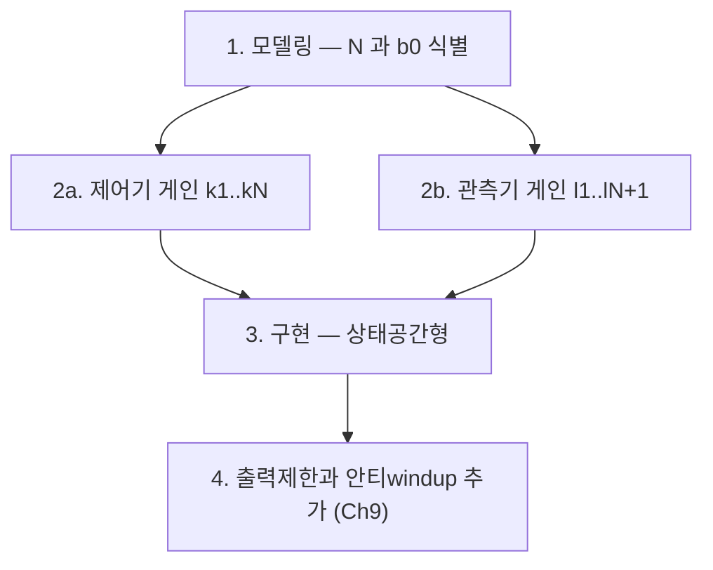

> **책:** Gernot Herbst, Rafał Madoński, *Active Disturbance Rejection Control: From Principles to Practice*, Control Engineering 시리즈, **Birkhäuser Cham, 2024** (eBook 2024-11-22), 서문 Zhiqiang Gao
> **DOI:** [10.1007/978-3-031-72687-3](https://doi.org/10.1007/978-3-031-72687-3), ISBN 978-3-031-72687-3 (eBook) / 978-3-031-72686-6 (print)
> **라이선스:** 🔓 **Open Access, CC BY 4.0** — 출처를 밝히면 인용, 복제, 번역, 개작, 코드 재사용이 자유롭다.
> **관련 시리즈:** [ADRC 목차](/posts/00-adrc-series/)

**결론부터.** [Han 의 2009 년 논문](/posts/paper-han2009-pid-to-adrc/)이 비선형 원형의 원전이라면, 이 책은 **실무에서 실제로 쓰이는 선형 ADRC(LADRC)의 정본**이다. 핵심 주장은 하나다.

> **LADRC 는 네 개의 값으로 완결된다. 차수 $N$, 임계이득 $b_0$, 제어기 대역폭 $\omega_{CL}$, 관측기 대역폭 $\omega_{ESO}$.**

나머지 게인은 전부 이 네 값에서 **이항계수로 계산된다.** 튜닝이라 부를 만한 자유도가 사실상 네 개뿐이라는 뜻이다.

CC BY 4.0 이라 수식과 코드를 출처 표기만으로 가져다 쓸 수 있다는 점도 실무에서는 큰 차이다.

---

## 1. 책의 구조

**Part I — Foundations**

| Ch | 제목 | 핵심 |
| --- | --- | --- |
| 1 | Prelude: A Fresh Look | 읽기 안내. 비순차 읽기를 권한다 |
| 2 | First Contact with ADRC | 물탱크와 질량 예제로 "얼마나 알아야 하나"를 보인다 |
| **3** | **Linear ADRC** | **N차 유도와 대역폭 파라미터화 튜닝.** 이 책의 심장 |
| 4 | Between Time & Frequency | 상태공간과 전달함수, PID 등가성 |
| 5 | Visual Tour | 튜닝 노브의 역할과 불확실성 시각화 |
| 6 | Extensions & Modifications | 모델정보 추가, 비선형, 오차기반 |
| 7 | Interlude: A Look Around | 문헌 조망 |

**Part II — Going Practical**

| Ch | 제목 | 핵심 |
| --- | --- | --- |
| **8** | **Discrete-Time LADRC** | 상태공간형, 전달함수형, 이중되먹임형 |
| 9 | Practical Aspects | 출력제한, 범프리스 전환, 측정노이즈, 데드타임 |
| 10 | Software Implementation | MATLAB/Simulink 와 **C 코드** |
| 11 | Application Examples | 히터 온도, DC-DC 컨버터 |
| 12 | Postlude | 전망 |
| 부록 A | **Linear ADRC Cheat Sheet** | 모든 튜닝식을 한 장에 |
| 부록 B | Simulink ADRC blockset | 배포용 블록 |

저자들은 **Part II 로 먼저 점프해 C 나 Simulink 레시피로 동작하는 것을 만들고, 그 다음 Part I 로 돌아와 원리를 이해하는 순서**를 권한다.

## 2. Ch3 — 플랜트를 표준형으로 옮기기

N차 일반형에서 출발한다 (식 3.1).

$$y^{(N)}(t)+\sum_{i=0}^{N-1}a_i\,y^{(i)}(t)=b\,u(t)+b_d\,d(t)$$

ADRC 는 $a_i$ 를 몰라도 된다. 필요한 것은 **차수 $N$ 과 $b$ 의 추정치 $b_0$** 뿐이고, 추정 오차 $\Delta b=b-b_0$ 는 불가피하게 남는다. 최고차 미분으로 재배열하면 알려진 것과 모르는 것이 갈린다.

$$y^{(N)}(t)=\underbrace{-\sum a_i y^{(i)}+\Delta b\,u+b_d d}_{\displaystyle f(t)\ =\ \text{total disturbance}}+\;b_0\,u(t)$$

$$y^{(N)}(t)=f(t)+b_0\,u(t) \tag{3.2}$$

**N중 적분기 사슬에 외란 입력 $f$ 가 붙은 형태**로 환원된다. 비선형, 모델 오차, 실제 외란이 전부 $f$ 안에 들어간다. 책은 $b_0$ 를 **critical gain parameter** 라 부른다.

### $b_0$ 와 $N$ 을 실제로 얻는 법 (Table 3.1)

| 플랜트 | 전달함수 | 미분방정식 | ADRC 파라미터 |
| --- | --- | --- | --- |
| 1차 저역통과 | $\dfrac{y}{u}=\dfrac{K}{Ts+1}$ | $\dot y=-\tfrac1T y+\tfrac KT u$ | $b_0=\dfrac{K}{T},\quad N=1$ |
| 2차 저역통과 | $\dfrac{y}{u}=\dfrac{K}{T^2s^2+2DTs+1}$ | $\ddot y=-\tfrac1{T^2}y-\tfrac{2D}{T}\dot y+\tfrac{K}{T^2}u$ | $b_0=\dfrac{K}{T^2},\quad N=2$ |

> **스텝응답으로 $K$ 와 $T$ 만 재면 $b_0$ 가 나온다.** 모델 동정을 제대로 할 필요가 없다는 주장이 여기서 구체적인 절차가 된다. 모터 조인트라면 $b_0 \approx K_t/J$ 에 대응한다.
{: .prompt-tip }

### 정규화 — $f$ 를 지우고 $b_0$ 를 상쇄한다

$$u(t)=\frac{u_0(t)-\hat f(t)}{b_0} \tag{3.3}$$

한 식에 두 가지가 들어 있다.

| 항 | 역할 |
| --- | --- |
| $-\hat f/b_0$ | **외란 제거** — 추정한 총외란을 상쇄한다 |
| $1/b_0$ | **플랜트 이득 역산** — 이득을 1 로 정규화한다 |

결과는 $y^{(N)}=u_0$, 즉 순수 적분기 사슬이다.

## 3. ESO 는 특별한 관측기가 아니다

내부 루프는 식 3.13, 외부 상태되먹임은 식 3.14 이고, 합치면 통합 제어법칙이 된다 (식 3.15).

$$u(t)=\frac{1}{b_0}\Big(k_1\,r(t)-\begin{bmatrix}\mathbf{k}^T & 1\end{bmatrix}\hat{\mathbf x}(t)\Big),\quad \mathbf k^T=[k_1\cdots k_N],\ \hat{\mathbf x}=[\hat x_1\cdots\hat x_{N+1}]^T$$

주목할 것은 **마지막 상태 $\hat x_{N+1}$ (총외란)에 붙는 게인이 1** 이라는 점이다. 추정한 만큼 그대로 빼서 상쇄한다. 나머지 상태에만 설계 게인 $\mathbf k^T$ 가 붙는다.

확장상태관측기는 다음과 같다 (식 3.16).

$$\dot{\hat{\mathbf x}}(t)=A\,\hat{\mathbf x}(t)+b\,u(t)+\mathbf l\big(y(t)-c^T\hat{\mathbf x}(t)\big)$$

$$A=\begin{bmatrix}\mathbf 0 & I_{N\times N}\\ 0 & \mathbf 0\end{bmatrix},\quad b=\begin{bmatrix}\mathbf 0\\ b_0\\ 0\end{bmatrix},\quad \mathbf l=[l_1\cdots l_{N+1}]^T,\quad c^T=[1\ \mathbf 0]$$

> **ESO 는 잘 알려진 Luenberger 관측기다.** 다른 점은 하나뿐이다. 모델 안에 총외란을 **상수 입력외란으로 넣었을 뿐**이다.
> 총외란을 상수로 모델링한 것이 PID 의 적분 항이 갖는 외란 제거 능력에 대응한다.
{: .prompt-info }

## 4. 대역폭 파라미터화 — 게인을 이항계수로 정한다

관측기가 충분히 빠르면 외부 제어기가 상대하는 것은 **단위이득 적분기 사슬**이다 (식 3.17). 그러면 극배치 문제가 된다. 모든 극을 $-\omega_{CL}$ 한 점에 두면 (식 3.18)

$$(\lambda+\omega_{CL})^N=\lambda^N+k_N\lambda^{N-1}+\dots+k_1$$

이고, 이항전개로 게인을 그대로 읽을 수 있다 (식 3.19).

$$k_i=\frac{N!}{(N-i+1)!\,(i-1)!}\,\omega_{CL}^{\,N-i+1},\quad i=1,\dots,N$$

실무에서 쓰는 두 경우는 다음과 같다.

| 차수 | 제어기 게인 |
| --- | --- |
| $N=1$ | $k_1=\omega_{CL}$ |
| $N=2$ | $k_1=\omega_{CL}^2,\quad k_2=2\omega_{CL}$ |

관측기도 같은 방식이다. 관측기 극을 전부 $-\omega_{ESO}$ 에 두면 $(N+1)$ 차 이항계수가 나온다 (식 3.24).

$$l_i=\binom{N+1}{i}\omega_{ESO}^{\,i}$$

$N=2$ 이면 $l_1=3\omega_{ESO},\ l_2=3\omega_{ESO}^2,\ l_3=\omega_{ESO}^3$ 이다. 널리 인용되는 그 형태가 여기서 나온다.

**두 대역폭의 비율**은 상대 관측기 대역폭으로 다룬다.

$$k_{ESO}=\frac{\omega_{ESO}}{\omega_{CL}}$$

> **출발점 권장값이 출처마다 다르다.**
> 이 책은 $k_{ESO}=3\sim10$, [MathWorks ADRC 블록 문서](https://www.mathworks.com/help/slcontrol/ug/active-disturbance-rejection-control.html)는 $5\sim10$ 을 제시한다. 둘 다 "관측기를 제어기보다 충분히 빠르게"라는 같은 경험칙이고 **하한만 다르다.** 측정 노이즈가 심하면 낮은 쪽을 택하게 된다.
{: .prompt-warning }

### 조리법 (Ch3 절차)

3단계까지의 구현에는 **출력 제한과 안티windup 이 아직 빠져 있다.** 책은 이를 Ch9 에서 따로 다룬다. 곧바로 실기기에 올리면 포화 구간에서 문제가 생긴다는 뜻이므로 순서를 기억할 필요가 있다.

## 5. Part II — 이산화와 실무

| 절 | 내용 | 왜 중요한가 |
| --- | --- | --- |
| 8.1 | **상태공간 이산형** | 소프트웨어로 구현 가능한 첫 형태. 모든 이산 변형의 기반 |
| 8.2 | 전달함수 이산형 | 고전 디지털 제어기와 비슷하지만 상태공간형의 일부 기능을 잃는다 |
| **8.3** | **이중되먹임 전달함수형** | 상태공간형 기능을 전부 유지하면서 **연산량이 가장 적다.** 임베디드에 유리 |
| 8.4 | 오차기반 이산형 | 고전 제어 구조에 가깝다 |
| 9.1 | 출력 제한과 안티windup | 포화 구간 |
| 9.2 | 범프리스 전환 | 수동/자동 전환, 모드 전환 |
| 9.3 | **측정 노이즈 대응** | $\omega_{ESO}$ 를 못 올리게 막는 실질적 벽 |
| 9.4 | 데드타임 제어 | 통신 지연이 있는 시스템 |
| 10.1~10.2 | MATLAB/Simulink 와 **C 코드** | CC BY 4.0 이므로 출처 표기 후 재사용 가능 |
| 11.1~11.2 | 히터 온도(1차), DC-DC 컨버터(2차) | 대상은 다르지만 절차는 동일 |

임베디드 관점에서는 **8.3 이중되먹임형**이 가장 실용적이다. 상태공간형의 기능을 잃지 않으면서 연산량이 줄기 때문에, 제어 주기가 빠듯한 MCU 에서 선택지가 된다.

## 6. Ch4 와 Ch6 — PID 와의 다리, 그리고 확장

Ch4 는 ADRC 를 고전 상태공간 제어의 언어로 다시 쓴다. 플랜트와 외란 모델을 확장하고(식 4.3), Luenberger 관측기를 붙이고(식 4.4), 상태되먹임과 정적이득과 외란보상을 결합한다(식 4.5). 외란이 완전히 제거되는 조건은 정확 추정 하에서 $b\,k_d^T=e\,c_d^T$ 다. §4.2 에서 전달함수형으로 옮기면 PI 및 PID 와 직접 비교할 수 있고, "필터 달린 PID" 라는 해석의 근거가 여기서 나온다.

Ch6 는 **ADRC 가 고정된 식이 아니라는 점**을 보인다.

| 절 | 확장 |
| --- | --- |
| 6.1 | 적분기 사슬 대신 아는 동역학을 관측기에 넣어 성능을 올린다 |
| 6.2 | 기준신호의 미분을 활용해 추종을 개선한다 |
| 6.3 | 비선형 ADRC — Han 의 fal 계열로 추정과 추종 품질을 개선한다 |
| 6.4 | 오차기반 ADRC — 2자유도 prefilter 와 결합하기 쉽다 |

## ⚠️ 주의

- **$k_{ESO}$ 권장값이 출처마다 다르다.** 이 책은 3~10, MathWorks 는 5~10 이다. 하한을 어디로 잡을지는 노이즈 수준이 정한다.
- **Ch3 의 조리법에는 출력 제한과 안티windup 이 없다.** Ch9 를 반드시 함께 읽어야 실기기에 올릴 수 있다.
- 대역폭 파라미터화는 **모든 극을 한 점에 두는** 선택이다. 설계 자유도를 줄여 튜닝을 쉽게 만든 것이지, 그 배치가 항상 최적이라는 뜻은 아니다.
- 이 책은 **선형 ADRC 중심**이다. Han 의 비선형 원형(fhan, fal)은 Ch6.3 에서 간략히 다룬다. 비선형 쪽은 [원전](/posts/paper-han2009-pid-to-adrc/)을 봐야 한다.

## 📌 정리

- **LADRC 는 $N$, $b_0$, $\omega_{CL}$, $\omega_{ESO}$ 네 값으로 완결된다.** 나머지 게인은 이항계수로 계산된다.
- 플랜트는 $y^{(N)}=f+b_0u$ 로 환원된다. 모르는 것은 전부 $f$ 안에 넣는다.
- $b_0$ 는 스텝응답으로 얻는다. 1차면 $K/T$, 2차면 $K/T^2$ 다.
- **ESO 는 Luenberger 관측기이고, 다른 점은 총외란을 상수 외란으로 모델링했다는 것뿐이다.**
- 제어기 게인은 $k_i=\binom{N}{\cdot}\omega_{CL}^{\cdot}$, 관측기 게인은 $l_i=\binom{N+1}{i}\omega_{ESO}^i$ 다. $N=2$ 의 $3\omega_o,\ 3\omega_o^2,\ \omega_o^3$ 가 여기서 나온다.
- 임베디드 구현은 **8.3 이중되먹임 전달함수형**이 연산량 면에서 유리하다.
- 🔓 CC BY 4.0 이므로 수식과 C 코드를 출처 표기 후 재사용할 수 있다.

## 참고

- Gernot Herbst, Rafał Madoński, *Active Disturbance Rejection Control: From Principles to Practice*, Birkhäuser Cham, 2024 — DOI [10.1007/978-3-031-72687-3](https://doi.org/10.1007/978-3-031-72687-3) (Open Access, CC BY 4.0)
- Jingqing Han, *From PID to Active Disturbance Rejection Control*, IEEE TIE 56(3), 2009 — [원전 읽기](/posts/paper-han2009-pid-to-adrc/)
- [MathWorks — Active Disturbance Rejection Control](https://www.mathworks.com/help/slcontrol/ug/active-disturbance-rejection-control.html)
- 관련 시리즈 — [ADRC 목차](/posts/00-adrc-series/), [LESO와 관측기 대역폭](/posts/06-observer-bandwidth/), [제어법칙과 제어기 대역폭](/posts/07-controller-bandwidth/), [b0](/posts/08-b0-critical-gain/), [이산화 구현](/posts/11-discretization/), [ADRC와 PID 등가성](/posts/10-adrc-vs-pid/)
