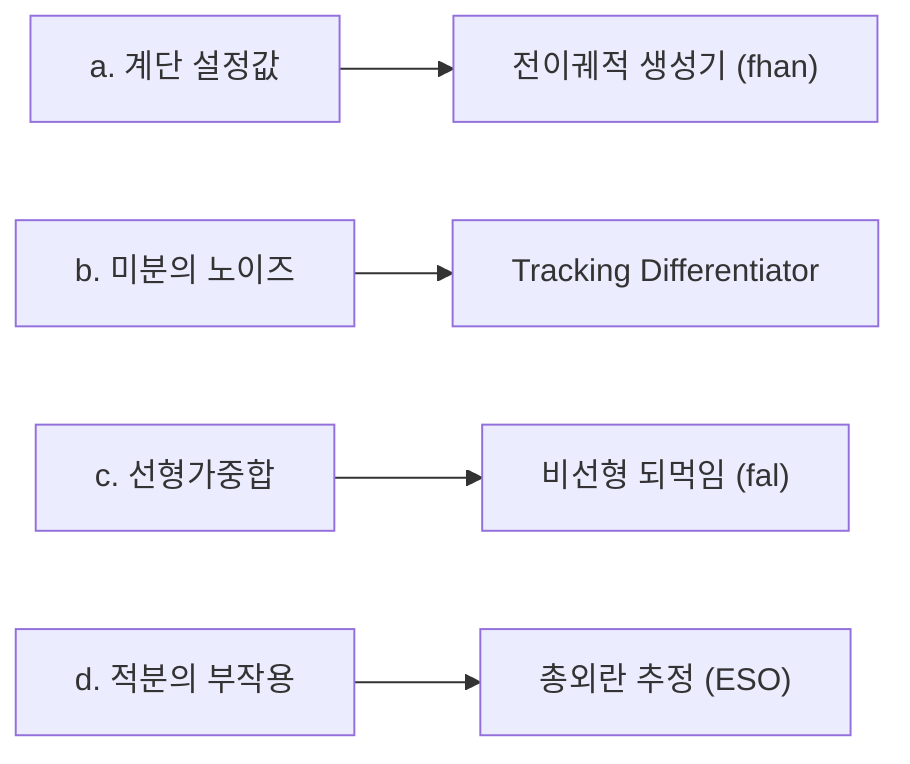

> **논문:** Jingqing Han, *From PID to Active Disturbance Rejection Control*, **IEEE Transactions on Industrial Electronics**, Vol. 56, No. 3, pp. 900–906, March 2009, DOI [10.1109/TIE.2008.2011621](https://doi.org/10.1109/TIE.2008.2011621), [Semantic Scholar](https://www.semanticscholar.org/paper/From-PID-to-Active-Disturbance-Rejection-Control-Han/e18dbe93dc0c0a3b22559b08fb04d94f481aad3a)
> **비고:** Han 은 이 논문의 영문 출판 이전인 2008년에 별세했다. 영문 개정은 제자 Zhiqiang Gao 가 맡았다.
> **관련 시리즈:** [ADRC 목차](/posts/00-adrc-series/)

**결론부터.** 이 논문은 ADRC 를 "PID 보다 나은 제어기"로 소개하지 않는다. **PID 의 네 가지 근본 한계를 하나씩 짚고, 각각에 처방을 붙여 조립한 결과물**로 제시한다. 그래서 제목이 *From PID to ADRC* 다. 네 처방은 각각 전이궤적 생성기, Tracking Differentiator, 비선형 되먹임, 그리고 확장상태관측기(ESO)다.

이 논문의 무게중심은 마지막 처방에 있다. **모델의 불확실성과 외란을 하나로 묶어 "총외란"이라 부르고, 그것을 상태로 승격시켜 추정한다.** 원문의 표현을 그대로 옮기면 다음과 같다.

> we have transformed a problem that traditionally belongs to **system identification** to that of **disturbance rejection**, and its consequence is enormous.

---

## 1. 논문 구조

| § | 내용 |
| --- | --- |
| I | 서론 — PID 80년, 무엇이 대체하나 |
| II | Classical PID — 구조와 네 가지 근본 한계 |
| III | Individual Remedies — TD, 비선형 되먹임, 총외란 ESO |
| IV | Putting It All Together — 전체 알고리즘 (식 26) |
| V | Application — 시간지연, MIMO, 캐스케이드, 공진계 |
| VI | Key Points — 문제 정식화, 상대차수 = 적분기 세기 |
| VII | 결론 — 실험과학으로서의 제어 |

## 2. PID 는 왜 오래 살아남았고 어디서 막혔나

PID 제어법칙은 오차의 누적, 현재, 예측을 선형결합한 것이다 (원문 식 1).

$$u = k_0\!\int_0^t e\,d\tau + k_1 e + k_2\frac{de}{dt}$$

Han 은 2차 플랜트(식 2)로 "왜 PID 가 쉽게 튜닝되는가"와 "그 한계"를 동시에 보인다.

$$\dot x_1=x_2,\quad \dot x_2 = a_1x_1+a_2x_2+bu,\quad y=x_1$$

$e_0=\int e$, $e_1=e$, $e_2=\dot e$ 로 두면 안정 조건이 나온다 (식 6).

$$bk_0>0,\quad (bk_1-a_1)>0,\quad (bk_2-a_2)>0,\quad (bk_1-a_1)(bk_2-a_2)>bk_0$$

모델을 알면 해석적으로, 몰라도 시행착오로 게인을 찾을 수 있다. **이 쉬움이 곧 한계의 뿌리다.**

원문 §II 가 드는 네 한계는 다음과 같다.

| # | 원문 지적 | 무엇이 문제인가 |
| --- | --- | --- |
| a | Setpoint is often given as a step function | 계단 설정값이 출력과 제어신호에 급격한 점프를 강요한다 |
| b | PID is often implemented without the D part because of noise sensitivity | 미분의 노이즈 민감성 때문에 D 를 실제로는 못 쓴다 |
| c | The weighted sum of the three terms may not be the best control law | 세 항의 선형가중합이 최선이라는 보장이 없다 |
| d | The integral term introduces saturation and reduced stability margin due to phase lag | 적분이 포화와 위상지연을 부른다 |

## 3. 네 한계에 네 처방

### 3.1 전이궤적 생성기 — 계단 대신 따라갈 수 있는 신호

계단 설정값을 그대로 주지 않고, 따라갈 수 있는 궤적 $v_1$ 과 그 미분 $v_2$ 를 만든다 (식 10).

$$v_1(k{+}1)=v_1+h\,v_2,\qquad v_2(k{+}1)=v_2+h\cdot f_{han}(v_1-v,\,v_2,\,r_0,\,h_0)$$

심장은 **fhan** 함수다 (식 11).

$$
\begin{aligned}
d &= h_0 r_0^2, \qquad a_0 = h_0 v_2, \qquad y = v_1 + a_0\\
a_1 &= \sqrt{d(d+8|y|)}\\
a_2 &= a_0 + \operatorname{sign}(y)\,(a_1-d)/2\\
s_y &= \big(\operatorname{sign}(y+d)-\operatorname{sign}(y-d)\big)/2\\
a &= (a_0+y-a_2)\,s_y + a_2\\
s_a &= \big(\operatorname{sign}(a+d)-\operatorname{sign}(a-d)\big)/2\\
f_{han} &= -r_0\!\left(\tfrac{a}{d}-\operatorname{sign}(a)\right)s_a - r_0\operatorname{sign}(a)
\end{aligned}
$$

가속도 한계 $r_0$ 안에서 $v_1 \to v$ 로 **오버슈트 없이 최속 수렴**하는 시간최적 해다. $r_0$ 가 속도, $h_0$ 가 평활도를 정한다.

### 3.2 Tracking Differentiator — 미분값을 설정값 쪽에서 뽑는다

흔한 미분 근사 $y=\dfrac{s}{\tau s+1}v$ 는 시간영역에서 다음과 같다 (식 12~13).

$$y(t)=\tfrac{1}{\tau}\big(v(t)-v(t-\tau)\big)\approx \dot v(t)$$

노이즈 $n(t)$ 가 $n(t)/\tau$ 로 **증폭된다.** 이것이 한계 b 의 정체다.

Han 의 대안은 중앙차분 근사를 2차 전달함수로 구현하는 것이고, 최속 추종의 연속형이 다음이다 (식 17).

$$\dot x_1=x_2,\qquad \dot x_2 = -r\,\operatorname{sign}\!\Big(x_1-v(t)+\tfrac{x_2|x_2|}{2r}\Big)$$

$x_1 \to v(t)$, $x_2 \to \dot v(t)$ 로 수렴한다. **핵심은 미분값을 측정 출력이 아니라 설정값 쪽에서 뽑는다는 것이다.** 측정 노이즈를 건드리지 않으므로 한계 b 가 해소된다.

### 3.3 비선형 되먹임 — fal 함수

선형가중합(한계 c) 대신 비선형 결합을 쓴다. 핵심은 **fal** 함수다 (식 18).

$$
f_{al}(e,\alpha,\delta)=
\begin{cases}
\dfrac{e}{\delta^{\,1-\alpha}}, & |e|\le\delta \quad(\text{원점 근처 선형화})\\[2mm]
|e|^{\alpha}\operatorname{sign}(e), & |e|>\delta
\end{cases}
$$

$\alpha<1$ 이면 작은 오차에 큰 게인, 큰 오차에 완만한 게인이 걸린다. 결과적으로 유한시간에 수렴하고 정상오차가 크게 줄어든다.

> 선형 되먹임은 오차가 무한시간에야 0 에 닿지만 $u=|e|^\alpha\operatorname{sign}(e)$ 는 **유한시간에 0 에 닿는다.** 그래서 적분 없이도 정상오차를 없앨 수 있고, 한계 d 를 우회한다.
> $\delta$ 는 원점 근처 채터링을 막는 선형 구간 폭이다.
{: .prompt-tip }

### 3.4 총외란과 ESO — 이 논문의 심장

2차 SISO 플랜트를 다음과 같이 쓴다 (식 19).

$$\dot x_1=x_2,\quad \dot x_2=f(x_1,x_2,w(t),t)+bu,\quad y=x_1$$

$f(\cdot)$ 는 상태, 외란, 시간의 다변수 함수다. **명시적으로 알 필요가 없다.** 되먹임 제어의 관점에서 $F(t)=f(x_1,x_2,w,t)$ 는 그저 제어입력으로 이겨낼 대상일 뿐이고, Han 은 이것을 **총외란(total disturbance)** 이라 부른다.

그 다음이 결정적이다. $F(t)$ 를 **세 번째 상태로 승격**시킨다 (식 20).

$$\dot x_1=x_2,\quad \dot x_2=x_3+bu,\quad \dot x_3=G(t),\quad y=x_1$$

$G$ 는 미지이지만 상관없다. **이 확장계는 항상 관측가능하다.** 관측가능하면 추정할 수 있고, 추정할 수 있으면 상쇄할 수 있다.

비선형 ESO 의 연속형은 다음과 같다 (식 21).

$$
\begin{aligned}
e&=z_1-y,\quad f_e=f_{al}(e,0.5,\delta),\quad f_{e1}=f_{al}(e,0.25,\delta)\\
\dot z_1&=z_2-\beta_{01}e\\
\dot z_2&=z_3+bu-\beta_{02}f_e\\
\dot z_3&=-\beta_{03}f_{e1}
\end{aligned}
$$

$z_1 \to y$, $z_2 \to \dot y$, $z_3 \to F(t)$ 로 수렴한다. 지수 0.5 와 0.25 는 Han 의 경험적 선택이다.

추정한 총외란을 제어법칙으로 상쇄하면 플랜트가 순수 2중 적분기로 환원된다 (식 25).

$$u=\frac{u_0-F(t)}{b} \quad\Longrightarrow\quad \dot x_1=x_2,\quad \dot x_2=u_0,\quad y=x_1$$

남는 것은 PD 뿐이다.

> **LESO 는 이 논문에 씨앗만 있다.**
> 원문은 *"the observer gains can be made linear… replacing both $f_e$ and $f_{e1}$ with $e$"* 라고 적는다. $f_e$ 와 $f_{e1}$ 을 그냥 $e$ 로 바꾸면 선형 ESO 가 된다.
> 다만 **깔끔한 대역폭 게인 $\beta_1=3\omega_o,\ \beta_2=3\omega_o^2,\ \beta_3=\omega_o^3$ 은 이 논문에 없다.** 그것은 Gao (2003) 의 기여다. Han 이 제시한 것은 샘플주기 $h$ 기반의 경험식(식 23~24)이다.
{: .prompt-warning }

## 4. 전체 알고리즘

세 조각을 합친 완전체가 원문 식 26 이다.

$$
\begin{aligned}
\textbf{TD:}\quad & f_v=f_{han}(v_1-v,\,v_2,\,r_0,\,h)\\
& v_1\leftarrow v_1+h\,v_2,\qquad v_2\leftarrow v_2+h\,f_v\\[1mm]
\textbf{ESO:}\quad & e=z_1-y,\quad f_e=f_{al}(e,0.5,h),\ f_{e1}=f_{al}(e,0.25,h)\\
& z_1\leftarrow z_1+h\,z_2-\beta_{01}e\\
& z_2\leftarrow z_2+h(z_3+b_0u)-\beta_{02}f_e\\
& z_3\leftarrow z_3-\beta_{03}f_{e1}\\[1mm]
\textbf{NLSEF:}\quad & e_1=v_1-z_1,\quad e_2=v_2-z_2\\
& u=-\dfrac{f_{han}(e_1,\,c\,e_2,\,r,\,h_1)+z_3}{b_0}
\end{aligned}
$$

제어법칙은 선형과 비선형 둘 다 가능하다 (식 27).

$$u=\frac{\beta_1 e_1+\beta_2 e_2-z_3}{b_0},\qquad
u=\frac{\beta_1 f_{al}(e_1,\alpha_1,\delta)+\beta_2 f_{al}(e_2,\alpha_2,\delta)-z_3}{b_0},\quad 0<\alpha_1<1<\alpha_2$$

> 원문 표현: *"one can easily find over 100 different controllers in the same ADRC structure."*
> ESO 와 되먹임의 선형/비선형 조합으로 100 가지 이상이 나온다. **구조는 하나, 구현은 다양하다.**
{: .prompt-info }

### 튜닝 파라미터 네 개

| 파라미터 | 의미 | 원문 지침 |
| --- | --- | --- |
| $r$ | 증폭계수, 가속도 한계 | TD 의 속도 |
| $c$ | 감쇠계수 | **1 부근**에서 미세조정 |
| $h_1$ | 정밀계수, 제어루프 공격성 | **주 튜닝 노브**. 샘플주기 $h$ 의 최소 4배 |
| $b_0$ | $b$ 의 거친 근사 | **±50 % 이내**면 충분 |

$b_0$ 를 ±50 % 범위로 잡아도 된다는 것, $h_1$ 이 주 노브이고 $c$ 는 미세조정이라는 것은 원문이 직접 못박은 지침이다.

## 5. PID 가 어려워하는 문제들에 대한 적용

| 문제 | 원문 처방 |
| --- | --- |
| **시간지연** (식 28) | ① $e^{-\tau s}\approx 1/(\tau s+1)$ 1차 근사 ② 예측 출력 되먹임 ③ 의사입력 예측. 모델 부정확에 강하므로 ①이면 대개 충분하다 |
| **MIMO 디커플링** (식 32~34) | $D=CB$ 가 가역이면 $\ddot y=G+U$ 로 완전 분리 → 채널마다 SISO ADRC → $u=D^{-1}U$. **$D$ 도 정확할 필요가 없다** |
| **캐스케이드** (식 35) | 안쪽 루프에 의사입력 $u_1=x_2$ 를 두고 ADRC, 그 출력을 바깥 setpoint 로. **안쪽을 바깥보다 빠르게** |
| **병렬계와 공진계** (식 36~37) | 공진 모드들의 합을 SISO 로 보고 모드 항들을 전부 총외란으로 처리 |

## 6. 적용의 네 원칙과 "차수 = 상대차수"

원문 §VI 의 실무 지침 네 가지다.

1. **입출력을 먼저 정한다.** 무엇이 조작가능 입력이고 무엇이 제어할 출력인지. 제어 문제 자체가 처음에는 잘 정의되어 있지 않다.
2. **ADRC 의 차수는 플랜트의 상대차수다.**
3. **총외란으로 잘 뭉치는 것이 성공의 열쇠다.** 아는 것과 모르는 것을 $F$ 로 묶는 재정식화가 핵심이다.
4. **의사 제어변수를 영리하게 쓴다.** MIMO 의 $U=Du$ 가 그 예다.

두 번째가 특히 오해를 부른다. 원문은 다음과 같이 적는다.

> the order of the system = **number of integrators**; the **relative degree** = **minimum number of integrators from input to output** through direct paths.

원문 Fig. 3 의 플랜트는 **4차이지만 상대차수는 2** 다. **전체 차수가 아니라 입력에서 출력까지의 최소 적분 횟수**다. ADRC 차수를 정할 때 기준이 되는 것은 후자다.

## 7. 패러다임 전환

원문 §VI 결론부의 대비가 이 논문의 성격을 잘 보여준다.

| | 관점 |
| --- | --- |
| **현대제어** | $f$ 가 주어졌을 때 상태궤적이 원하는 위상구조를 갖도록 $u(t)$ 를 찾는다 |
| **ADRC** | $f$ 의 구조나 성질에는 관심이 없다. 시각 $t$ 에서의 **값** $F(t)$ 만 필요하다. $bu(t)\approx \ddot r(t)-F(t)$ 이면 된다 |

그래서 원문은 선형과 비선형, 시변과 시불변의 구분이 무의미해진다고 말한다. 제어 대상을 "무엇인가"로 보지 않고 "지금 얼마인가"로 보기 때문이다.

## ⚠️ 주의

- **대역폭 파라미터화는 이 논문에 없다.** $\beta_1=3\omega_o,\ \beta_2=3\omega_o^2,\ \beta_3=\omega_o^3$ 는 Gao (2003) 의 기여다. Han 은 샘플주기 기반 경험식을 제시했다.
- 이 논문의 원형은 **비선형**(fhan, fal, 비선형 ESO)이다. 실무에서 널리 쓰이는 선형 LADRC 는 여기서 파생된 특수한 경우다.
- 원문은 안정성 증명을 목표로 하지 않는다. 마지막 절이 밝히듯 **실험과학으로서의 제어**를 표방하고, 시뮬레이션 결과를 근거로 삼는다. 정량적 안정성과 강인성 논의는 후속 문헌을 봐야 한다.
- 지수 0.5 와 0.25, $c \approx 1$ 같은 값은 **경험적 선택**이며 원문에 유도가 없다.

## 📌 정리

- ADRC 는 PID 를 부정한 것이 아니라 **PID 의 네 한계에 네 처방을 붙여 조립한 결과**다.
- 계단 설정값에는 전이궤적(fhan), 미분 노이즈에는 TD, 선형가중합에는 fal, 적분 부작용에는 ESO 가 대응한다.
- **총외란 $F(t)$ 를 상태 $x_3$ 로 승격시키면 확장계가 항상 관측가능해진다.** 이것이 논문의 심장이다.
- 상쇄 후 남는 플랜트는 순수 적분기 사슬이고, 제어기는 PD 로 충분하다.
- ADRC 차수는 전체 차수가 아니라 **상대차수**, 즉 입력에서 출력까지의 최소 적분 횟수다.
- 튜닝은 $b_0$ 를 ±50 % 로 잡고 $h_1$ 을 주 노브로 쓴다.

## 참고

- Jingqing Han, *From PID to Active Disturbance Rejection Control*, IEEE Transactions on Industrial Electronics, 56(3), 900–906, 2009 — DOI [10.1109/TIE.2008.2011621](https://doi.org/10.1109/TIE.2008.2011621), [Semantic Scholar](https://www.semanticscholar.org/paper/From-PID-to-Active-Disturbance-Rejection-Control-Han/e18dbe93dc0c0a3b22559b08fb04d94f481aad3a)
- Zhiqiang Gao, *Scaling and Bandwidth-Parameterization Based Controller Tuning*, Proceedings of the American Control Conference, 2003 — 대역폭 파라미터화의 원전 (본문에서 언급하는, 이 논문에 **없는** 부분)
- Gernot Herbst, Rafał Madoński, *ADRC: From Principles to Practice*, Birkhäuser Cham, 2024 (CC BY 4.0) — [선형 LADRC 정본 읽기](/posts/book-adrc-principles-to-practice/)
- 관련 시리즈 — [ADRC 목차](/posts/00-adrc-series/), [총외란이라는 발상](/posts/02-total-disturbance/), [ESO](/posts/05-extended-state-observer/), [ADRC 원형: TD, ESO, 제어법칙](/posts/04-adrc-td-eso-control/), [제어기 차수](/posts/09-adrc-order/)
