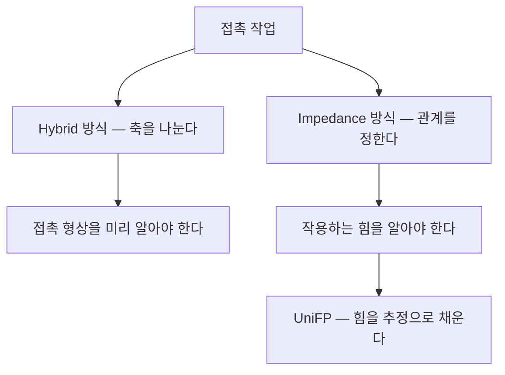
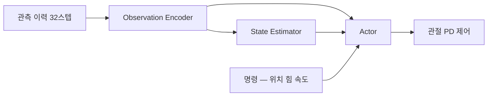

> **논문:** Peiyuan Zhi, Peiyang Li, Jianqin Yin, Baoxiong Jia, Siyuan Huang, *Learning a Unified Policy for Position and Force Control in Legged Loco-Manipulation* — [arXiv:2505.20829](https://arxiv.org/abs/2505.20829) (v1 2025-05, v2 2025-10)
> **수상:** [CoRL 2025 Best Paper](https://2025.corl.org/program/awards) / 확인일 2026-07-27
> **프로젝트 페이지:** [unified-force.github.io](https://unified-force.github.io/)

**결론부터.** 이 논문은 새 제어 법칙을 만들지 않는다. 임피던스 제어를 강화학습으로 구현하되, 힘 센서가 있어야 알 수 있던 값을 **관절 상태 이력에서 추정**해 채운다. 그 결과 위치 추종, 힘 인가, 힘 추종, 컴플라이언스가 **모드 전환 없이 하나의 정책**에서 나온다.

---

## 1. 접촉 방향에서 위치와 힘은 독립 변수가 아니다

엔드이펙터가 자유공간에 있을 때는 위치만 명령하면 된다. 환경에 닿는 순간 사정이 달라진다.

접촉면의 강성을 $K_e$, 표면 위치를 $x_e$ 라 하면 접촉력은 다음과 같다.

$$F = K_e (x - x_e)$$

강체 환경은 $K_e \to \infty$ 다. **위치를 1 mm 잘못 잡으면 힘이 발산한다.** 반대로 힘을 정확히 주려고 위치 제어를 놓으면, 접촉이 끊어진 순간 로봇이 허공으로 튀어나간다.

즉 접촉 방향에서는 **하나를 정하면 다른 하나가 환경에 의해 정해진다.** 둘 다 명령할 수 없다.

## 2. 고전적 해법 두 가지

**Hybrid position/force control** (Raibert & Craig, 1981)은 작업공간을 방향별로 쪼갠다. 칠판을 닦는다면 누르는 방향은 힘 제어, 닦는 방향은 위치 제어다. 한계는 분명하다. 선택 행렬을 만들려면 **접촉 형상을 미리 알아야** 하고, 곡면이거나 접촉이 생겼다 사라지면 무너진다.

**Impedance control** (Hogan, 1985)은 위치도 힘도 직접 명령하지 않고 **둘 사이의 동적 관계**를 명령한다.

$$F = K(x - x^{\text{des}}) + D(\dot{x} - \dot{x}^{\text{des}}) + M(\ddot{x} - \ddot{x}^{\text{des}}) \tag{1}$$

로봇이 가상의 스프링-댐퍼-질량처럼 행동하게 만든다. 접촉이 있든 없든 같은 법칙이 돌아가는 것이 장점이다. 자유공간에서는 $F=0$ 이므로 $x \to x^{\text{des}}$ 로 수렴하고, 접촉하면 침투량에 비례해 힘이 생긴다.

논문의 식 (1)이 정확히 이 식이다. **UniFP 는 임피던스 제어를 강화학습으로 구현한다.**

> 임피던스와 어드미턴스는 인과 방향이 반대다. 임피던스는 변위를 입력받아 힘을 내므로 힘 센서가 없어도 되지만 관절이 back-drivable 해야 한다. 어드미턴스는 힘을 입력받아 변위를 내므로 **힘 센서가 필요하다.**
>
> UniFP 는 힘 센서를 쓰지 않으므로 구조적으로 임피던스 쪽이다. 다만 힘 명령을 위치 오프셋으로 환산하는 대목은 어드미턴스의 발상이다.
{: .prompt-info }

## 3. 힘 센서를 빼려는 이유

6축 F/T 센서는 손목에 달면 되지만 실제로는 곤란한 점이 많다.

| 문제 | 내용 |
| --- | --- |
| 비용 | 수백만 원대이고 과부하에 취약하다 |
| 관측 범위 | 손목에 달면 **그 뒤쪽 링크가 받는 힘은 보이지 않는다.** 팔뚝으로 밀거나 몸으로 기대면 안 보인다 |
| 보정 | 중력과 관성 보상이 별도로 필요하고, 자세가 바뀌면 캘리브레이션이 흔들린다 |
| 다점 접촉 | 접촉점이 여럿이면 구분하지 못한다 |

그래서 관절 토크나 상태 이력에서 외력을 역산하려는 시도가 계속 있었다. 고전적으로는 generalized momentum observer 계열이 있고, UniFP 는 그 자리를 **학습된 추정기**로 채운다.

## 4. 핵심 아이디어 — 힘 명령을 위치 목표로 환산한다

준정적(quasi-static) 조작을 가정하면 식 (1)의 속도와 가속도 항이 사라진다.

$$F = K(x - x^{\text{des}})$$

저수준 PD 제어기가 만드는 로봇은 **강성 $K$ 짜리 스프링**이다. 목표 위치를 어디로 주느냐로 힘이 결정된다.

원하는 것은 두 가지다. 엔드이펙터의 실제 위치가 명령 위치에 있을 것, 그리고 동시에 환경에 능동적으로 힘을 가할 것. 작용하는 힘은 셋이다. 이를 스프링 관계에 넣고 목표 위치에 대해 풀면 논문의 식 (2)가 나온다.

$$\mathbf{x}^{\text{target}} = \mathbf{x}^{\text{cmd}} + \frac{\boldsymbol{F}^{\text{ext}} + (\boldsymbol{F}^{\text{cmd}} - \boldsymbol{F}^{\text{react}})}{K} \tag{2}$$

| 기호 | 뜻 |
| --- | --- |
| $\mathbf{x}^{\text{target}}$ | 정책이 실제로 향하는 목표 위치 |
| $\mathbf{x}^{\text{cmd}}$ | 사용자가 준 위치 명령 |
| $\boldsymbol{F}^{\text{ext}}$ | 외부 교란력 |
| $\boldsymbol{F}^{\text{cmd}}$ | 사용자가 준 능동 힘 명령 |
| $\boldsymbol{F}^{\text{react}}$ | 환경의 수동 반력 |
| $K$ | 엔드이펙터 유효 강성 |

**읽는 법.** 힘을 주고 싶으면 목표 위치를 접촉면 안쪽으로 $F^{\text{cmd}}/K$ 만큼 더 밀어 넣는다. 가상 스프링을 그만큼 압축시키는 것이다. 교란이 밀어오면 그만큼 목표를 옮겨 밀린 양을 되돌린다.

이 한 식에서 네 가지 모드가 전부 나온다.

| 모드 | 명령 조건 | 결과 |
| --- | --- | --- |
| 위치 추종 | $F^{\text{cmd}}=0$, 접촉 없음 | $x^{\text{target}} = x^{\text{cmd}}$, 일반 위치 제어 |
| 힘 인가 | $F^{\text{cmd}}\neq 0$, 접촉 | 목표를 밀어 넣어 원하는 힘 발생 |
| 힘 추종 | $F^{\text{cmd}}$ 가 시변 | 추정한 힘을 되먹여 추종 |
| 컴플라이언스 | $F^{\text{cmd}}=0$, 교란 있음 | $F^{\text{ext}}/K$ 만큼 순응 |

> **"통합(unified)"의 뜻은 모드 스위칭을 없앴다는 것이 아니라 명령 공간을 위치로 통일했다는 것이다.**
> 힘 명령이 들어와도 정책이 보는 것은 언제나 "가야 할 위치"다. 모드 전환이 없으므로 전환 시점의 불연속을 다룰 필요도 없다.
{: .prompt-tip }

베이스는 위치가 아니라 속도로 명령하므로 스프링 대신 댐퍼 관계를 쓴다. 식 (4)가 그것이다.

$$\mathbf{v}_{\text{base}}^{\text{target}} = \mathbf{v}^{\text{cmd}}_{\text{base}} + \frac{\boldsymbol{F}_{\text{base}}^{\text{ext}} + (\boldsymbol{F}_{\text{base}}^{\text{cmd}} - \boldsymbol{F}_{\text{base}}^{\text{react}})}{D} \tag{4}$$

팔은 위치-강성, 베이스는 속도-감쇠. **차수가 하나 다른 같은 구조**다.

## 5. 관측 공간에 힘 항목이 없다

논문의 식 (5)다.

$$\mathbf{o}_{t} = [\ \mathbf{g}^{\text{base}}_{t},\ \omega^{\text{base}}_{t},\ \mathbf{q}_{t},\ \dot{\mathbf{q}}_{t},\ \mathbf{a}_{t-1},\ \mathbf{c}^{\text{cmd}}_{t},\ \theta^{\text{feet}}_{t}\ ] \tag{5}$$

| 항 | 뜻 | 센서 |
| --- | --- | --- |
| $\mathbf{g}^{\text{base}}$ | 베이스 자세 | IMU |
| $\omega^{\text{base}}$ | 베이스 각속도 | IMU |
| $\mathbf{q},\ \dot{\mathbf{q}}$ | 관절 각도와 각속도 | 엔코더 |
| $\mathbf{a}_{t-1}$ | 직전 행동 | 내부값 |
| $\mathbf{c}^{\text{cmd}}$ | 명령 | 사용자 |
| $\theta^{\text{feet}}$ | 발 접촉 위상 | 내부 게이트 클럭 |

F/T 센서도, 관절 토크 센서도, 베이스 선속도도 없다. 전부 IMU 와 엔코더다.

관측 이력은 $H=32$ 스텝을 쓴다. **이력이 필요한 이유가 중요하다.** 한 시점의 상태만 보면 지금 자세밖에 알 수 없다. 외력은 명령한 위치와 실제 위치가 **시간에 걸쳐 벌어지는 양상**에서만 드러난다.

행동은 기본 자세에 대한 잔차로 낸다.

$$\mathbf{q}^{\text{target}}_{t} = \sigma_a \mathbf{a}_{t} + \mathbf{q}^{\text{default}}$$

정책은 세 덩어리로 나뉜다.

Actor 는 이력을 직접 보지 않는다. 인코더가 압축한 표현과 추정기가 뽑은 물리량을 본다. 추정기는 순 외력, 엔드이펙터 위치, 베이스 속도를 예측하고 MSE 로 학습한다. 결과적으로 추정기가 **"이력에서 물리량을 뽑는" 표현을 강제로 배우게 하는 보조 과제** 역할을 한다.

> **관측 가능하지 않은 것을 억지로 분리하지 않는다.**
> 논문은 외부 교란 $\boldsymbol{F}^{\text{ext}}$ 와 환경 반력 $\boldsymbol{F}^{\text{react}}$ 를 따로 모델링하지 않고 **순 외력 하나로 묶어** 추정한다. 물리적으로 둘은 능동과 수동으로 성격이 다르지만, 엔코더로 보이는 결과는 똑같다. 둘 다 "명령한 위치와 실제 위치의 벌어짐"으로만 나타난다.
>
> ADRC 가 모델 오차와 외란을 [총외란](/posts/02-total-disturbance/) 하나로 묶어 [ESO](/posts/05-extended-state-observer/) 로 추정하는 것과 같은 논리다. 다른 것은 추정기가 선형 관측기냐 학습된 MLP 냐뿐이다.
{: .prompt-info }

## 6. 보상 설계와 학습 설정

핵심 두 항은 식 (2)와 식 (4)를 그대로 보상으로 옮긴 것이다. 가중치는 각각 2.0 이다.

$$r_{\text{ee}} = \exp\left\{-\frac{\left|\mathbf{x}_{\text{ee}} - \left(\mathbf{x}^{\text{cmd}} + \dfrac{\boldsymbol{F}^{\text{ext}} + \boldsymbol{F}^{\text{cmd}} - \boldsymbol{F}^{\text{react}}}{K}\right)\right|}{0.5}\right\}$$

$$r_{\text{base}} = \exp\left\{-\frac{\left|\mathbf{v}_{\text{base}} - \left(\mathbf{v}^{\text{cmd}}_{\text{base}} + \dfrac{\boldsymbol{F}_{\text{base}}}{D}\right)\right|}{0.25}\right\}$$

보상식은 $\boldsymbol{F}^{\text{ext}}$ 와 $\boldsymbol{F}^{\text{react}}$ 를 안다. 시뮬레이터가 접촉력을 알고 있기 때문이다. 실기기에서는 알 수 없으므로 추정기가 대신한다. 학습에만 쓰는 정보로 목표를 정의하고 배포 때는 추정으로 채우는 구조다.

나머지 항은 논문 Table A.1 기준이다.

| 항 | 가중치 | 목적 |
| --- | --- | --- |
| 관절 한계 위반 | −10.0 | 기구 보호 |
| 충돌 | −5.0 | 자기 충돌과 환경 충돌 억제 |
| 행동 변화율 | −0.02 | 채터링 억제 |
| 토크 한계 | −0.005 | 포화 회피 |
| 관절 속도 | −8×10⁻⁴ | 진동 억제 |
| 토크 크기 | −5×10⁻⁶ | 에너지 |
| 관절 가속도 | −2×10⁻⁷ | 부드러움 |
| 접촉 수 유지 | +2.0 | 걸음새 유지 |
| 기준 동작 추종 | +1.0 | 자연스러운 보행 |

학습은 Isaac Gym 에서 PPO 로 하고, 병렬 환경은 4096 개다. 커리큘럼은 2단계다.

1. 힘 명령 없이 whole-body reaching 과 보행만 학습
2. 무작위 힘 명령과 외부 교란 투입

논문은 처음부터 외란을 넣으면 학습이 불안정해진다고 명시한다. 걷지도 못하는 정책에 미는 힘을 주면 무너진다는 뜻이다.

힘은 계단으로 넣지 않고 **선형 램프업 → 유지 → 램프다운 → 무힘 구간**을 반복한다. 힘이 있는 구간과 없는 구간을 모두 겪게 해서 정책이 접촉 여부를 이력에서 판별하도록 만든다.

명령과 교란 범위는 다음과 같다.

| 항목 | 범위 |
| --- | --- |
| EE 위치 (구면좌표) | $r \in [0.35, 0.85]$ m, $\theta \in [-0.4\pi, 0.4\pi]$, $\phi \in [-0.6\pi, 0.6\pi]$ |
| EE 힘 명령 | 축별 $[-60, 60]$ N |
| 베이스 속도 | $v_x \in [-0.8, 0.8]$, $v_y \in [-0.6, 0.6]$ m/s, $\omega_z \in [-0.8, 0.8]$ rad/s |
| 외부 교란 | 축별 $[-60, 60]$ N |

도메인 랜덤화는 마찰계수 $[0.3, 2.0]$, 몸체 질량 $[0, 15]$ kg, 무게중심 오프셋 $[-0.15, 0.15]$ m, 모터 강도 $[85, 115]$ %, 그리퍼 페이로드 $[0, 0.5]$ kg, 밀기 교란 $[0, 0.8]$ m/s 를 8초 간격으로 적용한다.

## 7. 강성을 낮추는 이유 — 관측 가능성과 위치 추종의 상충

논문이 지나가듯 적은 문장인데 실무적으로는 가장 값진 대목이다.

> 낮은 게인은 오버슈트를 크게 허용하고 **힘 추정 정확도를 개선한다.** 다만 지나치게 낮으면 위치 추종 정확도가 떨어진다.

준정적 관계 $F = K\,\Delta x$ 에서 $K$ 는 관절 PD 게인으로 결정되는 유효 강성이다. 힘을 위치 편차로부터 읽어내야 하므로 다음이 성립한다.

$$\Delta x = \frac{F}{K}$$

$K$ 가 크면 같은 힘에 대해 $\Delta x$ 가 작아진다. 그러면 엔코더 분해능과 노이즈에 묻혀 **힘을 읽어낼 수 없다.** $K$ 를 낮추면 $\Delta x$ 가 커져 신호 대 잡음비가 좋아지지만 위치 추종이 물러진다.

| 강성 | 위치 추종 | 힘 추정 |
| --- | --- | --- |
| $K$ 높음 | 좋음 | 나쁨 |
| $K$ 낮음 | 나쁨 | 좋음 |

**"얼마나 뻣뻣하게 만들 것인가"가 성능이 아니라 관측 가능성의 문제가 된다.** 센서를 뺀 대가를 강성으로 지불하는 구조이고, 힘 센서를 쓰지 않는 모든 방식이 결국 이 벽을 만난다.

## 8. 실험 결과

하드웨어는 두 종류다. 4족은 Unitree B2 (12 DOF) 에 Unitree Z1 팔 (6 DOF) 을 얹었고, 휴머노이드는 Unitree G1 (29 DOF) 이다. 둘 다 RTX 3090 데스크톱과 무선으로 연결해 구동했다.

**추종과 추정 정확도**

| 항목 | 값 |
| --- | --- |
| 엔드이펙터 위치 추종 오차 (시뮬레이션) | 대체로 0.1 m 이내 |
| 상태 추정기 위치 오차 | 전 축 0.05 m 이내 |
| 힘 추정 오차 (실기기, 0~60 N) | 평균 10 N 이내, 이산 레벨별 5~10 N |

**힘 인지 모방학습, 네 가지 접촉 과제** (각 50회 시도)

| 과제 | 위치 제어 | 힘 인지 | 절대 상승 |
| --- | --- | --- | --- |
| 칠판 닦기 | 0.22 | 0.58 | +0.36 |
| 캐비닛 열기 | 0.36 | 0.70 | +0.34 |
| 캐비닛 닫기 | 0.30 | 0.72 | +0.42 |
| 서랍 열기 (시야 가림) | 0.30 | 0.76 | +0.46 |

> **초록의 "약 39.5% 향상"은 상대 개선율이 아니다.**
> $(0.36 + 0.34 + 0.42 + 0.46)/4 = 0.395$ 이므로 **절대 성공률 차이의 평균, 즉 39.5%p** 다. 상대 개선율로 계산하면 +94 % ~ +163 % 로 훨씬 커진다.
> 표를 직접 확인하지 않으면 잘못 인용하게 된다.
{: .prompt-warning }

세 과제가 힘을 요구하는 이유는 서로 다르다.

| 과제 | 위치 제어만으로 실패하는 이유 |
| --- | --- |
| 칠판 닦기 | 이동 중 접촉을 계속 유지해야 한다. 떨어지거나 과하게 누른다 |
| 캐비닛 열고 닫기 | 3 mm 스트로크의 푸시투오픈 걸쇠라 시각만으로는 눌렸는지 알 수 없다 |
| 서랍 열기 | 진행하면서 그리퍼가 시야에서 사라진다 |

세 경우 모두 **시각으로는 원리적으로 알 수 없는 정보**를 요구한다. 힘 추정이 성능 향상이 아니라 **관측 가능성 자체를 복원**하는 역할을 한다는 것이 이 실험의 요지다.

논문에는 체계적인 ablation 표가 없다. 2단계 커리큘럼의 효과, 모터 게인과 힘 추정 정확도의 관계, 힘 추정 모듈을 뺀 베이스라인 비교가 서술로만 제시된다.

## 9. 논문이 다루지 않은 것

**강성 $K$ 를 상수로 두는 것의 타당성.** 관절 공간 강성 $K_q$ 와 작업 공간 강성 $K_x$ 의 관계는 자코비안에 의존한다.

$$K_x = J^{-\top} K_q J^{-1}$$

$J$ 는 자세의 함수이므로 $K_x$ 는 팔을 뻗는 방식에 따라 달라지고 방향에 따라서도 다르다. 특이점 근처에서는 특정 방향 강성이 급변한다. 논문은 이를 상수 $K$ 로 두고 넘어간다. 결과 절의 "Y축 오차가 크다", 한계 절의 "축별 힘 정확도에 sim-to-real gap 이 있다", "작업공간 가장자리에서 추정이 나빠진다" 세 관찰이 모두 이 지점을 가리킨다.

**힘 추정 오차 10 N 의 쓰임새.** 0~60 N 범위에서 평균 오차 10 N 은 작동 범위의 약 17 % 이고, 20 N 지령 같은 저부하 구간에서는 상대 오차가 50 % 에 달한다. 문 열기나 칠판 닦기에는 충분하지만 **접촉력에 안전 한계가 걸린 응용에는 쓸 수 없다.** 안전 요구사항은 평균 오차가 아니라 최악값과 그 발생 조건을 요구한다.

**실패 모드.** 위치 제어의 실패는 "닿지 않는다"이지만, 추정 기반 힘 제어의 실패는 **없는 힘을 있다고 믿고 목표를 더 밀어 넣는 것**이 될 수 있다. 식 (2)에서 추정된 힘이 목표 위치를 직접 밀어내므로, 과대평가 → 목표가 더 깊이 → 실제 접촉력 증가 → 더 큰 위치 편차 → 추정 증가 라는 양의 되먹임 경로가 구조적으로 존재한다. 학습된 정책이 이를 억제하는지는 논문에 검증이 없고, 안전 감독 계층에 대한 논의도 없다.

**빠진 비교 대상.** 정량 비교가 위치 제어 베이스라인 하나뿐이다. F/T 센서를 단 어드미턴스 제어, generalized momentum observer 같은 고전적 무센서 외력 추정, hybrid position/force control 과의 비교가 없다. 특히 두 번째가 아쉽다. **"학습이 고전 관측기보다 나은가"** 가 핵심 주장인데 그 비교가 빠져 있다.

**실시간성.** 추론 주기, 32스텝 이력 버퍼의 메모리, MLP 추론 시간, 제어 주기가 언급되지 않는다. RTX 3090 데스크톱에 무선으로 연결해 구동했다는 서술만 있다. 무선 링크는 지연과 손실이 있고 힘 제어 루프에서는 치명적일 수 있다. 온보드로 내렸을 때 성립하는지는 미확인이다.

## 10. 제어 관점에서의 시사점

**모드 스위칭을 없애는 방법.** 위치 모드와 힘 모드를 오가는 대신 힘 명령을 위치 오프셋으로 환산해 명령 공간을 하나로 통일했다. 상태를 늘리는 대신 좌표를 바꾼 것이다. FSM 을 설계할 때도 같은 질문이 가능하다. 이 상태 분기는 정말 필요한가, 아니면 표현을 바꾸면 사라지는가.

**관측할 수 없는 것을 억지로 분리하지 않는다.** 교란과 반력을 묶은 결정이 그렇다. [ADRC 의 총외란](/posts/02-total-disturbance/)과 같은 발상이고, 특정 기법의 트릭이 아니라 **관측 가능성에서 나오는 일반 원리**로 보는 편이 맞다.

**센서를 빼면 대가를 다른 설계 변수로 낸다.** 여기서는 강성이었다. 무료로 얻는 것은 없다.

**추정 기반 제어에서는 추정의 신뢰도가 그 자체로 상태여야 한다.** 감독 계층은 힘 값만이 아니라 추정이 유효한 영역 안에 있는지를 봐야 한다. 이 논문 기준으로는 작업공간 가장자리와 고주파 접촉이 무효 영역이다.

## ⚠️ 주의

- 논문의 향상률 표기(39.5 %)는 **절대 성공률 차이(%p)** 다. 상대 개선율로 오독하기 쉽다.
- 힘 추정 오차 10 N 은 성능 지표이지 안전 보증이 아니다.
- 임피던스 모델에서 감쇠와 관성 항을 생략한 **준정적 가정**이므로 민첩하거나 동적인 스킬에는 적용되지 않는다.
- 단일 접촉점만 다룬다. 다점 접촉력의 동시 추정은 미해결이다.
- 강체 접촉을 가정한다.

## 📌 정리

- 접촉 방향에서 위치와 힘은 독립 변수가 아니므로 둘 다 명령할 수 없다.
- UniFP 는 힘 명령을 $F/K$ 만큼의 위치 오프셋으로 환산해 **명령 공간을 위치로 통일**한다. 그 결과 네 가지 모드가 한 식에서 나온다.
- 힘 센서 대신 **32스텝 상태 이력에서 순 외력을 추정**한다. 외부 교란과 환경 반력을 묶어 하나로 다루는 것이 핵심이다.
- 그 대가로 **PD 게인을 낮춰야 한다.** 뻣뻣하면 힘을 위치 편차에서 읽어낼 수 없다.
- 접촉 과제 성공률이 39.5 %p 오른 이유는 성능 향상이 아니라 **시각으로 알 수 없는 정보를 복원**했기 때문이다.
- 안전 관점에서는 그대로 쓸 수 없다. 추정 과대평가의 양의 되먹임 경로와 안전 감독 계층 논의가 빠져 있다.

## 참고

- Peiyuan Zhi, Peiyang Li, Jianqin Yin, Baoxiong Jia, Siyuan Huang, *Learning a Unified Policy for Position and Force Control in Legged Loco-Manipulation* — [arXiv:2505.20829](https://arxiv.org/abs/2505.20829)
- 프로젝트 페이지 — [unified-force.github.io](https://unified-force.github.io/)
- [CoRL 2025 Awards](https://2025.corl.org/program/awards)
- N. Hogan, *Impedance Control: An Approach to Manipulation*, 1985
- M. Raibert, J. Craig, *Hybrid Position/Force Control of Manipulators*, 1981
- 관련 시리즈 — [ADRC 목차](/posts/00-adrc-series/), [총외란이라는 발상](/posts/02-total-disturbance/), [ESO](/posts/05-extended-state-observer/)
