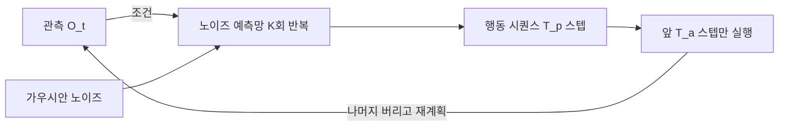
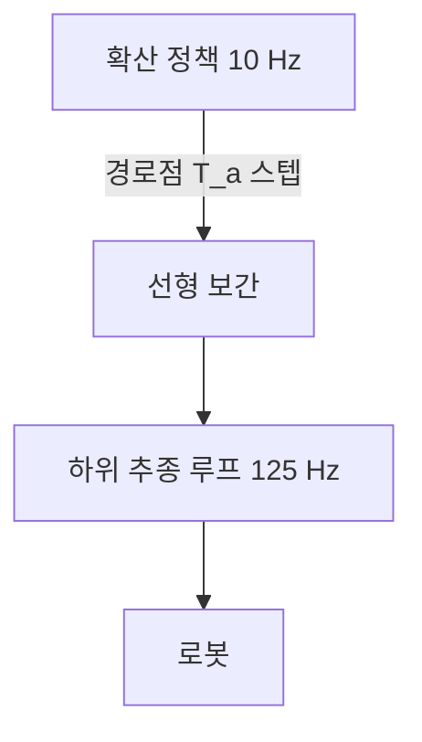

> **논문:** Cheng Chi, Zhenjia Xu, Siyuan Feng, Eric Cousineau, Yilun Du, Benjamin Burchfiel, Russ Tedrake, Shuran Song, *Diffusion Policy: Visuomotor Policy Learning via Action Diffusion*, RSS 2023 / [arXiv:2303.04137](https://arxiv.org/abs/2303.04137)
> **읽은 판본:** v5 (2024-03-14, 저널 확장판) / [arxiv.org/html/2303.04137v5](https://arxiv.org/html/2303.04137v5)
> **게재:** [RSS 2023 proceedings](https://roboticsconference.org/2023/program/papers/026/), IJRR 확장판 DOI [10.1177/02783649241273668](https://doi.org/10.1177/02783649241273668)
> **코드와 데이터:** [diffusion-policy.cs.columbia.edu](https://diffusion-policy.cs.columbia.edu/), [real-stanford/diffusion_policy](https://github.com/real-stanford/diffusion_policy)
> **확인일:** 2026-08-18

**결론부터.** 이 논문은 새로운 제어 법칙을 제안하지 않는다. 정책의 출력 방식을 바꾼다. 관측에서 행동으로 가는 함수를 학습하는 대신 **행동 분포의 기울기**를 학습해서, 가우시안 노이즈에서 시작해 여러 번 깎아 내려가며 **행동 시퀀스**를 만든다. 그 결과 같은 관측에서 유효한 행동이 여럿일 때 평균으로 뭉개지지 않고, 에너지 기반 모델을 막고 있던 정규화 상수 계산도 사라진다.

---

## 1. 문제의 뿌리: 시연을 따라 하는데 정답이 하나가 아니다

사람 시연을 모아 정책을 학습하는 것을 **behavior cloning** 이라 한다. 관측 $\mathbf{o}$ 에서 행동 $\mathbf{a}$ 로 가는 함수를 지도학습으로 맞춘다. 순진하게 쓰면 이렇게 된다.

$$\min_\theta \; \mathbb{E}_{(\mathbf{o},\mathbf{a})\sim\mathcal{D}} \big[\,\|\mathbf{a} - f_\theta(\mathbf{o})\|^2\,\big]$$

여기서 곧바로 깨진다. 같은 관측에서 사람이 매번 같은 행동을 하지 않기 때문이다. 장애물을 왼쪽으로 돌아도 되고 오른쪽으로 돌아도 되는 상황이면, 시연 데이터에 왼쪽 예시와 오른쪽 예시가 섞여 있다. MSE 를 최소화하는 $f_\theta(\mathbf{o})$ 는 그 둘의 평균, 즉 **장애물로 직진하는 행동**이다.

이것이 **다중모드 행동 분포**(multimodal action distribution) 문제다. 조건부 분포 $p(\mathbf{a}\mid\mathbf{o})$ 가 봉우리를 여럿 가질 때, 단일값을 내는 정책은 구조적으로 그것을 표현할 수 없다.

제어 쪽 언어로 옮기면 이건 추종 오차를 줄이는 문제가 아니다. **해가 유일하지 않은 문제를 유일한 해를 내는 구조로 풀려고 해서 생긴 문제**다. 역기구학에서 여유자유도가 있을 때 최소노름 해를 고르는 것과 성격이 비슷하지만, 여기서는 평균이 유효한 해가 아니라는 점이 다르다.

원격조작으로 시연을 모으는 방식이 퍼지면서 이 문제가 다시 전면에 나왔다. 데이터가 사람에게서 오고, 사람의 시연은 다중모드이며 **멈춤 구간**(idle action)을 많이 포함한다.

## 2. 기존 세 갈래와 각각이 막힌 곳

| 갈래 | 방법 | 막힌 곳 |
| --- | --- | --- |
| **명시적 정책 + 분포 표현** | 가우시안 혼합(`LSTM-GMM`)을 붙이거나 행동 공간을 이산화해 분류로 바꾼다(`BET`) | 혼합 성분 수를 미리 정해야 한다. 이산화는 고차원에서 격자 수가 폭발한다. 7자유도 팔의 연속 행동을 자르면 해상도와 격자 크기가 곧바로 상충한다 |
| **암묵적 정책(EBM)** | 에너지 $E_\theta(\mathbf{o},\mathbf{a})$ 를 학습하고 실행 시점에 최소점을 찾는다(`IBC`) | 학습이 안 된다. 정규화 상수를 계산할 수 없어 음성 샘플로 근사하는데, 그 근사가 부정확하면 학습이 흔들린다 |
| **한 스텝씩 내는 정책** | 위 둘 다 대개 한 시점의 행동을 낸다 | 연속한 시점에 서로 다른 봉우리를 고르면 행동이 진동한다. 왼쪽, 오른쪽, 왼쪽으로 번갈아 튄다 |

암묵적 정책이 왜 원리적으로는 맞는지부터 본다. 에너지를 지수화해 확률로 만들면 봉우리가 몇 개든 표현된다.

$$p_\theta(\mathbf{a}\mid\mathbf{o}) = \frac{e^{-E_\theta(\mathbf{o},\mathbf{a})}}{Z(\mathbf{o},\theta)}$$

문제는 분모다. $Z(\mathbf{o},\theta)$ 는 행동 공간 전체에 대한 적분이라 계산할 수 없다. InfoNCE 계열 손실로 음성 샘플 $\{\tilde{\mathbf{a}}^j\}$ 을 뽑아 근사하지만, 논문은 IBC 가 **학습 오차가 튀고 평가 성능이 학습 내내 불안정하다**고 관측했다(Figure 6).

## 3. 정규화 상수를 미분으로 지운다

정책을 실행할 때 실제로 필요한 것은 확률값이 아니다. **어느 방향으로 가야 확률이 높아지는가**다. 그 방향이 로그확률의 기울기, 즉 스코어 함수다.

$$\nabla_{\mathbf{a}} \log p(\mathbf{a}\mid\mathbf{o}) \;=\; -\nabla_{\mathbf{a}} E_\theta(\mathbf{a},\mathbf{o}) \;-\; \underbrace{\nabla_{\mathbf{a}} \log Z(\mathbf{o},\theta)}_{=\;0}$$

| 기호 | 뜻 |
| --- | --- |
| $\mathbf{o}$ | 관측 (이미지, 로봇 자세) |
| $\mathbf{a}$ | 행동 (엔드이펙터 자세 명령 등) |
| $E_\theta$ | 학습되는 에너지 함수 |
| $Z(\mathbf{o},\theta)$ | 정규화 상수. $\mathbf{a}$ 에 대한 적분이므로 $\mathbf{a}$ 의 함수가 아니다 |
| $\nabla_{\mathbf{a}}$ | 행동에 대한 기울기 |

$Z$ 는 $\mathbf{o}$ 와 $\theta$ 에만 의존하므로 $\mathbf{a}$ 로 미분하면 0 이다. 스코어를 학습하면 정규화 상수를 계산할 필요가 아예 없다. 논문의 표현으로는 Diffusion Policy 와 DDPM 이 $Z$ 추정 문제를 통째로 비껴간다. IBC 의 음성 샘플링이 사라지고, 그래서 학습이 안정된다.

## 4. 정식화

**식 (1), DDPM 의 한 번 깎기.**

$$\mathbf{x}^{k-1} = \alpha\big(\mathbf{x}^{k} - \gamma\,\varepsilon_\theta(\mathbf{x}^{k},k) + \mathcal{N}(0,\sigma^2 I)\big)$$

| 기호 | 뜻 |
| --- | --- |
| $\mathbf{x}^k$ | $k$ 번째 반복에서의, 아직 노이즈가 낀 샘플 |
| $K$ | 총 반복 횟수. $\mathbf{x}^K$ 는 순수 가우시안 노이즈이고 $\mathbf{x}^0$ 이 최종 출력 |
| $\varepsilon_\theta$ | 노이즈 예측 신경망. 지금 낀 노이즈가 얼마인지 맞힌다 |
| $\alpha,\gamma,\sigma$ | 노이즈 스케줄이 정하는 계수 |

형태가 **노이즈가 섞인 경사하강 한 스텝**이다. $\varepsilon_\theta$ 가 기울기 역할을 하고 $\gamma$ 가 학습률이며, 마지막 항이 국소최소에 갇히지 않게 흔든다. 논문이 이것을 stochastic Langevin dynamics 라 부르는 이유다. 행동을 계산해서 얻는 것이 아니라 **최적화해서** 얻는다.

**식 (3), 학습 손실.**

$$\mathcal{L} = \mathrm{MSE}\big(\varepsilon^k,\; \varepsilon_\theta(\mathbf{x}^0 + \varepsilon^k,\; k)\big)$$

깨끗한 데이터 $\mathbf{x}^0$ 에 무작위 세기의 노이즈 $\varepsilon^k$ 를 섞어 놓고 그 노이즈를 맞히게 시킨다. 이것이 스코어를 배우는 것과 등가라는 점이 확산 모델의 출발점이다.

**식 (4)와 (5), 관측을 조건으로 붙인 형태.**

$$\mathbf{A}_t^{k-1} = \alpha\big(\mathbf{A}_t^{k} - \gamma\,\varepsilon_\theta(\mathbf{O}_t, \mathbf{A}_t^{k}, k) + \mathcal{N}(0,\sigma^2 I)\big)$$

$$\mathcal{L} = \mathrm{MSE}\big(\varepsilon^k,\; \varepsilon_\theta(\mathbf{O}_t,\; \mathbf{A}_t^{0} + \varepsilon^k,\; k)\big)$$

이 두 식에 설계 결정 두 개가 함께 들어가 있다.

1. $\mathbf{x}$ 가 아니라 $\mathbf{A}_t$ 다. 한 시점의 행동이 아니라 **행동 시퀀스**를 통째로 생성한다.
2. $\mathbf{O}_t$ 를 **조건으로만** 넣는다. 관측까지 함께 생성하지 않으므로 미래 관측을 예측할 필요가 없어지고 계산이 줄어든다.

## 5. 세 개의 지평과 receding horizon

| 기호 | 이름 | 뜻 |
| --- | --- | --- |
| $T_o$ | 관측 지평 | 시점 $t$ 에서 정책이 보는 과거 관측의 길이 |
| $T_p$ | 예측 지평 | 한 번에 생성하는 행동 스텝 수 |
| $T_a$ | 실행 지평 | 그중 재계획 없이 실제로 실행하는 스텝 수 ($T_a \le T_p$) |

$T_p$ 만큼 만들고 $T_a$ 만큼만 쓴 뒤 나머지를 버리고 다시 만든다. 이것이 **receding horizon control** 이고, MPC 가 예측 구간을 밀고 나가는 방식과 같은 구조다. 논문은 행동 시퀀스 예측에 일정 시간 동안 커밋한 뒤 재계획한다고 표현한다.

행동 공간은 속도가 아니라 **위치**다. 이 선택이 8절의 트레이드오프로 이어진다.

## 6. 노이즈 예측망의 두 변형

| 변형 | 특징 | 논문이 말하는 적용처 |
| --- | --- | --- |
| **CNN 기반** (1D temporal UNet, FiLM 조건화) | 하이퍼파라미터에 둔감하고 기본값으로 잘 돈다 | 대부분의 과제. 다만 행동 시퀀스가 빠르게 변할 때 성능이 나쁘다 (예: 속도 제어) |
| **Time-series Diffusion Transformer** (minGPT 계열, causal mask) | 복잡한 과제에서 우세하다 | 추가 튜닝이 필요하다 |

논문의 권고는 CNN 으로 시작하고, 과제 복잡도 때문에 성능이 안 나오면 Transformer 로 가라는 것이다(§3.1).

목적함수는 식 (5) 하나다. 별도 보상 설계가 없다. 강화학습이 아니라 모방학습이기 때문인데, **목적함수 어디에도 안전이나 제약이 들어갈 자리가 없다**는 성질이 여기서 정해진다. 12절에서 다시 나온다.

## 7. 학습과 구현 설정

| 항목 | 값 |
| --- | --- |
| 학습 시 확산 반복 | 100회 |
| 추론 시 반복 (DDIM 가속) | 10회 |
| 추론 지연 | 0.1 s (NVIDIA 3080) |
| 정책 출력 주기 | 10 Hz |
| 로봇 실행 주기 | 125 Hz (선형 보간으로 올림) |
| 최적 $T_a$ | 8 스텝 (Figure 5 left) |
| 실기기 | UR5 스테이션, Franka Panda 스테이션 |

## 8. 행동 공간: 위치 제어가 속도 제어를 이긴다

논문 §4 에 지나가듯 있지만 실무 쪽으로 옮기기 좋은 관측이다.

> Diffusion Policy 는 **위치 제어** 행동 공간에서 **속도 제어**보다 일관되게 성능이 좋다(Figure 4). 그런데 비교 대상 기법들은 반대로 속도 제어에서 최고 성능이 나온다.

왜 반대인가. 위치 제어 명령은 다중모드가 더 심하고(같은 목표를 향하는 경로가 여럿이다) 오차가 누적된다. 그래서 표현력이 약한 정책은 위치 제어에서 망가지고, 다들 속도 제어로 도망갔다. Diffusion Policy 는 다중모드 표현력이 그 두 약점을 상쇄하므로 위치 제어를 그대로 쓸 수 있고, 그러면 속도 제어의 누적 적분 오차를 겪지 않는다.

여기서 따라오는 함의가 있다. **어떤 행동 공간이 좋은가는 로봇의 성질이 아니라 정책의 표현력에 따라 답이 바뀐다.** 속도 제어가 낫다는 통념이 사실은 정책이 약해서 생긴 우회로였다는 이야기다.

## 9. 실험 결과, 그리고 46.9 % 의 정의

| 구분 | 내용 |
| --- | --- |
| 시뮬레이션 | 4개 벤치마크, 15개 과제 (RoboMimic Lift/Can/Square/Transport/ToolHang, Push-T, BlockPush, Kitchen). 상태 관측판과 이미지 관측판을 따로 돌렸다. 시연 품질은 PH(숙련)와 MH(혼합) 두 가지 |
| 실기기 단완 | 4과제. Push-T(시연 136), Mug Flipping(250), Sauce Pouring 6DoF(90), Sauce Spreading(90) |
| 실기기 양완 (확장판) | 3과제. Egg Beater(210), Mat Unrolling(162), Shirt Folding(284) |
| 비교 대상 | LSTM-GMM(BC-RNN), IBC, BET |

초록의 46.9 % 가 상대인지 절대(%p)인지 논문이 명시하지 않는다. 논문 문장은 시뮬레이션 벤치마크에서 평균 46.9 % 향상이라고만 적고, 방법론 쪽에는 각 벤치마크에서 각 기준선 기법의 최고 성능을 가져와 비교했다고만 되어 있다.

Table 1 의 Transport MH 로 검산하면 LSTM-GMM 0.62 에서 Diffusion Policy-C 0.68 이다. 절대로는 +6 %p, 상대로는 +9.7 % 다. 이 하나만으로 46.9 라는 평균이 나오지 않는다.

| 과제 | IBC | LSTM-GMM | BET | DP-C | DP-T |
| --- | ---: | ---: | ---: | ---: | ---: |
| Transport MH (상태 관측) | 0.00 | 0.62 | 0.21 | **0.68** | 0.62 |

절대 %p 로 보기도 어렵다. IBC 가 여러 과제에서 0.00 이라 그 경우 상대 향상이 정의되지 않고, 절대 +46.9 %p 는 성공률 상한을 생각하면 과도하다. **논문 본문에서 정의를 찾지 못했으므로 미확인으로 남긴다.** 이 수치를 상대 46.9 % 향상이라고 단정해 인용하면 안 된다.

실기기 Push-T 결과는 이렇다(Table 6).

| 방법 | 성공률 | IoU |
| --- | ---: | ---: |
| **Diffusion Policy (end-to-end)** | 95 % | 0.80 |
| LSTM-GMM | 10~20 % | 미기재 |
| IBC | 0 % | 미기재 |
| 사람 (기준) | 100 % | 0.84 |

양완 과제는 각 20회 시행으로 Egg Beater 55 %, Mat Unrolling 75 %, Shirt Folding 75 % 다.

시뮬레이션과 실기기의 격차 폭이 다르다는 점이 눈에 띈다. 시뮬레이션에서 LSTM-GMM 은 0.62 로 붙어 있었는데 실기기에서는 10~20 % 대 95 % 다. 시뮬레이션 숫자만 보면 이 방법의 크기를 과소평가하게 된다.

## 10. 결과가 나온 이유 네 가지

| # | 메커니즘 |
| --- | --- |
| 1 | **다중모드를 평균으로 뭉개지 않는다.** 3절의 스코어 우회 덕분에 봉우리 여럿을 그대로 표현한다. IBC 도 원리는 같지만 정규화 상수 추정이 필요해서 실제로는 학습이 무너진다 |
| 2 | **학습이 안정적이다.** IBC 는 체크포인트를 신중히 고르고 실기기 평가를 자주 해야 했다(Figure 6). Diffusion Policy 는 과제가 바뀌어도 같은 하이퍼파라미터로 수렴한다 |
| 3 | **시퀀스를 내보내서 진동이 안 생긴다.** 한 스텝씩 내는 정책은 연속한 시점에 서로 다른 봉우리를 골라 모드 사이를 튀어다닌다. 시퀀스를 통째로 만들면 그 안에서 일관성이 강제된다 |
| 4 | **멈춤 구간에 과적합하지 않는다.** 원격조작 시연에는 사람이 멈칫한 구간이 많다. 한 스텝 정책은 가만히 있기를 배워 버리는데, 시퀀스 예측은 그 잡음을 자연히 걸러낸다 |

## 11. ablation 과 저자가 밝힌 한계

| 무엇 | 결과 |
| --- | --- |
| 실행 지평 $T_a$ | 8 스텝이 대부분의 과제에서 최적이다(Figure 5 left). 너무 짧으면 진동과 계산 부담이 생기고, 너무 길면 반응이 늦다 |
| 지연 내성 | 인위적 지연을 넣어도 4 스텝까지는 최고 성능을 유지한다(Figure 5 right) |
| 관측 지평 $T_o$ | 파라미터로 언급되나 별도 수치 표는 확인하지 못했다 |
| 행동 공간 | 위치 제어가 속도 제어보다 낫다(8절, Figure 4) |

저자가 밝힌 한계는 넷이다.

1. 모방학습의 한계를 그대로 물려받는다. 시연 데이터가 부실하면 성능도 부실하다.
2. 계산 비용과 추론 지연이 LSTM-GMM 같은 단순 기법보다 크다. 높은 주기의 제어가 필요한 과제에는 충분하지 않을 수 있다고 적었다.
3. Transformer 변형은 하이퍼파라미터에 민감하다.
4. 최적이 아닌 데이터와 부정적 데이터를 쓰지 못한다. 강화학습 확장이 필요하다고 밝혔다.

## 12. 비판적으로 읽기

### 12.1 가정이 깨지는 지점

- **시연 분포 안에 있다는 가정.** 확산 과정은 학습 분포의 스코어를 따라간다. 관측이 분포 밖으로 나가면 스코어는 여전히 무언가를 가리키지만 그것이 옳다는 보장이 없다. 그리고 그 상황을 알려 주는 신호가 없다. 확신도 출력이 없기 때문이다.
- **준정적 접촉 가정.** 실험 과제(밀기, 뒤집기, 붓기, 펴기)는 대체로 저속 준정적이다. 동역학이 지배적인 과제, 예를 들어 빠른 삽입이나 충격 접촉에서 10 Hz 재계획이 성립하는지는 다루지 않는다.
- **위치 제어가 언제나 가능하다는 가정.** 8절의 결론은 위치 명령을 받아 주는 하위 제어기가 이미 있다는 전제 위에 있다. 그 하위 제어기가 임피던스인지 강성 위치 제어인지에 따라 접촉 시 거동이 완전히 달라지는데, 논문은 그 계층을 다루지 않는다.

### 12.2 성공률은 안전 지표가 아니다

성공률 95 % 는 20회에 1회 실패한다는 뜻인데, **그 1회가 어떤 모습인지**를 논문은 말하지 않는다. 살짝 빗나가는 실패와 팔이 사람 쪽으로 나가는 실패가 같은 5 % 로 집계된다. 분모와 실패의 성격을 같이 말하지 않으면 그 퍼센트는 안전 논증에 들어갈 수 없다. 평균 성공률에는 최악값 보증이 없다.

### 12.3 실패 모드 두 가지

첫째는 $T_a$ 동안 커밋한다는 성질이다. 정책은 $T_p$ 스텝치 행동을 한 번에 만들어 놓고 그중 $T_a$(최적 8) 스텝을 재계획 없이 실행한다. 그 구간에는 관측을 다시 보지 않는다. 10 Hz 기준으로 **0.8초 동안 열린 루프**다.

- 그 사이에 사람이 작업 공간에 들어와도 정책 자체는 반응하지 않는다.
- 한 스텝씩 내는 정책이라면 다음 스텝에 반영될 상황이 여기서는 최대 $T_a$ 스텝 늦는다.
- 다중모드 표현력을 얻은 대가가 반응 지연이다. 논문은 이것을 진동 억제라는 성능 관점으로만 서술하고 안전 관점으로는 논의하지 않는다.

둘째는 확산 자체의 확률성이다. 식 (1) 의 $\mathcal{N}(0,\sigma^2 I)$ 때문에 같은 관측에서 매번 다른 행동이 나온다. 다중모드를 살리려고 일부러 넣은 것이지만, 재현성이 필요한 검증 상황에서는 그대로 걸림돌이 된다. 시드를 고정하지 않으면 같은 시험을 두 번 돌릴 수 없다.

### 12.4 빠진 비교 대상

- **고전 기법과의 비교가 없다.** 비교 대상 셋(LSTM-GMM, IBC, BET)이 전부 학습 기반이다. Push-T 같은 과제에 MPC 나 시각 서보잉을 붙이면 얼마나 되는지는 나오지 않는다. 학습 기법 중에서 최고라는 주장과 이 과제의 최선이라는 주장은 다르다.
- **접촉 과제에서 임피던스 제어나 어드미턴스 제어와의 비교가 없다.** Sauce Spreading 처럼 접촉력이 중요한 과제에서 힘 제어를 명시적으로 하는 고전 기법과 대조했다면, 이 방법이 무엇을 대체하고 무엇을 대체하지 못하는지가 드러났을 것이다.

## 13. 이중 레이트 구조

실시간 관점에서 이 논문이 정직하게 밝힌 축이 계산량이다.

| 항목 | 값 | 해석 |
| --- | --- | --- |
| 추론 지연 | 0.1 s | NVIDIA 3080 기준이다. 임베디드 타깃에서의 수치는 없다 |
| 확산 반복 | 학습 100 / 추론 10 (DDIM) | 추론 비용이 반복 수에 선형 비례한다 |
| 정책 주기 | 10 Hz | 제어 주기가 아니라 계획 주기다 |
| 실행 주기 | 125 Hz | 정책 출력을 선형 보간해서 올린다 |

여기서 구조가 드러난다. 단일 제어 루프가 아니라 **이중 레이트 배치**다. 확산 정책이 10 Hz 로 경로점을 찍고, 그 아래 125 Hz 루프가 보간해서 따라간다. 하드 실시간을 요구하는 층은 확산 모델이 아니라 그 아래 보간과 추종 루프다.

그런데 그 하위 루프에 대한 서술이 사실상 없다. 선형 보간이라는 한 줄이 전부다. 보간이 만드는 속도와 가속도 불연속, 하위 제어기의 게인, 지연 보상은 다루지 않는다. 실기기 성능의 상당 부분이 그 층에 있을 텐데 논문의 관심 밖이다.

임베디드로 옮길 때 남는 질문 셋을 정리하면 이렇다.

1. 0.1 s 는 3080 기준이다. 타깃 보드에서는 몇 초인가. 확산 반복 수에 선형이므로 반복을 줄이면 지연이 줄지만 품질이 떨어진다. 이 곡선을 재야 한다.
2. 정책이 늦거나 죽었을 때 하위 루프가 무엇을 하는가. 논문은 지연 4스텝까지 견딘다고 했지만 그건 성능 이야기이지 고장 시 거동이 아니다.
3. 보간 층이 만드는 속도와 가속도 불연속을 하위 제어기가 어떻게 받는가.

## 14. 제어 설계 쪽으로 옮겨오는 것

**평균이 정답이 아닌 문제를 알아보는 눈.** 연속제어는 대체로 추종 오차를 줄이는 문제이고 목표가 하나다. 이 논문이 다루는 것은 목표가 여럿이라 평균 내면 안 되는 문제다. 이 구분은 학습 정책만의 것이 아니다. 여러 모드가 있는 시스템에서 부드럽게 섞는 설계가 언제 위험한가로 그대로 옮겨온다. 두 제어기 출력을 가중평균하는 블렌딩이 어느 쪽도 아닌 출력을 낼 수 있다는 것이 같은 이야기다.

**$T_a$ 는 최소 체류 시간과 같은 성질의 파라미터다.** $T_a$ 를 짧게 하면 반응은 빠른데 모드 사이를 튄다. 길게 하면 안정적인데 늦다. FSM 에서 채터링을 막으려고 최소 체류 시간을 두는 것과 같은 트레이드오프다. 학습 정책이든 FSM 이든 결정을 얼마나 오래 붙들 것인가가 같은 자리에서 등장한다.

**안전 감시는 정책 바깥에 있어야 한다.** 목적함수(식 5)는 시연을 닮으라고만 요구한다. 속도 한계, 작업공간 한계, 접촉력 한계를 표현할 자리가 없다. 시연에 없던 상황에서 무엇을 낼지에 대한 보증이 구조적으로 없다. 게다가 정책이 0.8초치 행동을 커밋했다면 그 구간을 잘라낼 수 있는 것은 정책보다 빠른 층뿐이다. 비상정지와 속도 제한을 하위 루프에 두는 배치가 여기서 논리적으로 요구된다.

## ⚠️ 주의

- **46.9 % 의 정의를 논문에서 찾지 못했다.** 상대인지 절대(%p)인지 확인되지 않았으므로 그대로 인용하지 않는다.
- **인용수는 확인하지 않았다.** 최다 인용이라는 식의 표현은 이 글에서 쓰지 않는다.
- 관측 지평 $T_o$ 의 ablation 수치 표는 확인하지 못했다.
- 추론 지연 0.1 s 는 NVIDIA 3080 기준이며, 임베디드 타깃 수치는 논문에 없다.
- 실기기 성공률은 시행 횟수가 과제당 20회 안팎이다. 신뢰구간을 붙일 수 있는 표본이 아니다.
- IJRR 확장판과 RSS 판은 실험 범위가 다르다. 양완 과제 3종은 확장판에만 있다.

## 📌 정리

- 다중모드 문제는 표현력의 문제다. 단일값을 내는 정책은 봉우리가 여럿인 분포를 구조적으로 표현할 수 없고, MSE 최소화는 봉우리 사이의 평균으로 간다.
- 에너지 기반 모델이 막힌 곳은 정규화 상수 $Z$ 였다. 스코어 함수는 $Z$ 를 $\mathbf{a}$ 로 미분해 0 으로 지우므로 그 계산이 필요 없다. 여기서 학습 안정성이 나온다.
- 한 시점이 아니라 **행동 시퀀스**를 생성하고, 관측은 조건으로만 넣는다. 진동 억제와 계산 절감이 여기서 나온다.
- $T_p$ 만큼 만들고 $T_a$ 만큼 실행하는 receding horizon 구조다. $T_a$ 는 반응성과 진동 억제의 트레이드오프 노브다.
- 위치 제어가 속도 제어를 이긴다는 관측은, 행동 공간 선택이 정책 표현력에 종속된다는 뜻이다.
- 실행 구조는 10 Hz 정책과 125 Hz 보간의 이중 레이트다. 하드 실시간 요구는 아래층에 있고, 논문은 그 층을 서술하지 않는다.
- 목적함수에 제약이 없으므로 이 정책은 안전 계층을 겸할 수 없다. $T_a$ 동안 열린 루프라는 성질이 그 요구를 더 분명하게 만든다.

## 용어

| 용어 | 뜻 |
| --- | --- |
| behavior cloning | 시연 데이터를 지도학습으로 흉내 내는 모방학습. 보상 설계가 없다 |
| 다중모드 행동 분포 | 같은 관측에서 유효한 행동이 여럿인 상태. 평균이 유효한 해가 아니다 |
| DDPM | Denoising Diffusion Probabilistic Model. 노이즈를 점점 걷어내며 샘플을 만드는 생성모델 |
| DDIM | 확산 샘플링을 적은 반복으로 끝내는 가속 기법. 이 논문은 100회를 10회로 줄였다 |
| 스코어 함수 | $\nabla_{\mathbf{a}}\log p(\mathbf{a}\mid\mathbf{o})$. 확률이 높아지는 방향이며 정규화 상수와 무관하다 |
| EBM, 정규화 상수 $Z$ | 에너지 기반 모델과 그 분모. $Z$ 를 못 구하는 것이 IBC 가 막힌 지점 |
| InfoNCE, 음성 샘플링 | $Z$ 를 표본으로 근사하는 방법. 부정확하면 학습이 흔들린다 |
| FiLM | Feature-wise Linear Modulation. 조건 정보로 중간 특징의 스케일과 편향을 바꾸는 조건화 방식 |
| receding horizon | 길게 계획하고 앞부분만 실행한 뒤 다시 계획하는 방식. MPC 와 같은 구조 |
| $T_o / T_p / T_a$ | 관측 지평, 예측 지평, 실행 지평. $T_a$ 가 재계획 주기를 정한다 |
| IoU | Intersection over Union. Push-T 에서 목표 영역과 실제 결과의 겹침 비율 |
| PH / MH | Proficient Human, Multi-Human. 시연자 숙련도 조건 |

## 참고

- Cheng Chi et al., *Diffusion Policy: Visuomotor Policy Learning via Action Diffusion*, RSS 2023 / [arXiv:2303.04137](https://arxiv.org/abs/2303.04137), [RSS proceedings](https://roboticsconference.org/2023/program/papers/026/), IJRR 확장판 DOI [10.1177/02783649241273668](https://doi.org/10.1177/02783649241273668)
- 코드와 실험 로그 [diffusion-policy.cs.columbia.edu](https://diffusion-policy.cs.columbia.edu/), [real-stanford/diffusion_policy](https://github.com/real-stanford/diffusion_policy)
- Pete Florence et al., *Implicit Behavioral Cloning*, CoRL 2021 [arXiv:2109.00137](https://arxiv.org/abs/2109.00137), [프로젝트 페이지](https://implicitbc.github.io/) : 이 논문이 반박 대상으로 삼은 상대
- Jonathan Ho, Ajay Jain, Pieter Abbeel, *Denoising Diffusion Probabilistic Models*, NeurIPS 2020 [arXiv:2006.11239](https://arxiv.org/abs/2006.11239) : 식 (1)과 (3) 의 출처이며 노이즈 스케줄 계수의 유도가 여기 있다
- Kai-Chieh Hsu, Haimin Hu, Jaime Fisac, *The Safety Filter: A Unified View of Safety-Critical Control in Autonomous Systems*, Annual Review of Control, Robotics, and Autonomous Systems 2024 [arXiv:2309.05837](https://arxiv.org/abs/2309.05837) : 12절이 비워 둔 자리, 즉 이 정책 위에 무엇을 세울 것인가를 다룬다
- N. Hogan, *Impedance Control: An Approach to Manipulation*, 1985 : 12.4 절의 빠진 비교 대상
- 관련 글 [힘 센서 없이 위치와 힘을 함께 제어하기](/posts/paper-unifp-force-position/)
