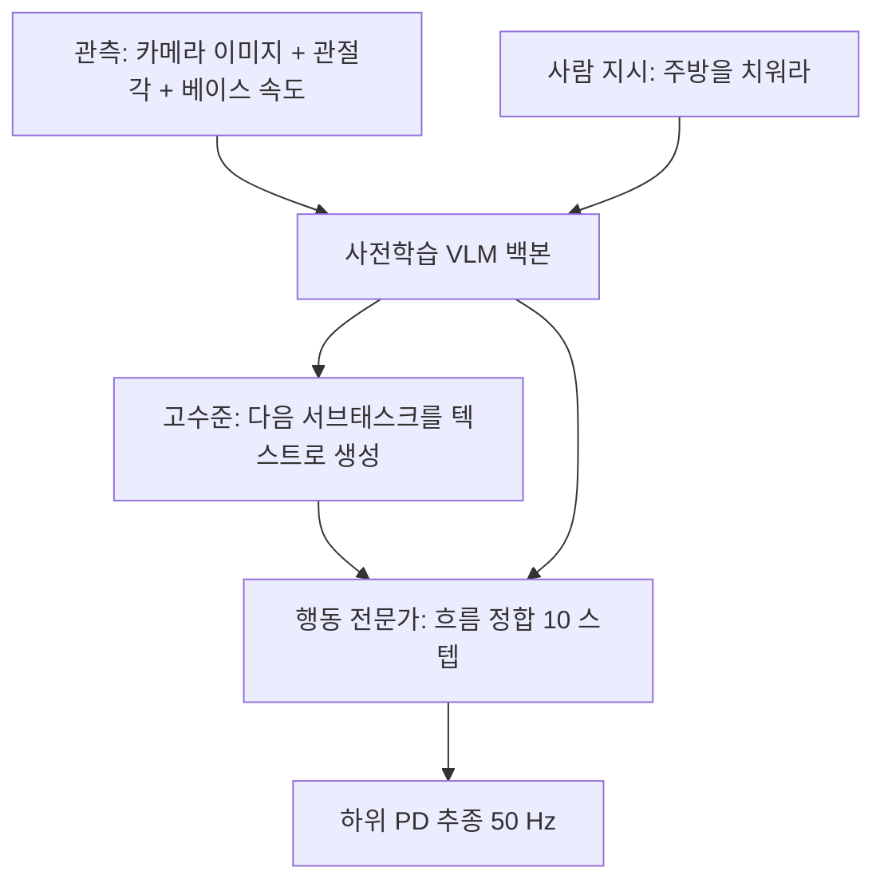
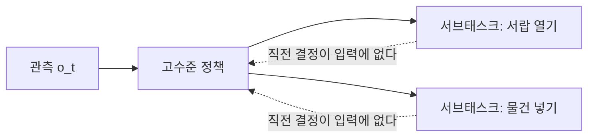

> **논문:** Physical Intelligence, *π₀.₅: a Vision-Language-Action Model with Open-World Generalization*, arXiv 프리프린트, 2025-04-22 제출 [arXiv:2504.16054](https://arxiv.org/abs/2504.16054) / [전문 HTML v1](https://arxiv.org/html/2504.16054v1)
> **읽은 판:** v1 (확인일 2026-08-18)
> **비고:** 동료심사를 거친 학회 논문이 아니라 회사 프리프린트다. 저자는 40명이 넘는다. 인용수나 수상 이력은 이 글에서 확인하지 않았다.

**결론부터.** 이 논문이 내놓은 것은 새 알고리즘이 아니라 **학습 데이터를 무엇으로 채우는가**와 **출력을 어떻게 쪼개는가**에 대한 답이다. 목표 로봇에서 모은 데이터는 학습 예시의 2.4%뿐이고 나머지는 다른 로봇, 웹 이미지, 사람이 말로 준 지시에서 온다. 그리고 모델은 행동을 바로 내지 않는다. "지금 무엇을 할 차례인가"를 텍스트로 먼저 생성하고, 그 텍스트를 조건으로 행동을 낸다. 근거는 **학습에 한 번도 쓰이지 않은 실제 가정집 3채**에서의 평가다.

## 1. 배경: 로봇 데이터는 늘릴 수가 없다

시연을 얼마나 잘 흉내 내는가는 [Diffusion Policy](https://arxiv.org/abs/2303.04137) 계열이 이미 다룬 문제다. 그다음에 남는 질문이 "학습에 없던 환경에서도 되는가"이고, 여기서 병목은 알고리즘이 아니라 데이터다.

- 언어 모델은 인터넷에 이미 쌓인 텍스트를 쓴다. 수집 비용이 사실상 0이다.
- 로봇 행동 데이터는 사람이 로봇을 직접 조작해서 만든다. 한 시간의 데이터에 한 시간이 든다.
- 로봇마다 관절 수, 기구, 카메라 위치가 달라서 한 로봇의 데이터를 다른 로봇에 그대로 못 쓴다.

그래서 "환경 하나 늘릴 때마다 데이터를 다시 모아야 한다"가 오랫동안 상수였다. 집집마다 구조가 다른 가정 환경은 이 방식으로 원리적으로 못 덮는다.

기존 해법과 각각이 막힌 자리는 다음과 같다.

| 해법 | 막힌 곳 |
| --- | --- |
| **그 환경에서 더 모은다** | 정직하고, 그래서 확장되지 않는다. 집 100채를 덮으려면 집 100채에서 모아야 한다 |
| **시뮬레이션에서 합성한다** | 현실 격차가 남는다. 접촉, 마찰, 조명처럼 시뮬레이터가 약한 부분이 조작 과제에서 결정적인 경우가 많다 |
| **사전학습 시각-언어 모델(VLM)에 행동 머리를 붙인다** | VLM 이 아는 것은 의미이지 행동이 아니다. "서랍을 연다"를 이해하는 것과 손잡이를 당기는 관절 궤적을 내는 것 사이의 간극은 다시 첫 줄의 문제로 돌아간다 |
| **계층을 나눈다 (상위 계획 + 하위 제어)** | 전통적으로 상위는 사람이 짠 규칙이나 별도 플래너였고, 하위 정책과 학습이 분리돼 있어 상위 지시가 하위의 실제 능력과 어긋났다 |

π0.5 의 주장은 이 넷 중 하나를 개선한 것이 아니라 **섞는 방식 자체가 답**이라는 것이다. 목표 로봇의 데이터가 적어도 다른 출처의 데이터가 충분히 이질적이면 일반화가 나온다는 쪽에 걸었다.

## 2. 정책을 두 단계로 분해한다

$$\pi_\theta\big(\mathbf{a}_{t:t+H},\, \hat{\ell} \,\big|\, \mathbf{o}_t,\, \ell\big) \;=\; \underbrace{\pi_\theta\big(\mathbf{a}_{t:t+H} \mid \mathbf{o}_t, \hat{\ell}\big)}_{\text{low-level: action}} \;\cdot\; \underbrace{\pi_\theta\big(\hat{\ell} \mid \mathbf{o}_t, \ell\big)}_{\text{high-level: next subtask}}$$

| 기호 | 뜻 |
| --- | --- |
| $\mathbf{o}_t$ | 관측. 모든 카메라 이미지와 로봇 구성(관절각, 그리퍼 자세, 토르소 리프트 자세, 베이스 속도) |
| $\ell$ | 사람이 준 전체 지시. 예를 들어 "주방을 치워라" |
| $\hat{\ell}$ | 모델이 스스로 만들어 낸 다음 서브태스크. 예를 들어 "접시를 싱크대에 넣어라" |
| $\mathbf{a}_{t:t+H}$ | 길이 $H$ 의 행동 청크. 목표 관절 자세와 엔드이펙터 자세 |
| $\theta$ | 하나의 모델. 두 항이 같은 가중치를 쓴다 |

조건부 확률을 곱으로 쪼갠 평범한 분해인데, 여기서 눈여겨볼 것은 $\hat{\ell}$ 이 **모델 자신의 출력이면서 동시에 자기 입력**이라는 점이다. 언어 모델의 chain-of-thought 와 같은 구조를 로봇 제어에 넣었다.

제어 쪽 언어로 옮기면 감독제어기와 연속제어기를 한 신경망 안에 넣은 것이다. 상위가 이산적인 "할 일"을 고르고 하위가 그 조건에서 연속 궤적을 낸다. 계층은 유지하되 학습을 함께 한다는 점이 앞 절 네 번째 해법과 갈리는 자리다.

## 3. 학습 목적함수

후처리 학습(post-training) 단계의 손실은 다음과 같다 (원문 식 1).

$$\mathcal{L} = \mathbb{E}_{\mathcal{D},\tau,\omega}\Big[\; \underbrace{H\big(\mathbf{x}_{1:M},\, f^{\ell}_\theta(\mathbf{o}_t,\ell)\big)}_{\text{(1) token cross-entropy}} \;+\; \alpha\,\underbrace{\big\|\,\omega - \mathbf{a}_{t:t+H} - f^{a}_\theta\big(\mathbf{a}^{\tau,\omega}_{t:t+H},\, \mathbf{o}_t,\, \ell\big)\big\|^2}_{\text{(2) flow matching}} \Big]$$

| 기호 | 뜻 |
| --- | --- |
| $H(\cdot,\cdot)$ | 교차엔트로피. 텍스트 토큰과 FAST 로 이산화된 행동 토큰 모두에 걸린다 |
| $f^{\ell}_\theta,\; f^{a}_\theta$ | 텍스트 머리와 행동 전문가(action expert) 머리 |
| $\omega \sim \mathcal{N}(0,\mathbf{I})$ | 가우시안 노이즈 |
| $\tau \in [0,1]$ | 보간 계수 |
| $\mathbf{a}^{\tau,\omega}_{t:t+H}$ | $\tau\,\mathbf{a}_{t:t+H} + (1-\tau)\,\omega$. 정답 행동과 노이즈를 $\tau$ 로 섞은 것 |
| $\alpha$ | 두 항의 가중치. 논문 설정은 $\alpha = 10.0$ |

(2) 항이 Diffusion Policy 와 이어지는 자리다. 노이즈 $\omega$ 에서 정답 $\mathbf{a}$ 로 가는 직선 경로의 속도장 $\omega - \mathbf{a}$ 를 맞히게 시킨다. Diffusion Policy 가 "지금 낀 노이즈"를 맞혔다면 [흐름 정합](https://arxiv.org/abs/2210.02747)은 "어느 방향으로 얼마나 가야 하는가"를 맞힌다. 둘 다 행동을 직접 출력하지 않고 행동으로 가는 방향을 학습한다는 점에서 같은 계보이고, 흐름 정합 쪽은 경로가 직선이라 반복 횟수가 적어도 된다.

## 4. 로봇과 신호

| 항목 | 값 |
| --- | --- |
| 로봇 | 모바일 조작기. 6자유도 팔 2개(평행 조 그리퍼, 손목 단안 RGB 카메라) + 홀로노믹 바퀴 베이스 + 토르소 리프트 |
| 총 자유도 | 18~19 DoF |
| 관측 | 전 카메라 이미지, 관절각, 그리퍼 자세, 토르소 리프트 자세, 베이스 속도 |
| 행동 | 청크마다 목표 관절 자세와 엔드이펙터 자세 |
| 하위 추종 | 50 Hz, 단순 PD 제어기 |

## 5. 학습 재료: 이질 데이터 6종

| 약칭 | 무엇 | 규모와 비고 |
| --- | --- | --- |
| MM | 목표 플랫폼(모바일 조작기)의 가정 과제 | 약 400시간, 약 100채의 집 |
| ME | 여러 환경의 비이동형 로봇 (플랫폼에 얹힌 팔) | 다양한 가정 |
| CE | 실험실 교차 임베디먼트. 여러 종류의 로봇, 여러 과제 | |
| HL | 고수준 서브태스크 주석 (사람이 단 의미 라벨) | |
| WD | 웹 데이터. 이미지 캡셔닝, VQA, 물체 위치지정 | |
| VI | 구두 지시. 전문가가 말로 이끈 시연 | 고수준 데이터의 약 11% |

논문에서 가장 자주 인용될 문장이 여기 붙는다.

> the vast majority of the training examples provided to π0.5 (97.6% in the first training stage) do not come from mobile manipulators performing home tasks, but from other sources such as other robots or the web.

목표 로봇에서, 목표 과제로 모은 데이터는 2.4%다.

## 6. 학습 2단계와 표현 갈아 끼우기

| 단계 | 스텝 | 행동 표현 | 들어가는 데이터 |
| --- | ---: | --- | --- |
| 사전학습 | 280k | FAST 이산 토큰 (다음 토큰 예측) | 전부 섞는다 (MM, ME, CE, HL, WD) |
| 후처리 학습 | 80k | 흐름 정합 행동 전문가 추가 ($\alpha=10.0$) | 모바일 조작에 특화. VI 추가, 실험실 CE 제외 |

추론 시 흐름 정합 반복은 10 스텝이다. 두 단계에서 행동 표현을 다르게 쓰는 이유를 논문은 짧게 설명하고 넘어간다.

> VLA training can be significantly faster when actions are represented with discrete tokens ... Unfortunately, such discrete representations are not well-suited for real-time inference, as they require expensive autoregressive decoding.

| | 이산 토큰 (FAST) | 연속 흐름 정합 |
| --- | --- | --- |
| 학습 효율 | 빠르다 | 느리다 |
| 추론 속도 | 자기회귀 디코딩. 토큰을 하나씩 순차 생성 | 10스텝 병렬 갱신 |

그래서 둘 다 쓴다. 대량의 이질 데이터를 밀어 넣는 사전학습은 이산 토큰으로 싸게 하고, 실제 로봇에 올릴 후처리 학습에서 흐름 정합 머리를 새로 붙인다.

일반화해서 옮겨 적을 만한 결정은 이것이다. **학습 시점에 유리한 표현과 실행 시점에 유리한 표현이 다를 수 있고, 그럴 때 하나로 통일하지 않고 단계별로 바꿔 다는 선택지가 있다.** 임베디드에서 부동소수점으로 학습하고 고정소수점으로 배포하는 것과 성격이 같다.

## 7. 평가 방식과 결과

평가는 학습에 없던 실제 가정집 3채에서 이뤄졌다. 주방과 침실 모두 시험했고 과제는 서랍에 물건 넣기, 싱크대에 접시 넣기, 빨래 정리다. 다단계 과제라 한 번 수행에 2~5분이 걸린다.

> **채점 방식을 먼저 확인해야 한다.** 성공과 실패의 이진이 아니라 **과제 진행률(task progress)** 이다. 논문의 설명으로는 접시의 절반을 싱크대에 넣으면 약 50%에 해당한다. 각 과제와 환경마다 10회 시행 평균이다.
{: .prompt-warning }

절대 수치 표는 논문 본문에서 확보되지 않는다. 결과가 대체로 막대그래프와 정성 서술("일관되게 성공", "통계적으로 유의")로 제시된다. 아래는 확인되는 것만 옮긴 것이다.

**(1) 학습 환경 수에 따른 확장.** 3, 12, 22, 53, 82, 104채로 나눠 학습했고 고유 표본 수를 통제한 상태에서(각 40k 스텝) 비교했다.

| 관측 | 내용 |
| --- | --- |
| 다단계 과제 성능 | 학습 장소가 많을수록 대체로 향상된다 |
| 대조 | **시험 환경에서 직접 학습한 모델이 104채 모델과 비슷한 성능**에 그쳤다 |
| 언어 지시 따르기 | 분포 내 물체는 꾸준히 향상. 분포 밖 물체는 향상되나 더 완만하다 |

두 번째 줄이 논문의 주장을 지탱한다. "그 집에서 직접 배운 모델"과 "그 집을 한 번도 못 본 모델"이 비슷하다면, 이질 데이터 공동학습이 현장 데이터 수집을 상당 부분 대체한다는 뜻이 된다.

**(2) 데이터 출처를 하나씩 빼 본 ablation.**

| 뺀 것 | 다단계 과제 성능 | 언어 지시 따르기 |
| --- | --- | --- |
| 웹 데이터(WD) | 통계적으로 유의하지 않다 | 분포 밖 물체에서 유의하게 나빠진다 |
| 다환경 비이동 로봇(ME) | 유의하게 저하 | 유의하게 저하 |
| 실험실 교차 임베디먼트(CE) | 유의하게 저하 | 유의하게 저하 |
| ME + CE 둘 다 | 각각보다 더 나쁘다 | |

웹 데이터 행이 눈에 띈다. 웹 데이터를 빼도 과제 수행 자체는 별로 안 나빠지는데 처음 보는 물체를 말로 지시했을 때가 나빠진다. 웹 데이터가 기여하는 것은 손재주가 아니라 어휘라고 읽힌다.

**(3) 고수준 추론 ablation.**

| 조건 | 결과 |
| --- | --- |
| 전체 모델 | 최고 |
| 구두 지시(VI) 제외 | 유의하게 약해진다. VI 는 고수준 데이터의 11%뿐인데도 그렇다 |
| 고수준 데이터를 학습에서 제외 | 유의하게 나쁨 |
| GPT-4 제로샷을 고수준으로 사용 | 가장 나쁨 |

마지막 줄은 범용 대형 언어모델을 그대로 상위 계획자로 쓰는 것이 직접 학습한 고수준보다 못하다는 관측이다. "무엇을 할 차례인가"는 그 로봇이 실제로 무엇을 할 수 있는지 아는 상태에서만 제대로 답할 수 있다는 뜻으로 읽힌다.

**(4) 기준선 비교.** 전작 [π0](https://arxiv.org/abs/2410.24164) 와 π0-FAST+Flow 를 유의하게 앞선다. π0 를 300k 스텝까지 더 길게 학습시켜도 마찬가지였다. 또 **암묵적 고수준** 변형(추론 시 고수준을 명시적으로 돌리지 않고 저수준만 쓰되 학습 데이터에는 서브태스크를 포함)이 두 번째로 좋았다. 이득의 상당 부분이 "추론 시 두 단계로 돌리는 것"이 아니라 "학습 데이터에 서브태스크를 섞는 것"에서 이미 나온다는 뜻이 된다.

ME 와 CE 를 빼면 크게 나빠지는데 둘 다 목표 로봇도 아니고 목표 과제도 아닌 데이터다. 서로 다른 몸과 서로 다른 과제를 함께 보면 몸에 종속되지 않는 표현이 남고, 그것이 새 집으로 옮겨간다는 설명이 된다.

## 8. 무엇이 몇 Hz로 도는가

지연 수치는 논문에 없다. 앞 절에서 "이산 표현은 실시간 추론에 잘 맞지 않는다"며 흐름 정합으로 바꾼 이유를 설명해 놓고, 바꾼 뒤 몇 ms 인지는 밝히지 않는다. 실시간성이 설계 동기인데 결과 수치가 없다. 확인되는 것은 구조뿐이다.

| 층 | 주기 | 비고 |
| --- | --- | --- |
| 고수준 서브태스크 추론 | 행동 추론보다 낮은 주기 (구체값 없음) | |
| 행동 청크 생성 | 흐름 정합 10 스텝 | 청크 길이 $H$ 미공개 |
| 하위 추종 | 50 Hz | 단순 PD 제어기 |

Diffusion Policy 와 같은 배치가 다시 나온다. 저쪽은 10 Hz 정책에 125 Hz 보간, 이쪽은 저주기 고수준과 중주기 행동 아래에 50 Hz PD 다. 무거운 학습 모델을 하드 실시간 루프 밖에 두고 그 아래에 단순하고 빠른 추종 층을 둔다. 서로 다른 두 논문에서 같은 답이 나온 셈이라, 하드 실시간 요구를 만족시키는 표준형으로 기억해 둘 만하다.

## 9. 제어 관점에서 남는 문제: 상위 결정의 채터링

저자들이 밝힌 한계는 다섯이다. 낯선 손잡이 같은 환경 고유의 난점, 로봇 팔이 대상을 가리는 부분 관측, 고수준 추론이 쉽게 산만해지는 것, 단순한 프롬프트만 처리하는 것, 문맥이 짧고 메모리 기제가 없는 것.

셋째가 제어 쪽에서 다르게 읽힌다. 원문의 표현은 "물건을 넣는 중에 서랍을 여러 번 여닫는다"이고, 이것은 FSM 언어로 정확히 채터링이다. 상위가 두 서브태스크 사이를 왕복하는 것이고 원인은 구조적이다. $\pi_\theta(\hat{\ell} \mid \mathbf{o}_t, \ell)$ 에는 직전에 무엇을 하고 있었는지가 들어가지 않는다. 매 시점 관측만 보고 다시 고르므로 관측이 경계에서 흔들리면 결정도 흔들린다.

고전 FSM 에는 이걸 막는 장치가 있다. 히스테리시스, 최소 체류 시간, 전이 조건의 상호배타성이다. 학습된 고수준 정책에는 그 장치가 없고 논문도 넣지 않았다. 저자는 이것을 산만함이라는 성능 문제로 적었지만, 상태 전이의 결정성 문제로 읽는 편이 정확하다. 메모리가 없다는 다섯째 한계도 같은 뿌리로 보인다. 다단계 과제가 2~5분인데 문맥이 짧다면 이미 한 일을 다시 하는 것을 구조적으로 못 막는다.

안전 쪽으로 옮기면 이 채터링은 비효율로 끝나지 않는다. 상위가 고를 수 있는 서브태스크 중에 "멈춤"이나 "안전 자세로 복귀"가 들어 있다면 그 전이도 같은 방식으로 흔들린다. 안전 상태로의 전이는 한 번 들어가면 함부로 나오지 않아야 하는데, 매 시점 관측만 보고 다시 고르는 구조는 그 성질을 보장하지 못한다. 안전 계층을 이 모델 바깥에 두어야 한다는 결론이 나오고, 목적함수에 제약이 없어서 같은 결론에 닿았던 Diffusion Policy 와는 도달 경로가 다르다.

## ⚠️ 주의

- **이 논문의 숫자는 안전 논증에 쓸 수 없다.** 연속 진행률이라 실패의 성격이 지워진다. 서랍을 못 연 50%와 접시를 깬 50%가 같은 값이다.
- **진행률 지표는 부분 진행에 후하다.** 작업은 대체로 마지막이 어렵다. 90%에서 멈추는 로봇과 100%를 끝내는 로봇의 실용 가치 차이는 10%가 아니다.
- **환경 수 확장 실험의 통제 범위.** 고유 표본 수를 통제했다고 하지만 집이 많아질수록 장면 다양성뿐 아니라 과제와 물체 다양성도 함께 는다. 무엇이 효과를 냈는지는 분리되지 않는다.
- **하위 PD 제어기가 잘 따라온다는 가정.** 접촉이 생기는 순간 위치 추종 PD 는 힘을 무한정 키우려 든다. 서랍이 걸리거나 손잡이가 낯선 상황이 정확히 그 지점인데 하위 제어기 쪽 대응은 서술되지 않는다.
- **모델 정보가 공개되지 않는다.** 백본 VLM 이 무엇인지, 파라미터 수가 얼마인지, 행동 전문가가 몇 개 파라미터인지 본문에서 확인되지 않는다. 재현도 비용 산정도 불가능하다.
- **빠진 비교 대상.** 상위를 사람이 짠 FSM 이나 태스크 플래너로 두고 하위만 학습한 구성과 비교하지 않았다. GPT-4 제로샷과는 비교했지만 그것은 범용 LLM 이지 설계된 플래너가 아니다. 9절의 채터링은 규칙 기반 상위였다면 애초에 안 생겼을 문제라 이 비교의 부재가 아쉽다. 같은 시기 다른 연구팀의 VLA 와도 대조가 없다.
- **동료심사를 거치지 않은 프리프린트이고, 평가를 저자들이 직접 설계하고 채점했다.** 제3자 벤치마크가 아니다.

## 📌 정리

- 목표 로봇과 목표 과제의 데이터는 학습 예시의 2.4%다. 나머지는 다른 로봇, 웹, 사람의 말에서 온다.
- 정책을 "다음 서브태스크를 텍스트로 생성"과 "그 텍스트를 조건으로 행동 생성"의 곱으로 쪼갠다. 두 항이 같은 가중치를 쓴다.
- 시험 환경에서 직접 학습한 모델이 104채로 학습한 모델과 비슷한 성능에 그쳤다는 것이 일반화 주장의 근거다.
- 웹 데이터를 빼면 손재주가 아니라 처음 보는 물체에 대한 언어 지시가 나빠진다.
- 사전학습은 FAST 이산 토큰, 배포는 연속 흐름 정합이다. 학습에 유리한 표현과 실행에 유리한 표현을 단계별로 바꿔 단다.
- 이득의 상당 부분이 추론 구조가 아니라 학습 데이터 구성에서 나온다. 암묵적 고수준 변형이 두 번째로 좋았다.
- 무거운 모델은 하드 실시간 루프 밖에, 그 아래에 50 Hz PD. 다른 논문에서도 반복되는 배치다.
- 학습된 상위 정책은 히스테리시스도 최소 체류 시간도 없어 채터링을 겪는다. 표현력과 결정의 안정성은 다른 축이다.

## 참고

- Physical Intelligence, *π₀.₅: a Vision-Language-Action Model with Open-World Generalization*, 2025 [arXiv:2504.16054](https://arxiv.org/abs/2504.16054)
- Kevin Black et al., *π₀: A Vision-Language-Action Flow Model for General Robot Control*, 2024 [arXiv:2410.24164](https://arxiv.org/abs/2410.24164) (이 논문의 기준선)
- Karl Pertsch et al., *FAST: Efficient Action Tokenization for Vision-Language-Action Models*, 2025 [arXiv:2501.09747](https://arxiv.org/abs/2501.09747) (사전학습 쪽 행동 표현)
- Yaron Lipman et al., *Flow Matching for Generative Modeling*, 2022 [arXiv:2210.02747](https://arxiv.org/abs/2210.02747) (식 1의 둘째 항)
- Cheng Chi et al., *Diffusion Policy: Visuomotor Policy Learning via Action Diffusion*, RSS 2023 [arXiv:2303.04137](https://arxiv.org/abs/2303.04137)
- Kai-Chieh Hsu, Haimin Hu, Jaime F. Fisac, *The Safety Filter: A Unified View of Safety-Critical Control in Autonomous Systems*, Annual Review of Control, Robotics, and Autonomous Systems, 2024 [arXiv:2309.05837](https://arxiv.org/abs/2309.05837)

## 용어

| 용어 | 뜻 |
| --- | --- |
| VLA | Vision-Language-Action. 사전학습된 시각-언어 모델에 행동 출력을 붙인 정책 계열 |
| 개방세계 일반화 | 학습에 없던 환경, 물체, 지시에서도 동작하는 성질 |
| 공동학습(co-training) | 목표 과제 데이터와 이질적 출처 데이터를 섞어서 한 번에 학습하는 것 |
| 교차 임베디먼트(cross-embodiment) | 몸이 다른 여러 로봇의 데이터를 함께 쓰는 것 |
| 행동 청크(action chunk) | 한 번에 생성하는 여러 스텝치 행동 |
| 흐름 정합(flow matching) | 노이즈에서 정답으로 가는 속도장을 학습하는 생성 기법. 확산과 사촌이고 경로가 직선이라 반복이 적다 |
| FAST 토크나이저 | 연속 행동 청크를 이산 토큰으로 압축하는 방식. 학습은 빠르지만 자기회귀 디코딩이 필요해 추론이 느리다 |
| 자기회귀 디코딩 | 토큰을 앞에서부터 하나씩 순차 생성. 병렬화가 안 돼 지연이 길다 |
| 행동 전문가(action expert) | 백본과 별도 가중치를 갖는 행동 생성 전용 트랜스포머 |
| 홀로노믹 베이스 | 제자리 회전 없이 임의 방향으로 이동 가능한 바퀴 구성 |
| 과제 진행률(task progress) | 이진 성공률이 아니라 완료한 단계 비율로 매기는 점수 |
