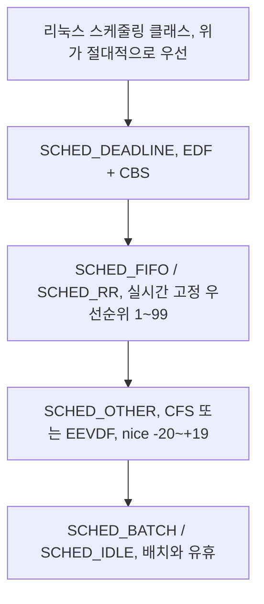
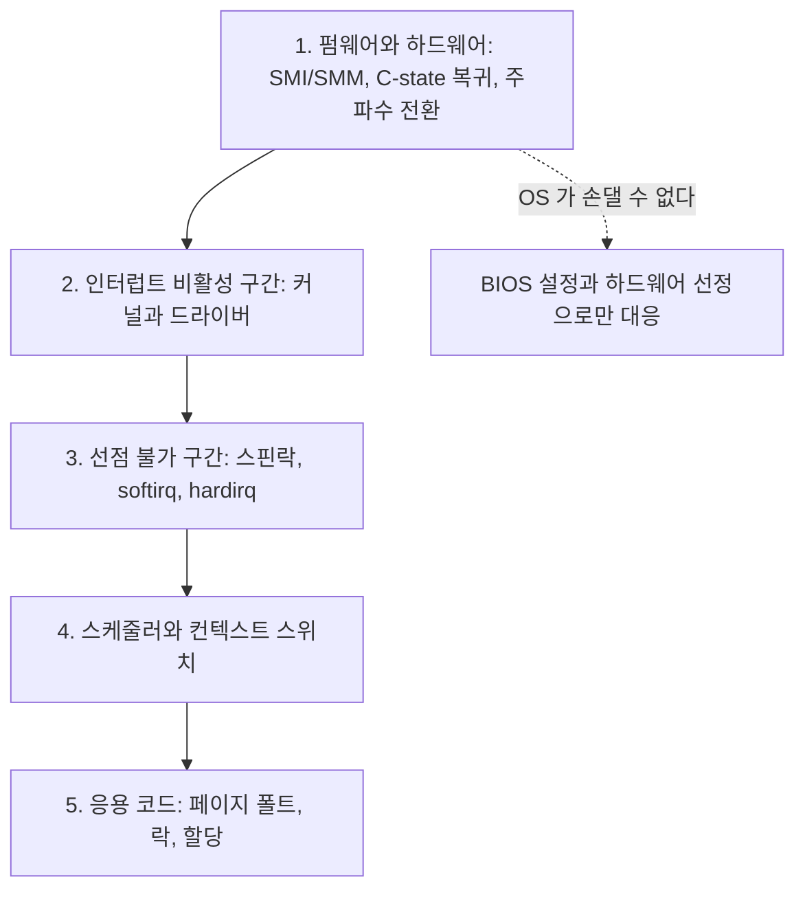

> **기준 출처:** [Linux kernel CFS Design](https://www.kernel.org/doc/html/latest/scheduler/sched-design-CFS.html) · [EEVDF Scheduler](https://www.kernel.org/doc/html/latest/scheduler/sched-eevdf.html) · [Linux Foundation RT Technical Basics](https://wiki.linuxfoundation.org/realtime/documentation/technical_basics/start) / 확인일 2026-08-07
> **시리즈:** [목차](/posts/00-rtos-series/) | 이전 → [이론 16. RTOS 커널 구조](/posts/16-rtos-kernel-freertos-zephyr/) | 다음 → [02. 커널 프리엠션 모델](/posts/02-kernel-preemption-models/)

이 연재의 리눅스 편은 측정 환경이 없어 수치를 싣지 않는다. 측정 방법과 판정 기준, 그리고 커널이 실제로 무엇을 하는지만 다룬다.

## 1. 리눅스는 공평성을 최적화하도록 만들어졌다

일반 리눅스의 기본 스케줄러는 CFS(Completely Fair Scheduler)이고 커널 6.6부터는 EEVDF다. 이름에 답이 있다.

| 기본 스케줄러의 목표 | 실시간이 원하는 것 |
| --- | --- |
| 모든 프로세스가 CPU를 골고루 쓴다 | 급한 것이 다 가져간다 |
| 기아(starvation)를 방지한다 | 낮은 것은 굶어도 된다 |
| 처리량을 최대화한다 | 최악 지연을 최소화한다 |
| `nice`가 비율을 바꾼다, 곧 가중치다 | 우선순위는 절대적이어야 한다 |

`nice -20`을 줘도 실시간이 되지 않는 이유가 여기 있다. `nice`는 CPU를 얼마나 큰 비율로 나눠 가질지를 바꿀 뿐 먼저 실행할지를 바꾸지 않는다. 가중치가 아무리 커도 다른 프로세스도 언젠가는 실행되고, 그것이 CFS의 설계 목표다.

실시간을 원하면 다른 스케줄링 클래스로 옮겨야 한다. [04편](/posts/04-posix-realtime-scheduling/)에서 다룬다.



위 클래스에 실행 가능한 태스크가 하나라도 있으면 아래 클래스는 절대 실행되지 않는다. 이것이 [이론 04편](/posts/04-scheduling-preemption-priority/)에서 말한 절대적 우선순위다.

## 2. 클래스만 바꿔서는 부족하다

`SCHED_FIFO` 우선순위 80을 줬는데도 가끔 수 ms씩 밀린다. 커널 안에 선점이 불가능한 구간이 있기 때문이다.


| 선점을 막는 구간 | 왜 막나 |
| --- | --- |
| 스핀락 보유 중 | 스핀락은 짧게 쓰라고 만든 것이라 선점을 끈다 |
| 인터럽트 핸들러(hardirq) 실행 중 | ISR은 태스크가 아니라 선점 대상이 아니다 |
| softirq와 tasklet 실행 중 | 네트워크와 타이머 후처리라 길어질 수 있다 |
| `preempt_disable()` 구간 | per-CPU 데이터 보호 등에 쓰인다 |
| RCU 임계구역 일부 | |

문제는 얼마나 긴지 아무도 보장하지 않는다는 것이다. 어떤 드라이버가 스핀락을 쥐고 큰 루프를 돌면 그 시간만큼 모든 실시간 태스크가 밀린다. 내 코드가 아니라 커널과 드라이버가 시스템의 최악 지연을 정한다.

## 3. 지연을 만드는 층 전체



| 층 | 일반 커널에서의 전형적 크기 | 어떻게 줄이나 |
| --- | --- | --- |
| 1. 펌웨어(SMI) | 수백 µs, 드물게 ms | BIOS 설정과 하드웨어 선정 ([12편](/posts/12-what-breaks-realtime/)) |
| 2. 인터럽트 비활성 | 수십 µs | 커널 튜닝, `irqsoff` 추적 |
| 3. 선점 불가 | 수 ms | `PREEMPT_RT` ([03편](/posts/03-what-preempt-rt-does/)) |
| 4. 스케줄러 | µs | `SCHED_FIFO`와 코어 격리 |
| 5. 응용 | 페이지 폴트로 ms | `mlockall` ([06편](/posts/06-lock-memory-mlockall/)) |

3번이 일반 리눅스와 RT 리눅스를 가르는 가장 큰 항목이다. 나머지를 아무리 다듬어도 3번이 수 ms면 최악 지연은 수 ms다. PREEMPT_RT는 정확히 3번을 공격한다.

## 4. 확인하는 법

지금 커널이 무엇인지 먼저 본다.

```bash
uname -a
# Linux robot 6.8.0-rt8 #1 SMP PREEMPT_RT ... x86_64 GNU/Linux
#                                ^^^^^^^^^^^ 이게 있으면 RT 커널

# 커널 설정 직접 확인
grep PREEMPT /boot/config-$(uname -r)
# CONFIG_PREEMPT_RT=y          <- RT 커널
# CONFIG_PREEMPT_VOLUNTARY=y   <- 일반 데스크톱 커널
```

`PREEMPT`와 `PREEMPT_RT`는 다르다. `uname`에 `PREEMPT`만 있으면 저지연 데스크톱 커널이지 RT 커널이 아니다. 네 단계의 차이는 [02편](/posts/02-kernel-preemption-models/)에서 다룬다.

다음으로 스케줄링 정책을 본다.

```bash
chrt -p $(pgrep myapp)
# pid 1234's current scheduling policy: SCHED_OTHER
# pid 1234's current scheduling priority: 0
#                                          ^ 실시간이 아니다

ps -eo pid,cls,rtprio,ni,comm | head
# PID CLS RTPRIO  NI COMMAND
#   1 TS       -   0 systemd          <- TS = SCHED_OTHER
#  12 FF      99   - migration/0      <- FF = SCHED_FIFO, 커널 스레드
```

위 출력은 형식을 보여주기 위한 예시다. `CLS` 열이 `TS`면 일반, `FF`면 `SCHED_FIFO`, `RR`이면 `SCHED_RR`, `DLN`이면 `SCHED_DEADLINE`이다.

## 5. 기본 리눅스로 어디까지 되나

| 목표 주기 | 일반 커널 | `PREEMPT` 저지연 | `PREEMPT_RT` |
| --- | --- | --- | --- |
| 100 ms (10 Hz) | 문제없다 | 문제없다 | 문제없다 |
| 10 ms (100 Hz) | 대부분 되지만 가끔 튄다 | 된다 | 된다 |
| 1 ms (1 kHz) | 어렵다 | 조건부로 된다 | 일반적인 목표다 |
| 100 µs (10 kHz) | 안 된다 | 안 된다 | 어렵다. 하드웨어 튜닝이 필수다 |
| 10 µs | 안 된다 | 안 된다 | 안 된다. MCU로 가야 한다 |

PREEMPT_RT의 현실적 목표는 1 kHz 제어 루프에 최악 지터 수십 µs 정도다. 필드버스 마스터와 궤적 생성과 힘 제어에는 충분하고 전류 루프에는 부족하다. 그래서 층을 나눈다([이론 16편](/posts/16-rtos-kernel-freertos-zephyr/)).

구체적 수치는 하드웨어에 크게 의존한다. 위 표는 방향을 잡기 위한 것이고 실제 판단은 그 장비에서 [`cyclictest`](/posts/09-latency-measurement-cyclictest/)를 돌려서 한다. 같은 커널이라도 메인보드와 BIOS와 CPU에 따라 최악값이 자릿수로 달라진다.

## 정리

- 리눅스 기본 스케줄러는 공평성이 목표다. `nice`를 아무리 줘도 실시간이 되지 않는다.
- 실시간을 원하면 스케줄링 클래스를 바꿔야 한다. 위 클래스가 있으면 아래는 절대 돌지 않는다.
- 클래스만 바꿔도 부족하다. 커널 안에 스핀락과 hardirq와 softirq로 인한 선점 불가 구간이 있다.
- 그 구간의 길이를 커널과 드라이버가 정한다. 내 코드로는 줄이지 못한다.
- 지연 5층 중 선점 불가 구간이 가장 크고 PREEMPT_RT가 정확히 그것을 공격한다.
- 확인은 `uname -a`의 `PREEMPT_RT` 표시, `chrt -p`의 정책, `ps -eo cls,rtprio`로 한다.
- 현실적 목표는 1 kHz에 최악 지터 수십 µs다. 그 이상은 MCU로 간다.

## 참고

- [Linux kernel — CFS Design](https://www.kernel.org/doc/html/latest/scheduler/sched-design-CFS.html)
- [Linux kernel — EEVDF Scheduler](https://www.kernel.org/doc/html/latest/scheduler/sched-eevdf.html)
- [Linux Foundation RT — Technical Basics](https://wiki.linuxfoundation.org/realtime/documentation/technical_basics/start)